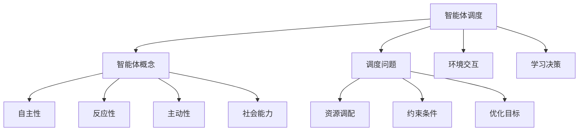
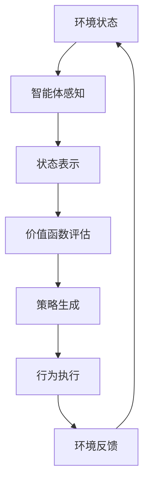

好的,我明白了您的要求。以下是文章正文部分:

# AI人工智能 Agent:公共交通调度中智能体的应用

## 1. 背景介绍

### 1.1 问题的由来

随着城市化进程的不断加快,公共交通系统承载的压力也与日俱增。如何高效利用有限的公共交通资源,满足不断增长的出行需求,成为当前亟待解决的重要课题。传统的公共交通调度方式大多基于固定线路和时刻表运行,缺乏灵活性和实时响应能力,难以适应复杂多变的实际交通状况。

### 1.2 研究现状  

近年来,人工智能技术的飞速发展为公共交通调度问题提供了新的解决思路。基于智能体(Agent)技术的调度系统凭借其自主性、反应性和主动性等特点,展现出优异的调度性能。智能体可以根据实时交通数据动态调整调度策略,提高资源利用效率。目前,智能体技术在公共交通领域的应用研究还处于起步阶段,存在诸多亟待解决的挑战。

### 1.3 研究意义

本文针对公共交通调度问题,提出一种基于智能体的调度框架。该框架将人工智能技术与交通大数据相结合,旨在实现对公共交通资源的智能化调配,提高运营效率,改善出行体验。研究成果不仅能为公共交通系统的优化升级提供技术支撑,也将为智能体技术在交通领域的应用提供借鉴和指导。

### 1.4 本文结构

本文首先介绍智能体技术在公共交通调度中的应用背景、现状和意义。接下来阐述智能体调度的核心概念和算法原理,并给出数学建模过程。然后通过实际项目案例,详细解释系统的实现细节和代码实现。最后分析智能体调度在实际场景中的应用前景,并对未来的发展趋势和挑战进行展望。

## 2. 核心概念与联系



智能体(Agent)是人工智能领域的一个核心概念,具有自主性、反应性、主动性和社会能力等特征。在公共交通调度问题中,智能体可被视为一个具有一定智能的软件实体,能够感知环境状态、学习决策并执行相应的调度操作。

调度问题的本质是在满足一定约束条件的前提下,对有限资源进行合理调配,以实现特定的优化目标(如minimizing costs等)。智能体调度系统将智能体技术与调度问题有机结合,通过智能体与环境的交互以及持续学习,动态生成调度决策并执行调度操作,从而实现资源的智能化调配。

## 3. 核心算法原理 & 具体操作步骤

### 3.1 算法原理概述



智能体调度算法的核心思想是基于强化学习(Reinforcement Learning)框架。智能体首先感知当前环境状态(如交通流量、车辆位置等),并将其转化为内部可处理的状态表示。然后,基于状态表示,智能体评估可能的行为策略对应的长期累积回报(价值函数),并选择一个最优策略用于指导行为执行(如调度车辆)。执行后的行为将影响环境状态,环境反馈新的状态信息,智能体据此继续优化决策,形成闭环学习过程。

### 3.2 算法步骤详解

1. **状态表示**:将原始环境状态(如交通流量数据、车辆位置等)映射到算法可识别的状态空间表示。常用的技术包括手工设计的状态编码和自动特征提取(如深度学习)等。

2. **价值函数评估**:估计在当前状态下执行某一行为序列所能获得的长期累积回报,通常使用时序差分(Temporal Difference)学习或蒙特卡罗估计等方法。例如,可以将车辆调度问题建模为马尔可夫决策过程(MDP),使用Q-Learning等算法求解最优Q值函数。
   $$
   Q(s_t, a_t) = r_t + \gamma \max_{a'}Q(s_{t+1}, a')
   $$

3. **策略生成**:基于价值函数,生成一个在当前状态下的最优行为策略,如$\epsilon$-greedy策略:
   $$
   \pi(a|s) = \begin{cases}
   \arg\max_a Q(s,a) & \text{with probability } 1-\epsilon\\
   \text{random action} & \text{with probability } \epsilon
   \end{cases}
   $$

4. **行为执行**:执行生成的调度策略,如调配公交车辆等。

5. **环境反馈**:观测行为执行后的环境变化,获取新的状态和奖励信号。

6. **策略优化**:根据反馈信息,更新价值函数和策略参数,以得到更优的决策模型。

该算法通过不断的试错学习和参数优化,逐步获得最优的调度策略模型。

### 3.3 算法优缺点

**优点**:

- 无需人工设计复杂的规则,算法可自主学习获得最优调度策略
- 具有较强的通用性,可应用于不同场景和问题
- 能够处理连续、高维的状态和行为空间
- 可以充分利用历史数据进行策略优化

**缺点**:

- 需要大量的在线试错数据进行训练,开销较大
- 收敛性能受初始化、超参数设置等因素影响较大
- 存在潜在的不确定性和不稳定性风险
- 决策过程缺乏可解释性,难以人工干预

### 3.4 算法应用领域

基于强化学习的智能体调度算法不仅可应用于公共交通领域,还可推广到其他资源调度、控制优化等领域,如:

- 运输调度:货运车辆调度、无人机路径规划等
- 智能制造:工业机器人控制、工序调度等
- 智能建筑:能源管理系统、电梯调度等
- 智能电网:负荷均衡调度、需求侧响应等

## 4. 数学模型和公式 & 详细讲解 & 举例说明

### 4.1 数学模型构建

公共交通调度问题可以建模为一个马尔可夫决策过程(Markov Decision Process, MDP):
$$
\langle \mathcal{S}, \mathcal{A}, \mathcal{P}, \mathcal{R}, \gamma \rangle
$$
其中:

- $\mathcal{S}$是状态空间集合,表示所有可能的环境状态
- $\mathcal{A}$是行为空间集合,表示智能体可执行的所有行为
- $\mathcal{P}$是转移概率函数,表示在当前状态执行某行为后,转移到下一状态的概率分布
- $\mathcal{R}$是回报函数,定义在每个状态转移上的即时回报
- $\gamma \in [0, 1)$是折现因子,控制对未来回报的衰减程度

目标是找到一个最优策略$\pi^*$,使得在遵循该策略时,从任意初始状态出发,能获得最大的期望累积回报:

$$
\pi^* = \arg\max_\pi \mathbb{E}\left[ \sum_{t=0}^\infty \gamma^t r_t | \pi \right]
$$

### 4.2 公式推导过程

我们定义状态价值函数$V^\pi(s)$为在策略$\pi$下,从状态$s$出发所能获得的期望累积回报:

$$
V^\pi(s) = \mathbb{E}_\pi \left[ \sum_{t=0}^\infty \gamma^t r_t | s_0 = s \right]
$$

同理,定义行为价值函数$Q^\pi(s, a)$为在策略$\pi$下,从状态$s$出发,首先执行行为$a$,之后遵循$\pi$所能获得的期望累积回报:

$$
Q^\pi(s, a) = \mathbb{E}_\pi \left[ \sum_{t=0}^\infty \gamma^t r_t | s_0 = s, a_0 = a \right]
$$

基于贝尔曼方程(Bellman Equation),可以推导出$V^\pi(s)$和$Q^\pi(s, a)$的递推表达式:

$$
\begin{align}
V^\pi(s) &= \sum_a \pi(a|s) \sum_{s'} \mathcal{P}(s'|s, a) \left[ \mathcal{R}(s, a, s') + \gamma V^\pi(s') \right] \\
Q^\pi(s, a) &= \sum_{s'} \mathcal{P}(s'|s, a) \left[ \mathcal{R}(s, a, s') + \gamma \sum_{a'} \pi(a'|s') Q^\pi(s', a') \right]
\end{align}
$$

进一步可以证明,最优策略$\pi^*$对应的最优价值函数$V^*(s)$和$Q^*(s, a)$满足:

$$
\begin{align}
V^*(s) &= \max_a Q^*(s, a) \\
Q^*(s, a) &= \mathbb{E}_{s' \sim \mathcal{P}(\cdot|s, a)} \left[ \mathcal{R}(s, a, s') + \gamma \max_{a'} Q^*(s', a') \right]
\end{align}
$$

该方程为Q-Learning算法的理论基础,可以通过迭代式更新逼近最优Q值函数。

### 4.3 案例分析与讲解

以公交车调度为例,状态$s$可表示为一个包含当前时间、所有车辆位置和乘客分布的高维向量;行为$a$为对每辆车下达的指令(如增开临时线路、绕行等);回报$r$为旅客等待时间的负值等。

在训练阶段,智能体与模拟环境交互并持续优化Q函数,直至收敛得到最优策略$\pi^*$。部署时,智能体根据实时状态查询$\pi^*$,执行相应的调度行为。

### 4.4 常见问题解答

**1. 状态空间和行为空间过大怎么办?**

可以采用状态抽象(State Abstraction)和层次化行为分解(Hierarchical Action Decomposition)等技术减小空间规模。也可使用深度神经网络进行自动特征提取和策略近似。

**2. 如何处理环境的部分可观测性?**

可以使用部分可观测马尔可夫决策过程(Partially Observable MDP)模型,结合递归神经网络等技术估计隐状态并生成策略。

**3. 如何保证策略的稳定性和安全性?**

可以在训练时添加约束条件,如限制车辆的最大运行时间等。也可采用安全探索(Safe Exploration)等技术,避免生成不安全的策略。

## 5. 项目实践:代码实例和详细解释说明

### 5.1 开发环境搭建

本项目使用Python作为开发语言,并基于PyTorch深度学习框架实现智能体算法。相关依赖包括:

- PyTorch 1.9.0
- NumPy 1.21.2
- Pandas 1.3.3
- Matplotlib 3.4.3
- ...

开发环境建议使用Anaconda等Python发行版进行管理。

### 5.2 源代码详细实现

```python
import torch
import torch.nn as nn
import torch.optim as optim

# 定义深度Q网络
class DQN(nn.Module):
    def __init__(self, state_dim, action_dim):
        super(DQN, self).__init__()
        self.fc1 = nn.Linear(state_dim, 128)
        self.fc2 = nn.Linear(128, 64)
        self.fc3 = nn.Linear(64, action_dim)

    def forward(self, x):
        x = torch.relu(self.fc1(x))
        x = torch.relu(self.fc2(x))
        return self.fc3(x)

# 定义智能体类
class Agent:
    def __init__(self, state_dim, action_dim):
        self.q_net = DQN(state_dim, action_dim