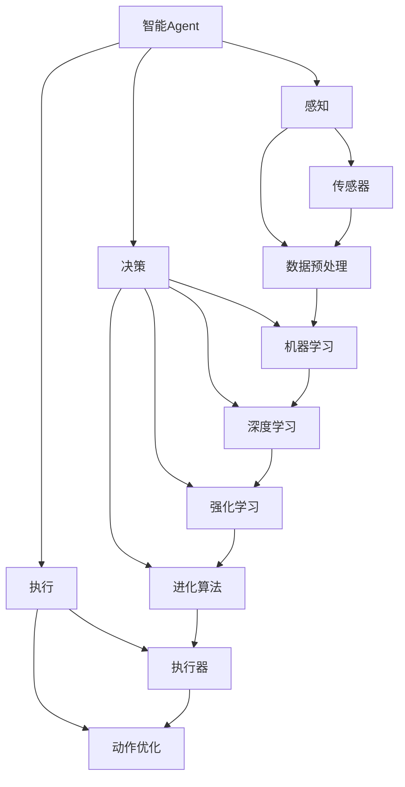

# AI人工智能 Agent：在推进数字化中的应用

关键词：人工智能、智能Agent、数字化转型、机器学习、深度学习、强化学习、多Agent系统

## 1. 背景介绍
### 1.1  问题的由来
随着人工智能技术的快速发展,智能Agent作为其中的重要分支,在推进各行各业数字化转型中扮演着越来越重要的角色。智能Agent能够感知环境、自主学习、动态优化决策,为复杂问题提供高效智能的解决方案,成为数字化时代的关键推动力量。
### 1.2  研究现状
目前,智能Agent已经在智能客服、无人驾驶、智能助理、工业控制等诸多领域得到广泛应用。各大科技公司和研究机构纷纷加大对智能Agent的研发投入。谷歌DeepMind、微软Maluuba等知名实验室都在Agent领域取得了重要突破。同时,强化学习、迁移学习等前沿算法也不断推动Agent能力的提升。
### 1.3  研究意义 
深入研究智能Agent技术,对于推进人工智能在各行业的落地应用、加速数字化转型进程具有重要意义。智能Agent能够模拟人类智能,自主完成复杂任务,大幅提升生产效率,推动传统行业升级。同时,Agent技术的进步也将促进人机协同,开创人机共生的智能新时代。
### 1.4  本文结构
本文将围绕智能Agent技术展开深入探讨。首先介绍Agent的核心概念和分类;然后重点阐述几大主流Agent算法的原理和实现步骤;接着通过数学建模分析Agent的理论基础;并给出具体的代码实例。同时,本文还将讨论Agent在实际场景中的应用,推荐相关学习资源,展望Agent未来的发展趋势和挑战。

## 2. 核心概念与联系
智能Agent是一种能够感知环境并自主行动以达成目标的计算机程序。它具备自主性、社会性、反应性、主动性等特点。按照功能,可将Agent分为反应型、认知型、社会型等类别。

从系统角度看,多个Agent可以组成多Agent系统(Multi-Agent System),通过分布式协同完成复杂任务。Agent之间通过通信语言(如KQML)进行信息交换,遵循一定的交互协议(如Contract Net)开展合作与竞争。

从实现技术看,Agent的核心能力主要依赖于人工智能的各项算法,包括机器学习、深度学习、强化学习、进化算法等。通过对环境数据的分析学习,Agent能够生成最优决策。

下图展示了智能Agent的核心概念架构:



## 3. 核心算法原理 & 具体操作步骤
### 3.1  算法原理概述
智能Agent的核心算法主要包括:
- 机器学习算法(如决策树、SVM、贝叶斯等),通过对历史数据的学习,生成Agent行为决策模型。
- 深度学习算法(如DQN、DDPG等),利用深度神经网络,使Agent掌握复杂的策略空间。 
- 强化学习算法(如Q-Learning、Sarsa等),通过探索和利用,使Agent学会在环境中采取最优行动获得最大累积回报。
- 进化算法(如遗传算法),通过种群迭代进化,搜索出最优Agent策略。
### 3.2  算法步骤详解
以Q-Learning为例,其核心步骤如下:
1. 初始化Q表,即状态-动作值函数。
2. Agent根据当前状态,用 $\epsilon$-greedy 策略选择一个动作执行。
3. 环境根据动作给出下一状态和奖励。 
4. 根据 Bellman 方程更新 Q 值:
$$Q(s,a) \leftarrow Q(s,a)+\alpha [r+\gamma \max _{a^{\prime }} Q(s^{\prime }, a^{\prime })-Q(s,a)]$$
5. 重复步骤2-4,直到Q值收敛或达到最大训练回合数。
6. 在实际应用中,Agent根据最终Q表选择最优动作。
### 3.3  算法优缺点
Q-Learning的优点是:
- 简单易实现,通过值迭代可高效学习最优策略。
- 通过探索避免局部最优,通过利用加快收敛。
- 不需要环境模型,在线学习,泛化能力强。

但其缺点在于:
- 大规模状态空间下,Q表难以存储。
- 难以处理连续状态和动作空间。
- 样本利用率低,学习效率较差。

因此,DQN等深度强化学习算法应运而生,用神经网络逼近Q函数,并引入经验回放、目标网络等机制加速训练。
### 3.4  算法应用领域
强化学习在智能Agent领域应用广泛,包括:
- 智能游戏AI,如Atari、星际争霸、Dota等
- 智能机器人控制,如Mujoco、ROS等
- 智能交通调度,如信号灯控制、车流优化
- 智能推荐系统,如阿里、腾讯等
- 智能电网调度,如风电、光伏预测优化

## 4. 数学模型和公式 & 详细讲解 & 举例说明
### 4.1  数学模型构建
强化学习可用马尔可夫决策过程(MDP)建模,其核心要素包括:
- 状态空间 $\mathcal{S}$,表示Agent所处的环境状态集合。
- 动作空间 $\mathcal{A}$,表示Agent可执行的行为集合。
- 状态转移概率 $\mathcal{P}$,表示在状态s执行动作a后,转移到状态s'的概率。
- 奖励函数 $\mathcal{R}$,表示执行动作后,环境给予的即时奖赏。
- 折扣因子 $\gamma$,表示未来奖赏的衰减比例。

Agent的目标是学习一个策略 $\pi$,使得在该策略下,智能体获得的期望累积奖赏最大化:

$$
\pi^{*}=\arg \max _{\pi} \mathbb{E}\left[\sum_{t=0}^{\infty} \gamma^{t} r_{t} | \pi\right]
$$

其中,最优策略 $\pi^{*}$ 对应最优状态值函数 $V^{*}(s)$ 和最优动作值函数 $Q^{*}(s,a)$:

$$
\begin{aligned}
V^{*}(s) &=\max _{a} Q^{*}(s, a) \\
Q^{*}(s, a) &=\mathcal{R}(s, a)+\gamma \sum_{s^{\prime}} \mathcal{P}\left(s^{\prime} | s, a\right) V^{*}\left(s^{\prime}\right)
\end{aligned}
$$

上式即为贝尔曼最优方程,揭示了值函数的递归性质。求解该方程的过程,就是值迭代的过程。
### 4.2  公式推导过程
以Q-Learning为例,结合贝尔曼方程,可将Q值更新公式推导如下:

对于最优Q函数,有:
$$
Q^{*}(s, a)=\mathcal{R}(s, a)+\gamma \sum_{s^{\prime}} \mathcal{P}\left(s^{\prime} | s, a\right) \max _{a^{\prime}} Q^{*}\left(s^{\prime}, a^{\prime}\right)
$$

在Q-Learning算法中,我们用 $Q(s,a)$ 逼近 $Q^{*}(s,a)$,并假设每次只更新当前状态-动作对 $(s_t,a_t)$ 的Q值,则可得:

$$
\begin{aligned}
Q\left(s_{t}, a_{t}\right) & \leftarrow Q\left(s_{t}, a_{t}\right)+\alpha\left[r_{t}+\gamma \max _{a} Q\left(s_{t+1}, a\right)-Q\left(s_{t}, a_{t}\right)\right] \\
&=Q\left(s_{t}, a_{t}\right)+\alpha\left[r_{t}+\gamma V\left(s_{t+1}\right)-Q\left(s_{t}, a_{t}\right)\right]
\end{aligned}
$$

其中, $\alpha$ 为学习率, $r_t$ 为 $t$ 时刻获得的奖励, $V(s_{t+1})=\max _{a} Q\left(s_{t+1}, a\right)$ 为下一状态的最大Q值。

可见,Q-Learning通过TD误差 $r_{t}+\gamma V\left(s_{t+1}\right)-Q\left(s_{t}, a_{t}\right)$ 来更新当前Q值,使其不断逼近最优Q值 $Q^{*}(s,a)$。
### 4.3  案例分析与讲解
下面我们以一个简单的迷宫寻宝问题为例,说明Q-Learning的具体应用。

假设一个 $4\times 4$ 的网格迷宫,Agent的目标是从起点(0,0)走到终点(3,3)获得宝藏,同时避开中间的陷阱。

我们可以将网格中每个位置视为一个状态,Agent在每个位置可以执行上下左右四个动作。执行动作后,状态按照指定方向转移,并获得相应奖励:走到宝藏奖励为100,走到陷阱奖励为-100,其他情况奖励为-1。

根据Q-Learning算法,我们可以设置如下参数:
- 状态空间大小: $|\mathcal{S}|=4 \times 4=16$
- 动作空间大小: $|\mathcal{A}|=4$
- 学习率: $\alpha=0.1$ 
- 折扣因子: $\gamma=0.9$
- $\epsilon$-greedy 探索率: $\epsilon=0.1$

然后,我们初始化一个 $16 \times 4$ 的Q表,并进行如下Q-Learning训练:
1. 随机选择一个起始状态。
2. 根据 $\epsilon$-greedy 策略,选择一个动作执行。
3. 观察下一状态和奖励,并更新Q表。
4. 重复步骤2-3,直至终止状态。
5. 重复步骤1-4,进行多轮训练直至Q表收敛。

最终,我们可以得到收敛后的Q表,Agent只需根据当前状态,选择Q值最大的动作即可获得最优策略。
### 4.4  常见问题解答
针对Q-Learning的常见问题,解答如下:
- Q: Q-Learning能否处理不完全观测的环境?
- A: Q-Learning要求马尔可夫性质,即下一状态和奖励只能由当前状态决定。对于不完全观测环境,需要引入belief states,用POMDP建模。

- Q: Q-Learning能否应对连续状态动作空间?
- A: 传统Q-Learning只能处理离散空间,对于连续空间需要引入函数逼近,如DQN用神经网络拟合Q函数。

- Q: Q-Learning能否实现多Agent协作?
- A: Q-Learning是单Agent算法,多Agent需要考虑信息不对称、奖励分配等问题,可用博弈论中的Nash均衡、纳什学习等算法。

## 5. 项目实践：代码实例和详细解释说明
### 5.1  开发环境搭建
我们使用Python和OpenAI Gym环境来实现Q-Learning。

首先安装依赖库:
```
pip install numpy matplotlib gym
```

然后,我们自定义一个简单的网格世界环境:
```python
import gym
from gym import spaces
import numpy as np

class GridWorld(gym.Env):
    def __init__(self, n=4):
        self.n = n  # 网格世界的宽度
        self.state = 0  # 初始状态
        
        self.action_space = spaces.Discrete(4)  # 动作空间:0-3分别表示上下左右
        self.observation_space = spaces.Discrete(self.n**2)  # 状态空间
        
        # 状态转移矩阵P[s][a]=(prob,next_state,reward,done)
        self.P = self._init_P() 
        
    def _init_P(self):
        P = [[[] for _ in range(4)] for _ in range(self.n**2)]
        for s in range(self.n**2):
            x, y = s // self.n, s % self.n
            for a in range(4):
                if a == 0:  