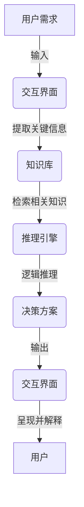

# AI人工智能 Agent：智能决策制定

## 1. 背景介绍

### 1.1 问题的由来

在当今快节奏的数字化时代，我们面临着越来越多的复杂决策问题。无论是企业经营决策、医疗诊断决策,还是交通路线规划等,都需要快速、准确地做出明智的决策。然而,人类的认知能力和计算能力是有限的,很难高效处理大规模的复杂数据并做出最优决策。因此,我们迫切需要一种智能决策系统,能够利用人工智能技术来辅助或代替人类进行决策。

### 1.2 研究现状  

近年来,人工智能技术的飞速发展为构建智能决策系统提供了有力支持。机器学习、深度学习、自然语言处理等技术可以从海量数据中提取有价值的信息,并对复杂问题进行建模和求解。目前,已有不少研究机构和企业致力于开发基于人工智能的智能决策系统,并在特定领域取得了一些进展。

然而,现有的智能决策系统仍然存在一些不足之处。首先,大多数系统只能解决特定类型的决策问题,缺乏通用性。其次,一些系统的决策过程是一个"黑箱",难以解释和控制。此外,一些系统对数据质量和数据量的要求过高,在实际应用中可能会受到限制。

### 1.3 研究意义

构建一个通用的、可解释的、高效的智能决策系统,对于提高决策质量、降低决策成本、优化资源配置等具有重大意义。这不仅可以提高企业和组织的运营效率,还可以为个人和社会的决策提供有力支持。此外,智能决策系统的研究也将推动人工智能技术在更多领域的应用,促进人工智能与其他学科的交叉融合。

### 1.4 本文结构

本文将全面介绍一种新型的智能决策系统——AI Agent。首先阐述AI Agent的核心概念和理论基础;然后详细解释其核心算法原理和数学模型;接着通过实际案例和代码示例展示其实现过程;最后探讨其应用前景、发展趋势和面临的挑战。

## 2. 核心概念与联系

AI Agent是一种基于人工智能技术的智能决策系统。它由以下三个核心组件组成:

1. **知识库(Knowledge Base)**: 存储用于决策的各种结构化和非结构化数据,包括规则、事实、历史数据等。

2. **推理引擎(Inference Engine)**: 基于知识库中的信息,利用机器学习、规则推理等算法进行逻辑推理和决策。

3. **交互界面(Interactive Interface)**: 与用户或其他系统进行交互,获取决策需求、提供决策结果并解释决策过程。

这三个组件通过有机结合,实现了从数据到知识,再到决策的转化过程。AI Agent的工作流程如下所示:

AI Agent的核心优势在于:

1. **通用性**: 可以处理各种类型的决策问题,而不局限于特定领域。

2. **可解释性**: 决策过程可解释,用户可以了解决策的依据和原因。

3. **高效性**: 利用人工智能算法快速处理海量数据,提高决策效率。

4. **可扩展性**: 知识库和推理引擎可以持续扩展和优化,不断提高决策质量。

## 3. 核心算法原理 & 具体操作步骤

### 3.1 算法原理概述

AI Agent的核心算法是一种基于机器学习和规则推理相结合的混合智能算法。它包含以下三个主要部分:

1. **知识图谱构建**: 利用自然语言处理和知识图谱技术,从结构化和非结构化数据中提取实体、关系等知识元素,构建知识图谱。

2. **规则推理**: 基于知识图谱和预定义的规则库,利用逻辑推理算法进行规则匹配和推理,生成初步的决策方案。

3. **机器学习优化**: 将历史决策数据作为训练集,利用强化学习、深度学习等算法对初步决策方案进行优化,生成最终的决策结果。

该算法的优势在于融合了符号推理和机器学习的长处,能够充分利用人类知识和大数据,提高决策质量和可解释性。

### 3.2 算法步骤详解

AI Agent算法的具体步骤如下:

1. **数据预处理**
   - 清洗和规范化输入数据
   - 将结构化数据转换为标准格式
   - 对非结构化数据(如文本)进行分词、词性标注等预处理

2. **知识图谱构建**
   - 从预处理后的数据中提取实体、关系等知识元素
   - 利用现有的知识库(如维基百科)进行实体链接和补充
   - 构建知识图谱,表示实体之间的关系网络

3. **规则匹配与推理**
   - 从规则库中加载相关的决策规则
   - 在知识图谱上进行规则匹配,找到适用的规则
   - 利用前向链接或反向链接等推理算法,生成初步决策方案

4. **机器学习优化**
   - 将历史决策数据作为训练集
   - 利用强化学习算法(如Q-Learning)训练智能体,优化决策序列
   - 利用深度学习模型(如注意力机制)对决策方案进行打分和排序
   - 输出最优决策方案

5. **结果输出与解释**
   - 将最终决策方案呈现给用户
   - 利用可解释性AI技术,解释决策依据和原因
   - 获取用户反馈,持续优化算法和知识库

该算法的关键在于知识图谱的构建质量、规则库的完备性,以及机器学习模型的训练效果。我们需要不断优化这三个环节,以提高AI Agent的决策能力。

### 3.3 算法优缺点

**优点**:

1. 融合符号推理和机器学习,结合人类知识和大数据优势
2. 决策过程可解释,提高用户信任度
3. 通用性强,可应用于多个领域
4. 持续学习和优化,决策质量不断提高

**缺点**:  

1. 算法复杂度较高,需要大量计算资源
2. 知识图谱和规则库的构建成本较高
3. 对训练数据的质量和数量有较高要求
4. 可解释性AI技术仍在发展中,解释能力有限

### 3.4 算法应用领域

AI Agent算法可以广泛应用于各个领域的决策问题,包括但不限于:

- 企业经营决策:产品策略、营销策略、投资决策等
- 医疗健康决策:疾病诊断、治疗方案选择、药物开发等
- 金融决策:投资组合优化、风险管理、反洗钱监控等  
- 交通运输决策:路线规划、调度优化、智能交通管理等
- 政府决策:政策制定、应急决策、公共资源配置等
- 个人决策:职业规划、购房决策、旅游路线规划等

总的来说,任何需要基于复杂信息做出明智决策的场景,都可以考虑应用AI Agent系统。

## 4. 数学模型和公式 & 详细讲解 & 举例说明

### 4.1 数学模型构建

AI Agent算法中的机器学习优化部分,可以建模为一个马尔可夫决策过程(Markov Decision Process, MDP)。MDP是一种用于形式化描述序列决策问题的数学模型。

在AI Agent的场景中,MDP可以定义为一个五元组 $\langle \mathcal{S}, \mathcal{A}, \mathcal{P}, \mathcal{R}, \gamma \rangle$:

- $\mathcal{S}$ 是状态空间,表示所有可能的决策场景状态
- $\mathcal{A}$ 是行为空间,表示智能体可以采取的所有决策行为
- $\mathcal{P}$ 是状态转移概率,即在当前状态 $s$ 下采取行为 $a$ 后,转移到状态 $s'$ 的概率 $\mathcal{P}(s'|s,a)$
- $\mathcal{R}$ 是奖励函数,表示在状态 $s$ 下采取行为 $a$ 后获得的即时奖励 $\mathcal{R}(s,a)$
- $\gamma \in [0,1)$ 是折现因子,用于权衡即时奖励和长期奖励的重要性

在MDP中,我们的目标是找到一个最优策略 $\pi^*$,使得在任意初始状态 $s_0$ 下,按照该策略进行决策时可获得最大的期望累积奖励:

$$
\pi^* = \arg\max_\pi \mathbb{E}\left[\sum_{t=0}^\infty \gamma^t R(s_t, a_t) \mid s_0, \pi\right]
$$

其中 $a_t = \pi(s_t)$ 表示在状态 $s_t$ 下按策略 $\pi$ 选择的行为。

### 4.2 公式推导过程  

为了求解最优策略 $\pi^*$,我们可以利用强化学习算法,例如 Q-Learning 算法。Q-Learning 算法的核心思想是学习一个 Q 函数 $Q(s,a)$,表示在状态 $s$ 下采取行为 $a$ 后可获得的期望累积奖励。

Q 函数的更新规则为:

$$
Q(s_t, a_t) \leftarrow Q(s_t, a_t) + \alpha \left[r_t + \gamma \max_{a'} Q(s_{t+1}, a') - Q(s_t, a_t)\right]
$$

其中:

- $\alpha$ 是学习率,控制更新幅度
- $r_t$ 是在状态 $s_t$ 下采取行为 $a_t$ 后获得的即时奖励
- $\gamma \max_{a'} Q(s_{t+1}, a')$ 是下一状态 $s_{t+1}$ 下可获得的最大期望累积奖励

通过不断更新 Q 函数,最终可以收敛到最优 Q 函数 $Q^*$。此时,对任意状态 $s$,选择行为 $\arg\max_a Q^*(s,a)$ 即可获得最大的期望累积奖励,从而得到最优策略 $\pi^*$。

### 4.3 案例分析与讲解

为了更好地理解AI Agent算法的工作原理,我们以一个简单的路径规划问题为例进行分析。

假设有一个机器人需要从起点 A 移动到终点 B,地图上有多个障碍物。机器人可以采取四种行为:上、下、左、右。我们的目标是找到一条从 A 到 B 的最短路径。

首先,我们构建如下的MDP模型:

- 状态空间 $\mathcal{S}$ 包含所有可能的机器人位置
- 行为空间 $\mathcal{A}$ 包含四种移动方向
- 状态转移概率 $\mathcal{P}(s'|s,a)$ 表示从状态 $s$ 采取行为 $a$ 后,到达状态 $s'$ 的概率(如果移动合法则为 1,否则为 0)
- 奖励函数 $\mathcal{R}(s,a)$ 设置为:到达终点 B 时获得大正奖励,碰到障碍物时获得大负奖励,其他情况下获得小的负奖励(鼓励走最短路径)
- 折现因子 $\gamma$ 设置为一个较小的值(如 0.9),以更重视即时奖励

然后,我们利用 Q-Learning 算法训练智能体。在每一个episode中,智能体从起点 A 出发,根据当前的 Q 函数值选择移动方向,直到到达终点 B 或碰到障碍物为止。根据获得的奖励,更新 Q 函数。

经过多次训练后,Q 函数将收敛到最优解,智能体可以根据 $\arg\max_a Q^*(s,a)$ 选择最优移动方向,从而找到从 A 到 B 的最短路径。