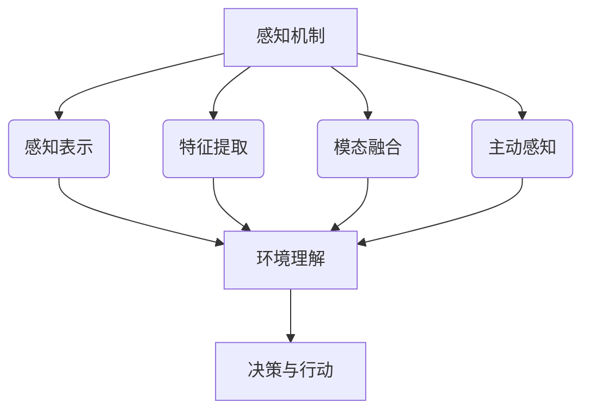

# AI人工智能 Agent：理解和应用智能体的感知机制

## 1. 背景介绍

### 1.1 问题的由来

在当今快速发展的数字时代，人工智能(AI)已经渗透到我们生活的方方面面。从智能助手到自动驾驶汽车，从推荐系统到医疗诊断，AI正在彻底改变我们与世界互动的方式。然而,AI系统的关键在于它们如何感知和理解周围环境,并根据感知信息做出明智的决策和行动。这就引出了智能体(Agent)的概念,智能体是AI系统中具有感知、决策和行动能力的核心组件。

智能体的感知机制是其与环境交互的桥梁,决定了它对环境的理解程度。传统的AI系统往往依赖人工设计的感知模块,这些模块存在局限性,难以应对复杂多变的真实环境。因此,研究和开发更加智能、鲁棒的感知机制,对于提高智能体的环境适应能力至关重要。

### 1.2 研究现状

近年来,机器学习和深度学习技术的飞速发展为智能体的感知机制带来了新的契机。研究人员已经提出了多种基于深度学习的感知模型,如卷积神经网络(CNN)用于计算机视觉,循环神经网络(RNN)用于自然语言处理等。这些模型展现出了强大的特征提取和模式识别能力,在许多领域取得了令人瞩目的成就。

然而,现有的感知模型仍然存在一些局限性。例如,它们往往需要大量的标注数据进行训练,而获取高质量的标注数据是一个巨大的挑战。此外,这些模型通常专注于单一模态(如视觉或语音),而忽视了多模态感知的重要性。此外,现有模型缺乏对环境的主动探索和交互能力,无法像人类那样主动获取感知信息。

### 1.3 研究意义

发展更加智能、鲁棒的感知机制,对于提高智能体的性能和应用前景具有重大意义。首先,优秀的感知机制可以帮助智能体更好地理解复杂的环境,从而做出更明智的决策和行动。其次,感知机制的改进将推动智能体在各个领域的应用,如自动驾驶、机器人技术、智能家居等。此外,研究感知机制也将为人工智能系统的可解释性和可信赖性提供新的见解。

### 1.4 本文结构

本文将全面探讨智能体的感知机制,包括核心概念、算法原理、数学模型、实际应用等多个方面。文章首先介绍感知机制的背景和研究现状,然后深入探讨核心概念和算法原理。接下来,详细阐述相关的数学模型和公式推导过程,并通过案例分析加深理解。此外,文章还将介绍感知机制在实际项目中的应用,包括开发环境搭建、代码实现和运行结果展示。最后,我们将探讨感知机制的实际应用场景、未来发展趋势和面临的挑战。

## 2. 核心概念与联系

智能体的感知机制涉及多个核心概念,包括感知表示(Perception Representation)、特征提取(Feature Extraction)、模态融合(Modality Fusion)和主动感知(Active Perception)等。这些概念相互关联,共同构建了智能体对环境的理解和决策能力。

1. **感知表示(Perception Representation)**: 指智能体如何表示和存储从环境中获取的原始感知数据,如图像、声音、文本等。合理的感知表示方式有助于后续的特征提取和模式识别。

2. **特征提取(Feature Extraction)**: 从原始感知数据中提取出对环境理解有意义的特征或模式,是感知机制的核心步骤。深度学习模型如CNN和RNN在特征提取方面表现出色。

3. **模态融合(Modality Fusion)**: 指将来自不同感知模态(如视觉、听觉、触觉等)的信息进行融合,形成更加全面的环境理解。模态融合是实现多模态感知的关键。

4. **主动感知(Active Perception)**: 指智能体主动与环境交互,获取更多有用的感知信息,而不是被动接收。主动感知有助于提高感知的准确性和鲁棒性。

这些核心概念相互关联,共同推动了智能体对环境的理解和决策能力。合理的感知表示为特征提取奠定基础,特征提取和模态融合则提供了环境理解的关键信息,而主动感知则有助于获取更多有价值的感知数据,形成正向反馈循环。

## 3. 核心算法原理 & 具体操作步骤

### 3.1 算法原理概述

智能体的感知机制通常采用机器学习和深度学习算法来实现。这些算法的核心思想是从大量数据中自动学习特征表示和模式,而不是依赖人工设计的规则。

常见的感知算法包括:

1. **卷积神经网络(Convolutional Neural Network, CNN)**: 擅长处理图像、视频等高维结构化数据,通过卷积和池化操作自动学习特征表示。

2. **循环神经网络(Recurrent Neural Network, RNN)**: 适用于处理序列数据(如文本、语音),通过内部状态捕捉序列依赖关系。

3. **注意力机制(Attention Mechanism)**: 赋予模型专注于输入数据的不同部分的能力,提高了感知的准确性和解释性。

4. **生成对抗网络(Generative Adversarial Network, GAN)**: 通过生成器和判别器的对抗训练,学习数据的真实分布,在数据增强和模态转换等任务中表现出色。

5. **强化学习(Reinforcement Learning)**: 智能体通过与环境交互,获得奖惩反馈,不断优化策略,实现主动感知。

这些算法原理各有侧重,但都旨在从数据中自动学习有意义的特征表示,提高智能体对环境的理解能力。

### 3.2 算法步骤详解

以卷积神经网络(CNN)为例,我们详细介绍感知算法的具体操作步骤:

1. **数据预处理**: 将原始输入数据(如图像)进行标准化、归一化等预处理,以满足神经网络的输入要求。

2. **卷积层(Convolution Layer)**: 通过滑动卷积核(小矩阵)在输入数据上进行卷积操作,提取局部特征。卷积层可以自动学习多种特征检测器,如边缘、纹理等。

3. **激活函数(Activation Function)**: 对卷积层的输出施加非线性变换(如ReLU),增强网络的表达能力。

4. **池化层(Pooling Layer)**: 对卷积层的输出进行下采样,减小特征图的维度,提高模型的鲁棒性和平移不变性。

5. **全连接层(Fully Connected Layer)**: 将前面层的特征图展平,并通过全连接层进行高层次特征的组合和分类。

6. **损失函数(Loss Function)**: 定义模型输出与真实标签之间的误差,如交叉熵损失。

7. **优化器(Optimizer)**: 通过梯度下降等优化算法,反向传播误差梯度,更新网络参数,最小化损失函数。

8. **模型评估**: 在测试集上评估模型的性能,如准确率、召回率等指标。

通过上述步骤,CNN可以自动从图像数据中学习有意义的特征表示,实现高精度的图像分类、目标检测等任务。其他感知算法(如RNN、注意力机制等)虽然具体实现有所不同,但总体思路是类似的。

### 3.3 算法优缺点

感知算法具有以下优缺点:

**优点**:

1. **自动特征学习**: 无需人工设计特征,可以从大量数据中自动学习有意义的特征表示。

2. **端到端训练**: 算法的各个模块可以进行端到端的联合训练,提高整体性能。

3. **泛化能力强**: 通过在大量数据上训练,算法可以获得良好的泛化能力,应对未见过的新数据。

4. **可解释性**: 一些算法(如注意力机制)可以提高模型的可解释性,有助于人类理解模型的决策过程。

**缺点**:

1. **数据饥渴**: 大多数算法需要大量高质量的标注数据进行训练,获取这些数据是一个巨大的挑战。

2. **黑箱操作**: 除了少数可解释模型外,大多数算法的内部工作机制仍然是一个黑箱,缺乏透明度。

3. **对抗样本**: 算法容易受到对抗样本的攻击,导致错误的感知和决策。

4. **计算资源需求高**: 训练和推理过程通常需要大量的计算资源,对硬件要求较高。

5. **缺乏常识推理**: 现有算法主要关注感知任务,缺乏对常识知识的理解和推理能力。

总的来说,感知算法展现出了强大的数据驱动能力,但也存在一些局限性和挑战,需要进一步的研究和改进。

### 3.4 算法应用领域

感知算法在多个领域都有广泛的应用:

1. **计算机视觉**: 包括图像分类、目标检测、语义分割、视频理解等任务,CNN是该领域的主导算法。

2. **自然语言处理**: 包括机器翻译、文本生成、情感分析、问答系统等任务,RNN和Transformer等序列模型表现出色。

3. **语音识别**: 将语音信号转换为文本,通常采用RNN、CNN等模型进行特征提取和序列建模。

4. **多模态学习**: 融合视觉、语音、文本等多种模态的信息,提高感知的准确性和鲁棒性。

5. **机器人技术**: 机器人需要对环境进行精确感知,以实现导航、操作等功能,感知算法在此扮演重要角色。

6. **自动驾驶**: 自动驾驶汽车需要对路况、障碍物等进行实时感知,感知算法是其核心组件之一。

7. **医疗影像分析**: 利用CNN等算法对医学影像(如CT、MRI)进行分析,辅助疾病诊断和治疗决策。

8. **增强现实(AR)**: 通过感知算法实时理解环境,将虚拟信息与真实世界无缝融合。

总之,感知算法为各个领域的智能系统提供了强大的感知能力,是实现人工智能的关键技术之一。

## 4. 数学模型和公式 & 详细讲解 & 举例说明

### 4.1 数学模型构建

智能体的感知机制通常可以建模为一个函数 $f$,将输入的感知数据 $x$ (如图像、语音等)映射到目标输出 $y$ (如类别标签、语义表示等):

$$y = f(x; \theta)$$

其中 $\theta$ 表示模型的可学习参数。感知算法的目标是通过从训练数据中学习最优参数 $\theta^*$,使得模型在测试数据上的性能最大化:

$$\theta^* = \arg\max_\theta \mathcal{L}(f(x; \theta), y)$$

这里 $\mathcal{L}$ 是一个衡量模型输出与真实标签之间契合程度的损失函数(Loss Function),如交叉熵损失、均方误差等。

不同的感知算法对函数 $f$ 的具体形式有不同的定义,但通常都涉及以下几个关键组件:

1. **特征提取模块(Feature Extractor)**: 将原始输入数据 $x$ 映射到特征表示 $\phi(x)$,捕捉输入数据的内在结构和模式。

2. **特征编码器(Feature Encoder)**: 对提取的特征 $\phi(x)$ 进行编码,生成更加紧凑、高层次的特征表示 $h$。

3. **输出层(Output Layer)**: 将编码后的特征 $h$ 映射到目标输出空间,得到最终的模型输