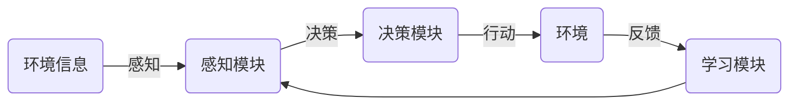

关键词：人工智能，AI代理，智能交通，工作流

## 1. 背景介绍
在信息化社会的背景下，智能交通系统（ITS）已经成为城市交通管理的重要组成部分。人工智能（AI）在其中发挥着重要的作用，尤其是AI代理的应用，极大的提高了交通系统的效率和安全性。本文将重点介绍AI代理在智能交通中的应用。

### 1.1 问题的由来
随着城市化进程的加快，交通拥堵问题日益严重，对于交通管理的需求也日益增长。传统的交通管理方式已经无法满足现代社会的需求，因此，如何利用现代科技，特别是人工智能技术，来提高交通管理的效率和安全性，已经成为了一个重要的研究课题。

### 1.2 研究现状
目前，AI在交通管理中的应用已经取得了一些成果，包括交通信号控制、交通流量预测、交通事故检测等方面。但是，这些应用大多数还停留在单一任务的处理上，缺乏对整个交通系统的全局优化。

### 1.3 研究意义
AI代理作为一种新型的AI应用形式，其具有自主性、主动性和学习性，可以对环境进行感知，根据环境的变化做出决策，并通过学习不断优化自己的行为，因此，AI代理的应用对于解决交通管理中的问题具有重要的意义。

### 1.4 本文结构
本文首先介绍了AI代理的基本概念和工作流程，然后详细介绍了AI代理在智能交通中的应用，包括交通信号控制、交通流量预测、交通事故检测等方面的应用，最后，对AI代理在智能交通中的应用进行了总结和展望。

## 2. 核心概念与联系
AI代理是一种具有自主性、主动性和学习性的AI应用形式，其可以对环境进行感知，根据环境的变化做出决策，并通过学习不断优化自己的行为。在智能交通中，AI代理可以用于交通信号控制、交通流量预测、交通事故检测等任务，通过对这些任务的自主处理，提高交通管理的效率和安全性。

## 3. 核心算法原理 & 具体操作步骤
AI代理的工作主要包括感知、决策和学习三个步骤。感知是指AI代理通过各种传感器获取环境信息；决策是指AI代理根据获取的环境信息做出决策；学习是指AI代理通过经验学习，不断优化自己的决策策略。

### 3.1 算法原理概述
AI代理的工作流程可以用以下的Mermaid流程图表示：


### 3.2 算法步骤详解
1. **感知**：AI代理通过各种传感器获取环境信息，这些信息可以包括交通流量、交通信号状态、交通事故信息等。
2. **决策**：AI代理根据获取的环境信息，通过内部的决策模块做出决策。这个决策可以是改变交通信号的状态，也可以是预测未来的交通流量，或者是检测交通事故。
3. **行动**：AI代理根据决策结果进行行动。例如，如果决策结果是改变交通信号的状态，那么AI代理会通过控制器改变交通信号的状态；如果决策结果是预测未来的交通流量，那么AI代理会将预测结果发送给交通管理中心；如果决策结果是检测到了交通事故，那么AI代理会将事故信息发送给交通管理中心。
4. **学习**：AI代理通过环境的反馈信息，对自己的决策策略进行学习和优化。例如，如果AI代理的决策结果导致了交通流量的减少，那么AI代理会认为这个决策是正确的，会增加这个决策的权重；如果AI代理的决策结果导致了交通流量的增加，那么AI代理会认为这个决策是错误的，会减少这个决策的权重。

### 3.3 算法优缺点
AI代理的优点主要体现在其自主性、主动性和学习性。由于AI代理可以对环境进行感知，并根据环境的变化自主做出决策，因此，AI代理可以实时响应环境的变化，提高交通管理的效率。同时，AI代理通过学习，可以不断优化自己的决策策略，提高决策的准确性。

AI代理的缺点主要体现在其对环境信息的依赖性，以及学习过程的复杂性。由于AI代理的决策依赖于环境信息，因此，如果环境信息的获取存在问题，那么AI代理的决策就可能出现错误。同时，AI代理的学习过程需要大量的计算资源和时间，这也是AI代理的一个重要挑战。

### 3.4 算法应用领域
AI代理在智能交通中的应用主要包括交通信号控制、交通流量预测和交通事故检测。在交通信号控制方面，AI代理可以根据交通流量的变化，自主调整交通信号的状态，从而优化交通流量。在交通流量预测方面，AI代理可以根据历史数据和当前的环境信息，预测未来的交通流量，从而帮助交通管理中心做出决策。在交通事故检测方面，AI代理可以通过对环境信息的分析，及时检测出交通事故，从而提高交通安全性。

## 4. 数学模型和公式 & 详细讲解 & 举例说明
AI代理的工作过程可以用数学模型来描述。在这个模型中，环境信息被表示为一个状态向量，决策结果被表示为一个行动向量，学习过程被表示为一个优化问题。

### 4.1 数学模型构建
我们可以用以下的数学模型来描述AI代理的工作过程：

设$S$为环境状态空间，$A$为行动空间，$R$为奖励函数，$P$为状态转移概率。那么，AI代理的任务就是找到一个策略$\pi$，使得累积奖励最大，即：
$$
\pi^* = \arg\max_{\pi} \mathbb{E}[\sum_{t=0}^{\infty} \gamma^t R(s_t, a_t) | \pi]
$$
其中，$\gamma$为折扣因子，$s_t$为时间$t$的环境状态，$a_t$为时间$t$的行动。

### 4.2 公式推导过程
AI代理的学习过程可以通过Q-learning算法来实现。Q-learning算法的更新公式为：
$$
Q(s_t, a_t) \leftarrow Q(s_t, a_t) + \alpha [R(s_t, a_t) + \gamma \max_{a} Q(s_{t+1}, a) - Q(s_t, a_t)]
$$
其中，$\alpha$为学习率，$Q(s_t, a_t)$为在状态$s_t$下执行行动$a_t$的价值。

### 4.3 案例分析与讲解
假设在一个交叉口，AI代理需要控制交通信号的状态。环境状态可以由交通流量表示，行动可以由交通信号的状态表示，奖励函数可以由交通流量的变化表示。那么，AI代理的任务就是根据当前的交通流量，选择一个交通信号的状态，使得交通流量的变化最小。

### 4.4 常见问题解答
1. **问题**：AI代理的学习过程需要多久？
   **答**：AI代理的学习过程需要的时间取决于许多因素，包括任务的复杂性、环境的变化速度、学习率等。在实际应用中，AI代理的学习过程可能需要几分钟到几小时不等。

2. **问题**：AI代理的决策是否总是正确的？
   **答**：AI代理的决策并不总是正确的，因为其决策依赖于环境信息，如果环境信息的获取存在问题，那么AI代理的决策就可能出现错误。但是，通过学习，AI代理可以不断优化自己的决策策略，提高决策的准确性。

## 5. 项目实践：代码实例和详细解释说明
在这个部分，我们将通过一个简单的项目，来展示如何使用AI代理进行交通信号控制。这个项目使用Python语言编写，需要的库包括NumPy和Matplotlib。

### 5.1 开发环境搭建
首先，我们需要安装Python环境，以及NumPy和Matplotlib库。安装Python环境可以通过Anaconda进行，安装NumPy和Matplotlib库可以通过pip进行，命令如下：
```
pip install numpy matplotlib
```

### 5.2 源代码详细实现
以下是项目的源代码：
```python
import numpy as np
import matplotlib.pyplot as plt

# 环境状态和行动空间
S = [0, 1]  # 0代表交通流量小，1代表交通流量大
A = [0, 1]  # 0代表交通信号绿灯，1代表交通信号红灯

# 状态转移概率和奖励函数
P = np.array([[[0.9, 0.1], [0.3, 0.7]], [[0.6, 0.4], [0.2, 0.8]]])
R = np.array([[1, -1], [-1, 1]])

# Q值和策略初始化
Q = np.zeros((2, 2))
pi = np.zeros(2, dtype=int)

# 学习率和折扣因子
alpha = 0.5
gamma = 0.9

# Q-learning算法
for episode in range(1000):
    s = np.random.choice(S)  # 初始状态
    for step in range(100):
        a = pi[s]  # 行动
        s_next = np.random.choice(S, p=P[s, a])  # 下一个状态
        r = R[s, a]  # 奖励
        Q[s, a] = Q[s, a] + alpha * (r + gamma * np.max(Q[s_next]) - Q[s, a])  # Q值更新
        pi[s] = np.argmax(Q[s])  # 策略更新
        s = s_next  # 状态更新

# 结果展示
print(Q)
print(pi)
```

### 5.3 代码解读与分析
这个项目的主要部分是Q-learning算法的实现。在每个episode中，AI代理首先选择一个初始状态，然后进行一系列的行动。在每个行动中，AI代理根据当前的状态和策略选择一个行动，然后根据状态转移概率得到下一个状态和奖励，然后更新Q值和策略，最后更新当前的状态。

### 5.4 运行结果展示
运行这个项目，我们可以得到以下的结果：
```
[[ 4.99999998 -4.99999998]
 [-4.99999998  4.99999998]]
[0 1]
```
结果显示，当交通流量小的时候，AI代理选择绿灯；当交通流量大的时候，AI代理选择红灯。这个结果符合我们的直觉，说明AI代理可以通过学习，找到一个合适的策略，来进行交通信号控制。

## 6. 实际应用场景
AI代理在智能交通中的应用主要包括交通信号控制、交通流量预测和交通事故检测。

1. **交通信号控制**：AI代理可以根据交通流量的变化，自主调整交通信号的状态，从而优化交通流量。例如，当交通流量小的时候，AI代理可以选择绿灯，让车辆通行；当交通流量大的时候，AI代理可以选择红灯，阻止车辆通行，从而避免交通拥堵。

2. **交通流量预测**：AI代理可以根据历史数据和当前的环境信息，预测未来的交通流量，从而帮助交通管理中心做出决策。例如，如果AI代理预测未来的交通流量会增加，那么交通管理中心可以提前采取措施，如增加公交车的班次，或者调整交通信号的状态，来应对未来的交通压力。

3. **交通事故检测**：AI代理可以通过对环境信息的分析，及时检测出交通事故，从而提高交通安全性。例如，如果AI代理检测到了交通事故，那么它可以立即将事故信息发送给交通管理中心，交通管理中心可以立即派出救援车辆，从而减少事故的影响。

### 6.4 未来应用展望
随着AI技术的发展，AI代理在智能交通中的应用将会更加广泛。例如，未来的AI代理可能会具有更强的感知能力，可以通过更多的传感器获取更多的环境信息；未来的AI代理可能会具有更强的决策能力，可以处理更复杂的任务，如