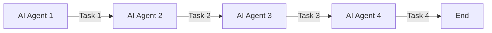

# AI人工智能代理工作流 AI Agent WorkFlow：在物流与供应链中的应用

关键词：AI Agent、工作流、物流、供应链、优化、自动化、决策

## 1. 背景介绍

### 1.1  问题的由来

随着全球化进程的加速和电子商务的蓬勃发展，现代物流和供应链系统面临着前所未有的挑战。订单量激增、配送时效要求提高、运输成本上涨等因素给传统的物流供应链运作模式带来了巨大压力。企业亟需引入先进技术手段，提升物流供应链的智能化水平和运作效率，而人工智能技术的发展为解决这一难题提供了新的思路。

### 1.2  研究现状

近年来，人工智能技术在物流供应链领域得到了广泛应用，如需求预测、库存管理、运输优化、自动拣选等方面。然而，当前的AI应用大多局限于单一环节或特定场景，缺乏全局视角和端到端的优化能力。同时，不同AI模块之间缺乏有效协同，难以发挥整体效能。因此，亟需一种能够统筹物流供应链全流程的AI架构范式。

### 1.3  研究意义

本文提出了一种基于AI Agent的工作流范式，旨在实现物流供应链的全局优化和智能协同。通过引入智能Agent作为各个物流节点的自主决策主体，并通过工作流机制协调不同Agent之间的交互与合作，可以显著提升物流供应链整体的柔性、敏捷性和效率。这一研究对于推动物流行业的数字化转型和智能升级具有重要意义。

### 1.4  本文结构

本文将首先介绍AI Agent和工作流的核心概念及二者之间的关系，然后重点阐述AI Agent工作流的核心算法原理和关键步骤。接下来，我们将建立AI Agent工作流的数学模型，并给出详细的公式推导过程和案例分析。在此基础上，本文将提供一个基于Python的项目实践，展示AI Agent工作流的代码实现。最后，我们将探讨AI Agent工作流在物流供应链中的实际应用场景，分享相关的学习资源和开发工具，并对未来的发展趋势和挑战进行展望。

## 2. 核心概念与联系

AI Agent是一种能够感知环境、自主决策和执行任务的智能实体。它通过机器学习算法从数据中学习，建立对世界的认知模型，并根据当前状态和目标采取相应的行动。在物流供应链场景下，我们可以为每个关键节点（如供应商、仓库、配送中心、运输车辆等）设计对应的AI Agent，赋予它们感知、决策、执行的能力。

工作流是一种基于流程的任务编排和调度机制。通过将复杂任务分解为一系列相互关联的子任务，并按照预设的流程依次执行，工作流可以协调多个参与者之间的协作，实现全局任务的有序完成。将AI Agent嵌入到工作流中，可以实现多个Agent之间的分工协作，从而完成端到端的供应链优化任务。

下图展示了AI Agent与工作流之间的关系：

如上图所示，多个AI Agent通过工作流串联起来，每个Agent负责完成一个特定的子任务，并将结果传递给下一个Agent。这种松耦合的设计使得系统具备了很好的灵活性和可扩展性。

## 3. 核心算法原理 & 具体操作步骤

### 3.1  算法原理概述

AI Agent工作流的核心是一种基于强化学习的多Agent协同优化算法。每个Agent都被建模为一个智能体，通过与环境的交互来学习最优策略。多个Agent之间通过工作流协议进行通信和协作，共同完成全局优化目标。算法的关键是如何设计有效的奖励函数，使得每个Agent的局部决策能够与全局目标保持一致。同时，还需要解决多Agent博弈、信息不对称、奖励稀疏等问题。

### 3.2  算法步骤详解

1. 定义状态空间和动作空间。对于每个Agent，我们需要定义它所面临的状态空间（如库存水平、订单需求、车辆位置等）和可选的动作空间（如补货、拣选、路径规划等）。

2. 设计奖励函数。奖励函数决定了Agent的优化目标，需要综合考虑各个物流指标（如成本、时效、服务水平等）的权重，并将全局目标分解到每个Agent的局部奖励中。

3. 选择学习算法。常见的强化学习算法包括Q-Learning、SARSA、Policy Gradient等，针对不同的问题特点选择合适的算法。

4. 定义工作流协议。设计Agent之间通信和协作的规则，包括信息传递的内容、时机和方式，以及任务分解、分配、同步的机制。

5. 训练模型。通过仿真环境或真实数据，利用强化学习算法训练每个Agent的策略模型，并不断优化奖励函数和协作机制，直到收敛。

6. 部署应用。将训练好的Agent模型集成到实际的物流供应链系统中，并持续监控和改进性能。

### 3.3  算法优缺点

优点：
- 能够实现端到端的全局优化，打破传统的信息孤岛和局部视角。
- 具有自适应和自学习能力，可以根据实时数据流动态调整决策。 
- 多Agent协同有助于应对复杂多变的现实场景，提升系统的鲁棒性。

缺点：
- 算法复杂度高，对计算资源和数据质量要求较高。  
- 奖励函数的设计需要大量的领域知识和反复调试。
- 多Agent博弈可能导致次优均衡，需要精细的机制设计。

### 3.4 算法应用领域

AI Agent工作流算法可以广泛应用于各种物流供应链场景，如：

- 智能仓储：优化库存补货、拣选路径、货位分配等策略。
- 运输调度：优化车辆路径、载重、时间窗口等决策。
- 需求预测：结合历史数据和实时信息，预测未来订单需求。
- 供应商管理：优化供应商选择、订单分配、绩效评估等流程。

此外，该算法也可以扩展到其他具有多Agent协同特征的领域，如智慧城市、智能电网、网络安全等。

## 4. 数学模型和公式 & 详细讲解 & 举例说明

### 4.1  数学模型构建

我们以多Agent强化学习为基础，构建AI Agent工作流的数学模型。考虑一个由$N$个Agent组成的系统，每个Agent对应一个马尔可夫决策过程（MDP），定义为一个六元组：

$$\mathcal{M}_i=\langle\mathcal{S}_i,\mathcal{A}_i,\mathcal{P}_i,\mathcal{R}_i,\gamma_i,\rho_0^i\rangle$$

其中，$\mathcal{S}_i$表示Agent $i$的状态空间，$\mathcal{A}_i$表示其动作空间，$\mathcal{P}_i$是状态转移概率矩阵，$\mathcal{R}_i$是奖励函数，$\gamma_i$是折扣因子，$\rho_0^i$是初始状态分布。

多Agent系统的联合状态空间为$\mathcal{S}=\mathcal{S}_1\times\cdots\times\mathcal{S}_N$，联合动作空间为$\mathcal{A}=\mathcal{A}_1\times\cdots\times\mathcal{A}_N$。每个Agent的策略是一个从状态到动作的映射，记为$\pi_i:\mathcal{S}_i\mapsto\mathcal{A}_i$。联合策略为$\boldsymbol{\pi}=\langle\pi_1,\cdots,\pi_N\rangle$。

系统的全局奖励为每个Agent奖励的加权和：

$$R(\boldsymbol{s},\boldsymbol{a})=\sum_{i=1}^N w_i R_i(s_i,a_i)$$

其中，$\boldsymbol{s}=\langle s_1,\cdots,s_N\rangle$是联合状态，$\boldsymbol{a}=\langle a_1,\cdots,a_N\rangle$是联合动作，$w_i$是Agent $i$的重要性权重。

目标是寻找一个最优联合策略$\boldsymbol{\pi}^*$，使得全局期望累积奖励最大化：

$$\boldsymbol{\pi}^*=\arg\max_{\boldsymbol{\pi}} \mathbb{E}\left[\sum_{t=0}^{\infty}\gamma^t R(\boldsymbol{s}_t,\boldsymbol{a}_t)\right]$$

### 4.2  公式推导过程

为了求解最优联合策略，我们采用基于价值函数的强化学习方法。首先定义联合状态-动作价值函数（Q函数）：

$$Q^{\boldsymbol{\pi}}(\boldsymbol{s},\boldsymbol{a})=\mathbb{E}\left[\sum_{k=0}^{\infty}\gamma^k R(\boldsymbol{s}_{t+k},\boldsymbol{a}_{t+k})\mid \boldsymbol{s}_t=\boldsymbol{s},\boldsymbol{a}_t=\boldsymbol{a}\right]$$

它表示在联合状态$\boldsymbol{s}$下采取联合动作$\boldsymbol{a}$，并在之后一直遵循策略$\boldsymbol{\pi}$所能获得的期望累积奖励。

根据贝尔曼方程，我们可以得到Q函数的递推形式：

$$Q^{\boldsymbol{\pi}}(\boldsymbol{s},\boldsymbol{a})=R(\boldsymbol{s},\boldsymbol{a})+\gamma\sum_{\boldsymbol{s}'\in\mathcal{S}}P(\boldsymbol{s}'|\boldsymbol{s},\boldsymbol{a})V^{\boldsymbol{\pi}}(\boldsymbol{s}')$$

其中，$V^{\boldsymbol{\pi}}(\boldsymbol{s})=\sum_{\boldsymbol{a}\in\mathcal{A}}\boldsymbol{\pi}(\boldsymbol{a}|\boldsymbol{s})Q^{\boldsymbol{\pi}}(\boldsymbol{s},\boldsymbol{a})$是联合状态价值函数。

最优Q函数满足贝尔曼最优方程：

$$Q^*(\boldsymbol{s},\boldsymbol{a})=R(\boldsymbol{s},\boldsymbol{a})+\gamma\sum_{\boldsymbol{s}'\in\mathcal{S}}P(\boldsymbol{s}'|\boldsymbol{s},\boldsymbol{a})\max_{\boldsymbol{a}'\in\mathcal{A}}Q^*(\boldsymbol{s}',\boldsymbol{a}')$$

因此，最优联合策略可以通过贪心法从最优Q函数中导出：

$$\boldsymbol{\pi}^*(\boldsymbol{s})=\arg\max_{\boldsymbol{a}\in\mathcal{A}}Q^*(\boldsymbol{s},\boldsymbol{a})$$

### 4.3  案例分析与讲解

下面我们通过一个简单的例子来说明如何应用上述模型和算法。考虑一个由两个Agent组成的物流系统，其中Agent 1负责管理一个仓库，Agent 2负责配送中心。

状态空间：
- Agent 1的状态为当前库存水平，分为高、中、低三档； 
- Agent 2的状态为当前待配送订单数，分为多、中、少三档。

动作空间：
- Agent 1的动作为补货量，分为大、中、小三档；
- Agent 2的动作为配送量，分为大、中、小三档。

奖励函数：
- Agent 1的奖励由库存成本（越高扣分越多）和缺货损失（越多扣分越多）组成；
- Agent 2的奖励由配送效率（越高加分越多）和延误率（越高扣分越多）组成；
- 全局奖励为两个Agent奖励的加权和，权重分别为0.4和0.6。

在此设定下，我们可以通过Q-Learning等算法对两个Agent进行训练，学习最优的补货和配送策略，并通过工作流协议实现两个Agent的协同，从而优化整个物流系统的效率和成本。

### 4.4  常见问题解答

Q: 如何处理Agent之间的信息不对称问题？