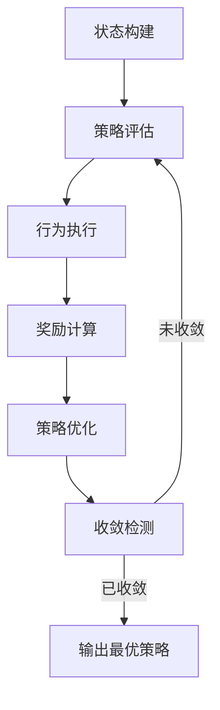

好的，我会按照您提供的要求和框架，撰写一篇关于"AI人工智能代理工作流：在自动化检查中的应用"的专业技术博客文章。

# AI人工智能代理工作流 AI Agent WorkFlow：在自动化检查中的应用

## 1. 背景介绍

### 1.1 问题的由来

在当今快节奏的软件开发生命周期中,确保代码质量和及时发现潜在缺陷是一项艰巨的挑战。传统的人工代码审查和测试往往效率低下、耗时耗力,很难跟上不断增加的代码复杂度和交付节奏。因此,引入自动化检查工具来提高代码质量和加快交付速度变得越来越重要。

### 1.2 研究现状

目前已有许多静态代码分析、单元测试、集成测试等自动化检查工具,它们在一定程度上提高了代码质量,但仍然存在一些不足:

- 工具分散,缺乏统一的工作流程管理
- 配置复杂,难以灵活调整检查策略  
- 反馈滞后,无法及时发现和修复问题
- 缺乏智能化,无法自主优化检查过程

### 1.3 研究意义 

AI人工智能代理工作流(AI Agent Workflow)旨在解决上述痛点,提供一种全新的自动化检查范式。它集成了多种检查工具,并基于AI技术构建了智能化的工作流管理和优化机制,可以极大提升自动化检查的效率、及时性和智能化水平。

### 1.4 本文结构

本文将全面介绍AI人工智能代理工作流在自动化检查中的应用,内容包括:

- 核心概念与联系
- 核心算法原理与具体操作步骤  
- 数学模型与公式推导
- 项目实践与代码示例
- 实际应用场景分析
- 相关工具和学习资源推荐
- 未来发展趋势与挑战探讨

## 2. 核心概念与联系

AI人工智能代理工作流是一个涵盖多个核心概念的复杂系统,其中包括:

1. **智能代理(Intelligent Agent)**: 指具有一定自主性和智能的软件实体,能够感知环境、作出决策并执行相应操作。在本系统中,智能代理负责管理和优化整个自动化检查工作流。

2. **工作流管理(Workflow Management)**: 对自动化检查的各个环节(如静态分析、单测、集成测试等)进行统一调度和协调,确保检查流程高效有序运行。

3. **策略优化(Policy Optimization)**: 基于历史数据和反馈,持续优化检查策略,包括检查工具的选择、配置参数的调整等,以提高检查的准确性和效率。  

4. **机器学习(Machine Learning)**: 应用监督学习、强化学习等技术,从大量历史案例中自动学习出优化策略,实现自主优化检查流程。

5. **DevOps**: AI代理工作流紧密融入DevOps实践,支持代码提交、构建、测试、发布等环节的自动化检查,全面保障交付质量。

这些核心概念相互关联、环环相扣,共同构建了一个智能化的自动化检查新范式。

## 3. 核心算法原理与具体操作步骤  

### 3.1 算法原理概述

AI人工智能代理工作流的核心算法基于**马尔可夫决策过程(Markov Decision Process, MDP)**和**深度强化学习(Deep Reinforcement Learning)**技术。

在MDP模型中,自动化检查过程被建模为一个**状态-行为-奖励**循环:

- **状态(State)**: 描述当前代码的质量状况、已执行的检查操作等信息
- **行为(Action)**: 智能代理可采取的下一步检查操作,如运行某种静态分析工具、添加某种测试用例等
- **奖励(Reward)**: 行为执行后获得的反馈,如发现的新缺陷数、检查耗时等,用于评估行为的效果

根据当前状态,智能代理通过**策略函数(Policy Function)** $\pi(a|s)$ 选择最优行为,目标是最大化在整个检查过程中累积获得的总奖励。

为了求解最优策略函数,我们借助**深度强化学习**技术,使用**深度神经网络(Deep Neural Network)**来逼近策略函数和价值函数(评估状态的长期收益)。通过不断的试错与学习,神经网络可以自主发现检查过程中的最优决策模式。

### 3.2 算法步骤详解

AI代理工作流的核心算法可分为以下几个主要步骤:

1. **状态构建**: 根据当前代码库、已执行的检查操作、发现的缺陷等信息,构建状态向量作为算法输入。

2. **策略评估**: 将状态向量输入到策略神经网络,计算各种可选行为的执行概率,选择概率最大的行为作为本次决策。

3. **行为执行**: 执行选定的检查操作,如运行静态分析工具、添加测试用例等。

4. **奖励计算**: 根据检查结果(如新发现缺陷数、耗时等)计算本次行为的奖励值。

5. **策略优化**: 将(状态,行为,奖励)数据加入经验池,并周期性地对策略神经网络进行训练,使其学习到更优的决策模式。

6. **收敛检测**: 监测策略是否已收敛(在给定状态下能够稳定地选择同一最优行为),若收敛则终止训练,否则重复2-5步骤。

上述算法步骤通过**经验循环(Experience Loop)**不断重复迭代,持续优化策略模型,直至收敛于(近似)最优解。

### 3.3 算法优缺点

**优点**:

- 自主性强,无需人工干预即可持续优化检查策略
- 融合多种检查工具,发挥各自优势形成协同效应
- 基于强化学习的试错反馈机制,可不断改进并发现新的最优解
- 灵活性高,可根据具体场景和需求调整奖励函数

**缺点**:  

- 需要大量历史数据用于模型训练,对于新项目可能效果不佳
- 策略收敛速度较慢,需要大量试错迭代才能收敛
- 算法复杂,需要大量计算资源支持

### 3.4 算法应用领域

AI人工智能代理工作流算法可广泛应用于以下场景:

- 软件开发生命周期的各个环节(代码静态分析、单元测试、集成测试、系统测试等)
- Web应用程序的安全检查和渗透测试  
- 嵌入式系统固件的质量检查和故障诊断
- 机器学习模型的验证和测试
- 其他需要复杂决策流程的自动化检查任务

## 4. 数学模型和公式详细讲解与举例说明

### 4.1 数学模型构建  

AI代理工作流算法建模于**马尔可夫决策过程(MDP)** ,它是一种用于描述序贯决策问题的数学模型。

在MDP中,自动化检查过程被建模为一个由 $(S, A, P, R, \gamma)$ 组成的五元组:

- $S$ 是 **状态集合(State Space)** ,描述系统可能的状态
- $A$ 是 **行为集合(Action Space)** ,描述智能代理可执行的行为 
- $P(s'|s,a)$ 是 **转移概率(Transition Probability)** ,表示在状态 $s$ 执行行为 $a$ 后,转移到状态 $s'$ 的概率
- $R(s,a)$ 是 **奖励函数(Reward Function)** ,定义在状态 $s$ 执行行为 $a$ 后获得的即时奖励
- $\gamma \in [0,1)$ 是 **折扣因子(Discount Factor)** ,用于权衡即时奖励和长期收益

在该模型下,智能代理的目标是找到一个 **策略(Policy)** $\pi: S \rightarrow A$ ,使得沿着该策略执行时,能够最大化预期的**累积折扣奖励(Discounted Cumulative Reward)**:

$$
G_t = \sum_{k=0}^{\infty} \gamma^k R(s_{t+k}, a_{t+k})
$$

其中 $s_t, a_t$ 分别表示在时间步 $t$ 的状态和行为。

通过建模为MDP,自动化检查的决策过程可以借助强化学习等技术,从大量历史经验中自动学习出(近似)最优策略。

### 4.2 公式推导过程

在上述MDP模型的基础上,我们可以使用**值迭代(Value Iteration)** 或 **策略迭代(Policy Iteration)** 等经典动态规划算法求解最优策略。

以 **值迭代** 为例,算法的目标是找到一个 **价值函数(Value Function)** $V^*(s)$ ,使其满足 **贝尔曼最优方程(Bellman Optimality Equation)** :

$$
V^*(s) = \max_{a} \mathbb{E}[R(s, a) + \gamma V^*(s')]
$$

其中 $s'$ 是执行行为 $a$ 后的下一状态。

我们可以通过 **值迭代算法** iteratively 逼近最优价值函数:

$$
V_{k+1}(s) = \max_a \mathbb{E}[R(s, a) + \gamma \sum_{s'} P(s'|s, a)V_k(s')]
$$

当 $V_k$ 收敛时,即得到最优价值函数 $V^*$,对应的最优策略为:

$$
\pi^*(s) = \arg\max_a \mathbb{E}[R(s, a) + \gamma \sum_{s'}P(s'|s, a)V^*(s')]
$$

上述传统动态规划算法需要事先已知MDP的精确转移概率,这在实践中往往难以获得。因此我们借助 **深度强化学习** 技术,使用**深度神经网络**来逼近策略函数和价值函数,通过从大量数据中学习,自动发现最优解。

### 4.3 案例分析与讲解  

我们以一个简化的代码静态检查场景为例,说明AI代理工作流算法的具体应用。

假设我们有一个Java代码库,需要进行静态检查以发现潜在缺陷(如空指针引用、资源未释放等)。我们可以使用多种静态分析工具(如FindBugs、PMD、SonarQube等),但是不同工具在发现缺陷类型、分析速度、配置复杂度等方面存在差异。

我们的目标是设计一个智能代理,能够自主选择最合适的工具组合及其配置参数,以最小的耗时发现尽可能多的缺陷。

**状态空间(State Space)** 可以定义为一个包含以下信息的向量:

- 代码库的基本统计信息(文件数、行数等)
- 已发现的缺陷类型及数量
- 已执行的静态分析工具及其配置
- 当前已耗费的时间

**行为空间(Action Space)** 包括:

- 运行某种静态分析工具(如FindBugs)
- 调整某工具的配置参数(如PMD的规则集)
- 停止检查,输出最终结果

**奖励函数(Reward Function)** 可以设计为:

$$
R(s, a) = \alpha * \text{新发现缺陷数} - \beta * \text{执行耗时}
$$

其中 $\alpha$ 和 $\beta$ 是权重系数,用于权衡缺陷发现数量和耗时之间的重要性。

在该场景下,智能代理将根据当前状态(如已发现缺陷类型、耗时等),选择最优行为(如运行FindBugs、调整PMD配置等),目标是最大化累积奖励,即发现更多缺陷且耗时更少。

通过大量的试错训练,智能代理可以逐步学习到一个近似最优的策略,自主调度各种工具的执行,达到高效检查的目的。

### 4.4 常见问题解答

1. **为什么要使用深度强化学习,而不是直接编码规则?**

编码规则存在一些固有缺