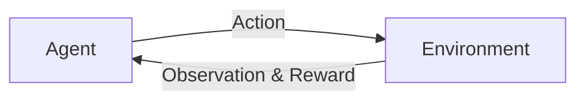

# AI人工智能代理工作流 AI Agent WorkFlow：未来发展趋势

作者：禅与计算机程序设计艺术 / Zen and the Art of Computer Programming

关键词：人工智能, 代理, 工作流, 自动化, 智能决策, 自适应, 协作, 分布式

## 1. 背景介绍
### 1.1  问题的由来
随着人工智能技术的快速发展,特别是机器学习、深度学习等技术的突破,AI已经开始在许多领域得到广泛应用。然而,当前的AI系统大多是针对特定任务设计的,缺乏通用性和灵活性。如何设计出能够自主学习、自主决策、自主执行任务的通用AI系统,实现从"弱人工智能"到"强人工智能"的跨越,是当前AI领域亟待解决的重大课题之一。

而AI Agent(人工智能代理)正是为解决这一问题而提出的一种新型AI系统架构。它借鉴了经济学中"代理人"的概念,将AI系统看作是一个智能体,代表人类用户执行各种任务。通过引入工作流(Workflow)的概念,AI Agent可以将复杂任务分解为一系列可执行的子任务,并通过工作流引擎来调度和执行这些子任务,从而实现任务的自动化。

### 1.2  研究现状 
目前,AI Agent的研究还处于起步阶段,主要集中在理论模型和算法的探索上。一些代表性的研究工作包括:

- Google DeepMind提出了Deep Reinforcement Learning(深度强化学习)框架,并基于此开发了AlphaGo等智能系统,在围棋、星际争霸等复杂博弈问题上取得了重大突破。

- OpenAI提出了GPT、DALL·E等大规模语言模型和多模态生成模型,展示了AI在自然语言理解、图像生成等方面的惊人能力。

- 微软亚洲研究院提出了FLOW框架,将工作流引入到机器学习中,实现了端到端的机器学习流程自动化。

- 清华大学提出了HyperNetwork模型,通过将网络嵌套网络的方式,实现了模型的自适应和自演化。

- 麻省理工学院媒体实验室提出了Society of Mind理论,探讨了如何将多个AI模块组织起来,实现类似人脑的分布式智能。

总的来说,当前AI Agent的研究还处于理论探索阶段,离真正的落地应用还有较大距离。未来的研究重点在于如何将各种AI技术(如机器学习、知识图谱、因果推理等)与工作流技术相结合,设计出更加通用、灵活、鲁棒的AI Agent系统。同时,还需要探索如何让多个AI Agent相互协作,发挥群体智能,解决更加复杂的现实问题。

### 1.3 研究意义
AI Agent代表了未来人工智能技术的重要发展方向,具有重大的理论意义和应用价值:

- 在理论上,AI Agent为探索通用人工智能(AGI)提供了新的思路。通过将复杂任务分解为可执行的子任务,并通过工作流的方式来组织和调度这些子任务,AI Agent可以实现从特定领域智能到通用智能的跨越,为AGI的实现奠定基础。

- 在应用上,AI Agent可以大大提高人类的生产力和创造力。通过将日常工作任务交给AI Agent执行,人类可以从繁琐的重复劳动中解放出来,将更多的精力投入到创新性工作中去。同时,AI Agent还可以在危险环境、极端条件下替代人类工作,保障作业安全。

- 此外,AI Agent还为实现人机协同、人机共生提供了新的可能。未来,人类与AI Agent可以和谐共处,相互补充,共同应对各种挑战。AI Agent可以作为人类的得力助手,而人类则可以为AI Agent提供指导和监督,双方优势互补,共同进步。

### 1.4 本文结构
本文将重点探讨AI Agent的工作流(Workflow)模型,介绍其核心概念、关键技术、实现架构、应用场景等,展望其未来的发展趋势和面临的挑战。全文结构如下:

第2部分介绍AI Agent的核心概念,包括Agent、Environment、Action、Reward等,说明它们之间的关系。

第3部分重点介绍AI Agent的核心算法原理,包括马尔可夫决策过程(MDP)、蒙特卡洛树搜索(MCTS)、深度强化学习(DRL)等,并通过具体的操作步骤说明如何应用这些算法构建AI Agent。

第4部分介绍AI Agent的数学模型和公式,包括贝尔曼方程、策略梯度定理、变分推断等,通过详细的公式推导和案例分析,加深读者对算法原理的理解。

第5部分通过项目实践,展示如何使用Python等开发语言来实现一个简单的AI Agent系统,并通过代码解读和运行结果分析,加深读者对系统实现的认识。

第6部分介绍AI Agent在智能客服、自动驾驶、智慧城市等领域的实际应用场景,展望其未来的应用前景。

第7部分推荐一些学习AI Agent的工具和资源,包括开源框架、在线课程、经典论文等,方便读者进一步学习和研究。

第8部分总结全文,评述AI Agent的研究现状和未来发展趋势,分析其面临的机遇和挑战,并对下一步的研究方向提出展望。

第9部分列举了一些读者关心的常见问题,并给出了详细的解答,帮助读者更好地理解AI Agent的相关概念和技术细节。

## 2. 核心概念与联系

在介绍AI Agent的工作流之前,我们先来了解一下其核心概念:

- **Agent(代理)** : 在人工智能领域,Agent指的是一个可以感知环境、做出决策并采取行动的自主实体。它可以是一个软件程序、一个机器人,或者一个智能体系统。Agent的目标是根据当前的环境状态,选择最优的行动策略,以获得最大的累积回报。

- **Environment(环境)** : Environment指的是Agent所处的外部环境,它包含了Agent可以感知和交互的所有对象和信息。Environment的状态是动态变化的,会受到Agent行为的影响。Environment会给Agent提供观察值(Observation)和回报(Reward)。

- **Action(行动)** : Action指的是Agent在某个状态下可以采取的一系列动作或决策。不同的Action会导致Environment状态的改变,并产生相应的回报。Agent需要通过学习和优化,找到最佳的行动策略。

- **Reward(回报)** : Reward指的是Environment对Agent的行为给出的即时反馈。通常用一个数值来表示,正值表示鼓励,负值表示惩罚。Agent的目标就是最大化累积回报,因此Reward信号对于引导Agent学习至关重要。

- **State(状态)** : State指的是Environment在某一时刻的完整描述,它包含了Agent做决策所需的所有信息。马尔可夫决策过程假设下一个状态只与当前状态和行动有关,与之前的历史状态无关。

- **Policy(策略)** : Policy指的是Agent的行为决策函数,即在某个State下应该选择哪个Action。优化Policy是Agent学习的核心目标。

- **Value Function(价值函数)** : Value Function指的是在某个State下,遵循某个Policy可以获得的期望累积回报。它反映了这个State的长期价值。

- **Model(模型)** : Model指的是对Environment的一种表示,用于预测下一个State和Reward。基于Model的强化学习方法可以利用Model进行规划和推理,无需频繁与真实环境交互。

下图展示了Agent与Environment交互的基本框架:

可以看到,Agent通过感知Environment的Observation,结合当前的State,根据Policy选择Action,并获得相应的Reward反馈。不断重复这个交互过程,Agent会逐步优化自己的Policy,最终找到最优策略。

这些概念是构建AI Agent系统的基础,下面我们将基于这些概念,详细介绍AI Agent的工作流模型。

## 3. 核心算法原理 & 具体操作步骤

### 3.1 算法原理概述

AI Agent的核心算法主要基于强化学习(Reinforcement Learning),即通过Agent与Environment的交互,不断试错和优化,最终学习到最优策略的过程。常见的强化学习算法包括:

- 值函数方法(Value-based): 通过学习状态价值函数(State Value Function)或者动作价值函数(Q-Function),评估每个状态或行动的长期回报,并据此选择最优动作。代表算法有Q-Learning、Sarsa等。

- 策略梯度方法(Policy Gradient): 直接对策略函数进行参数化,并通过梯度上升的方式来更新策略参数,使得优秀的动作被采样的概率越来越高。代表算法有REINFORCE、Actor-Critic等。

- 蒙特卡洛树搜索(MCTS): 通过反复在搜索树中模拟采样,并计算每个节点的平均回报,逐步扩展和优化搜索树,最终选择最优动作。AlphaGo就是基于MCTS和深度神经网络的结合。

- 进化算法(Evolutionary Algorithm): 借鉴生物进化论的思想,通过对一组候选策略反复进行选择、交叉、变异等操作,不断淘汰劣质策略、优化优质策略,最终收敛到最优策略。

- 多智能体强化学习(Multi-agent RL): 在包含多个Agent的环境中,通过建模Agent之间的博弈和协作关系,求解纳什均衡或帕累托最优,实现整体利益最大化。

### 3.2 算法步骤详解

下面我们以 Q-Learning 算法为例,详细介绍强化学习的具体步骤:

1. 初始化 Q-Table。Q-Table 是一个二维表格,行表示State,列表示Action,每个元素表示在某个State下采取某个Action的期望回报。初始时,Q-Table可以随机初始化或者全部初始化为0。

2. 选择Action。Agent根据当前的State,采用一定的策略选择要执行的Action。常见的策略有ε-greedy策略,即以1-ε的概率选择Q值最高的Action,以ε的概率随机选择其他Action,以平衡Exploration和Exploitation。

3. 执行Action,得到Reward和下一个State。Agent将选定的Action作用于Environment,使得Environment状态发生改变,并获得即时Reward和新的State。

4. 更新Q-Table。利用获得的Reward和新State,根据Bellman方程来更新Q-Table中的Q值。更新公式为:
$$ Q(s,a) \leftarrow Q(s,a) + \alpha [r + \gamma \max_{a'} Q(s',a') - Q(s,a)] $$
其中,s为当前State,a为选择的Action,r为获得的即时Reward,s'为新的State,α为学习率,γ为折扣因子。

5. 重复步骤2-4,直到收敛或达到最大迭代次数。不断重复上述过程,随着训练的进行,Q-Table会逐渐收敛,最终得到最优策略。

6. 评估和应用策略。利用学习到的Q-Table,可以得到一个确定性策略:对于任意State,选择Q值最高的Action即可。将该策略应用到实际环境中,并评估其性能。

### 3.3 算法优缺点

Q-Learning算法的主要优点包括:
- 简单易实现,适合入门学习
- 可以在模型未知的环境中应用(model-free)
- 能够收敛到最优策略(在一定条件下)
- 通过离线学习Q-Table,可以实现快速决策

但它也存在一些局限性:
- 状态和动作空间太大时,Q-Table难以存储和收敛
- 难以处理连续状态和动作空间
- 学习效率较低,需要大量的探索和试错
- 不适合非静态环境和多Agent场景

因此在实际应用中,我们往往需要在Q-Learning的基础上,引入函数逼近(如深度神经网络)、Experience Replay、并行学习等机制,以提升其性能和泛化能力。一些改进版的算法,如DQN、DDPG、PPO等,在Atari游戏、机器人控制等领域取得了不错的效果。

### 3.4 算法应用领域

强化学习算法在许多领域得到了广泛应用,比如:

- 游