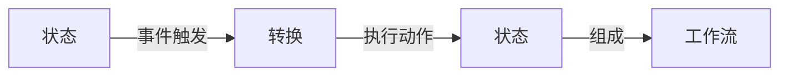

# AI人工智能代理工作流 AI Agent WorkFlow：状态的定义与跟踪

## 1. 背景介绍

### 1.1 问题的由来

在当今快节奏的软件开发环境中，人工智能(AI)代理的应用越来越广泛。这些智能代理需要执行复杂的任务,涉及多个步骤和状态转换。有效地管理和跟踪这些代理的工作流程对于确保系统的正确性和高效性至关重要。然而,随着任务复杂度的增加,手动跟踪代理状态变得越来越困难,容易出现错误和遗漏。

### 1.2 研究现状 

目前,已有一些研究致力于解决这一问题。一种常见的方法是使用有限状态机(Finite State Machine,FSM)来建模代理的工作流程。FSM定义了一组有限的状态,以及在给定条件下从一个状态转移到另一个状态的规则。然而,FSM在处理复杂场景时存在局限性,因为状态数量会快速增加,导致状态空间爆炸。

另一种方法是使用行为树(Behavior Trees,BT),它是一种基于层次结构的决策模型,可以更好地处理复杂场景。BT通过组合简单的任务来构建复杂的行为,但在某些情况下,它可能难以直观地表示代理的状态。

### 1.3 研究意义

为了更好地管理和跟踪AI代理的工作流程,我们需要一种新的方法来有效地定义和表示代理的状态。这种方法应该具有足够的表现力来捕获复杂场景,同时保持简单性和可维护性。通过清晰地定义和跟踪代理的状态,我们可以更好地理解代理的行为,并在出现异常时快速定位和解决问题。

### 1.4 本文结构

本文将介绍一种新颖的方法来定义和跟踪AI代理的工作流程状态。我们将首先探讨核心概念和它们之间的关系,然后深入探讨算法原理和具体操作步骤。接下来,我们将介绍相关的数学模型和公式,并通过实例进行详细说明。随后,我们将提供一个实际项目的代码实现,并对其进行详细解释。最后,我们将讨论该方法在实际应用场景中的应用,并推荐相关工具和资源。

## 2. 核心概念与联系

在介绍我们的方法之前,让我们首先定义一些核心概念:

1. **状态(State)**: 代理在某个时间点的条件或情况。状态可以是离散的(如"等待"、"执行"等),也可以是连续的(如位置坐标)。

2. **事件(Event)**: 导致代理状态发生变化的触发条件。事件可以是外部输入(如传感器数据)或内部条件(如计时器超时)。

3. **转换(Transition)**: 代理从一个状态切换到另一个状态的过程。转换通常由事件触发,并可能伴随着一些动作的执行。

4. **工作流(Workflow)**: 代理执行特定任务所需遵循的状态序列。工作流由一系列状态和转换组成,形成一个有向图。

这些概念之间的关系如下所示:



我们的目标是为AI代理设计一种灵活且易于维护的工作流定义和跟踪方法,以确保代理能够正确地执行其任务,并在出现异常时进行及时处理。

## 3. 核心算法原理 & 具体操作步骤

### 3.1 算法原理概述

我们提出的方法基于一种称为"分层状态机(Hierarchical State Machine,HSM)"的概念。HSM是一种扩展的有限状态机,它允许状态具有层次结构,并支持并行执行多个子状态。

在HSM中,每个状态可以包含多个并行运行的子状态,这些子状态又可以进一步分解为更细粒度的子状态。这种分层结构使得我们能够将复杂的行为分解为多个较简单的子行为,从而提高可维护性和可重用性。

HSM的核心算法包括以下几个步骤:

1. 定义状态层次结构
2. 为每个状态指定进入(Entry)和退出(Exit)动作
3. 定义状态之间的转换条件(Transitions)
4. 处理并行运行的子状态
5. 处理历史状态(History States)

通过这种方式,我们可以清晰地表示代理的工作流程,并在代理执行过程中实时跟踪其状态。

### 3.2 算法步骤详解

#### 3.2.1 定义状态层次结构

状态层次结构是HSM的核心组成部分。它定义了代理可能处于的不同状态,以及这些状态之间的包含关系。

我们可以使用一种类似于文件系统目录结构的表示方式来定义状态层次结构。每个状态都可以包含子状态,子状态又可以进一步包含更深层次的子状态。

例如,一个机器人导航任务的状态层次结构可能如下所示:

```
Navigation
    ├── Planning
    │   ├── PathFinding
    │   └── ObstacleAvoidance
    └── Moving
        ├── Forward
        ├── Backward
        ├── Left
        └── Right
```

在这个示例中,`Navigation`是顶层状态,它包含两个子状态`Planning`和`Moving`。`Planning`状态又进一步分解为`PathFinding`和`ObstacleAvoidance`两个子状态。

#### 3.2.2 进入(Entry)和退出(Exit)动作

对于每个状态,我们可以定义在进入该状态时执行的动作(Entry Actions)和退出该状态时执行的动作(Exit Actions)。这些动作可以用于初始化或清理与该状态相关的资源。

例如,对于`Moving`状态,我们可以定义以下进入和退出动作:

- Entry Action: 启动机器人的运动控制系统
- Exit Action: 停止机器人的运动控制系统

#### 3.2.3 定义状态转换条件

状态之间的转换由事件触发。我们需要为每个可能的转换定义触发条件。触发条件可以是外部事件(如传感器数据)或内部条件(如计时器超时)。

例如,从`PathFinding`状态转换到`ObstacleAvoidance`状态的条件可能是:

- 触发条件: 检测到障碍物

#### 3.2.4 处理并行运行的子状态

HSM支持在同一层次上并行运行多个子状态。这对于模拟同时发生的多个行为非常有用。

例如,在`Navigation`状态下,我们可以同时运行`Planning`和`Moving`子状态,以实现同时规划路径和执行运动的功能。

#### 3.2.5 处理历史状态

HSM还支持历史状态(History States)的概念。历史状态记录了上次退出某个状态时,它的子状态处于什么状态。当重新进入该状态时,HSM可以自动恢复到上次的子状态,而不必从头开始执行。

这对于处理中断和恢复操作非常有用。例如,如果机器人导航过程中暂时失去了定位,它可以在重新获得定位后继续执行之前的子状态,而不必重新开始整个导航过程。

### 3.3 算法优缺点

我们提出的基于HSM的方法具有以下优点:

- **模块化和可维护性**: 通过将复杂的行为分解为多个层次的子状态,我们可以提高代码的模块化和可维护性。
- **可视化和易于理解**: HSM的层次结构使得代理的工作流程更加直观和易于理解。
- **支持并行执行**: HSM支持在同一层次上并行运行多个子状态,这对于模拟同时发生的多个行为非常有用。
- **支持中断和恢复**: 历史状态的概念使得HSM能够很好地处理中断和恢复操作。

然而,这种方法也存在一些潜在的缺点:

- **状态空间可能仍然很大**: 尽管HSM通过分层结构减小了状态空间,但对于非常复杂的系统,状态数量仍然可能快速增长。
- **转换条件复杂性**: 随着状态数量的增加,定义状态转换条件可能变得非常复杂。
- **并发问题**: 处理并行运行的子状态时,可能会出现并发问题,如竞争条件和死锁。

### 3.4 算法应用领域

基于HSM的工作流定义和跟踪方法可以应用于各种需要管理复杂行为的AI代理系统,包括但不限于:

- 机器人控制系统
- 游戏AI
- 智能虚拟助手
- 流程自动化系统
- 决策支持系统

无论是在工业、娱乐还是商业领域,只要涉及到需要执行复杂任务的智能代理,这种方法都可以提供有效的解决方案。

## 4. 数学模型和公式 & 详细讲解 & 举例说明

### 4.1 数学模型构建

为了形式化地描述HSM,我们可以将其建模为一个五元组:

$$
M = (S, E, T, \delta, \gamma)
$$

其中:

- $S$ 是有限状态集合
- $E$ 是事件集合
- $T \subseteq S \times E \times S$ 是状态转换关系
- $\delta: S \times E \rightarrow S$ 是状态转换函数
- $\gamma: S \rightarrow \mathcal{P}(A)$ 是动作映射函数,将每个状态映射到一组动作

我们可以进一步将状态集合 $S$ 分解为多个层次:

$$
S = \bigcup_{i=1}^{n} S_i
$$

其中 $S_i$ 表示第 $i$ 层的状态集合,并且每个状态 $s \in S_i$ 都可以包含一组子状态 $\operatorname{children}(s) \subseteq S_{i+1}$。

### 4.2 公式推导过程

现在,我们来推导状态转换函数 $\delta$ 的形式定义。

首先,我们定义一个辅助函数 $\operatorname{exit}(s, e)$,它返回从状态 $s$ 出发,由事件 $e$ 触发的转换目标状态集合:

$$
\operatorname{exit}(s, e) = \{s' \in S \mid (s, e, s') \in T\}
$$

对于简单状态(不包含子状态),状态转换函数 $\delta$ 的定义如下:

$$
\delta(s, e) = \begin{cases}
s' & \text{if } \operatorname{exit}(s, e) = \{s'\} \\
\perp & \text{if } \operatorname{exit}(s, e) = \emptyset \\
\text{Error} & \text{otherwise}
\end{cases}
$$

其中 $\perp$ 表示未定义的状态。

对于包含子状态的复合状态 $s$,我们需要递归地应用 $\delta$ 函数,直到达到简单状态或发生状态转换。具体来说:

$$
\delta(s, e) = \begin{cases}
\bigcup_{s' \in \operatorname{exit}(s, e)} \delta(s', e) & \text{if } \operatorname{exit}(s, e) \neq \emptyset \\
\bigcup_{s_c \in \operatorname{children}(s)} \delta(s_c, e) & \text{otherwise}
\end{cases}
$$

这个定义说明,如果存在由事件 $e$ 触发的转换,我们就执行该转换;否则,我们递归地应用 $\delta$ 函数到 $s$ 的子状态。

### 4.3 案例分析与讲解

为了更好地理解上述数学模型,让我们以机器人导航任务为例进行案例分析。

假设我们有以下状态层次结构:

```
Navigation
    ├── Planning
    │   ├── PathFinding
    │   └── ObstacleAvoidance
    └── Moving
        ├── Forward
        ├── Backward
        ├── Left
        └── Right
```

其中,`Navigation`是顶层状态,包含`Planning`和`Moving`两个子状态。`Planning`状态又包含`PathFinding`和`ObstacleAvoidance`两个子状态。`Moving`状态包含`Forward`、`Backward`、`Left`和`Right`四个子状态。

我们定义以下事件集合:

- `e1`: 新路径计算完成
- `e2`: 检测到障碍物
- `e3`: 到达目标位置
- `e4`: 移动指