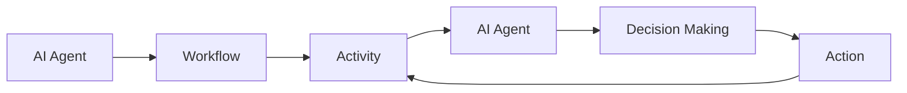

# AI人工智能代理工作流AI Agent WorkFlow：AI代理在物联网场景的应用

关键词：AI代理、物联网、工作流、智能决策、实时控制

## 1. 背景介绍
### 1.1  问题的由来
在当前物联网快速发展的时代，海量的设备和传感器产生了巨大的数据量。如何高效地处理这些数据，实现设备的智能化管理和控制，成为了一个亟待解决的问题。传统的集中式控制方式难以应对物联网场景下的复杂性和动态性，急需一种灵活、自适应的新型解决方案。
### 1.2  研究现状
近年来，人工智能技术取得了长足的进步，为解决物联网领域的诸多挑战提供了新的思路。其中，将AI代理引入物联网系统，通过工作流的方式协调多个AI代理的协同工作，实现分布式的智能决策和控制，成为了一个备受关注的研究方向。国内外学者在该领域开展了广泛的探索，取得了一系列研究成果。
### 1.3  研究意义
AI代理工作流在物联网场景下的应用研究，对于提升物联网系统的智能化水平、优化资源配置、提高系统效率等方面具有重要意义。通过引入AI代理，赋予物联网设备一定的自主性和智能性，使其能够根据环境变化自适应地调整行为策略。同时，工作流机制的引入，可以协调多个AI代理的工作，发挥群体智能的优势，从而更好地应对复杂多变的物联网应用需求。
### 1.4  本文结构
本文将围绕AI代理工作流在物联网场景下的应用展开深入探讨。第2部分介绍AI代理和工作流的核心概念及二者之间的关系；第3部分重点阐述AI代理工作流的核心算法原理和具体操作步骤；第4部分建立AI代理工作流的数学模型，并结合案例进行详细分析；第5部分给出一个基于AI代理工作流的物联网项目的代码实例，并进行详细解读；第6部分分析AI代理工作流在实际物联网场景中的应用情况；第7部分推荐相关的工具和学习资源；第8部分对全文进行总结，并展望AI代理工作流的未来发展趋势和面临的挑战；第9部分的附录中列出了一些常见问题及解答。

## 2. 核心概念与联系
在物联网场景下，AI代理指的是一种具备感知、决策和执行能力的智能实体，它能够代表物联网设备进行信息交互和任务处理。每个AI代理基于自身的知识、目标和策略，根据所处环境的状态，自主地做出决策和行动。

工作流则是对一个完整业务过程的抽象和描述，由一系列活动以及活动间的执行顺序、数据传递方式等控制逻辑组成。工作流定义了一个任务完成的标准流程，规定了每个活动的执行主体、先决条件、后置动作等。

将AI代理引入工作流，即AI Agent Workflow，旨在利用工作流机制来协调多个AI代理的工作，使其能够在物联网环境中协同完成复杂任务。工作流中的每个活动由特定的AI代理负责执行，AI代理根据活动定义的目标和约束，结合自身的智能算法，做出决策并采取行动。同时，工作流引擎负责在AI代理之间传递数据和控制信号，协调它们的执行次序，保证整个任务流程的顺利进行。

下图展示了AI代理与工作流两个核心概念之间的关系：

从图中可以看出，AI代理和工作流是相辅相成的。AI代理作为工作流活动的执行主体，其智能决策和执行能力是工作流顺利进行的基础。而工作流则为AI代理的协同工作提供了一种规范和约束，使得多个AI代理能够基于统一的流程规则开展工作，避免了冲突和混乱。二者的结合，为物联网场景下的智能化业务流程管理开辟了一条全新的途径。

## 3. 核心算法原理 & 具体操作步骤
### 3.1  算法原理概述
AI代理工作流的核心算法包括两个方面：一是单个AI代理的决策算法，二是多个AI代理在工作流中的协同算法。

对于单个AI代理，常用的决策算法包括基于规则的推理、深度强化学习、进化优化算法等。这些算法使AI代理能够根据自身知识和环境状态，通过逻辑推理、试错学习等方式，找到最优的行动策略。

对于多个AI代理在工作流中的协同，需要引入多智能体协同算法，如博弈论、拍卖机制、投票机制等。这些算法旨在解决AI代理之间的信息共享、任务分配、资源竞争等问题，实现多个AI代理在同一工作流中的高效协同。

### 3.2  算法步骤详解
下面以基于拍卖机制的AI代理工作流协同算法为例，详细说明其具体步骤：

1. 工作流引擎将一个任务分解为多个子任务，并为每个子任务定义所需的资源和完成条件。
2. 工作流引擎发布任务拍卖公告，公告中包含每个子任务的描述信息和投标规则。 
3. 各个AI代理根据自身的能力和当前状态，对感兴趣的子任务进行投标。投标信息包括完成任务所需的资源和预计完成时间等。
4. 工作流引擎根据预设的评标规则，对所有投标进行评估，选出每个子任务的最优中标者。
5. 工作流引擎将子任务分配给中标的AI代理，并下发任务执行指令。
6. AI代理按照工作流规定的顺序，执行各自的子任务。在执行过程中，AI代理可以与其他AI代理或环境进行必要的信息交互。
7. 每个AI代理完成分配的子任务后，向工作流引擎反馈任务完成状态。 
8. 工作流引擎收集所有AI代理的反馈信息，进行综合评估。如果整个任务尚未完成，则根据工作流定义的规则，开展下一轮任务分配；如果任务已经完成，则输出最终结果，结束整个工作流。

### 3.3  算法优缺点
上述基于拍卖机制的AI代理工作流协同算法的优点包括：

1. 通过市场化的方式配置任务和资源，可以实现AI代理之间的优化配合，提高系统整体效率。
2. 拍卖机制能够激励AI代理根据自身特点进行专业化分工，避免了"多面手"式的冗余。
3. 算法适应性强，可以根据不同的任务类型和约束条件，灵活调整拍卖规则。

同时，该算法也存在一些局限性：

1. 在任务复杂度较高的情况下，拍卖过程的通信和决策成本会急剧增加。
2. 算法依赖于AI代理的"理性"，如果某些AI代理出现恶意竞争或者违约行为，会影响整个系统的公平性和稳定性。
3. 对于强依赖关系的任务，拍卖机制分配的结果可能不是全局最优。

### 3.4  算法应用领域
基于拍卖机制的AI代理工作流协同算法在物联网的众多领域都有广阔的应用前景，例如：

1. 智慧工厂中的生产调度优化。通过AI代理竞拍任务的方式，可以实现设备、原料、人员等生产要素的动态优化配置。
2. 智能电网的能源平衡管理。通过AI代理参与电力市场交易，可以实现分布式能源的高效利用和电网的供需平衡。
3. 智慧城市的交通流量疏导。通过AI代理竞价使用道路资源，可以引导车辆合理分流，缓解交通拥堵。
4. 物联网设备的资源协调与共享。通过AI代理竞相提供闲置资源，可以提高物联网系统的资源利用率。

## 4. 数学模型和公式 & 详细讲解 & 举例说明
### 4.1  数学模型构建
为了对基于拍卖的AI代理工作流协同算法进行形式化描述，我们可以构建如下数学模型：

设有n个AI代理参与工作流协同，每个AI代理的决策由一个效用函数$u_i$表示。效用函数的自变量包括AI代理的行动策略$a_i$以及其他AI代理的行动策略$a_{-i}$，环境状态$s$，即：

$$u_i=f_i(a_i,a_{-i},s)$$

其中，$i=1,2,\cdots,n$。每个AI代理的目标是选择一个行动策略$a_i^*$，使得自身的效用最大化，即：

$$a_i^*=\arg \max_{a_i} u_i(a_i,a_{-i},s)$$

在拍卖过程中，每个参与竞价的AI代理需要提交一个标书$b_i$，标书的内容包括AI代理对子任务的估值$v_i$以及完成任务所需的资源$r_i$，即：

$$b_i=(v_i,r_i)$$

工作流引擎根据预设的评标函数$g$对所有标书进行评分，评标函数的自变量包括标书的内容以及当前环境状态，即：

$$score_i=g(b_i,s)$$

评分最高的AI代理将中标子任务，并获得相应的任务奖励$p_i$。AI代理的最终效用取决于任务奖励和完成任务的成本$c_i$，即：

$$u_i=\begin{cases}
p_i-c_i, & \text{if } score_i=\max_j score_j \\
0, & \text{otherwise}
\end{cases}$$

### 4.2  公式推导过程
根据上述数学模型，我们可以推导出AI代理在拍卖过程中的最优策略。

假设AI代理$i$对子任务的真实估值为$\hat{v}_i$，那么它在拍卖中的最优标书$b_i^*$应该满足以下条件：

$$b_i^*=\arg \max_{b_i} (p_i-c_i) \cdot \mathbb{P}(score_i=\max_j score_j)$$

其中，$\mathbb{P}(score_i=\max_j score_j)$表示AI代理$i$以标书$b_i$中标的概率。

假设评标函数$g$是一个严格递增函数，且所有AI代理的估值和成本相互独立，那么上式可以进一步化简为：

$$b_i^*=\arg \max_{b_i} (\hat{v}_i-c_i) \cdot \mathbb{P}(b_i > \max_{j \neq i} b_j)$$

这意味着，AI代理在拍卖中的最优策略是提交一个略低于真实估值的标书，以提高中标概率的同时获得一定的利润空间。

### 4.3  案例分析与讲解
下面我们以一个具体的物联网场景为例，说明如何应用上述数学模型进行AI代理工作流的协同优化。

假设某智能工厂需要完成一批产品的生产任务，每个任务可以分解为原料准备、零部件加工、整机组装、质量检测等多个子任务。工厂中部署了多个AI代理，分别控制不同类型的设备，如数控机床、搬运机器人、AGV小车等。每个AI代理根据自身控制的设备特性，对不同的子任务具有不同的能力和成本估算。

当工厂的任务管理系统发布一个生产任务时，各个AI代理根据任务的具体要求，对各个子任务进行估值和投标。例如，数控机床AI代理对零部件加工任务的估值较高，而AGV小车AI代理对原料准备任务的估值较高。

工厂的任务管理系统会综合考虑每个AI代理的标书、当前设备的工作负荷、任务的紧急程度等因素，计算每个标书的评分。评分规则可以设计为：

$$score_i=\alpha \cdot v_i+\beta \cdot (1-l_i)+\gamma \cdot (1-t_i)$$

其中，$l_i$表示AI代