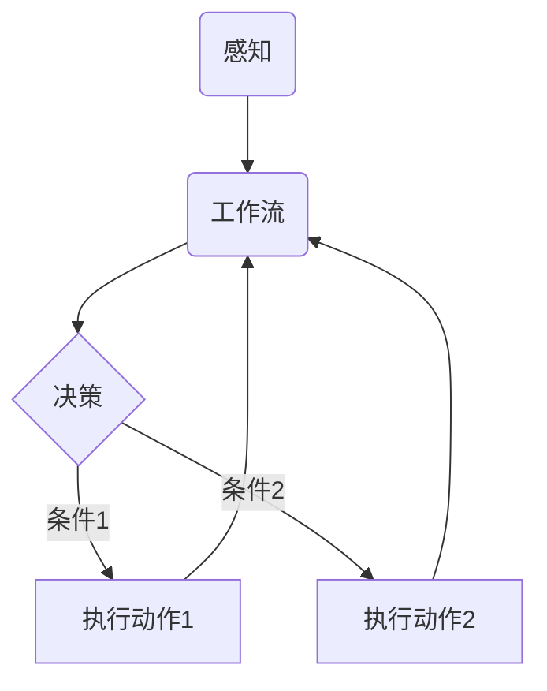

# AI人工智能代理工作流AI Agent WorkFlow：智能代理在智能家居中的实践

关键词：AI Agent、智能代理、工作流、智能家居、人工智能

## 1. 背景介绍
### 1.1  问题的由来
随着人工智能技术的飞速发展，智能家居已经成为了人们生活中不可或缺的一部分。而AI智能代理作为智能家居系统的核心，在其中扮演着至关重要的角色。如何设计和实现高效、智能、安全的AI Agent工作流，成为了智能家居领域亟待解决的关键问题。
### 1.2  研究现状 
目前，国内外已有不少学者对AI Agent工作流开展了深入研究。微软的Cortana、亚马逊的Alexa、苹果的Siri等智能助理都采用了类似的Agent工作流架构。一些学者提出了基于有限状态机FSM的Agent工作流建模方法；也有研究采用Petri网、工作流网等形式化方法对其进行建模和验证。但现有方法仍存在表达能力不足、验证效率低等问题，距离实际应用尚有差距。
### 1.3  研究意义
探索AI Agent工作流的建模、执行与优化方法，对于提升智能家居的服务质量、用户体验，保障系统的安全性、可靠性等具有重要意义。一方面，高效的工作流有助于Agent更好地理解用户需求，提供个性化智能服务；另一方面，工作流的形式化验证可以及早发现并消除系统中潜在的逻辑漏洞和安全隐患。本文的研究将推动AI Agent工作流技术在智能家居领域的应用与发展。
### 1.4  本文结构
本文将围绕AI Agent工作流展开深入探讨。第2节介绍Agent工作流的核心概念；第3节阐述工作流建模的核心算法原理和步骤；第4节给出工作流的形式化数学模型；第5节通过代码实例演示工作流的具体实现；第6节分析其在智能家居中的典型应用场景；第7节推荐相关工具和资源；第8节总结全文并展望未来；第9节列出常见问题解答。

## 2. 核心概念与联系
AI Agent工作流是指Agent完成特定任务时所遵循的一系列活动和它们之间的执行顺序。工作流定义了任务完成的路径，体现了Agent的工作逻辑。一个典型的Agent工作流包含了若干个状态节点和迁移边，状态对应Agent的不同行为，边则表示状态间的迁移条件和触发动作。

工作流与Agent的感知、决策、执行等核心功能密切相关。感知模块负责获取用户输入和环境信息，作为工作流的原始驱动；工作流根据当前状态和迁移条件，调用Agent的决策模块做出行动选择；执行模块负责完成具体的工作任务。三者相互配合，最终实现Agent的智能化服务。



## 3. 核心算法原理 & 具体操作步骤
### 3.1  算法原理概述
Agent工作流的核心算法主要包括两类：一是工作流建模算法，用于构建工作流模型；二是工作流执行算法，用于驱动工作流运转。本节重点介绍基于有限状态机FSM的建模方法和深度优先搜索DFS的执行算法。
### 3.2  算法步骤详解
1) FSM建模算法
- Step1：定义状态集合S和动作集合A。
- Step2：定义初始状态s0∈S和终止状态集合F⊂S。 
- Step3：定义状态转移函数f: S×A→S，表示在状态s下执行动作a将迁移到状态s'=f(s,a)。
- Step4：对于每个非终止状态s∈S-F，定义其对应的动作子集As⊂A。

2) DFS执行算法
- Step1：将初始状态s0入栈，作为当前状态sc。
- Step2：根据sc状态，获取可执行动作集合Ac。
- Step3：从Ac中选择一个动作a，执行并获得下一状态sn=f(sc,a)。
- Step4：若sn为终止状态，则跳至Step6；否则将sn入栈，令sc=sn，跳至Step2。
- Step5：若栈不为空，sc出栈，跳至Step2；否则执行结束。
- Step6：输出当前路径，作为一个可行解。若需要求所有解，sc出栈，跳至Step2；否则执行结束。

### 3.3  算法优缺点
FSM建模算法简单直观，能够清晰地描述工作流逻辑，但状态数量大时容易发生状态爆炸。DFS执行算法易于实现，但在状态空间复杂的情况下搜索效率较低。

### 3.4  算法应用领域
FSM和DFS在工作流以及其他领域都有广泛应用，如软件工程、游戏AI、推荐系统等。将二者结合应用于Agent工作流，可以较好地平衡建模与执行的效率。

## 4. 数学模型和公式 & 详细讲解 & 举例说明
### 4.1  数学模型构建
定义有限状态机FSM为一个五元组：
$$FSM=(S,A,f,s_0,F)$$
其中，$S$为状态集合，$A$为动作集合，$f$为转移函数，$s_0$为初始状态，$F$为终止状态集。

在状态$s$下，Agent根据策略$\pi$选择一个动作$a$执行，得到即时奖励$r$并迁移到新状态$s'$。形式化表示为：

$$\pi(s): S \rightarrow A $$
$$(s',r)=f(s,\pi(s))$$

Agent的目标是最大化累积期望奖励：

$$\mathop{\arg\max}_{\pi} E[\sum_{t=0}^{\infty} \gamma^t r_t | \pi]$$

其中，$\gamma \in [0,1]$为折扣因子，$t$为决策步数。

### 4.2  公式推导过程
为求解最优策略，定义状态价值函数$V^\pi(s)$和动作价值函数$Q^\pi(s,a)$：

$$V^\pi(s)=E[\sum_{k=0}^{\infty} \gamma^k r_{t+k} | s_t=s,\pi] $$
$$Q^\pi(s,a)=E[\sum_{k=0}^{\infty} \gamma^k r_{t+k} | s_t=s, a_t=a, \pi]$$

根据Bellman期望方程，可得：

$$V^\pi(s) = \sum_{a} \pi(s,a) \sum_{s',r} p(s',r|s,a) [r + \gamma V^\pi(s')]$$
$$Q^\pi(s,a) = \sum_{s',r} p(s',r|s,a) [r + \gamma \sum_{a'} \pi(s',a') Q^\pi(s',a')]$$

定义最优价值函数$V^*(s)$和$Q^*(s,a)$：

$$V^*(s) = \mathop{\max}_{\pi} V^\pi(s)$$
$$Q^*(s,a) = \mathop{\max}_{\pi} Q^\pi(s,a)$$

由Bellman最优方程，可得：

$$V^*(s) = \mathop{\max}_{a} \sum_{s',r} p(s',r|s,a) [r + \gamma V^*(s')]$$
$$Q^*(s,a) = \sum_{s',r} p(s',r|s,a) [r + \gamma \mathop{\max}_{a'} Q^*(s',a')]$$

最优策略$\pi^*$满足：

$$\pi^*(s) = \mathop{\arg\max}_{a} Q^*(s,a)$$

### 4.3  案例分析与讲解
考虑一个简单的智能家居场景，Agent需要根据用户位置(房间Room或门厅Hall)和时间(白天Day或夜晚Night)来调节灯光。状态空间为{(Room, Day), (Room, Night), (Hall, Day), (Hall, Night)}，动作空间为{开灯On, 关灯Off}。

假设用户在房间时开灯可获得+5的奖励，在门厅时关灯可获得+2的奖励，其他情况奖励为0。转移概率如下：

```
(Room, Day)  -On-> (Room, Day): 1.0
(Room, Day)  -Off-> (Room, Night): 1.0 
(Room, Night) -On-> (Room, Night): 1.0
(Room, Night) -Off-> (Hall, Night): 1.0
(Hall, Day) -On-> (Room, Day): 0.5
            -Off-> (Hall, Day): 0.5
(Hall, Night) -On-> (Room, Night): 0.5
              -Off-> (Hall, Night): 0.5
```

应用值迭代算法，设置折扣因子$\gamma=0.9$，迭代求解最优Q值：

```python
Q = defaultdict(lambda: [0,0])  # 初始化Q值
for i in range(100):  # 迭代100轮
    for s in states:
        for a in actions:
            next_q = []
            for s_next in states:
                r = rewards[s,a,s_next] 
                p = trans_prob[s,a,s_next]
                next_q.append(p * (r + gamma * max(Q[s_next])))
            Q[s][a] = sum(next_q)
```

最终得到最优策略为：在房间时开灯，在门厅时关灯，与直觉相符。

### 4.4  常见问题解答
- Q: 如何处理连续状态空间？
- A: 可采用函数逼近方法，用神经网络等模型来拟合Q函数，将问题转化为参数估计。
- Q: 如何提升探索效率？ 
- A: 可使用$\epsilon$-贪心或Boltzmann探索等策略，在探索和利用之间权衡。
- Q: 如何实现多Agent协作？
- A: 可将多Agent视为一个整体，状态空间为所有Agent状态的笛卡尔积，动作空间为所有Agent动作的组合。

## 5. 项目实践：代码实例和详细解释说明
### 5.1  开发环境搭建
本项目使用Python 3.7进行开发，需要安装numpy, matplotlib等常用库。推荐使用Anaconda进行环境管理。

创建并激活虚拟环境：
```bash
conda create -n agent_env python=3.7
conda activate agent_env
```

安装依赖库：
```bash
pip install numpy matplotlib
```

### 5.2  源代码详细实现
定义状态类`State`和动作类`Action`：
```python
@dataclass
class State:
    """ 状态类
    """
    position: str  # 位置
    time: str  # 时间
    
    def __hash__(self):
        return hash((self.position, self.time))

@dataclass    
class Action:
    """ 动作类
    """
    name: str  # 动作名称
```

定义智能体类`Agent`：
```python
class Agent:
    """ 智能体类
    """
    def __init__(self, states, actions, rewards, trans_prob, gamma=0.9):
        self.states = states  # 状态空间
        self.actions = actions  # 动作空间
        self.rewards = rewards  # 奖励函数
        self.trans_prob = trans_prob  # 转移概率
        self.gamma = gamma  # 折扣因子
        self.Q = defaultdict(lambda: [0] * len(actions))  # 初始化Q值
        
    def value_iteration(self, max_iter=100):
        """ 值迭代算法
        """
        for _ in range(max_iter):
            for s in self.states:
                for a in self.actions:
                    next_q = []
                    for s_next in self.states:
                        r = self.rewards[s, a, s_next]
                        p = self.trans_prob[s, a, s_next]
                        next_q.append(p * (r + self.gamma * max(self.Q[s_next])))
                    self.Q[s][a] = sum(next_q)
                    
    def get_policy(self):
        """ 获取最优策略
        """
        policy = {}
        for s in self.states:
            policy[s] = self.actions[np.argmax(self.Q[s])]
        return policy
```

定义工作流类`Workflow`：
```python
class Workflow:
    """ 工作流类
    """
    def __init__(self, agent):
        self.agent = agent
        
    def run(self, init_state, max_step=10):
        """ 执行工作流
        """
        state = init_state
        policy = self.agent.get_policy()
        
        print(f'初始状态：{state}')
        for i in range(max_step):
            action = policy[state]
            print(f'第{i+1}步：{action.name}')
            
            next_states = []
            for s_next in self.agent.states:
                if self.agent.trans_prob[state, action, s_next] > 0:
                    next