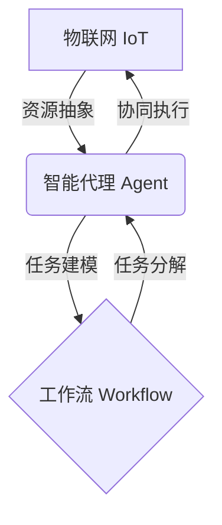

# AI人工智能代理工作流AI Agent WorkFlow：智能代理在物联网系统中的应用

关键词：人工智能、智能代理、工作流、物联网、多智能体系统

## 1. 背景介绍
### 1.1  问题的由来
随着人工智能技术的飞速发展,智能代理(Intelligent Agent)在各个领域得到了广泛应用。尤其是在物联网(Internet of Things, IoT)系统中,海量的异构设备、复杂多变的网络环境对系统的自适应性、自组织性提出了更高的要求。传统的集中式管理模式已经难以满足IoT系统的需求。因此,如何利用智能代理技术来优化IoT系统,实现分布式的智能管理和控制,成为了亟待解决的问题。

### 1.2  研究现状
近年来,国内外学者围绕智能代理在IoT中的应用开展了大量研究。MIT的Marvin Minsky最早提出了智能代理的概念,为该领域奠定了理论基础。此后,众多学者对智能代理的体系结构、交互机制、学习算法等展开了深入研究。

在IoT场景下,学者们提出了多种基于智能代理的系统框架。比如,W. Ren等人设计了一种层次化的智能代理系统用于IoT设备管理;S. Poslad等人提出了一种语义驱动的智能代理中间件,支持IoT资源的动态发现和协同;L. Atzori等人构建了一个多智能体框架,实现了IoT数据的分布式挖掘和知识共享。

总的来说,当前对于智能代理在IoT中的应用已经有了较为丰富的研究积累,但在工作流建模与优化方面的探索还比较有限。本文将重点关注这一问题。

### 1.3  研究意义
智能代理工作流的引入,有望从以下几个方面改善IoT系统的性能:

1. 提高系统灵活性。将IoT任务建模为由智能代理协作完成的工作流,可根据环境变化动态调整任务分配和执行过程,增强系统适应性。

2. 优化资源利用。通过工作流来统筹调度IoT资源,平衡负载,避免单点故障,提高系统吞吐量和可靠性。

3. 增强数据处理能力。利用智能代理并行执行工作流任务,可加速IoT数据的采集、传输、存储和分析,实现实时洞察。

4. 赋能智能决策。智能代理可通过工作流执行积累经验,不断优化决策模型,逐步实现IoT系统的自主管控。

因此,本文的研究对于提升IoT系统的智能化水平,具有重要的理论和实践意义。

### 1.4  本文结构
本文后续章节安排如下:第2节介绍相关核心概念;第3节重点阐述智能代理工作流的核心算法原理;第4节给出形式化的数学模型;第5节通过具体的代码实例说明如何实现;第6节分析典型的应用场景;第7节总结全文并展望未来研究方向。

## 2. 核心概念与联系
在探讨智能代理工作流之前,有必要先明确几个核心概念:

- 智能代理(Intelligent Agent):能够感知环境并做出自主决策和行动的计算实体,具有一定的社会能力,可与其他代理或人类进行交互。

- 工作流(Workflow):对业务过程的建模与抽象,通过把任务分解为一系列活动并定义其执行顺序,来实现对任务全生命周期的管理。

- 物联网(IoT):通过RFID、传感器等技术,将各种物理实体互联起来,进行信息交换和通信的基础设施。

- 多智能体系统(Multi-Agent System):由多个智能代理组成的松耦合分布式系统,代理之间通过协商与合作完成共同的任务目标。

智能代理、工作流、IoT三者之间的关系如下图所示:

可以看出,智能代理是IoT资源的抽象,负责感知物理环境,工作流则为IoT任务提供了建模方法,两者结合可实现对IoT系统的全局优化管控。多个智能代理协同执行工作流,可以增强IoT系统的并行处理能力和鲁棒性。

## 3. 核心算法原理 & 具体操作步骤
### 3.1  算法原理概述
智能代理工作流的核心是任务分解与动态调度。给定一个IoT任务,首先利用工作流建模方法将其分解为多个原子活动,然后由调度器将活动分配给不同的智能代理去执行。执行过程中,调度器根据各代理的状态和环境变化,动态优化任务分配,确保工作流高效稳定地完成。其基本原理可总结为以下几点:

1. 层次化建模。采用自顶向下的方式,将IoT任务逐层分解,形成树状的工作流模型,便于实现任务的模块化和并行化。

2. 基于约束的任务规划。综合考虑代理能力、任务属性、环境状态等多重约束,制定可行的任务执行计划。

3. 自适应动态调度。在任务执行过程中,调度器实时监测各代理和环境的状态变化,动态调整任务分配,以应对突发事件。

4. 多智能体协同。通过引入适当的协商机制和激励措施,协调多个智能代理的行为,避免恶性竞争,实现整体优化。

### 3.2  算法步骤详解
智能代理工作流算法的主要步骤如下:

**Step1:工作流建模**
1. 定义IoT任务的目标状态和约束条件。
2. 采用自顶向下的方法,将任务分解为多个子任务,建立层次化的工作流模型。
3. 明确各活动之间的依赖关系和数据流方向。

**Step2:任务规划**
1. 获取当前各智能代理的能力和负载状态。
2. 分析任务活动对执行资源的需求。
3. 综合考虑任务约束、代理能力、负载均衡等因素,生成初始的任务分配方案。

**Step3:动态调度**
1. 各智能代理按照分配方案执行任务,并实时反馈执行状态给调度器。
2. 调度器监测环境变化和代理异常,根据反馈动态调整任务分配。
3. 调度器协调多个智能代理的行为,避免任务执行中的冲突。

**Step4:任务执行**
1. 智能代理根据调度指令,自主完成分配的任务活动。
2. 智能代理通过适当的交互机制,与其他代理或人类协作。
3. 智能代理将任务结果反馈给调度器,更新自身状态。

**Step5:结果评估**
1. 调度器评估任务的完成质量,生成任务报告。
2. 调度器分析影响任务性能的关键因素。
3. 调度器将评估结果反馈给智能代理,帮助其优化行为策略。

通过以上步骤的循环迭代,多个智能代理可以高效协同地完成复杂的IoT任务,并在执行过程中不断自我完善,提高工作流的性能。

### 3.3  算法优缺点
智能代理工作流算法的主要优点包括:

1. 分布式任务处理,减轻单个节点负载。
2. 动态适应环境变化,提高系统鲁棒性。
3. 支持多智能体协同,发挥群体智慧。
4. 任务分解粒度可控,易于实现模块化。

但该算法也存在一些局限性:

1. 任务建模的复杂度较高,对领域知识要求较高。
2. 多智能体协同机制的设计难度大。
3. 缺乏对全局优化目标的考虑。
4. 算法的收敛性和稳定性有待进一步研究。

### 3.4  算法应用领域
智能代理工作流算法可应用于多个IoT领域,例如:

1. 智慧城市。协调各类传感器和设备,优化城市交通、安防、能源等系统的运行。

2. 工业互联网。对生产设备和流程进行建模,实现产线的智能调度和预测性维护。 

3. 智能电网。平衡发电侧和用电侧的供需关系,提高电网的稳定性和效率。

4. 车联网。引导车辆的行驶路线,减少拥堵,提升交通系统的安全性。

5. 智慧医疗。连接医疗器械和健康监测设备,实现远程诊断和个性化治疗方案推荐。

## 4. 数学模型和公式 & 详细讲解 & 举例说明
### 4.1  数学模型构建
为了对智能代理工作流进行形式化描述,引入如下数学符号:
- 令$A=\{a_1,a_2,...,a_n\}$ 表示由$n$个智能代理组成的集合。
- 令$T=\{t_1,t_2,...,t_m\}$ 表示IoT任务$T$包含的$m$个原子活动。
- 令$R=\{r_1,r_2,...,r_k\}$ 表示完成任务$T$需要的$k$种资源。
- 定义代理$a_i$的能力向量为$C_i=[c_i^1,c_i^2,...,c_i^k]$,其中$c_i^j$表示代理$a_i$拥有的第$j$种资源的数量。
- 定义活动$t_j$的资源需求向量为$D_j=[d_j^1,d_j^2,...,d_j^k]$,其中$d_j^i$表示活动$t_j$需要的第$i$种资源的数量。
- 定义代理$a_i$的负载率为$l_i$,表示其当前的忙碌程度,取值范围为$[0,1]$。
- 定义活动$t_j$的重要性系数为$w_j$,表示其对任务完成的影响程度,取值范围为$[0,1]$。

于是,在给定代理集合$A$和任务$T$的情况下,智能代理工作流的任务规划问题可以表示为一个最优化模型:

$$
\begin{align*}
\max \quad & \sum_{j=1}^{m} w_j \cdot \sum_{i=1}^{n} x_{ij} \\
s.t. \quad 
& \sum_{i=1}^{n} x_{ij} \cdot c_i^k \geq d_j^k, \forall j,k \\
& \sum_{j=1}^{m} x_{ij} \cdot d_j^k \leq c_i^k, \forall i,k \\ 
& \sum_{j=1}^{m} x_{ij} \cdot w_j \leq 1-l_i, \forall i \\
& x_{ij} \in \{0,1\}, \forall i,j
\end{align*}
$$

其中,$x_{ij}$为决策变量,表示是否将活动$t_j$分配给代理$a_i$执行。目标函数表示在满足资源和负载约束的情况下,最大化任务完成质量。约束条件的含义如下:
1. 每个活动的资源需求必须得到满足。 
2. 每个代理的资源利用不能超过其能力上限。
3. 每个代理的负载不能超过其空闲程度。
4. 决策变量为0-1变量。

### 4.2  公式推导过程
为了求解以上最优化模型,可以采用启发式算法,如贪心法、遗传算法等。以贪心法为例,其主要思路是每次选择最优的局部解,以期达到全局最优。算法流程如下:

1. 初始化代理集合$A$和活动集合$T$,令任务完成质量$Q=0$。
2. 对于每个活动$t_j$,按照其重要性系数$w_j$从大到小排序。 
3. 对于每个代理$a_i$,计算其能力向量$C_i$和负载率$l_i$。
4. 从$T$中选择重要性最高的活动$t_j$,寻找满足资源需求且负载率最低的代理$a_i$。 
5. 如果找到了合适的代理$a_i$,则将活动$t_j$分配给$a_i$,更新$a_i$的能力向量