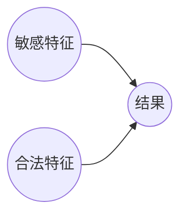

好的,我会按照您提供的要求和框架,尽力写一篇高质量的技术博客文章。下面是正文部分:

# AI人工智能核心算法原理与代码实例讲解：数据偏见

## 1. 背景介绍

### 1.1 问题的由来

随着人工智能(AI)系统在各个领域的广泛应用,它们的公平性和偏见问题日益受到关注。人工智能算法通过从大量数据中学习模式来做出预测和决策,但如果训练数据本身存在偏差或代表性不足,那么从中学习到的模型就可能继承并放大这些偏差,导致对某些群体做出不公平的决策。

数据偏见可能源于多种原因,例如:

- 数据收集过程中的系统性偏差
- 数据注释过程中的人为偏差
- 数据集本身的代表性不足等

无论原因如何,数据偏见都可能导致AI系统在现实世界应用中表现出令人不安的有害行为,例如:

- 在招聘中歧视某些群体
- 在司法判决中表现出种族偏见 
- 在信贷审批中对某些群体设置更高门槛
- 在广告投放中加强刻板印象等

因此,消除AI系统中的数据偏见,确保它们能够公平对待所有个人和群体,是当前人工智能领域亟需解决的重要问题。

### 1.2 研究现状

为解决数据偏见问题,研究人员已经提出了多种方法,主要可分为三类:

1. **数据处理**:通过重采样、数据增强等技术来提高训练数据的多样性和代表性。
2. **算法去偏**:在模型训练过程中,通过对损失函数、正则化项等进行修改,降低模型对数据中的偏差的拟合程度。
3. **后处理**:在模型训练完成后,通过对输出结果进行校正,消除其中的偏差。

目前,这些方法在特定场景下都取得了一些成效,但仍然面临诸多挑战:

- 缺乏通用的评估标准,难以量化和比较不同方法的去偏效果
- 大多数方法专注于消除单一类型的偏见,无法处理多种偏见的情况
- 一些方法在去除偏见的同时,也降低了模型的整体性能
- 很多方法需要大量的人工标注,代价高昂且可能引入新的偏差

因此,设计出高效、通用、可扩展的数据去偏方法,仍然是该领域的一个重大挑战。

### 1.3 研究意义

消除AI系统中的数据偏见,不仅是一个技术问题,更是一个重大的社会责任。公平的AI系统有助于:

- 保护弱势群体的权益,避免歧视和不公平对待
- 提高AI系统的可信度和社会接受度
- 促进AI技术在更多领域的应用和发展
- 推动建立更加公正、包容的社会环境

从技术层面来看,研究数据去偏方法也将推动人工智能算法本身的进步,例如:

- 提高模型的鲁棒性,降低对噪声和异常值的敏感度
- 增强模型的泛化能力,提升在分布偏移情况下的性能
- 促进算法设计中公平性和其他目标的权衡
- 为解决其他AI公平性问题(如因果推理偏差等)积累经验

因此,数据偏见问题的研究将为AI系统的公平性和可靠性提供重要保障,对推动人工智能技术的健康发展和广泛应用具有重大意义。

### 1.4 本文结构 

本文将围绕数据偏见这一核心问题,介绍相关的核心概念、算法原理、数学模型、代码实现和应用场景等内容。具体来说,本文的主要结构安排如下:

1. 背景介绍:阐述数据偏见问题的由来、研究现状和意义。
2. 核心概念与联系:介绍数据偏见的主要类型,以及它们与其他AI公平性问题的关系。
3. 核心算法原理:详细讲解几种主流的数据去偏算法的原理、步骤、优缺点和应用场景。
4. 数学模型和公式:对算法中涉及的数学模型进行构建,并推导相关公式。
5. 代码实例:提供算法的代码实现,并进行解读和分析。
6. 实际应用场景:讨论数据去偏技术在不同领域的应用现状和案例。
7. 工具和资源:推荐相关的学习资料、开发工具和论文等。
8. 总结与展望:对研究成果进行总结,并展望未来的发展趋势和挑战。

通过对上述内容的全面讲解,读者能够深入理解数据偏见问题的本质、现有解决方案的原理和实践,从而更好地应对AI系统中的公平性挑战。

## 2. 核心概念与联系

在深入探讨数据偏见的具体算法之前,我们需要先介绍一些核心概念,并阐明它们之间的联系。

### 2.1 数据偏见的类型

数据偏见主要可分为以下几种类型:

1. **群体统计差异偏见(Group Statistic Bias)**:某些特征(如性别、种族等)在整个数据集中的分布与真实世界存在显著差异。例如,在一个招聘数据集中,女性申请者的比例远低于男性。

2. **注释偏差(Annotation Bias)**: 由于注释者的主观因素,不同群体的样本被赋予了不同的标签或属性。例如,在一个面部数据集中,对于相同的面部特征,不同肤色的人被标注了不同的情绪。

3. **表示偏差(Representation Bias)**:数据集中缺乏对某些群体或情况的足够代表性。例如,一个手写数字识别数据集中,几乎没有包含儿童的笔迹样本。

4. **测量偏差(Measurement Bias)**:由于测量或记录过程中的系统性错误,导致某些群体的特征被歪曲。例如,在一个医疗数据集中,对于相同症状,不同族裔的患者被记录了不同的病情严重程度。

5. **选择率偏差(Selection Rate Bias)**:在构建数据集时,对不同群体应用了不同的采样率或策略。例如,在一个面部识别数据集中,白人面部的采样率远高于其他肤色。

这些偏见类型有时会交叉存在,并通过算法的训练过程被放大和传递,最终导致AI系统做出不公平的决策。因此,有必要对它们进行综合考虑和处理。

### 2.2 与其他AI公平性问题的关系

除了数据偏见之外,影响AI系统公平性的还有其他一些问题,例如:

- **算法偏差**:算法本身的设计和优化目标可能会导致对某些群体的偏袒。
- **因果推理偏差**:由于缺乏对因果关系的正确建模,算法可能将相关性误解为因果性。
- **环境偏移**:算法在训练和部署环境之间的差异,可能导致性能下降。
- **隐私与透明度权衡**:为提高公平性,有时需要牺牲一定的隐私性和模型透明度。

这些问题往往是相互关联的。例如,数据偏见可能源于算法偏差,也可能导致因果推理偏差;而去偏技术有时需要牺牲隐私性等。因此,在解决数据偏见问题的同时,也需要考虑与其他公平性问题的联系,采取全面的策略来提高AI系统的整体公平性。

## 3. 核心算法原理与具体操作步骤

针对数据偏见问题,研究人员已经提出了多种算法,本节将重点介绍其中几种代表性和主流的算法原理、操作步骤以及优缺点分析。

### 3.1 算法原理概述

常见的数据去偏算法主要可分为三大类:

1. **数据处理算法**:通过对训练数据进行重采样、数据增强等操作,来提高数据的多样性和代表性,从而降低偏见。

2. **算法去偏算法**:在模型训练过程中,通过修改损失函数、引入正则化项等方式,降低模型对数据中的偏差的拟合程度。

3. **后处理算法**:在模型训练完成后,通过对输出结果进行校正,消除其中的偏差。

下面将分别介绍这三类算法中的几种典型代表。

### 3.2 算法步骤详解

#### 3.2.1 重采样 (Resampling)

重采样是一种常见的数据处理算法,主要思路是:

1) 计算每个群体在训练数据中的比例
2) 对于代表性不足的群体,通过重复采样增加其样本量
3) 对于代表性过多的群体,通过下采样减少其样本量
4) 使用重采样后的数据集进行模型训练

具体操作步骤如下:

输入:原始训练数据集 $D$,敏感特征 $S$
1) 计算每个敏感特征值 $s \in S$ 对应的样本比例 $p_s$
2) 确定目标比例 $p^*$,例如取所有 $p_s$ 的均值
3) 对于每个 $s$:
    a) 若 $p_s > p^*$,则从 $D_s$ 中随机下采样,使其新比例为 $p^*$  
    b) 若 $p_s < p^*$,则从 $D_s$ 中随机重复采样,使其新比例为 $p^*$
4) 将所有重采样后的子集合并,作为新的训练集 $D'$
5) 在 $D'$ 上训练模型

重采样算法的优点是简单直接,无需修改模型结构和训练过程。但缺点是它只考虑了群体统计差异偏见,无法处理其他类型的偏见;而且可能会丢失掉一些有用的样本信息。

#### 3.2.2 对抗性数据增强 (Adversarial Data Augmentation)

对抗性数据增强算法的思路是:

1) 训练一个辅助模型(对抗模型)来预测样本的敏感属性
2) 生成对抗样本,使得模型无法可靠地预测其敏感属性
3) 将对抗样本加入训练集,提高模型的群体不可区分性

具体步骤如下:

输入:原始训练数据集 $D$,敏感特征 $S$,主模型 $F$,对抗模型 $A$
1) 从 $D$ 中采样一个小批量数据 $X$
2) 最小化如下损失函数训练 $A$:
    $$\mathcal{L}_{adv}(A) = -\sum_{x\in X}\log A(S|x)$$
    使得 $A$ 能够较好地预测样本的敏感属性
3) 生成对抗样本 $X'$:
    $$X' = X + \alpha \text{sign}(\nabla_X \mathcal{L}_{adv}(A))$$
    其中 $\alpha$ 为步长超参数
4) 最小化如下损失函数训练 $F$:
    $$\mathcal{L}(F) = \mathcal{L}_0(F) + \lambda \sum_{x'\in X'} \log A(S|F(x'))$$
    使得 $F$ 能够很好地完成主任务,同时使 $A$ 难以预测其输出的敏感属性
5) 重复2-4,直到收敛
6) 将对抗样本 $X'$ 加入训练集,重新训练 $F$

该算法的优点是能够提高模型的群体不可区分性,从而降低偏见。缺点是需要同时训练两个模型,计算开销较大;而且对抗训练的稳定性有待提高。

#### 3.2.3 基于因果的去偏 (Causality-based Debiasing)

基于因果的去偏算法的核心思想是:利用因果图对数据生成过程进行建模,从而识别出偏见的根源,并针对性地进行去偏处理。

假设我们有一个简单的因果图:

其中 $S$ 对 $Y$ 存在不合理的因果路径,导致了偏见。我们希望去除这条路径的影响,使 $Y$ 只受