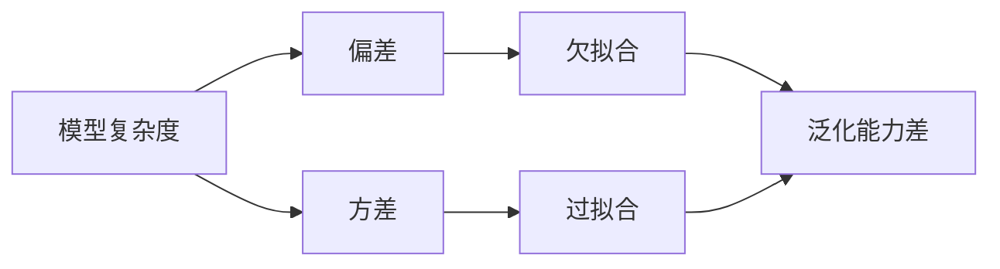

# AI人工智能核心算法原理与代码实例讲解：模型选择

关键词：人工智能, 机器学习, 模型选择, 算法原理, 代码实例

## 1. 背景介绍
### 1.1  问题的由来
随着人工智能技术的飞速发展,机器学习已经成为实现人工智能的核心驱动力。在机器学习中,模型选择是一个关键问题。面对海量的数据和复杂的任务,如何从众多的机器学习模型中选择出最优的模型,成为人工智能研究者和实践者亟需解决的难题。
### 1.2  研究现状 
目前,学术界和工业界已经提出了多种模型选择的方法。这些方法大致可以分为以下几类:
1. 基于性能度量的方法:通过比较不同模型在验证集上的性能表现来选择最优模型,如准确率、召回率等。
2. 基于复杂度的方法:通过比较模型的复杂度(如参数量)来选择模型,认为模型越简单越好。
3. 基于贝叶斯理论的方法:利用贝叶斯理论,通过计算不同模型的后验概率来选择最优模型。
4. 集成学习方法:通过组合多个模型的预测结果来提高性能,如Bagging、Boosting等。

这些方法在实践中都取得了不错的效果,但仍然存在一些问题和挑战,如性能度量的选择、模型复杂度的权衡、贝叶斯推断的计算复杂性等。
### 1.3  研究意义
模型选择问题的研究对于提高机器学习的效率和性能具有重要意义。一方面,合理的模型选择可以帮助我们快速找到适合特定任务的最优模型,避免不必要的尝试和资源浪费。另一方面,研究模型选择的一般性原理和方法,可以为机器学习的自动化和智能化提供理论基础和技术支持。
### 1.4  本文结构
本文将重点介绍几种主流的模型选择方法的核心原理和代码实现。全文分为9个部分:第1部分是背景介绍;第2部分阐述了模型选择涉及的一些核心概念;第3部分详细讲解了几种典型的模型选择算法原理和步骤;第4部分介绍相关的数学模型和公式;第5部分给出了算法的代码实例;第6部分分析了模型选择在实际场景中的应用;第7部分推荐了一些学习资源和工具;第8部分对全文进行了总结并展望了未来;第9部分是一些常见问题解答。

## 2. 核心概念与联系
在讨论模型选择算法之前,我们先来了解一下其中涉及的几个核心概念:
- 机器学习:一种无需明确编程,通过数据训练计算机学习的方法。
- 模型:机器学习算法生成的一个数学函数,可以对新数据进行预测。常见的模型有线性回归、逻辑回归、决策树、神经网络等。
- 训练集:用于训练模型的数据集合。
- 验证集:用于在训练过程中评估模型性能、调整超参数的数据集合。
- 测试集:用于评估训练好的模型性能的数据集合,通常是未在训练中使用过的新数据。
- 欠拟合:模型过于简单,无法很好地拟合数据的情况。表现为训练误差和测试误差都很大。
- 过拟合:模型过于复杂,过度拟合了训练数据的噪声,导致泛化能力差。表现为训练误差很小但测试误差很大。
- 偏差:模型预测值与真实值之间的差异。偏差越大,欠拟合可能性越大。
- 方差:模型预测结果的变化范围。方差越大,过拟合可能性越大。
- 正则化:在损失函数中加入一个正则化项,限制模型复杂度,防止过拟合。

这些概念之间有着密切的联系。我们的目标是选择一个偏差和方差都较小的模型,即能够很好地拟合数据,又不会过度拟合。下图展示了模型选择中偏差和方差的权衡:



## 3. 核心算法原理 & 具体操作步骤
### 3.1  算法原理概述
下面我们重点介绍两种常用的模型选择算法:交叉验证和正则化。
#### 3.1.1 交叉验证
交叉验证的基本思想是,将数据集划分为k个子集,每次选择其中的k-1个子集作为训练集,剩下的1个作为验证集,进行k次训练和验证,最后取k次验证结果的平均值作为模型的性能估计。这样可以有效利用有限的数据,减少过拟合。常见的交叉验证方法有:
- 留一交叉验证(LOO):每次只留一个样本作为验证集,其他所有样本作为训练集。
- k折交叉验证:将数据集平均分成k份,每次选择其中1份作为验证集,其他k-1份作为训练集。
- 分层k折交叉验证:在划分子集时,保持每个子集中不同类别样本的比例与整个数据集中的比例相同。

#### 3.1.2 正则化  
正则化是在损失函数中引入一个正则化项,对模型复杂度进行约束,防止过拟合。常见的正则化方法有:
- L1正则化(Lasso):正则化项为参数绝对值之和,可以使一些参数变为0,实现特征选择。
- L2正则化(Ridge):正则化项为参数平方和,可以使参数值变小,降低模型复杂度。
- 弹性网络(Elastic Net):同时包含L1和L2正则化,结合了两者的优点。

### 3.2  算法步骤详解
下面以k折交叉验证和L2正则化为例,详细介绍模型选择的具体步骤。
#### 3.2.1 k折交叉验证
1. 将数据集D随机划分为k个大小相似的互斥子集,记为$D_1,D_2,...,D_k$。
2. for i=1,2,...,k:
   a. 将$D_i$作为验证集,其他子集$D_{/i}$作为训练集；
   b. 在$D_{/i}$上训练模型,在$D_i$上评估模型性能,得到性能指标$P_i$。
3. 计算k次交叉验证的平均性能$\bar{P}=\frac{1}{k}\sum_{i=1}^kP_i$
4. 选择平均性能最好的模型作为最终模型。

#### 3.2.2 L2正则化
以线性回归为例,加入L2正则化项后的损失函数为:
$$J(\theta)=\frac{1}{2m}\sum_{i=1}^m(h_\theta(x^{(i)})-y^{(i)})^2+\frac{\lambda}{2m}\sum_{j=1}^n\theta_j^2$$
其中$\lambda$为正则化系数,控制正则化的强度。求解该损失函数的步骤为:
1. 初始化参数$\theta$
2. 循环直到收敛:
   a. 计算当前参数的梯度:
   $$\frac{\partial J(\theta)}{\partial \theta_j}=\frac{1}{m}\sum_{i=1}^m(h_\theta(x^{(i)})-y^{(i)})x_j^{(i)}+\frac{\lambda}{m}\theta_j$$
   b. 更新参数:
   $$\theta_j:=\theta_j-\alpha\frac{\partial J(\theta)}{\partial \theta_j}$$
3. 得到最优参数$\theta$

### 3.3  算法优缺点
交叉验证的优点是可以充分利用有限的数据,评估模型的泛化性能,减少过拟合。缺点是计算开销大,需要训练多个模型。  
正则化的优点是可以有效控制模型复杂度,提高泛化能力,实现特征选择(L1)。缺点是引入了额外的超参数$\lambda$,需要调参。

### 3.4  算法应用领域
交叉验证和正则化几乎适用于所有的机器学习任务,如分类、回归、聚类、降维等。一些具体的应用如:
- 使用交叉验证选择支持向量机的核函数类型和参数
- 使用L1正则化进行文本分类的特征选择
- 使用L2正则化控制神经网络的过拟合
- 使用弹性网络回归分析基因表达数据

## 4. 数学模型和公式 & 详细讲解 & 举例说明
### 4.1  数学模型构建
模型选择可以看作是一个优化问题,目标是找到一组参数$\theta$,使得模型$h_\theta(x)$在验证集上的性能最优。以均方误差为例,数学模型可以表示为:
$$\min_\theta \frac{1}{2m}\sum_{i=1}^m(h_\theta(x^{(i)})-y^{(i)})^2+\lambda R(\theta)$$
其中$R(\theta)$为正则化项,常见的形式有:
- L1正则化:$R(\theta)=\sum_{j=1}^n|\theta_j|$
- L2正则化:$R(\theta)=\sum_{j=1}^n\theta_j^2$
- 弹性网络:$R(\theta)=\alpha\sum_{j=1}^n|\theta_j|+(1-\alpha)\sum_{j=1}^n\theta_j^2$

### 4.2  公式推导过程
以L2正则化的线性回归为例,我们来推导其闭式解。令上述优化问题的目标函数为$J(\theta)$,将其展开可得:
$$J(\theta)=\frac{1}{2m}(\mathbf{X}\theta-\mathbf{y})^T(\mathbf{X}\theta-\mathbf{y})+\frac{\lambda}{2m}\theta^T\theta$$
其中$\mathbf{X}$为$m\times n$的设计矩阵,$\mathbf{y}$为$m\times 1$的标签向量。对$J(\theta)$求导并令其为0:
$$\frac{\partial J(\theta)}{\partial \theta}=\frac{1}{m}\mathbf{X}^T(\mathbf{X}\theta-\mathbf{y})+\frac{\lambda}{m}\theta=0$$
整理可得:
$$(\mathbf{X}^T\mathbf{X}+\lambda \mathbf{I})\theta=\mathbf{X}^T\mathbf{y}$$
其中$\mathbf{I}$为$n\times n$的单位矩阵。由此可得闭式解为:
$$\theta=(\mathbf{X}^T\mathbf{X}+\lambda \mathbf{I})^{-1}\mathbf{X}^T\mathbf{y}$$

### 4.3  案例分析与讲解
下面我们用一个简单的例子来说明L2正则化的效果。假设我们要拟合一个二次函数$y=x^2$,数据点如下:

| x | y |
|---|---|
| -2 | 4 |
| -1 | 1 |
| 0 | 0 |
| 1 | 1 |
| 2 | 4 |

我们分别用2次、4次、9次多项式对数据进行拟合,得到的拟合曲线如下图所示:

```python
import numpy as np
import matplotlib.pyplot as plt

x = np.array([-2, -1, 0, 1, 2])
y = np.array([4, 1, 0, 1, 4])

plt.figure(figsize=(12, 4))
for i, degree in enumerate([2, 4, 9]):
    plt.subplot(1, 3, i+1)
    plt.scatter(x, y)
    
    X = np.vander(x, degree+1)
    theta = np.linalg.pinv(X).dot(y)
    
    X_test = np.linspace(-3, 3, 100).reshape(-1, 1)
    X_test = np.vander(X_test.ravel(), degree+1)
    y_test = X_test.dot(theta)
    
    plt.plot(X_test[:, 1], y_test, 'r-')
    plt.title(f'Degree={degree}')
    plt.xlim(-3, 3)
    plt.ylim(-5, 25)
plt.tight_layout()    
plt.show()
```


可以看出,随着多项式次