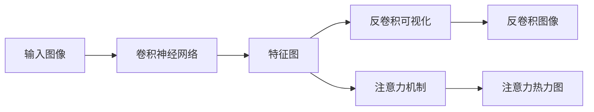

# AI人工智能深度学习算法：卷积神经网络的可视化技术

关键词：人工智能, 深度学习, 卷积神经网络, 可视化技术, 特征图, 反卷积, 注意力机制

## 1. 背景介绍

### 1.1 问题的由来

随着人工智能技术的飞速发展,深度学习算法尤其是卷积神经网络(CNN)在计算机视觉、自然语言处理等领域取得了令人瞩目的成就。CNN通过局部感受野、权值共享、池化等操作,能够自动提取图像的层次化特征,大大提升了图像识别、目标检测等任务的性能。

然而,CNN内部的工作机制对于大多数人来说仍是一个"黑盒子"。虽然我们知道CNN能够自动学习图像特征,但究竟学到了什么样的特征,不同层次的特征有何区别,哪些特征对最终的分类结果影响更大,这些问题都没有一个直观的答案。可视化技术为理解CNN的内部机制提供了一种有效途径。

### 1.2 研究现状

近年来,国内外学者围绕CNN可视化展开了广泛而深入的研究。总的来说,CNN可视化技术主要包括以下几类:

1. 特征图可视化:将CNN中间层的特征图转化为图像,直观展示不同层次特征的视觉模式。

2. 反卷积可视化:通过反向传播梯度,生成能够最大程度激活某个神经元的输入图像,揭示该神经元所关注的视觉概念。

3. 注意力机制可视化:在CNN中引入注意力机制,生成热力图展示模型在做出预测时重点关注的图像区域。

4. 基于规则的解释:提取CNN中的显著特征模式,总结为一系列规则,解释模型的决策依据。

代表性的研究成果有:Zeiler等人提出的反卷积可视化方法,揭示了CNN逐层学习边缘、纹理、部件到整体的层次化特征;Zhou等人利用类激活图(CAM)可视化了CNN在图像分类任务中的关注区域;Selvaraju等人进一步提出了Grad-CAM方法,可以被应用于各种CNN架构。

### 1.3 研究意义

CNN可视化技术具有重要的理论和实践意义:

1. 深入理解CNN的工作机制,有助于发现CNN的局限性,为算法改进提供启发。

2. 可视化结果可以作为调试工具,帮助排查模型的异常行为,提高模型的鲁棒性。

3. 一些可视化方法如CAM、Grad-CAM可以作为通用工具,被应用到目标检测、图像分割等其他任务中。

4. 可视化使深度学习模型的决策过程更加透明,增强了模型的可解释性,有利于用户建立对AI的信任。

5. 直观的可视化结果可以作为深度学习科普的有力工具,让更多人了解AI的内部原理。

### 1.4 本文结构

本文将重点介绍几种主流的CNN可视化技术,揭示其核心原理,并通过实例讲解其具体应用。全文结构安排如下:

第二部分介绍CNN可视化涉及的核心概念,如特征图、反卷积、注意力等,阐述它们之间的联系。

第三部分重点讲解几种经典的可视化算法,包括反卷积、CAM、Grad-CAM等,剖析其数学原理和实现步骤。

第四部分通过一个实际的图像分类案例,演示如何应用可视化技术分析CNN的特征图、注意力区域,并对结果进行解读。

第五部分提供一些CNN可视化的参考代码实现,并详细解释其中的关键步骤。

第六部分讨论可视化技术在图像分类、目标检测、语义分割等领域的应用情况。

第七部分推荐一些有助于深入理解和实践CNN可视化的学习资源、开发工具和相关论文。

第八部分总结CNN可视化的研究现状和未来发展趋势,分析目前面临的技术挑战,展望下一步的研究方向。

## 2. 核心概念与联系

在介绍具体的可视化算法之前,我们先来了解一下CNN可视化中涉及的几个核心概念。

**特征图(Feature Map)**: 特征图是CNN中间层的输出,表示输入图像在该层被提取到的特征。浅层的特征图倾向于捕捉边缘、纹理等低级特征,深层的特征图则表示更加抽象的语义特征。特征图的维度一般为(channels, height, width),其中channels表示特征图的数量。特征图可视化就是将特征图还原为图像的过程。

**反卷积(Deconvolution/Transposed Convolution)**: 反卷积是卷积操作的逆过程,常用于上采样和可视化。给定特征图和卷积核,反卷积的输出称为反卷积图,与原始输入图像尺寸相同,直观反映了特征图所捕捉的视觉模式。反卷积可视化通过反向传播梯度,生成可最大程度激活某个特定神经元的输入图像。

**注意力机制(Attention Mechanism)**: 注意力机制起源于人类视觉系统,指的是将注意力集中到感兴趣的目标区域上的能力。在CNN中引入注意力机制,可以生成与原图尺寸相同的热力图,直观地展示出模型用于做出预测的关键区域,即模型的"注意力"所在。主流的注意力可视化技术包括CAM、Grad-CAM等。

这些核心概念之间有着紧密的联系。特征图展示了模型学到的视觉特征,但需要通过反卷积操作还原为可解释的图像。注意力机制聚焦于重要的特征图区域,并最终生成直观的热力图。它们相互配合,共同揭示CNN的内部工作机制,构成了CNN可视化的基础。

## 3. 核心算法原理 & 具体操作步骤

### 3.1 算法原理概述

CNN可视化的核心算法主要包括反卷积、CAM、Grad-CAM等。它们的基本原理如下:

**反卷积**: 反卷积可视化通过反向传播梯度,找到能够最大程度激活某个神经元的输入图像。具体来说,首先给定一个训练好的CNN模型和目标神经元,将该神经元的梯度设为1,其他神经元的梯度设为0,然后反向传播到输入层,得到的输入图像即为反卷积结果。直观地说,反卷积图像展示了该神经元所关注的视觉概念。

**CAM**: Class Activation Mapping(CAM)是一种基于全局平均池化(GAP)的可视化方法。在CNN的最后一个卷积层后添加GAP层和全连接层,训练完成后,将最后一个卷积层的特征图与全连接层权重相乘,得到的加权和即为CAM。CAM与原图尺寸相同,突出显示了模型用于识别某个类别的关键区域。

**Grad-CAM**: Gradient-weighted Class Activation Mapping(Grad-CAM)是CAM的一般化版本,适用于各种CNN架构。Grad-CAM首先计算分类得分对最后一个卷积层特征图的梯度,然后对梯度沿着通道维度取平均,作为各通道的权重,最后用权重对特征图加权求和得到Grad-CAM。相比CAM,Grad-CAM省去了对模型结构的修改,更加灵活通用。

### 3.2 算法步骤详解

下面以Grad-CAM为例,详细讲解其实现步骤。

输入:
- 训练好的CNN模型 $f(x)$
- 目标类别 $c$
- 待分析图像 $I$

输出:
- Grad-CAM热力图 $L^c_{Grad-CAM} \in \mathbb{R}^{u \times v}$

步骤:
1. 前向传播图像$I$,得到目标类别$c$的分类得分$y^c$。
2. 对$y^c$关于最后一个卷积层特征图$A^k$求梯度,得到 $\frac{\partial y^c}{\partial A^k}$。
3. 对梯度$\frac{\partial y^c}{\partial A^k}$在通道维度上取均值,得到各通道的权重 $\alpha_k^c$:

$$\alpha_k^c = \frac{1}{Z} \sum_i \sum_j \frac{\partial y^c}{\partial A_{ij}^k}$$

其中$Z$是特征图的高度和宽度之积。

4. 用$\alpha_k^c$对$A^k$加权求和,得到Grad-CAM:

$$L^c_{Grad-CAM} = ReLU(\sum_k \alpha_k^c A^k)$$

其中$ReLU$函数将负值截断为0,保留显著的正值区域。

5. 将$L^c_{Grad-CAM}$上采样到输入图像尺寸,叠加到原图上,得到最终的可视化结果。

可视化结果直观地展示了模型在识别目标类别时重点关注的图像区域,热力图的亮度越高,表示该区域对分类结果的贡献越大。

### 3.3 算法优缺点

Grad-CAM的优点在于:
1. 实现简单,只需要目标类别的梯度信息,不用修改模型结构。
2. 可解释性强,生成的热力图直观地展示了模型的关注区域。
3. 通用性好,适用于各种CNN架构,如VGG、ResNet、Inception等。

但Grad-CAM也存在一些局限性:
1. 生成的热力图比较粗糙,空间分辨率有限。
2. 只关注梯度信息,忽略了特征图的语义含义。
3. 可能出现错误关注,如背景区域的高亮显示。

针对这些不足,后续研究提出了一些改进方法,如Guided Grad-CAM、Smooth Grad-CAM++等,通过引入更细粒度的梯度信息、特征图语义等因素,生成更加准确、清晰的可视化结果。

### 3.4 算法应用领域

Grad-CAM作为一种通用的可视化方法,在多个领域得到了广泛应用,如:

- 计算机视觉:Grad-CAM可以分析CNN在图像分类、目标检测、语义分割等任务中的关注区域,帮助理解和优化模型。

- 医学影像:Grad-CAM可以突出医学图像中的异常区域,辅助医生进行诊断和治疗。

- 自然语言处理:Grad-CAM可以用于分析文本分类模型的关键词和句子,解释模型的判别依据。

- 模型调试:Grad-CAM可以发现模型存在的异常行为,如注意力集中在无关背景上,进而指导算法改进。

- 深度学习可解释性:Grad-CAM为理解CNN的决策过程提供了直观的可视化证据,是研究可解释性的重要工具。

## 4. 数学模型和公式 & 详细讲解 & 举例说明

这一部分我们深入探讨Grad-CAM的数学模型和公式推导过程,并用一个具体的图像分类案例加以说明。

### 4.1 数学模型构建

首先,我们定义CNN模型为一个函数$f(I)$,它将输入图像$I$映射到输出类别标签$y$:

$$y = f(I)$$

其中$y$是一个$C$维向量,表示输入图像属于各类别的概率。$C$为类别总数。

假设CNN的最后一个卷积层有$K$个通道,每个通道生成一个尺寸为$u \times v$的特征图,记为$A^k, k=1,2,...,K$。

我们的目标是生成一个与原图尺寸相同的热力图$L^c_{Grad-CAM}$,突出显示模型在识别目标类别$c$时关注的显著图像区域。

### 4.2 公式推导过程

Grad-CAM的核心思想是,最后一个卷积层的每个通道都代表了一种视觉模式,它们对模型的预测结果有不同的贡献。贡献大小可以用梯度信息度量,梯度越大,说明该通道对分类结果影响越大。

具体