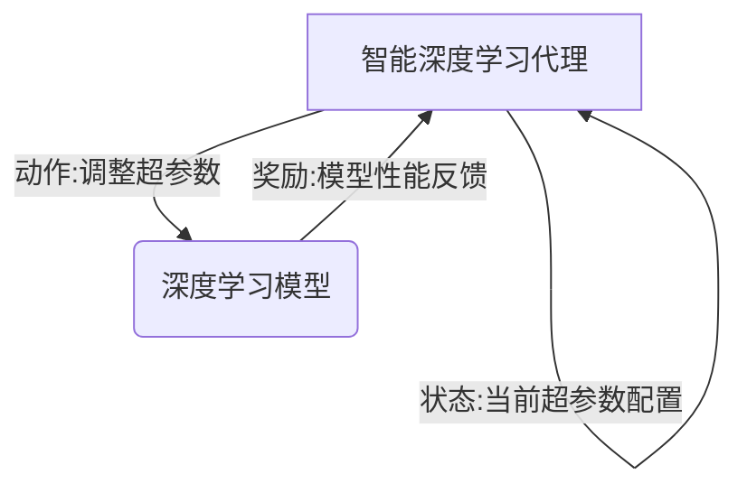

# AI人工智能深度学习算法：智能深度学习代理的性能调整与优化

关键词：人工智能, 深度学习, 智能代理, 性能优化, 超参数调整, 神经网络

## 1. 背景介绍
### 1.1 问题的由来
随着人工智能技术的飞速发展,深度学习算法在各个领域得到了广泛应用。然而,训练一个高性能的深度学习模型往往需要大量的时间和计算资源。如何高效地调整深度学习模型的超参数,优化其性能,成为了一个亟待解决的问题。
### 1.2 研究现状
目前,主要有两种超参数优化方法:1)基于搜索的方法,如网格搜索、随机搜索等;2)基于优化的方法,如贝叶斯优化、进化算法等。但这些方法都存在一定局限性,如搜索空间过大、优化效率低下等问题。因此,研究一种更加高效、智能的超参数优化方法具有重要意义。
### 1.3 研究意义  
本文提出了一种基于深度强化学习的智能代理来自动调整深度学习模型超参数的方法。通过智能代理自主学习和探索,可以快速找到最优的超参数组合,从而显著提升模型性能,降低人工调参的成本。这对于推动深度学习算法的工程应用具有重要价值。
### 1.4 本文结构
本文首先介绍了智能深度学习代理的核心概念和工作原理,然后详细阐述了基于深度强化学习的超参数优化算法,并给出了详细的数学模型和公式推导。接着,通过实际项目案例演示了算法的代码实现和应用效果。最后,讨论了该方法的优势、局限性以及未来的改进方向。

## 2. 核心概念与联系
智能深度学习代理(Intelligent Deep Learning Agent)是一种基于深度强化学习的自主智能体,通过与环境(即待优化的深度学习模型)不断交互,学习如何调整模型的超参数以优化其性能。其核心概念如下:
- 状态(State):描述智能体所处的环境状态,通常为待优化模型的当前超参数配置。
- 动作(Action):智能体根据当前状态采取的调整超参数的行为决策。
- 奖励(Reward):环境根据智能体采取的动作对其进行的即时反馈,通常为模型评估指标的提升或下降。
- 策略(Policy):智能体根据状态选择动作的映射函数,即给定状态下应该采取何种动作。
- 价值函数(Value Function):评估状态或者状态-动作对的长期累积奖励,引导智能体学习最优策略。

下图展示了智能深度学习代理与深度学习模型环境交互优化的流程:



## 3. 核心算法原理 & 具体操作步骤 
### 3.1 算法原理概述
本文采用了基于策略梯度的深度强化学习算法,通过梯度上升来最大化智能体的期望累积奖励,从而学习到最优的超参数调整策略。算法主要分为两个阶段:
1) 采样阶段:智能体与环境交互,生成一批状态-动作-奖励数据。 
2) 训练阶段:根据采样数据,通过策略梯度算法更新智能体的策略网络参数。

通过多轮迭代优化,智能体的超参数调整策略会不断改进,最终学习到一个接近最优的策略。
### 3.2 算法步骤详解
1. 随机初始化智能体策略网络的参数$\theta$
2. for 迭代轮数 i = 1 to N do
3.    重置深度学习模型环境状态 
4.    while 未达到最大调整步数 T do
5.        智能体根据当前状态$s_t$和策略网络$\pi_{\theta}$生成一个动作$a_t$
6.        在深度学习模型上执行动作$a_t$,得到新状态$s_{t+1}$和奖励$r_t$
7.        将$(s_t,a_t,r_t,s_{t+1})$转换为训练样本,存入经验回放池 
8.    end while
9.    从经验回放池中采样一批数据$D=\{(s_j,a_j,r_j,s_{j+1})\}$
10.   基于采样数据,通过策略梯度算法更新策略网络参数:
      $\theta \leftarrow \theta + \alpha \nabla_{\theta} J(\theta)$,其中
      $\nabla_{\theta} J(\theta) = \frac{1}{|D|} \sum_{j} r_j \nabla_{\theta} log \pi_{\theta}(a_j|s_j)$
11. end for

### 3.3 算法优缺点
优点:
- 端到端的优化方式,避免了人工调参的盲目性和低效性
- 通过深度神经网络直接从高维状态中提取有效特征,具有较强的泛化能力
- 采用策略梯度算法直接优化策略,训练稳定且易于实现

缺点: 
- 需要与目标模型反复交互,训练耗时较长
- 超参数空间较大时,需要较多的采样数据,采样效率有待提高
- 面对复杂的优化问题,策略可能难以收敛到全局最优

### 3.4 算法应用领域
智能深度学习代理可以应用于各种需要调参优化的深度学习模型,如:
- 计算机视觉:图像分类、目标检测、语义分割等
- 自然语言处理:机器翻译、文本分类、命名实体识别等
- 语音识别:声学模型、语言模型等
- 推荐系统:深度匹配模型、排序模型等

## 4. 数学模型和公式 & 详细讲解 & 举例说明
### 4.1 数学模型构建
我们定义智能深度学习代理的策略网络为$\pi_{\theta}(a|s)$,即在状态$s$下选择动作$a$的概率。其中$\theta$为策略网络的参数。每个状态$s$对应一个值函数$V^{\pi}(s)$,表示状态$s$在策略$\pi$下的期望累积奖励:

$$V^{\pi}(s) = \mathbb{E}_{a \sim \pi_{\theta}} [R(s,a)]$$

其中$R(s,a)$为状态动作对$(s,a)$的累积奖励,定义为:

$$R(s,a) = \sum_{t=0}^{T-1} \gamma^t r_t$$

这里$r_t$为第$t$步的即时奖励,$\gamma \in [0,1]$为折扣因子。

智能体的优化目标是最大化起始状态$s_0$的期望累积奖励,即:

$$J(\theta) = V^{\pi}(s_0) = \mathbb{E}_{a \sim \pi_{\theta}} [R(s_0,a)]$$

### 4.2 公式推导过程
根据策略梯度定理,我们可以得到目标函数$J(\theta)$对策略网络参数$\theta$的梯度:

$$\nabla_{\theta} J(\theta) = \mathbb{E}_{s \sim \rho^{\pi}, a \sim \pi_{\theta}} [\nabla_{\theta} log \pi_{\theta}(a|s) Q^{\pi}(s,a)]$$

其中$\rho^{\pi}$为策略$\pi$诱导的状态边际分布,$Q^{\pi}(s,a)$为状态-动作值函数,表示在状态$s$下采取动作$a$,之后遵循策略$\pi$的期望累积奖励。

实际优化时,我们采用蒙特卡洛估计的方法,即通过采样一批数据$D=\{(s_j,a_j,r_j,s_{j+1})\}$来近似计算梯度:

$$\nabla_{\theta} J(\theta) \approx \frac{1}{|D|} \sum_{j} r_j \nabla_{\theta} log \pi_{\theta}(a_j|s_j)$$

然后利用随机梯度上升算法更新策略网络参数$\theta$:

$$\theta \leftarrow \theta + \alpha \nabla_{\theta} J(\theta)$$

其中$\alpha$为学习率。

### 4.3 案例分析与讲解
下面我们以优化一个卷积神经网络的超参数为例,来说明智能深度学习代理的工作流程。

假设我们要优化的超参数包括:卷积层数、每层卷积核数量、卷积核大小、池化层类型、全连接层神经元数等。我们将这些超参数编码为一个离散的状态空间$\mathcal{S}$。

智能体的策略网络$\pi_{\theta}$以状态$s$为输入,输出各个动作(即不同的超参数选择)的概率分布。每次智能体根据当前状态采样一个动作$a$,并在目标卷积神经网络上执行该超参数配置,得到一个评估指标(如验证集准确率)作为奖励$r$。

通过多轮迭代,智能体逐步优化其策略网络,学习到一个最优的超参数调整策略。在测试阶段,我们可以直接用学习到的最优策略来配置卷积神经网络的超参数,而无需再进行搜索。

### 4.4 常见问题解答
Q: 策略网络的结构如何设计?
A: 通常采用多层感知机或者LSTM等结构,以状态特征为输入,输出动作的概率分布。需要根据状态和动作空间的大小来合理设置网络规模。

Q: 奖励函数如何设计?
A: 奖励函数需要能够反映不同超参数配置下模型的性能差异。一般可以直接用模型在验证集上的评估指标(如准确率、AUC等)作为奖励值。奖励值要适当归一化,以便训练的稳定性。

Q: 如何平衡探索和利用?
A: 探索是指智能体尝试新的超参数配置,利用是指选择当前已知的最优配置。二者需要平衡,可以在生成动作时加入一定的随机噪声,以一定概率进行探索。也可以用epsilon-greedy或者UCB等探索策略。

Q: 是否可以优化连续值超参数?
A: 可以将连续值超参数离散化到一个有限空间内,比如网格搜索。也可以将策略网络的输出改为均值和方差,通过重参数技巧生成连续型动作,用于连续值超参数的调整。

## 5. 项目实践：代码实例和详细解释说明
### 5.1 开发环境搭建
- Python 3.7
- PyTorch 1.8
- OpenAI Gym 0.18 (可选)
- Ray 1.2 (可选)

### 5.2 源代码详细实现
下面给出了智能深度学习代理的PyTorch实现代码:

```python
import torch
import torch.nn as nn
import torch.optim as optim
from torch.distributions import Categorical

class Agent(nn.Module):
    def __init__(self, state_dim, action_dim, hidden_dim):
        super(Agent, self).__init__()
        self.fc1 = nn.Linear(state_dim, hidden_dim)
        self.fc2 = nn.Linear(hidden_dim, action_dim) 
        
    def forward(self, x):
        x = torch.relu(self.fc1(x))
        x = self.fc2(x)
        return x
      
    def select_action(self, state):
        state = torch.from_numpy(state).float().unsqueeze(0)
        probs = torch.softmax(self.forward(state), dim=1)
        m = Categorical(probs)
        action = m.sample()
        return action.item(), m.log_prob(action)
    
def train(agent, optimizer, states, actions, rewards):
    optimizer.zero_grad()
    states = torch.tensor(states, dtype=torch.float)
    actions = torch.tensor(actions, dtype=torch.long)
    rewards = torch.tensor(rewards, dtype=torch.float)
    
    log_probs = torch.stack(actions)
    returns = torch.zeros_like(rewards)
    
    for i in reversed(range(len(rewards))):
        returns[i] = rewards[i] + 0.99 * returns[i+1] if i < len(rewards)-1 else rewards[i]
        
    loss = - (log_probs * returns).sum()
    loss.backward()
    optimizer.step()
    
def main():
    state_dim = 10
    action_dim = 5
    hidden_dim = 64
    lr = 1e-3
    num_episodes = 1000
    max_steps = 100
    
    agent = Agent(state_dim, action_dim, hidden_dim)
    optimizer =