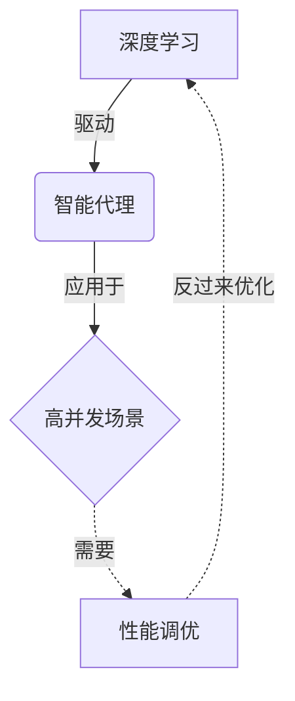
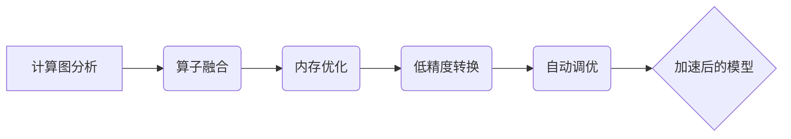
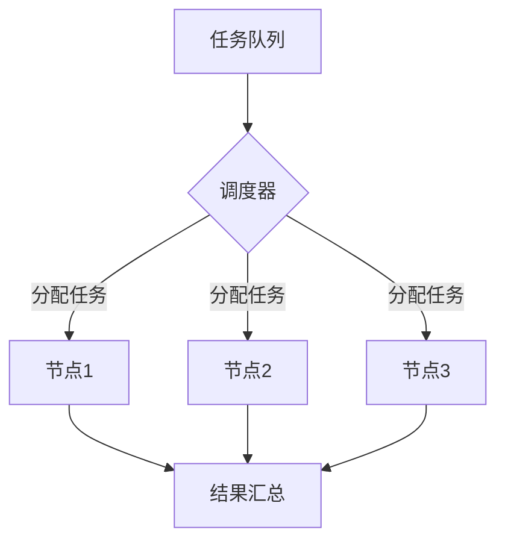
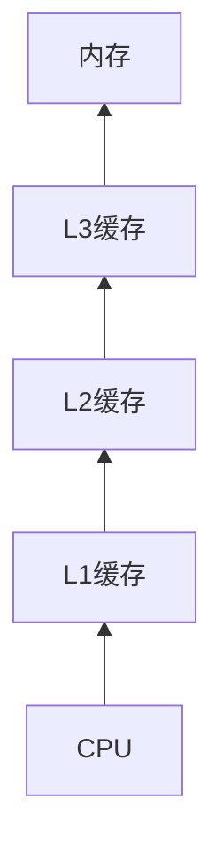

# AI人工智能深度学习算法：智能深度学习代理的高并发场景下的性能调优

关键词：深度学习、智能代理、高并发、性能优化、算法调优

## 1. 背景介绍
### 1.1 问题的由来
随着人工智能技术的飞速发展,深度学习已经成为了智能系统的核心驱动力。在实际应用中,深度学习模型通常需要部署在高并发的生产环境中,面临着性能和效率的巨大挑战。尤其是对于智能代理这类需要实时响应、快速迭代的场景,如何在保证模型效果的同时,最大限度地提升系统吞吐量和降低时延,成为了一个亟待解决的关键问题。

### 1.2 研究现状
目前,针对深度学习系统的性能优化已经有了一些研究和实践。例如采用模型压缩、知识蒸馏等方法减小模型体积,使用量化、剪枝等技术加速推理过程,或是设计高效的并行计算框架等。但是,大多数工作还主要集中在单个模型的层面,对于工业界实际应用中普遍存在的多模型协同、动态调度等需求,还缺乏系统性的解决方案。

### 1.3 研究意义
深入研究智能代理在高并发场景下的性能优化,对于推动人工智能技术在实际生产环境中的规模化应用具有重要意义。一方面,可以提升系统性能,降低服务时延,提高用户体验；另一方面,优化资源利用率,节省计算成本,让深度学习技术真正成为企业核心竞争力的有力武器。同时,这也将促进人工智能基础理论与工程实践的进一步融合,为构建新一代高效、实用的智能系统铺平道路。

### 1.4 本文结构
本文将重点围绕智能深度学习代理在高并发场景下的性能调优展开,系统性地探讨相关的算法原理、数学模型、工程实践以及未来发展趋势等。第2部分介绍相关领域的核心概念；第3部分重点阐述用于提升性能的几个关键算法；第4部分给出算法背后的数学原理和推导过程；第5部分通过具体的代码实例,演示性能优化的完整过程；第6部分讨论智能代理优化在实际场景中的应用价值；第7部分推荐一些有助于深入理解和实践的资源;第8部分对全文进行总结,并展望未来的机遇与挑战。

## 2. 核心概念与联系
在探讨智能代理性能优化之前,我们先来了解一下相关领域的几个核心概念：
- 深度学习(Deep Learning):一种基于多层神经网络的机器学习方法,通过学习大量数据,自动提取高层特征,构建复杂的映射关系。它是当前人工智能的核心驱动力。
- 智能代理(Intelligent Agent):能够感知环境,并根据目标采取行动,自主完成特定任务的系统。它通常由多个功能模块组成,深度学习是其中的关键组件。
- 高并发(High Concurrency):系统能够同时处理大量请求或任务的能力。在互联网应用中,高并发通常意味着要在海量用户同时在线的情况下,依然保持良好的性能。
- 性能调优(Performance Tuning):通过系统分析、参数调整、代码优化等手段,提升系统的处理效率,降低资源消耗。它需要在算法、数据结构、工程实现等多个层面协同优化。

这几个概念之间有着紧密的内在联系。智能代理的核心能力来自深度学习,而实现高并发则需要通过性能调优,最大限度地发挥深度学习的效能。下图展示了它们之间的关系：

可以看到,深度学习、智能代理、高并发、性能调优,构成了一个相互影响、密不可分的闭环。本文将重点放在性能调优这一环节,系统性地阐述如何在算法、模型、工程等层面对智能代理进行全方位优化,从而实现高并发下的高效服务。

## 3. 核心算法原理 & 具体操作步骤
### 3.1 算法原理概述
智能代理的性能优化涉及多个层面,其中在算法层面,我们主要采用以下几种核心方法：
1. 模型压缩(Model Compression):通过减小模型体积,降低计算复杂度,从而加速推理过程。主要技术包括量化、剪枝、知识蒸馏等。
2. 计算加速(Computational Acceleration):优化底层计算库、算子,充分利用现代硬件加速器如GPU的并行计算能力,提升单个任务的执行效率。
3. 任务调度(Task Scheduling):根据任务的优先级、执行时间、资源需求等,动态调度任务到不同的计算节点,实现负载均衡和任务并行。
4. 缓存优化(Caching Optimization):合理使用多级缓存,降低数据访问的时延,提高吞吐量。需要权衡缓存命中率和更新代价。
5. 数据流优化(Data Flow Optimization):改进数据在系统内部的流动方式,减少不必要的数据复制和传输,提高整体的执行效率。

这几个方面相辅相成,共同构成了智能代理性能优化的核心内容。下面我们将逐一展开,详细阐述每种方法的原理和实现。

### 3.2 算法步骤详解
#### 3.2.1 模型压缩
模型压缩的目标是在保持模型性能的前提下,尽可能减小模型的体积和计算量。以下是几种主要的模型压缩技术：
1. 量化(Quantization):将模型权重和激活值从浮点数转换为低比特的定点数,减小存储和计算开销。具体步骤如下：
   - 确定量化位宽(如8bit)和量化方式(对称或非对称)
   - 计算权重/激活值的量化参数(比例因子和零点)
   - 量化权重/激活值,储存为定点数
   - 重写计算逻辑,用定点数代替浮点数进行推理
2. 剪枝(Pruning):去除模型中冗余的连接或神经元,降低模型复杂度。具体步骤如下：
   - 设定剪枝目标(比如稀疏度)和策略(结构化或非结构化)
   - 根据某种重要性准则(如L1范数),选择要剪枝的连接或神经元
   - 在训练过程中逐步将它们的权重设为0,达到剪枝效果 
   - 去除被剪枝的部分,得到精简后的模型
3. 知识蒸馏(Knowledge Distillation):用大模型(Teacher)去指导小模型(Student)学习,将知识从前者转移到后者。具体步骤如下：
   - 准备好预训练的大模型和待训练的小模型
   - 使用相同的数据对两个模型进行前向传播
   - 计算Teacher模型的软标签(soft label),作为Student模型的训练目标
   - 训练Student模型,使其在推理时模仿Teacher模型的行为
   
通过这些技术,我们可以显著降低模型体积和计算量,加快推理速度,同时保持模型性能不会显著下降。

#### 3.2.2 计算加速
计算加速主要是通过优化底层计算库、算子,充分利用硬件加速器,来提升单个任务的执行效率。以下是一些常用的加速方法：
1. 算子融合(Operator Fusion):将多个小的计算算子合并为一个大的算子,减少数据交换和内存访问,提高缓存利用率和并行度。
2. 内存优化(Memory Optimization):改进数据在内存中的存储方式,减少不必要的数据移动和复制。比如说通过数据排布优化,将不同算子的输入输出安排在连续的内存空间。
3. 低精度计算(Low Precision Computation):在保证模型精度的前提下,使用半精度(FP16)甚至更低精度进行训练和推理,减少计算量和内存带宽压力。
4. 自动调优(Auto-tuning):针对特定的硬件环境和模型结构,自动搜索最优的计算配置,如算子实现、线程数、缓存大小等,充分发挥硬件性能。

下图展示了一个计算加速的典型流程:

通过计算加速,我们可以显著提升单个推理任务的执行效率,降低时延,提高吞吐量。这对于实现智能代理的高并发服务至关重要。

#### 3.2.3 任务调度
在高并发场景下,有大量的任务需要智能代理处理。高效的任务调度可以让这些任务合理地分配到不同的计算资源上,尽可能地提高整体吞吐量,缩短响应时间。以下是一些常用的任务调度策略：
1. 优先级调度(Priority Scheduling):根据任务的重要程度,给它们分配不同的优先级。调度器总是优先执行高优先级的任务。
2. 最短任务优先(Shortest Job First):优先执行预估执行时间最短的任务,尽快完成它们,提高短任务的响应速度。
3. 负载均衡(Load Balancing):根据当前各个计算节点的负载情况,将新到来的任务分配给负载较轻的节点,尽量让所有节点的负载保持均衡。
4. 抢占式调度(Preemptive Scheduling):允许调度器暂停正在运行的低优先级任务,让高优先级任务先执行,提高关键任务的响应速度。

下图展示了一个负载均衡调度的示意图:

通过合理的任务调度,我们可以充分利用分布式计算资源,让每个节点都能发挥自己的作用,从而提高整个系统的并发处理能力。

#### 3.2.4 缓存优化
缓存是提高系统性能的重要手段。通过在内存中缓存频繁访问的数据,我们可以减少对后端存储的依赖,降低读取时延,提高吞吐量。以下是一些常用的缓存优化策略：
1. 多级缓存(Multi-level Cache):使用多级缓存结构,L1、L2、L3等,不同层次的缓存大小和访问速度不同。将最频繁访问的数据放在最快的缓存中。
2. 缓存粒度选择(Cache Granularity Selection):根据数据的特性和访问模式,选择合适的缓存粒度,比如按块缓存、按行缓存、按列缓存等。
3. 缓存一致性(Cache Coherence):在分布式环境中,需要保证不同节点缓存数据的一致性。常用的方法有失效、更新、MESI等协议。
4. 缓存替换策略(Cache Replacement Policy):当缓存空间不足时,需要选择合适的数据进行替换。常见的策略有LRU、LFU、ARC等。

下图展示了一个典型的多级缓存结构：

通过缓存优化,我们可以显著降低数据访问的平均时延,提高系统的整体性能。但同时也要注意缓存的成本和一致性问题,需要仔细权衡。

#### 3.2.5 数据流优化
除了优化计算和缓存,改进数据在系统内部的流动方式也是提升性能的重要手段。以下是一些常用的数据流优化策略：
1. 数据本地化(Data Locality):尽量将计算任务调度到数据所在的节点上执行,减少网络传输,提高数据访问效率。
2. 数