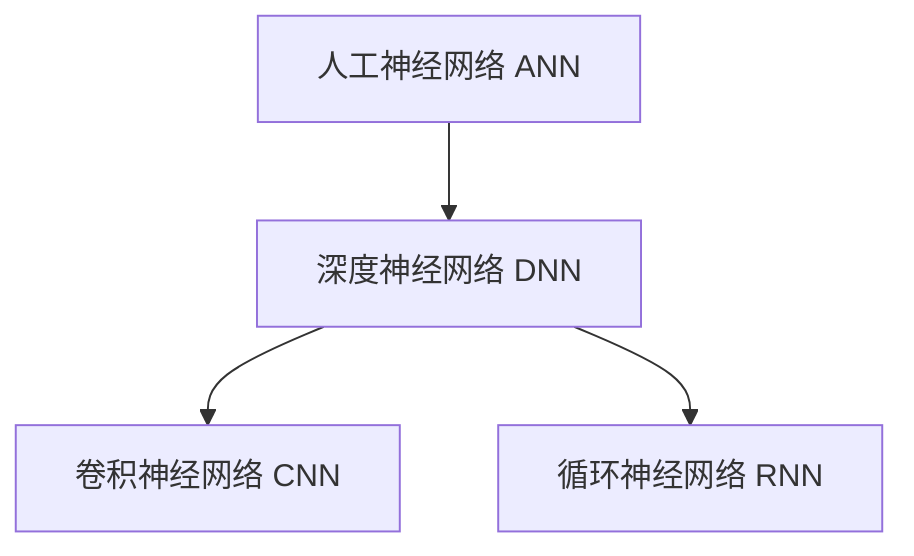

好的,我明白了您的要求。以下是题为《AI人工智能深度学习算法:深度学习的挑战与前景》的技术博客文章正文:

# AI人工智能深度学习算法:深度学习的挑战与前景

## 1. 背景介绍

### 1.1 问题的由来

在过去的几十年里,人工智能(AI)技术取得了长足的进步,尤其是在深度学习(Deep Learning)领域的突破性发展。深度学习作为机器学习的一个新的研究热点,展现出了强大的数据处理能力,在计算机视觉、自然语言处理、推荐系统等诸多领域取得了卓越的成绩。

然而,与此同时,深度学习也面临着一些挑战和局限性。例如,深度神经网络被视为"黑箱",很难解释其内部工作机理;训练深度模型需要大量的数据和计算资源;存在对抗样本的问题等。因此,我们需要更深入地探讨和研究深度学习的原理、算法及其应用,以推动人工智能技术的发展。

### 1.2 研究现状  

目前,深度学习的研究主要集中在以下几个方面:

1. **模型优化**: 提出新的网络结构和训练策略,提高模型的准确性和泛化能力。
2. **可解释性**: 探索深度模型内部机理,增强其透明度和可解释性。
3. **高效计算**: 设计高效的并行计算框架,加速模型的训练和推理过程。
4. **应用拓展**: 将深度学习技术应用到更多的领域,如医疗、金融、智能制造等。
5. **理论基础**: 深入研究深度学习的数学理论基础,为模型优化提供指导。

### 1.3 研究意义

深入研究深度学习算法及其挑战具有重要的理论和应用价值:

1. **理论层面**: 有助于我们更好地理解深度神经网络的工作原理,为模型优化和创新提供理论指导。
2. **应用层面**: 解决深度学习面临的一些关键性挑战,有助于提高模型的性能和可靠性,从而推动AI技术在更多领域的应用。
3. **社会影响**: 人工智能技术的发展将深刻影响人类社会的方方面面,对于建设智能化社会具有重要意义。

### 1.4 本文结构

本文将从以下几个方面深入探讨深度学习算法:

1. 介绍深度学习的核心概念和基本原理。
2. 详细阐述主流深度学习算法的原理和具体实现步骤。
3. 分析深度学习模型的数学表示形式,并推导相关公式。
4. 通过实例项目,演示深度学习算法的编码实现和应用。  
5. 讨论深度学习在不同领域的应用场景和案例。
6. 总结深度学习面临的主要挑战,并展望未来的发展趋势。

## 2. 核心概念与联系

在深入探讨深度学习算法之前,我们先来了解一些核心概念:

1. **人工神经网络(Artificial Neural Network, ANN)**: 深度学习模型的基础,它是一种模拟生物神经网络结构和信息传递方式的数学模型。
2. **深度神经网络(Deep Neural Network, DNN)**: 具有多个隐藏层的人工神经网络,能够自动从数据中提取多层次特征。
3. **卷积神经网络(Convolutional Neural Network, CNN)**: 一种常用于计算机视觉任务的深度神经网络,通过卷积操作提取图像特征。
4. **循环神经网络(Recurrent Neural Network, RNN)**: 专门用于处理序列数据的深度网络,在自然语言处理等领域有广泛应用。

这些概念之间存在着紧密的联系,如下所示:

深度学习算法的核心思想是利用多层非线性变换,从原始数据中自动提取有效特征,并基于这些特征完成相应的任务。不同类型的深度神经网络针对不同的数据形式和任务而设计,但它们都遵循这一基本原理。

## 3. 核心算法原理 & 具体操作步骤

### 3.1 算法原理概述

深度学习算法的核心原理可以概括为以下三个方面:

1. **前向传播**: 输入数据经过多层非线性变换,提取出有效特征,得到输出结果。
2. **反向传播**: 根据输出结果与期望目标之间的误差,计算每一层参数的梯度,并通过优化算法更新参数值。
3. **迭代训练**: 重复执行前向传播和反向传播的过程,不断优化模型参数,直至模型在训练数据上达到预期的性能指标。

这一原理适用于各种深度神经网络,如前馈网络、卷积网络和循环网络等。不同类型的网络主要体现在具体的网络结构、层次操作和参数形式上的差异。

### 3.2 算法步骤详解

以下是一个典型的深度学习算法的具体实现步骤:

1. **数据预处理**: 对原始数据进行清洗、标准化等预处理,以满足模型的输入要求。
2. **构建网络结构**: 根据任务需求,设计合适的深度神经网络结构,包括输入层、隐藏层和输出层的层数和神经元数量。
3. **初始化参数**: 对网络中的可训练参数(权重和偏置)进行随机初始化。
4. **前向传播计算**: 输入数据经过多层非线性变换,计算出每一层的输出,最终得到模型的预测结果。
5. **计算损失函数**: 将模型预测结果与真实标签进行对比,计算出相应的损失函数值。
6. **反向传播求梯度**: 利用链式法则,从输出层开始,逐层计算每一层参数的梯度。
7. **参数更新**: 使用优化算法(如梯度下降)根据梯度值,更新网络中的可训练参数。
8. **迭代训练**: 重复执行步骤4-7,直至模型在验证集上的性能满足要求或达到最大训练轮数。
9. **模型评估**: 在测试集上评估训练好的模型,获取最终的性能指标。
10. **模型部署**: 将训练好的模型应用于实际的预测或决策任务中。

这个过程通常使用优化技术(如批量梯度下降、随机梯度下降等)和正则化策略(如L1/L2正则化、dropout等)来提高模型的泛化能力。

### 3.3 算法优缺点

深度学习算法具有以下优点:

1. **强大的特征提取能力**: 能够自动从原始数据中学习出多层次的抽象特征,无需人工设计特征。
2. **端到端的训练方式**: 将特征提取和模型学习统一在同一个过程中进行,简化了传统机器学习的流程。
3. **可扩展性强**: 通过增加网络深度和宽度,可以提高模型的表达能力,处理更加复杂的任务。
4. **泛化能力强**: 在大量数据的支持下,深度模型能够很好地捕获数据的内在规律,具有良好的泛化性能。

但同时也存在一些缺点和挑战:

1. **需要大量数据**: 训练深度神经网络通常需要大量的标注数据,数据获取和标注成本高。
2. **黑箱性质**: 深度模型内部的工作机理难以解释,缺乏透明度。
3. **对抗样本**: 深度模型容易受到对抗样本的攻击,导致预测结果失真。
4. **硬件资源要求高**: 训练深度模型需要大量的计算资源,对硬件配置要求较高。

### 3.4 算法应用领域

深度学习算法在以下领域有着广泛的应用:

1. **计算机视觉**: 图像分类、目标检测、语义分割、视频理解等。
2. **自然语言处理**: 机器翻译、文本生成、情感分析、问答系统等。
3. **语音识别**: 自动语音识别、语音合成、语音唤醒等。
4. **推荐系统**: 个性化推荐、内容推荐、广告推荐等。
5. **金融科技**: 风险评估、欺诈检测、量化交易等。
6. **医疗健康**: 医学影像分析、疾病诊断、药物发现等。
7. **智能制造**: 缺陷检测、工艺优化、预测性维护等。

随着深度学习技术的不断发展,其应用领域也在不断扩展。

## 4. 数学模型和公式 & 详细讲解 & 举例说明

### 4.1 数学模型构建

深度神经网络是一种由多层神经元组成的数学模型,每一层都对输入数据进行非线性变换。我们可以将整个网络表示为一个复合函数:

$$
\hat{y} = f(x; \theta) = f^{(L)}(f^{(L-1)}(...f^{(2)}(f^{(1)}(x))))
$$

其中:
- $x$是输入数据
- $\hat{y}$是模型的预测输出
- $\theta$是模型的所有可训练参数(权重和偏置)的集合
- $f^{(l)}$表示第$l$层的非线性变换函数

每一层的变换函数通常由两个步骤组成:线性变换和非线性激活。

**线性变换**:

$$
z^{(l)} = W^{(l)}a^{(l-1)} + b^{(l)}
$$

其中:
- $a^{(l-1)}$是上一层的输出(对于输入层,$a^{(0)} = x$)
- $W^{(l)}$是该层的权重矩阵
- $b^{(l)}$是该层的偏置向量

**非线性激活**:

$$
a^{(l)} = g(z^{(l)})
$$

其中$g$是非线性激活函数,如Sigmoid、ReLU等。

通过层层叠加这种线性变换和非线性激活,网络就能够拟合任意的复杂函数。

### 4.2 公式推导过程

在训练深度神经网络时,我们需要最小化一个损失函数(Loss Function),例如均方误差损失:

$$
J(\theta) = \frac{1}{2m}\sum_{i=1}^m\left\Vert\hat{y}^{(i)} - y^{(i)}\right\Vert^2
$$

其中:
- $m$是训练样本的数量
- $\hat{y}^{(i)}$是模型对第$i$个样本的预测输出
- $y^{(i)}$是第$i$个样本的真实标签

为了最小化损失函数,我们需要计算每个参数的梯度,并通过梯度下降法更新参数值。

对于第$l$层的权重矩阵$W^{(l)}$,其梯度可以通过**反向传播算法**计算得到:

$$
\frac{\partial J}{\partial W^{(l)}} = \frac{1}{m}\sum_{i=1}^m\delta^{(l)(i)}(a^{(l-1)(i)})^T
$$

其中$\delta^{(l)(i)}$是第$l$层的**误差项**,定义为:

$$
\delta^{(l)(i)} = ((W^{(l+1)})^T\delta^{(l+1)(i)}) \odot g'(z^{(l)(i)})
$$

对于输出层,误差项为:

$$
\delta^{(L)(i)} = \nabla_a^{(L)(i)}J(\theta) \odot g'(z^{(L)(i)})
$$

这里$\nabla_a^{(L)(i)}J(\theta)$是损失函数对输出层激活值的梯度。

通过这种链式法则的反向传播,我们可以计算出每一层的梯度,并使用优化算法(如梯度下降)更新参数值。

### 4.3 案例分析与讲解

为了更好地理解深度学习的数学模型和公式,我们来分析一个简单的示例。

假设我们有一个二分类问题,需要构建一个二层神经网络进行分类。输入数据$x$是一个三维向量,我们的目标是根据输入数据预测其类别$y \in \{0, 1\}$。

**网络结构**:
- 输入层: 3个神经元
- 隐藏