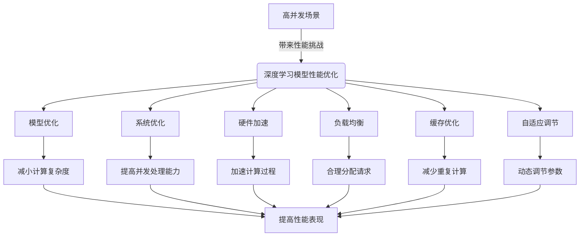

# AI人工智能深度学习算法：高并发场景下深度学习代理的性能调优

## 1. 背景介绍

### 1.1 问题的由来

随着人工智能和深度学习技术的飞速发展,越来越多的企业开始将深度学习模型应用于生产环境中。然而,在高并发的生产场景下,如何保证深度学习模型的高效运行和良好性能,成为了一个亟待解决的问题。

在实际应用中,深度学习模型通常被部署在服务器集群中,以应对大规模的请求并发。但由于深度学习模型计算复杂、资源消耗大等特点,在高并发场景下,模型的响应时间可能会大幅增加,甚至导致请求超时或系统崩溃。这不仅影响了用户体验,也可能给企业带来巨大的经济损失。

### 1.2 研究现状

为了解决这一问题,业界和学术界已经提出了多种性能优化方案,包括模型压缩、模型并行化、异步推理等技术。但这些方案大多专注于特定场景或特定模型,缺乏一种通用的、系统化的解决方案。

此外,现有的性能优化方案往往只关注单一指标,如响应时间或吞吐量,忽视了其他重要指标,如资源利用率、可扩展性等。因此,需要一种全面的性能评估和优化框架,能够综合考虑多个关键指标,从而实现深度学习模型在高并发场景下的最佳性能表现。

### 1.3 研究意义

本文旨在提出一种系统化的方法,解决高并发场景下深度学习模型的性能瓶颈问题。该方法不仅能够显著提高模型的响应时间和吞吐量,还能够优化资源利用率,提高系统的可扩展性和鲁棒性。

通过本文提出的方法,企业可以更好地利用深度学习技术,提升业务效率和用户体验,从而获得竞争优势。同时,该方法也为学术界提供了一种新的研究视角,有助于推动人工智能和深度学习技术的进一步发展。

### 1.4 本文结构

本文首先介绍了高并发场景下深度学习模型性能优化的背景和研究现状,阐明了研究的重要意义。接下来,文章详细阐述了核心概念和算法原理,包括数学模型和公式的推导过程。

然后,文章提供了一个实际的项目案例,展示了如何在代码层面实现性能优化,并对关键代码进行了解释和分析。

此外,文章还探讨了该方法在实际应用场景中的应用前景,并推荐了一些有用的工具和学习资源。

最后,文章总结了研究成果,展望了未来的发展趋势和面临的挑战,为读者提供了一个全面的视角。

## 2. 核心概念与联系

在深入探讨算法原理之前,我们需要先了解一些核心概念及其相互关系。这些概念为后续的理论和实践奠定了基础。

### 2.1 深度学习模型

深度学习模型是一种基于人工神经网络的机器学习模型,能够从大量数据中自动学习特征表示,并对复杂问题进行建模和预测。常见的深度学习模型包括卷积神经网络(CNN)、递归神经网络(RNN)、生成对抗网络(GAN)等。

深度学习模型通常由多个层次组成,每一层都对输入数据进行非线性转换,最终输出预测结果。这种层次结构使得深度学习模型能够学习到数据的高级特征表示,从而在许多任务上取得了卓越的性能。

### 2.2 高并发场景

高并发场景是指系统在同一时间内需要处理大量的请求或事务。在这种情况下,系统需要具备良好的并发处理能力,才能保证响应及时、稳定可靠。

对于基于深度学习的系统,高并发场景意味着需要同时处理大量的推理请求。由于深度学习模型的计算复杂度较高,单个请求的处理时间较长,因此在高并发情况下,系统很容易出现性能瓶颈。

### 2.3 性能指标

评估深度学习模型在高并发场景下的性能,需要考虑多个关键指标,包括:

1. **响应时间(Latency)**: 指系统处理一个请求所需的时间,反映了系统的实时性能。
2. **吞吐量(Throughput)**: 指单位时间内系统能够处理的请求数量,反映了系统的整体处理能力。
3. **资源利用率(Resource Utilization)**: 指系统对CPU、内存、网络等资源的利用程度,反映了资源的利用效率。
4. **可扩展性(Scalability)**: 指系统在负载增加时,能够通过增加资源来提高性能的能力。
5. **鲁棒性(Robustness)**: 指系统在异常情况下(如硬件故障、网络拥塞等)的容错和恢复能力。

这些指标相互影响、相互制约,需要综合考虑和权衡,才能实现深度学习模型在高并发场景下的最佳性能表现。

### 2.4 性能优化方法

为了提高深度学习模型在高并发场景下的性能,可以从多个层面进行优化,包括:

1. **模型优化**: 通过模型压缩、模型剪枝等技术,减小模型的计算复杂度和内存占用,提高推理效率。
2. **系统优化**: 优化系统架构、调度策略、资源分配等,提高系统的并发处理能力和资源利用率。
3. **硬件加速**: 利用GPU、TPU等专用硬件,加速深度学习模型的计算过程。
4. **负载均衡**: 通过合理的负载均衡策略,将请求合理分配到多个节点,提高整体吞吐量。
5. **缓存优化**: 利用缓存技术,减少重复计算,提高响应速度。
6. **自适应调节**: 根据实时负载情况,动态调节系统参数和资源分配,实现自适应优化。

本文将重点介绍一种基于深度学习代理的性能优化方法,该方法综合运用了上述多种优化技术,能够全面提升深度学习模型在高并发场景下的性能表现。

上图展示了深度学习模型在高并发场景下的性能优化方法及其核心思路。通过综合运用多种优化技术,可以从不同层面提高模型的性能表现,实现响应时间的缩短、吞吐量的提升、资源利用率的优化、可扩展性的增强和鲁棒性的加强。

## 3. 核心算法原理与具体操作步骤

### 3.1 算法原理概述

本文提出的性能优化方法基于一种称为"深度学习代理(Deep Learning Proxy)"的核心思想。深度学习代理是一种位于客户端和深度学习模型之间的中间层,负责接收客户端请求、管理模型资源、调度推理任务并返回结果。

深度学习代理的核心算法包括三个主要组件:

1. **请求调度器(Request Scheduler)**: 负责接收客户端请求,并根据预定义的策略将请求分发到不同的模型实例进行推理。
2. **模型管理器(Model Manager)**: 负责管理深度学习模型的生命周期,包括加载、卸载、更新等操作,并监控模型的运行状态。
3. **结果缓存(Result Cache)**: 缓存模型推理的结果,以减少重复计算,提高响应速度。

这三个组件通过紧密协作,实现了高效的请求处理、合理的资源分配、智能的缓存策略和动态的自适应调节,从而显著提升了深度学习模型在高并发场景下的性能表现。

上图展示了深度学习代理的基本工作流程。客户端请求首先被请求调度器接收,然后根据调度策略分发到合适的深度学习模型实例进行推理。模型实例的生命周期由模型管理器负责管理。推理结果会被缓存在结果缓存中,以备将来重用。最终,响应结果会返回给客户端。

在这个过程中,请求调度器、模型管理器和结果缓存会根据系统的实时状态(如负载、资源利用情况等)进行动态调节,以实现自适应优化。

### 3.2 算法步骤详解

下面我们详细介绍深度学习代理算法的具体步骤:

#### 3.2.1 请求调度

1. 客户端发送推理请求到请求调度器。
2. 请求调度器根据预定义的调度策略(如轮询、最小响应时间等)选择一个合适的模型实例。
3. 如果所有模型实例都在繁忙状态,请求将被加入队列等待调度。
4. 选定的模型实例接收请求,并开始推理计算。

#### 3.2.2 模型管理

1. 模型管理器持续监控系统的资源利用情况(CPU、内存、GPU等)。
2. 根据资源利用情况,模型管理器可以动态调整模型实例的数量:
    - 如果资源利用率较高,增加模型实例数量以提高并行能力。
    - 如果资源利用率较低,减少模型实例数量以释放资源。
3. 模型管理器还负责模型实例的生命周期管理,包括加载、卸载、更新等操作。

#### 3.2.3 结果缓存

1. 模型实例完成推理计算后,将结果存入结果缓存。
2. 结果缓存采用LRU(最近最少使用)或其他缓存替换策略,在空间满时淘汰旧的缓存项。
3. 当新的请求到来时,请求调度器首先查询结果缓存:
    - 如果命中缓存,直接返回缓存结果,无需进行推理计算。
    - 如果未命中,则将请求分发到模型实例进行推理。

#### 3.2.4 自适应调节

1. 系统会持续监控关键性能指标,如响应时间、吞吐量、资源利用率等。
2. 如果发现性能不佳(如响应时间过长、吞吐量过低等),系统将自动调节相关参数:
    - 调整请求调度策略,优化请求分发。
    - 调整模型实例数量,增加或减少并行能力。
    - 调整结果缓存大小,优化缓存命中率。
3. 系统会根据调节效果,持续优化参数配置,实现自适应性能优化。

通过以上步骤,深度学习代理算法能够实现高效的请求处理、合理的资源分配、智能的缓存策略和动态的自适应调节,从而全面提升深度学习模型在高并发场景下的性能表现。

### 3.3 算法优缺点

#### 优点

1. **高效处理**: 通过请求调度和模型实例管理,可以充分利用系统资源,高效处理大量并发请求。
2. **响应迅速**: 结果缓存机制可以大幅减少重复计算,提高响应速度。
3. **自适应性强**: 算法能够根据实时状况动态调节系统参数,实现自适应优化。
4. **可扩展性好**: 模型实例数量可以动态调整,系统具有良好的可扩展性。
5. **鲁棒性高**: 算法能够容忍硬件故障和网络异常,提高系统