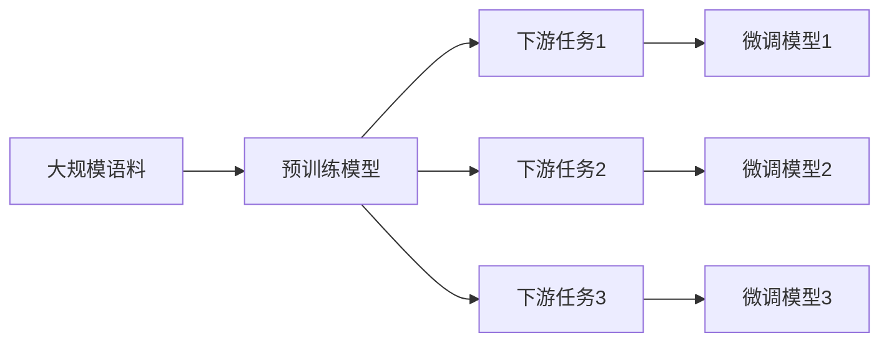

# AI工程学：大模型应用开发实战：预训练与微调

关键词：人工智能, 大模型, 预训练, 微调, 迁移学习, Transformer, BERT, GPT, 多任务学习, 领域适应

## 1. 背景介绍

### 1.1 问题的由来

随着人工智能技术的飞速发展,特别是深度学习的崛起,我们已经进入了"大模型"时代。越来越多的研究表明,在海量数据上预训练的大规模语言模型,如BERT、GPT等,可以通过迁移学习应用到下游的各种自然语言处理任务中,并取得了显著的性能提升。这种"预训练+微调"的范式,正在成为NLP领域的新范式。

### 1.2 研究现状

目前,业界主流的大模型训练方法主要有两种:

1. 无监督预训练:在大规模无标注语料上进行自监督学习,如BERT使用的Masked Language Model和Next Sentence Prediction。

2. 有监督微调:在特定任务的标注数据上对预训练模型进行微调,使其适应具体任务。

一些最新的研究进展包括:

- 使用更大规模的数据和模型(如GPT-3,Switch Transformer等)进行预训练
- 探索更有效的预训练目标和策略(如Electra, ALBERT等) 
- 将预训练模型应用到更多种类的任务中(如对话、问答、摘要等)
- 研究低资源场景下的预训练模型应用

### 1.3 研究意义

大模型预训练与微调技术的研究,对于推动人工智能在实际应用中的落地具有重要意义:

1. 降低应用开发门槛:开发者可以直接使用预训练模型,省去从头训练的巨大开销。

2. 提升模型性能:预训练使模型学到了丰富的语言知识,微调可以高效适应具体任务。

3. 扩大应用领域:将NLP技术应用到更广泛的场景中,催生出更多创新性的应用。

4. 探索人工智能的本质:理解预训练模型学到的语言知识,对于揭示人类语言智能的奥秘具有重要价值。

### 1.4 本文结构

本文将全面介绍大模型应用开发的流程和要点,主要包括:

- 核心概念:预训练、微调、迁移学习等
- 主流算法:Transformer, BERT, GPT等的原理和实现
- 开发实践:如何使用预训练模型进行具体任务开发
- 应用场景:预训练模型在各领域的应用案例
- 未来展望:大模型技术的发展趋势和挑战

## 2. 核心概念与联系

- 大模型:参数量巨大(数亿到千亿级)的深度学习模型,通常采用Transformer等架构。
- 预训练:在大规模无标注语料上进行自监督学习,让模型学习通用的语言知识。常见的预训练任务有语言模型、Masked Language Model等。
- 微调:在下游任务的标注数据上对预训练模型进行训练,使其适应具体任务。通常只需要较小的学习率和少量的训练步数。
- 迁移学习:将在源任务上学到的知识迁移到目标任务中,避免从头训练的开销。预训练模型的迁移学习可分为特征提取和微调两种方式。
- 自监督学习:让模型在无标注数据上自己构建学习目标,如预测被遮挡的单词。这使得模型能利用大规模无标注数据进行训练。
- 多任务学习:将多个相关任务放在一起联合训练,让模型学习通用的表示。这可以提升模型的泛化能力。
- 领域适应:让预训练模型适应特定领域的数据分布,如使用领域内数据进行二次预训练。

下图展示了这些概念之间的关系:

## 3. 核心算法原理 & 具体操作步骤

### 3.1 算法原理概述

主流的预训练模型如BERT、GPT等,核心都是基于Transformer架构。Transformer使用自注意力机制来建模文本序列内和序列间的依赖关系,具有并行度高、长程建模能力强等优点。

以BERT为例,其预训练目标包括:

1. Masked Language Model(MLM):随机遮挡一部分词,让模型根据上下文预测这些词。
2. Next Sentence Prediction(NSP):让模型判断两个句子在原文中是否相邻。

通过这些任务,模型可以学习到词语的上下文表示以及句子间的关系,从而得到通用的语言理解能力。

### 3.2 算法步骤详解

以下是使用预训练模型进行下游任务开发的一般步骤:

1. 选择合适的预训练模型:根据任务类型和语种,在BERT、RoBERTa、GPT、T5等模型中选择。

2. 准备数据:对下游任务的数据进行收集、清洗和标注,并划分为训练集、验证集和测试集。

3. 搭建开发环境:使用TensorFlow、PyTorch等框架,加载预训练模型的参数。

4. 设计输入输出:根据任务定义模型的输入(如token embeddings)和输出(如分类概率)。

5. 添加任务特定层:在预训练模型之上,添加一些浅层的任务特定网络,如分类层、CRF层等。

6. 微调训练:使用下游任务的训练数据,对整个模型进行端到端的微调训练,通常使用较小的学习率。

7. 评估与调优:在验证集上评估模型性能,并根据需要调整超参数。

8. 模型部署:将调优后的模型封装为API,并集成到实际的应用系统中。

### 3.3 算法优缺点

预训练模型的优点包括:

- 降低了训练成本,避免从头训练的巨大开销
- 在下游任务上能取得更好的性能,特别是对于低资源场景
- 可以实现零样本和少样本学习,具有较强的泛化能力

但它也存在一些局限性:

- 预训练的语料与目标领域差异较大时,迁移效果可能不佳
- 对计算资源要求较高,在边缘设备上部署有难度
- 模型体积庞大,推理速度和内存占用可能无法满足实时场景的需求

### 3.4 算法应用领域

预训练模型已经在NLP的各个领域取得了广泛应用,包括但不限于:

- 文本分类:如情感分析、新闻分类、意图识别等
- 序列标注:如命名实体识别、词性标注、语义角色标注等
- 句子关系判断:如自然语言推理、语义相似度计算等
- 生成任务:如抽取式摘要、问答、对话生成等
- 跨语言任务:如机器翻译、跨语言文本分类等

此外,预训练模型还被应用到多模态场景,如图像描述、视频问答等。

## 4. 数学模型和公式 & 详细讲解 & 举例说明

### 4.1 数学模型构建

Transformer作为主流预训练模型的基础架构,其核心是自注意力机制和前馈神经网络。

对于一个输入序列$\mathbf{x}=(x_1,\dots,x_n)$,Transformer首先将其转换为向量表示$\mathbf{H}^0=(\mathbf{h}_1^0,\dots,\mathbf{h}_n^0)$,然后通过若干个Transformer Block得到最终的序列表示$\mathbf{H}^L$:

$$
\mathbf{H}^l = \text{TransformerBlock}(\mathbf{H}^{l-1}), l=1,\dots,L
$$

其中每个Transformer Block包含两个子层:多头自注意力层和前馈层。

多头自注意力将序列$\mathbf{H}^{l-1}$线性投影为查询矩阵$\mathbf{Q}$、键矩阵$\mathbf{K}$和值矩阵$\mathbf{V}$,然后计算注意力分数:

$$
\text{Attention}(\mathbf{Q},\mathbf{K},\mathbf{V}) = \text{softmax}(\frac{\mathbf{Q}\mathbf{K}^T}{\sqrt{d_k}})\mathbf{V}
$$

多头注意力则是将$\mathbf{Q},\mathbf{K},\mathbf{V}$划分为多个"头",分别计算注意力并拼接:

$$
\begin{aligned}
\text{MultiHead}(\mathbf{Q},\mathbf{K},\mathbf{V}) &= \text{Concat}(\text{head}_1,\dots,\text{head}_h)\mathbf{W}^O \\
\text{head}_i &= \text{Attention}(\mathbf{Q}\mathbf{W}_i^Q, \mathbf{K}\mathbf{W}_i^K, \mathbf{V}\mathbf{W}_i^V)
\end{aligned}
$$

其中$\mathbf{W}_i^Q, \mathbf{W}_i^K, \mathbf{W}_i^V$是第$i$个头的投影矩阵,$\mathbf{W}^O$是输出的投影矩阵。

前馈层则是两个全连接层的叠加:

$$
\text{FFN}(\mathbf{x}) = \text{ReLU}(\mathbf{x}\mathbf{W}_1 + \mathbf{b}_1)\mathbf{W}_2 + \mathbf{b}_2
$$

此外,Transformer还使用了残差连接和层归一化来促进训练。

### 4.2 公式推导过程

以BERT的Masked Language Model为例,我们推导其训练目标。

假设句子$\mathbf{x}$中有$M$个位置被遮挡,记为$\mathbf{m}=(m_1,\dots,m_M)$,对应的词为$\mathbf{w}^m=(w_{m_1},\dots,w_{m_M})$。BERT的目标是最大化如下似然:

$$
\mathcal{L}(\theta;\mathbf{x},\mathbf{m}) = \log p(\mathbf{w}^m|\mathbf{x}_{\setminus \mathbf{m}};\theta)
$$

其中$\mathbf{x}_{\setminus \mathbf{m}}$表示去掉遮挡位置的词,$\theta$为模型参数。假设各个位置相互独立,则有:

$$
\log p(\mathbf{w}^m|\mathbf{x}_{\setminus \mathbf{m}};\theta) = \sum_{i=1}^M \log p(w_{m_i}|\mathbf{x}_{\setminus \mathbf{m}};\theta)
$$

而$p(w_{m_i}|\mathbf{x}_{\setminus \mathbf{m}};\theta)$可以通过BERT的输出层$\mathbf{h}_{m_i}^L$和softmax层计算:

$$
p(w_{m_i}|\mathbf{x}_{\setminus \mathbf{m}};\theta) = \frac{\exp(\mathbf{e}_{w_{m_i}}^T\mathbf{h}_{m_i}^L)}{\sum_{w'\in\mathcal{V}} \exp(\mathbf{e}_{w'}^T\mathbf{h}_{m_i}^L)}
$$

其中$\mathbf{e}_w$是词$w$的嵌入向量,$\mathcal{V}$是词表。将其代入似然公式并取负对数,即得到BERT的损失函数:

$$
\mathcal{J}(\theta;\mathbf{x},\mathbf{m}) = -\sum_{i=1}^M \log \frac{\exp(\mathbf{e}_{w_{m_i}}^T\mathbf{h}_{m_i}^L)}{\sum_{w'\in\mathcal{V}} \exp(\mathbf{e}_{w'}^T\mathbf{h}_{m_i}^L)}
$$

### 4.3 案例分析与讲解

我们以情感分类任务为例,展示如何使用BERT进行微调。

假设我们有一个二分类数据集$\mathcal{D}=\{(\mathbf{x}_i,y_i)\}_{i=1}^N$,其中$\mathbf{x}_i$是第$i$个句子,$y_i\in\{0,1\}$是其情感标签。我们的目标是训练一个分类器$f(\mathbf{x};\theta)$来预测句子的情感。

首先,我们加载预训练的BERT模型,并在其顶层添加一个全连接层作为分类器:

$$