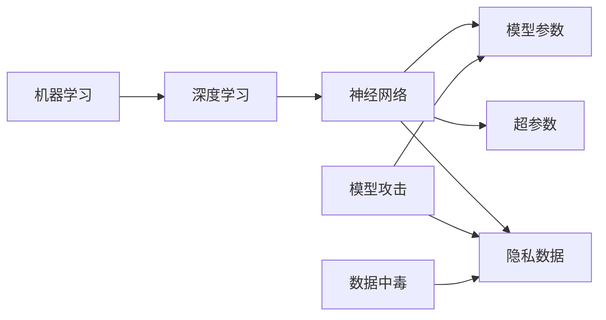

# AI模型安全与隐私保护原理与代码实战案例讲解

关键词：AI模型安全、隐私保护、数据隐私、模型攻击、联邦学习、同态加密、差分隐私

## 1. 背景介绍
### 1.1  问题的由来
随着人工智能技术的快速发展,AI模型在各行各业得到了广泛应用。然而,AI模型的安全和隐私问题日益突出。恶意攻击者可能会窃取模型参数、推断训练数据,甚至操纵模型输出,给个人隐私和社会安全带来巨大威胁。保护AI模型安全,确保用户隐私,已经成为AI领域亟待解决的重要课题。
### 1.2  研究现状
目前,学术界和工业界都在积极探索AI模型安全与隐私保护技术。谷歌、微软等科技巨头纷纷推出相关解决方案。学术方面,斯坦福大学、麻省理工等知名高校也在这一领域取得了诸多研究成果。总的来说,现有的AI模型安全与隐私保护技术主要包括联邦学习、同态加密、差分隐私等。但在实际应用中,仍面临诸多挑战。
### 1.3  研究意义 
AI模型安全与隐私保护研究对于推动人工智能健康发展具有重要意义。一方面,它可以保障用户隐私权益,增强公众对AI技术的信任;另一方面,它有利于规避AI系统的安全风险,促进AI应用落地。此外,相关研究还将带动密码学、隐私计算等领域的进步。总之,这一研究具有很高的理论价值和实践意义。
### 1.4  本文结构
本文将全面探讨AI模型安全与隐私保护技术。第2部分介绍相关核心概念;第3部分重点阐述几种主流算法原理;第4部分给出数学模型和公式推导;第5部分提供代码实例讲解;第6部分分析实际应用场景;第7部分推荐学习资源;第8部分总结全文并展望未来。希望通过本文,读者能够系统掌握AI模型安全与隐私保护的相关知识。

## 2. 核心概念与联系
在讨论AI模型安全与隐私保护之前,我们先来了解几个核心概念:

- 机器学习:让计算机系统从数据中自动分析获得规律,并利用规律对未知数据进行预测。
- 深度学习:机器学习的一个分支,通过构建深层神经网络,实现对复杂数据的高层抽象。
- 神经网络:一种模拟生物神经系统结构和功能的数学模型,由大量神经元节点互联组成。
- 模型参数:神经网络模型中各层连接权重矩阵、偏置向量等需要学习的变量。
- 超参数:神经网络结构、学习率等人为设定的参数,对模型性能有重要影响。
- 隐私数据:包含个人身份、行为等敏感信息的数据,如姓名、地址、医疗记录等。
- 模型攻击:恶意攻击者窃取、篡改模型,或利用模型漏洞进行恶意操控的行为。
- 数据中毒:在模型训练数据中掺入恶意数据,使训练出的模型具有特定的攻击行为。

这些概念之间关系紧密。机器学习特别是深度学习技术是AI模型的核心,而深度神经网络的安全和隐私问题尤为突出。攻击者可能窃取模型参数,推测隐私训练数据,甚至利用数据中毒等手段操纵模型。因此,亟需相关技术来保障AI模型安全,保护数据隐私。



## 3. 核心算法原理 & 具体操作步骤
### 3.1  算法原理概述
针对AI模型安全与隐私保护,业界提出了多种算法和架构。本节重点介绍联邦学习、同态加密和差分隐私三类主流技术。
### 3.2  算法步骤详解

#### 联邦学习
联邦学习(Federated Learning)是一种分布式机器学习范式。其核心思想是:参与方在本地训练模型,只共享模型参数而不共享原始数据,由中心服务器整合各方模型,生成全局模型。这样既可利用多方数据训练模型,又无需共享隐私数据。
典型的联邦学习算法如下:
1. 各参与方在本地利用自有数据训练模型,得到本地模型参数。 
2. 各参与方将本地模型参数发送给中心服务器。
3. 中心服务器汇总各方模型参数,更新全局模型。
4. 中心服务器将更新后的全局模型分发给各参与方。
5. 各参与方用全局模型替换本地模型,开始新一轮训练。
6. 重复以上步骤,直到全局模型收敛或达到预设轮数。

#### 同态加密
同态加密(Homomorphic Encryption)是一种特殊的加密方法,它允许直接对密文进行某些运算,得到的结果解密后与对明文进行同样运算的结果一致。利用同态加密技术,可以在加密数据上直接进行机器学习,从而保护数据隐私。
以加法同态加密为例,其算法步骤如下:
1. 数据拥有方用公钥对原始数据进行加密。
2. 数据使用方直接在密文上进行加法运算。
3. 将运算结果发送给数据拥有方。
4. 数据拥有方用私钥对结果解密,得到明文结果。

#### 差分隐私
差分隐私(Differential Privacy)通过在数据中注入随机噪声,使得单个样本对模型输出影响有限,从而保护个体隐私。设$\varepsilon$为隐私预算,$f$为随机算法,若对任意相邻数据集$D$和$D'$,满足:
$$
\Pr[f(D) \in S] \leq e^\varepsilon \Pr[f(D') \in S]
$$
则称$f$满足$\varepsilon$-差分隐私。$\varepsilon$越小,隐私保护程度越高,但数据可用性下降。
差分隐私的实现算法主要有:
1. Laplace机制:对函数$f$的输出添加服从$Lap(\Delta f/\varepsilon)$的噪声。
2. 指数机制:根据效用函数指数化选择输出,保护隐私的同时提高数据效用。
3. 梯度扰动:在分布式梯度下降过程中,对每个梯度添加Laplace噪声。

### 3.3  算法优缺点
联邦学习的优点是保护数据隐私,支持多方安全合作;缺点是通信开销大,算法设计复杂。
同态加密的优点是数据可以加密存储和使用;缺点是计算效率低,支持运算种类有限。
差分隐私的优点是数学定义严格,理论基础扎实;缺点是引入噪声损失了数据效用。

### 3.4  算法应用领域
联邦学习可用于多组织数据共享、金融风控、智慧医疗等。
同态加密可用于隐私数据存储、云端安全计算等。
差分隐私主要用于数据统计分析、发布等隐私保护场景。

## 4. 数学模型和公式 & 详细讲解 & 举例说明
### 4.1  数学模型构建
以下以联邦学习为例,给出其数学模型。假设有$K$个参与方,每方有$m_k$条数据。记$D_k$为第$k$方数据集,$w_k$为第$k$方模型参数,则全局模型参数$w$为:

$$
w = \sum_{k=1}^K \frac{m_k}{m} w_k
$$

其中$m=\sum_{k=1}^K m_k$为总样本数。可见,全局模型是各方模型的加权平均,权重为样本数占比。

### 4.2  公式推导过程
上述权重平均的全局模型,相当于最小化如下损失函数:

$$
\min_w \sum_{k=1}^K \frac{m_k}{m} F_k(w)
$$

其中$F_k(w)$为第$k$方数据在模型$w$上的经验风险,即:

$$
F_k(w) = \frac{1}{m_k} \sum_{i=1}^{m_k} f(w, x_i^k, y_i^k)
$$

这里$f$为样本损失函数,$(x_i^k, y_i^k)$为第$k$方第$i$个样本。可见,联邦学习的全局目标函数,就是各方经验风险的加权平均。

### 4.3  案例分析与讲解
下面以一个简单的例子直观说明联邦学习的运作过程。假设有两家医院A和B,各有一些糖尿病患者的诊疗数据。现在要训练一个预测糖尿病风险的模型,但两家医院都不愿共享原始数据。
可以采用如下联邦学习方案:
1. 医院A在本地数据上训练,得到模型参数$w_A$。
2. 医院B在本地数据上训练,得到模型参数$w_B$。 
3. 将$w_A$和$w_B$发送给第三方服务器。
4. 服务器计算全局模型$w = \frac{m_A}{m_A+m_B} w_A + \frac{m_B}{m_A+m_B} w_B$。
5. 服务器将$w$分发给医院A和B。
6. 两家医院用$w$替换本地模型,开始新一轮训练。
7. 多轮迭代后,得到最终的糖尿病风险预测模型。

在这个过程中,医院A和B都没有共享原始医疗数据,而是通过交换模型参数的方式合作训练,有效保护了患者隐私。

### 4.4  常见问题解答
Q: 联邦学习能否防止恶意参与方窃取隐私?
A: 单纯的联邦学习无法防止恶意参与方推断其他方隐私数据。需要引入安全多方计算、差分隐私等额外技术,提高隐私保护能力。

Q: 同态加密的效率如何?
A: 目前全同态加密的计算效率还较低,但半同态和近似同态加密在一些场景下已经较为实用。未来全同态加密有望在效率上取得重大突破。

Q: 差分隐私的隐私预算$\varepsilon$如何设置?
A: $\varepsilon$控制隐私保护强度和数据效用的平衡。$\varepsilon$越小,隐私保护越好,但加的噪声越多,数据失真也越大。$\varepsilon$的具体取值需要根据应用场景灵活权衡。

## 5. 项目实践：代码实例和详细解释说明
### 5.1  开发环境搭建
以下代码使用Python 3和TensorFlow 2实现。需要预先安装如下库:
```
!pip install tensorflow==2.4.0
!pip install tensorflow-federated==0.17.0
```

### 5.2  源代码详细实现
下面给出一个联邦学习的简单代码示例,在MNIST手写数字数据集上训练CNN模型。
```python
import tensorflow as tf
import tensorflow_federated as tff

# 定义CNN模型
def create_keras_model():
    model = tf.keras.models.Sequential([
        tf.keras.layers.Conv2D(32, (3, 3), activation='relu', input_shape=(28, 28, 1)), 
        tf.keras.layers.MaxPooling2D(pool_size=(2, 2)),
        tf.keras.layers.Conv2D(64, (3, 3), activation='relu'),
        tf.keras.layers.MaxPooling2D(pool_size=(2, 2)), 
        tf.keras.layers.Flatten(),
        tf.keras.layers.Dense(64, activation='relu'),
        tf.keras.layers.Dense(10, activation='softmax')
    ])
    return model

# 定义客户端训练过程
@tff.tf_computation(tf.float32)
def client_update(model, dataset, server_weights, client_optimizer):
    client_weights = model.trainable_variables
    tf.nest.map_structure(lambda x, y: x.assign(y), client_weights, server_weights)
    for batch in dataset:
        with tf.GradientTape() as tape:
            outputs = model(batch['x