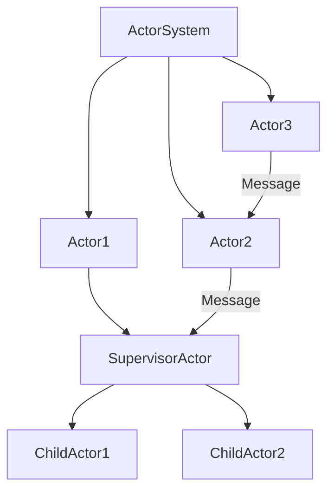

# Akka集群原理与代码实例讲解

关键词：Akka、Actor模型、分布式系统、容错、可伸缩性、集群

## 1. 背景介绍
### 1.1 问题的由来
在当今大数据时代，企业需要处理海量数据和高并发请求，单台服务器已无法满足性能和可靠性要求。传统的垂直扩展方式成本高昂，水平扩展面临开发复杂性问题。如何构建高可用、可伸缩的分布式系统成为亟待解决的难题。

### 1.2 研究现状
针对上述问题，业界已经开发出多种分布式计算框架，如Hadoop、Spark等。然而它们主要针对离线批处理场景，对于实时流处理还存在延迟高、吞吐量低等不足。Akka作为一个基于Actor模型的高性能分布式计算框架，凭借其异步、非阻塞、高容错等特性，在实时流处理领域得到越来越多的关注和应用。

### 1.3 研究意义
深入研究Akka集群原理，对于掌握构建高可用分布式系统的关键技术具有重要意义。通过学习Akka的Actor编程模型、容错机制、集群管理等核心功能，可以帮助开发人员快速上手开发出稳定高效的分布式应用，更好地应对海量数据、高并发等挑战。同时对Akka的原理进行剖析，也有助于读者理解分布式计算的一般方法论，开阔架构设计思路。

### 1.4 本文结构
本文将分为以下几个部分展开论述：

1. 介绍Akka的核心概念及其之间的关系，如Actor、消息、监管者等。 
2. 详细讲解Akka集群的工作原理，包括节点发现、成员管理、分布式数据等机制。
3. 通过数学模型和公式推导，分析Akka集群的容错性、一致性算法。
4. 给出Akka集群应用的代码实例，并解释其关键实现。
5. 总结Akka集群的实际应用场景和案例。
6. 推荐相关的学习资源和开发工具。
7. 展望Akka的未来发展趋势和面临的机遇与挑战。

## 2. 核心概念与联系

在深入理解Akka集群原理之前，我们有必要先了解一下Akka的几个核心概念：

- Actor：Akka的基本计算单元。Actor是一种轻量级的实体，它封装了状态和行为，通过异步消息与其他Actor通信。每个Actor有自己的邮箱，以及处理消息的方法。

- 消息：Actors之间通信的基本单位。消息是不可变的，可以是任意的数据类型，如字符串、数字、对象等。当一个Actor向另一个发送消息时，消息会被放入接收者的邮箱中依次处理。

- 监管者(Supervisor)：负责管理和协调其他Actors的特殊Actor。监管者定义了错误处理和恢复策略，可以监控子Actor的行为，并在异常发生时采取相应措施，如重启、停止等。这种"让它崩溃"的哲学，使得Akka具有很高的容错性。

- Actor系统(ActorSystem)：一个运行Actor的容器，提供了配置、日志等底层服务。一个应用可以包含多个ActorSystem，每个ActorSystem对应一个JVM进程。

下图展示了这些概念之间的关系：



可以看到，Actors组成了一个树形结构，顶层的ActorSystem负责创建和管理下层的Actors。Actors之间通过发送消息进行通信，形成一个松耦合的异步网络。这种分层监管的架构，使得错误可以被局部处理，避免了级联失败。

## 3. 核心算法原理 & 具体操作步骤
### 3.1 算法原理概述
Akka集群采用了Gossip协议来实现分布式节点管理。Gossip是一种去中心化、容错性好的节点间通信机制，通过定期交换节点状态信息，每个节点最终都能获得整个集群的全局视图。同时Akka还利用了改进的Phi Accrual Failure Detector算法来进行故障检测。

### 3.2 算法步骤详解
#### 3.2.1 节点发现与加入
1. 种子节点启动，开始监听其他节点的加入请求。
2. 新节点启动，向种子节点发送加入集群的请求。
3. 种子节点收到请求后，将新节点加入集群，并通知集群中其他节点。
4. 新节点收到回复后，开始与其他节点进行Gossip通信，交换节点状态信息。

#### 3.2.2 成员管理与故障检测
1. 每个节点维护一个成员列表，记录其他节点的状态（Up、Down等）。
2. 节点之间定期进行Gossip通信，随机选择一些节点交换节点状态信息。
3. 当节点收到Gossip消息后，更新自己的成员列表。如果发现新的节点加入或者宕机，则将变更通知给集群中其他节点。
4. 节点通过Phi Accrual Failure Detector来检测其他节点是否宕机。每个节点会独立地对其他节点进行"Ping-Ack"心跳检测，根据心跳响应时间计算可疑度，当可疑度超过一定阈值时，判定节点宕机，并更新成员列表。

### 3.3 算法优缺点
Gossip协议的优点在于：
- 去中心化，不存在单点故障。
- 容错性好，能够容忍一定数量的节点失效。
- 收敛速度快，节点状态变更可以快速传播到全网。

缺点是：
- 通信开销大，每个节点需要定期与其他节点通信同步状态。
- 一致性较弱，不同节点的状态视图可能存在短暂的不一致。

Phi Accrual Failure Detector的优点是：
- 可以动态调整检测时间，减少误判。
- 对网络抖动有较强的鲁棒性。

缺点是：
- 实现复杂度较高。
- 参数调优有一定难度，需要根据系统的延迟特性进行设置。

### 3.4 算法应用领域
- 分布式应用的高可用集群管理
- 分布式系统的故障检测与容错
- 大规模实时流处理系统的负载均衡与动态伸缩

## 4. 数学模型和公式 & 详细讲解 & 举例说明
### 4.1 数学模型构建
我们可以用一个简单的概率模型来分析Gossip协议的收敛速度。假设集群中有$n$个节点，每个节点以$p$的概率向其他节点发送Gossip消息。那么在第$k$轮Gossip交互后，任意节点获得某个节点状态变更信息的概率为：

$$
P(k) = 1 - (1 - p)^k
$$

可以看到，随着交互轮次$k$的增加，$P(k)$会快速收敛到1，即所有节点最终都会获得变更信息。

### 4.2 公式推导过程
上面的公式可以这样推导：

1. 在第1轮Gossip中，节点获得信息的概率为$p$。
2. 在第2轮Gossip中，节点要么在第1轮已经获得信息，要么在第2轮获得。这两个事件是互斥的，概率分别为$p$和$(1-p)p$，因此第2轮获得信息的概率为：

$$
P(2) = p + (1-p)p = 1 - (1-p)^2
$$

3. 以此类推，在第$k$轮Gossip后，节点仍未获得信息的概率为$(1-p)^k$，因此获得信息的概率为：

$$
P(k) = 1 - (1-p)^k
$$

### 4.3 案例分析与讲解
举个例子，假设集群中有100个节点，每个节点以30%的概率向其他节点发送Gossip消息，那么经过5轮Gossip后，任意节点获得某个状态变更信息的概率为：

$$
P(5) = 1 - (1 - 0.3)^5 \approx 83\%
$$

如果经过10轮Gossip，获得信息的概率将上升到97%以上。可见Gossip协议能够以较低的通信成本实现快速的信息传播。

### 4.4 常见问题解答
Q: Gossip收敛的速度如何？会受哪些因素影响？
A: Gossip的收敛速度主要取决于节点数量$n$和发送概率$p$。$n$越大，$p$越小，收敛速度越慢。此外，网络延迟和拓扑结构也会对Gossip的效率产生影响。

Q: Gossip能保证强一致性吗？
A: 不能。Gossip属于最终一致性，在一定时间后所有节点的状态最终会达成一致，但不能保证某个时刻所有节点的状态都是一致的。对于需要强一致性的场景，需要采用Paxos、Raft等共识算法。

## 5. 项目实践：代码实例和详细解释说明
下面我们通过一个简单的Akka集群应用，来演示如何使用Akka进行分布式计算。该应用由一个主节点和多个工作节点组成，主节点接收客户端请求，将任务分发给工作节点处理，并收集结果返回给客户端。

### 5.1 开发环境搭建
- 安装JDK 8+
- 安装sbt构建工具
- 安装Akka依赖库

### 5.2 源代码详细实现
#### 5.2.1 项目结构
```
src
 |-main
    |-java
        |-demo
            |-ClusterApp.java
            |-Master.java
            |-Worker.java
            |-WorkerTask.java
            |-TaskResult.java
```

#### 5.2.2 消息定义
首先定义Worker节点处理任务及返回结果的消息类型：

```java
public class WorkerTask implements Serializable {
    private final int taskId;
    private final String taskData;
    
    public WorkerTask(int taskId, String taskData) {
        this.taskId = taskId;
        this.taskData = taskData;
    }
    
    public int getTaskId() { return taskId; }
    
    public String getTaskData() { return taskData; }
}

public class TaskResult implements Serializable {
    private final int taskId;
    private final String result;
    
    public TaskResult(int taskId, String result) {
        this.taskId = taskId;
        this.result = result;
    }
    
    public int getTaskId() { return taskId; }
    
    public String getResult() { return result; }
}
```

#### 5.2.3 Worker节点
Worker节点负责接收任务，处理后返回结果给Master：

```java
public class Worker extends AbstractActor {
    
    @Override
    public Receive createReceive() {
        return receiveBuilder()
            .match(WorkerTask.class, this::handleTask)
            .build();
    }
    
    private void handleTask(WorkerTask task) {
        // 模拟执行任务
        String result = task.getTaskData() + " processed by worker";
        getSender().tell(new TaskResult(task.getTaskId(), result), getSelf());
    }
}
```

#### 5.2.4 Master节点
Master节点接收客户端请求，生成任务ID，选择一个Worker节点发送任务，并维护任务ID与客户端的映射关系。收到Worker的处理结果后，再返回给对应的客户端。

```java
public class Master extends AbstractActor {
    private final Map<Integer, ActorRef> taskIdToClientMap = new HashMap<>();
    private final Random random = new Random();
    
    @Override
    public Receive createReceive() {
        return receiveBuilder()
            .match(String.class, this::handleClientRequest)
            .match(TaskResult.class, this::handleTaskResult)
            .build();
    }
    
    private void handleClientRequest(String request) {
        int taskId = random.nextInt(10000);
        taskIdToClientMap.put(taskId, getSender());
        ActorRef worker = getContext().actorOf(Props.create(Worker.class));
        worker.tell(new WorkerTask(taskId, request), getSelf());
    }
    
    private void handleTaskResult(TaskResult result) {
        ActorRef client = taskIdToClientMap.remove(result.getTaskId());
        if (client != null) {
            client.tell(result.getResult(), getSelf());   
        }
    }
}
```

#### 5.2.5 主程序
最后，在主程序中启动Akka集群，并创建Master节点：

```