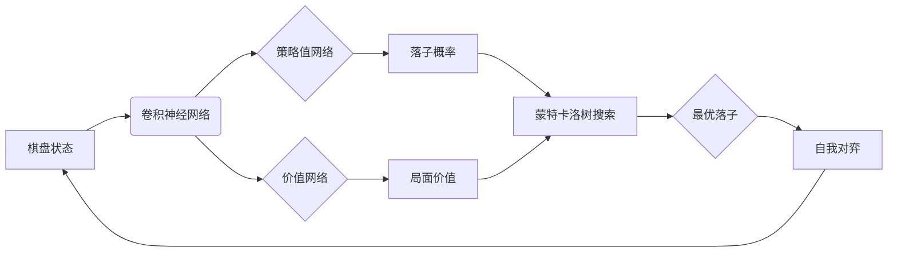

# AlphaGo原理与代码实例讲解

## 1. 背景介绍

### 1.1 问题的由来
自1997年IBM深蓝战胜国际象棋世界冠军卡斯帕罗夫以来,人工智能在棋类游戏领域不断取得突破。然而,围棋因其变化和复杂程度远超国际象棋,一直被视为人工智能的终极挑战。传统的基于搜索树的算法在围棋上难以取得好的效果。直到2016年,DeepMind公司开发的AlphaGo战胜了人类顶尖棋手,掀开了人工智能围棋的新篇章。

### 1.2 研究现状
AlphaGo的成功引发了学术界和产业界对深度学习和强化学习在棋类游戏中应用的广泛关注。此后,DeepMind又陆续推出了AlphaGo Zero、AlphaZero等更强大的版本,它们完全通过自我对弈学习,摆脱了人类知识的依赖。同时,腾讯、阿里等科技公司也纷纷推出了自己的围棋AI,并在比赛中取得优异成绩。当前,AlphaGo的思路已被广泛应用到国际象棋、日本将棋、星际争霸等其他游戏中。

### 1.3 研究意义
AlphaGo的突破不仅仅在于战胜人类棋手,更重要的意义在于它开创了一种通用的游戏AI框架。这种框架结合了深度学习、强化学习、蒙特卡洛树搜索等多种技术,可以在信息不完全、状态空间和动作空间巨大的复杂博弈问题中取得良好效果。研究AlphaGo的原理和实现,有助于我们理解和推动人工智能在博弈领域的最新进展,也为相关技术在其他决策优化问题上的应用提供了思路。

### 1.4 本文结构
本文将从以下几个方面对AlphaGo进行深入讲解:

- 第2部分介绍AlphaGo涉及的核心概念与技术之间的联系
- 第3部分讲解AlphaGo的核心算法原理及具体操作步骤
- 第4部分给出AlphaGo用到的数学模型和公式推导
- 第5部分提供AlphaGo的代码实例与详细解释说明
- 第6部分分析AlphaGo的实际应用场景
- 第7部分推荐AlphaGo相关的学习资源与工具
- 第8部分总结AlphaGo的研究成果、未来发展趋势与面临的挑战
- 第9部分列举AlphaGo的常见问题与解答

## 2. 核心概念与联系
AlphaGo融合了多种人工智能技术,主要包括:

- 深度学习(Deep Learning):通过类似人脑的神经网络结构,从大量数据中学习特征。AlphaGo使用卷积神经网络来提取棋盘特征。
- 强化学习(Reinforcement Learning):通过与环境的交互,在获得奖励或惩罚的反馈中学习最优策略。AlphaGo使用策略值网络和价值网络分别估计落子概率和局面价值。
- 蒙特卡洛树搜索(MCTS):一种启发式搜索方法,通过随机模拟来估计动作价值。AlphaGo将神经网络与MCTS相结合,大幅提升了搜索效率。
- 自我对弈(Self-Play):AlphaGo通过自己和自己下棋产生训练数据,在学习过程中不断进化和提高。

这些技术之间紧密结合,形成了AlphaGo的核心架构:



## 3. 核心算法原理 & 具体操作步骤

### 3.1 算法原理概述
AlphaGo的核心算法由以下几个部分组成:

1. 棋盘状态的卷积神经网络表示
2. 策略值网络预测每个合法落子的概率  
3. 价值网络估计当前局面对AlphaGo的胜率
4. 蒙特卡洛树搜索选择最优落子
5. 自我对弈生成训练数据并迭代更新网络  

### 3.2 算法步骤详解

#### 3.2.1 棋盘状态的卷积神经网络表示
- 将19x19的围棋棋盘转化为多个二值特征平面,例如:黑子位置、白子位置、上一步落子位置等。
- 使用多层卷积神经网络对特征平面进行处理,提取局部特征并组合为高级特征。

#### 3.2.2 策略值网络
- 策略值网络在卷积神经网络的基础上,添加若干全连接层,并在末端分支为两个头:策略头和价值头。  
- 策略头输出当前局面下每个合法落子的概率分布。
- 价值头输出当前局面对AlphaGo的胜率估计。
- 使用随机梯度下降算法训练策略值网络,损失函数包括交叉熵损失和均方误差损失。

#### 3.2.3 价值网络
- 价值网络与策略值网络结构类似,但没有策略头分支。
- 价值网络单独估计当前局面价值,作为蒙特卡洛树搜索的评估函数。
- 价值网络的训练数据来自策略值网络的自我对弈,标签为对局最终胜负。

#### 3.2.4 蒙特卡洛树搜索 
- 从根节点(当前局面)出发,通过选择、扩展、模拟、回传四个步骤搜索出最优落子。
- 选择:根据策略值网络的概率分布和节点统计信息,选择最有潜力的子节点。
- 扩展:如果选择的节点不是叶节点,则创建新的子节点。
- 模拟:从新扩展的节点开始,使用快速走子策略(如随机走子)模拟对局直到终局。  
- 回传:将模拟结果(胜负)反向传播更新路径上节点的统计信息。
- 多次迭代直到搜索预算耗尽,选择访问次数最多的落子。

#### 3.2.5 自我对弈
- AlphaGo的两个实例互相对弈,使用蒙特卡洛树搜索选择落子,直到终局。
- 将每一步的棋盘状态和落子概率作为策略值网络的训练样本。
- 将终局胜负作为价值网络的训练标签。
- 重复大量自我对弈,迭代更新策略值网络和价值网络。

### 3.3 算法优缺点
优点:
- 端到端学习,不依赖人工特征和领域知识
- 通过自我对弈生成海量训练数据
- 策略值网络与MCTS的结合大幅提升搜索效率
- 多次击败人类顶尖棋手,棋力超越此前所有围棋AI

缺点:  
- 训练需要庞大的计算资源和时间成本
- 模型复杂,可解释性较差
- 泛化能力有待进一步验证

### 3.4 算法应用领域
- 围棋、国际象棋、日本将棋等二人零和完全信息博弈游戏
- 扑克、麻将等不完全信息博弈游戏
- 机器人行动规划与控制
- 网络安全博弈(攻防对抗)
- 自动驾驶决策
- 药物发现与优化
- 智能电网调度
- 金融投资组合优化

## 4. 数学模型和公式 & 详细讲解 & 举例说明

### 4.1 数学模型构建
AlphaGo的数学模型主要包括:

1. 卷积神经网络:将棋盘状态$s$映射为特征表示$f(s)$
$$f(s) = \text{CNN}(s) \in \mathbb{R}^d$$

2. 策略值网络:在特征$f(s)$基础上预测落子概率分布$\mathbf{p}$和胜率$v$
$$\mathbf{p} = \text{softmax}(W_p f(s) + b_p) \in [0,1]^{19\times 19}$$
$$v = \sigma(W_v f(s) + b_v) \in [0,1]$$
其中$W_p, b_p, W_v, b_v$为可训练参数,$\sigma$为sigmoid激活函数。

3. 价值网络:单独预测局面价值$v$
$$v = V(s) = \sigma(W_V f(s) + b_V) \in [0,1]$$

4. 蒙特卡洛树搜索:基于节点统计信息$\{N(s,a), W(s,a), Q(s,a), P(s,a)\}$选择动作$a$,其中
- $N(s,a)$为节点访问次数
- $W(s,a)$为节点总奖励
- $Q(s,a)=\frac{W(s,a)}{N(s,a)}$为节点平均奖励
- $P(s,a)$为策略值网络给出的先验概率
- 动作选择公式:$a^* = \arg\max\limits_a \left( Q(s,a) + c P(s,a) \frac{\sqrt{\sum_b N(s,b)}}{1+N(s,a)}\right)$
- $c$为探索常数,控制探索与利用的权衡

### 4.2 公式推导过程

#### 4.2.1 交叉熵损失
策略值网络的策略头输出$\mathbf{p}$与训练标签$\mathbf{\pi}$(来自MCTS落子概率)的交叉熵损失为:
$$L_p(\theta) = -\sum_{s}\sum_a \pi(a|s) \log p(a|s;\theta)$$
其中$\theta$为策略值网络参数。

#### 4.2.2 均方误差损失 
价值网络输出$v$与训练标签$z$(来自对局胜负)的均方误差损失为:
$$L_v(\theta) = \sum_s (z - v(s;\theta))^2$$

#### 4.2.3 策略值网络训练
总损失为策略损失和价值损失的加权和:
$$L(\theta) = c_1 L_p(\theta) + c_2 L_v(\theta)$$
使用随机梯度下降算法更新参数$\theta$以最小化损失函数:
$$\theta \leftarrow \theta - \alpha \nabla_{\theta} L(\theta)$$
其中$\alpha$为学习率。

### 4.3 案例分析与讲解
以下是一个简化的案例来说明AlphaGo的决策过程:

1. 给定棋盘状态$s_0$:
```
   A B C D E
 1 . . . . . 
 2 . X . . .
 3 . . O . .
 4 . . . . .
 5 . . . . . 
```
其中X为黑子,O为白子,当前轮到黑方落子。

2. 使用卷积神经网络提取特征:
$$f(s_0) = \text{CNN}(s_0) \in \mathbb{R}^d$$

3. 策略值网络输出落子概率分布$\mathbf{p}$和胜率估计$v$:
$$\mathbf{p} = [0.1, 0.2, 0.05, 0.05, 0.6] \text{ (假设只考虑5个候选点)}$$
$$v = 0.65 \text{ (黑方胜率)}$$  

4. 基于$\mathbf{p}$和$v$进行MCTS搜索,假设搜索结果为:
```
   A   B   C   D   E
 1 13  24  8   9  46 
 2 5   62  11  8   14
 3 9   15  38  12  26
 4 7   11  9   13  60
 5 4   8   6   11  71
```
其中数字表示每个落子的访问次数$N(s,a)$。

5. 选择访问次数最多的E5作为最优落子。

6. 更新棋盘状态,进入下一回合,重复步骤2-5直到终局。

7. 完整对局产生的数据(棋盘状态、MCTS概率、胜负结果)用于训练策略值网络和价值网络。

### 4.4 常见问题解答
Q: AlphaGo需要多少训练数据?
A: AlphaGo通过自我对弈生成训练数据,论文报告使用了数百万局