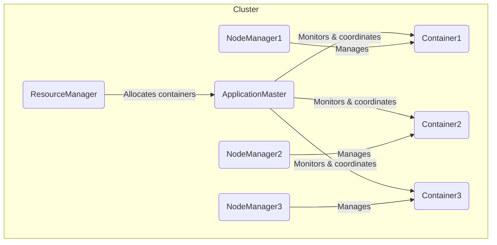

# ApplicationMaster 原理与代码实例讲解

## 1. 背景介绍

### 1.1 问题的由来

在大数据时代,海量数据的存储和计算成为了一个巨大的挑战。传统的单机系统已经无法满足现代大数据应用的需求,因此分布式计算框架应运而生。Apache Hadoop是最著名的开源大数据分布式计算框架之一,它采用了主从架构,由一个ResourceManager(RM)作为主节点,负责整个集群的资源管理和任务调度,而ApplicationMaster(AM)则作为从节点,负责具体任务的执行和监控。

### 1.2 研究现状 

ApplicationMaster是Hadoop YARN(Yet Another Resource Negotiator)架构中的关键组件,负责为每个提交到集群的应用程序协调和监控容器的资源使用情况。它是Hadoop生态系统中最核心和最复杂的组件之一,对于整个分布式计算框架的性能、可靠性和扩展性起着至关重要的作用。

目前,ApplicationMaster的研究主要集中在以下几个方面:

1. **资源管理和调度算法优化**:如何更高效地利用集群资源,提高资源利用率,减少资源浪费。
2. **容错性和可靠性增强**:提高ApplicationMaster的容错能力,确保任务在节点故障时能够自动恢复和迁移。
3. **安全性和隔离性加强**:保证ApplicationMaster的安全性,防止恶意代码攻击,并提供良好的任务隔离机制。
4. **可扩展性和性能优化**:提高ApplicationMaster的可扩展性,使其能够支持大规模集群和海量任务。

### 1.3 研究意义

ApplicationMaster作为Hadoop生态系统中最核心的组件之一,对于提高整个分布式计算框架的性能、可靠性和扩展性具有重要意义。优化ApplicationMaster不仅可以提高大数据应用的运行效率,还能降低运维成本,提高资源利用率,从而为企业带来巨大的经济价值。此外,ApplicationMaster的研究也将推动大数据技术的发展,为解决更多实际问题提供技术支持。

### 1.4 本文结构

本文将全面介绍ApplicationMaster的原理、算法、实现和应用。首先介绍ApplicationMaster的背景和核心概念,然后详细阐述其核心算法原理和数学模型,并通过代码实例讲解其具体实现过程。接下来,探讨ApplicationMaster在实际应用中的场景,并给出相关工具和学习资源的推荐。最后,总结ApplicationMaster的发展趋势和面临的挑战,并对未来的研究方向进行展望。

## 2. 核心概念与联系

ApplicationMaster是Hadoop YARN架构中的一个关键组件,它负责为每个提交到集群的应用程序协调和监控容器的资源使用情况。下面是一些核心概念:

1. **ResourceManager(RM)**: YARN集群的主节点,负责整个集群的资源管理和任务调度。
2. **NodeManager(NM)**: YARN集群的从节点,负责管理单个节点上的资源和容器。
3. **Container**: YARN中的资源抽象,表示一组可用的资源(CPU、内存等)。
4. **ApplicationMaster(AM)**: 为每个应用程序实例化,负责与RM协商获取容器资源,并监控和协调容器的执行。
5. **Application**: 提交到YARN集群的应用程序实例。

ApplicationMaster与其他组件的关系如下:

ApplicationMaster是应用程序与YARN集群交互的桥梁,它负责以下主要功能:

1. **资源协商**: 与ResourceManager协商,获取应用程序所需的容器资源。
2. **任务分发**: 将任务分发到获取的容器中执行。
3. **监控和跟踪**: 监控和跟踪容器的执行状态。
4. **容错处理**: 处理容器故障,并进行相应的恢复和重试操作。
5. **资源释放**: 在应用程序完成后,释放占用的资源。

ApplicationMaster的设计和实现直接影响着YARN集群的性能、可靠性和扩展性,因此它是Hadoop生态系统中最核心和最复杂的组件之一。

## 3. 核心算法原理 & 具体操作步骤

### 3.1 算法原理概述

ApplicationMaster的核心算法主要包括以下几个方面:

1. **资源请求算法**: 决定如何向ResourceManager请求资源。
2. **任务调度算法**: 决定如何将任务分发到获取的容器中执行。
3. **容错恢复算法**: 决定如何处理容器故障,并进行相应的恢复和重试操作。
4. **资源释放算法**: 决定如何在应用程序完成后释放占用的资源。

这些算法需要综合考虑多个因素,如应用程序的特点、集群的资源状况、容器的执行情况等,以实现高效的资源利用和任务执行。

### 3.2 算法步骤详解

#### 3.2.1 资源请求算法

ApplicationMaster向ResourceManager请求资源的过程如下:

1. **初始化**: ApplicationMaster启动时,向ResourceManager注册自己,并获取集群的资源信息。
2. **资源评估**: 根据应用程序的需求和集群的资源状况,评估需要请求的资源数量和规格。
3. **资源请求**: 向ResourceManager发送资源请求。
4. **资源分配**: ResourceManager根据集群的资源状况,分配可用的容器资源给ApplicationMaster。
5. **资源获取**: ApplicationMaster获取分配的容器资源。
6. **重复步骤2-5**: 根据应用程序的执行情况,重复步骤2-5,动态地请求和获取资源。

#### 3.2.2 任务调度算法

ApplicationMaster将任务分发到获取的容器中执行的过程如下:

1. **任务划分**: 将应用程序的整体任务划分为多个可并行执行的子任务。
2. **资源匹配**: 根据子任务的资源需求,匹配合适的容器资源。
3. **任务分发**: 将子任务分发到匹配的容器中执行。
4. **执行监控**: 监控容器的执行情况,包括进度、状态等。
5. **结果收集**: 收集和汇总各个容器的执行结果。
6. **重试或继续**: 如果有容器执行失败,进行重试或继续执行其他子任务。

#### 3.2.3 容错恢复算法

当容器执行出现故障时,ApplicationMaster需要进行容错恢复操作:

1. **故障检测**: 通过监控容器的执行情况,检测到容器故障。
2. **故障原因分析**: 分析容器故障的原因,如硬件故障、网络故障等。
3. **恢复策略选择**: 根据故障原因和应用程序的特点,选择合适的恢复策略,如重试、迁移或终止等。
4. **恢复操作执行**: 执行选定的恢复策略,如重新分发任务、请求新的容器资源等。
5. **监控恢复过程**: 监控恢复操作的执行情况,确保任务能够成功恢复。

#### 3.2.4 资源释放算法

当应用程序执行完成后,ApplicationMaster需要释放占用的资源:

1. **结果验证**: 验证应用程序的执行结果是否满足要求。
2. **资源统计**: 统计应用程序占用的所有容器资源。
3. **资源释放**: 向ResourceManager发送释放资源的请求,释放占用的容器资源。
4. **状态更新**: 更新ApplicationMaster的状态为"完成"。
5. **清理操作**: 执行必要的清理操作,如删除临时文件、释放内存等。

### 3.3 算法优缺点

ApplicationMaster的核心算法具有以下优点:

1. **高效利用资源**: 通过动态请求和分配资源,可以高效利用集群的资源。
2. **良好的容错能力**: 具有容错恢复机制,能够处理容器故障,提高应用程序的可靠性。
3. **灵活的任务调度**: 可以根据应用程序的特点和资源状况,灵活地调度任务。
4. **资源隔离和安全**: 通过容器的资源隔离机制,可以保证应用程序的安全性。

但是,这些算法也存在一些缺点:

1. **算法复杂度高**: 需要综合考虑多个因素,算法实现较为复杂。
2. **资源开销较大**: 维护ApplicationMaster和容器的运行需要一定的资源开销。
3. **调度延迟**: 在资源紧张的情况下,任务调度可能会出现延迟。
4. **可扩展性挑战**: 在大规模集群和海量任务的情况下,可扩展性面临挑战。

### 3.4 算法应用领域

ApplicationMaster的核心算法可以应用于以下领域:

1. **大数据处理**: ApplicationMaster是Hadoop生态系统中最核心的组件,广泛应用于大数据处理领域。
2. **科学计算**: 科学计算任务通常需要大量的计算资源,ApplicationMaster可以高效地管理和调度这些资源。
3. **云计算**: 在云计算环境中,ApplicationMaster可以用于管理和调度虚拟机资源。
4. **机器学习**: 机器学习任务通常需要大量的数据和计算资源,ApplicationMaster可以提供资源管理和调度支持。

## 4. 数学模型和公式 & 详细讲解 & 举例说明

ApplicationMaster的核心算法涉及多个数学模型和公式,下面将详细讲解其中的几个重要模型和公式。

### 4.1 数学模型构建

#### 4.1.1 资源请求模型

资源请求模型描述了ApplicationMaster向ResourceManager请求资源的过程。我们使用一个优化问题来建模:

$$
\begin{aligned}
\max\quad & U(R) \\
\text{s.t.}\quad & R \leq R_\text{available} \\
& R \geq R_\text{min}
\end{aligned}
$$

其中:

- $U(R)$是一个效用函数,表示分配资源$R$时的效用。
- $R_\text{available}$是集群中可用的资源量。
- $R_\text{min}$是应用程序所需的最小资源量。

目标是在满足应用程序最小资源需求的前提下,最大化资源分配的效用。效用函数$U(R)$可以根据具体的应用程序特点和资源利用策略来定义。

#### 4.1.2 任务调度模型

任务调度模型描述了如何将任务分发到获取的容器中执行。我们使用一个约束优化问题来建模:

$$
\begin{aligned}
\min\quad & T_\text{total} \\
\text{s.t.}\quad & \sum_{i=1}^{n} x_{ij} = 1,\quad j = 1,2,\ldots,m \\
& \sum_{j=1}^{m} r_{ij}x_{ij} \leq R_i,\quad i = 1,2,\ldots,n \\
& x_{ij} \in \{0, 1\}
\end{aligned}
$$

其中:

- $T_\text{total}$是完成所有任务所需的总时间。
- $n$是容器的数量,编号为$1,2,\ldots,n$。
- $m$是任务的数量,编号为$1,2,\ldots,m$。
- $x_{ij}$是一个二值变量,表示任务$j$是否分配给容器$i$。
- $r_{ij}$是任务$j$在容器$i$上所需的资源量。
- $R_i$是容器$i$的可用资源量。

目标是最小化完成所有任务所需的总时间,同时满足每个任务只能分配给一个容器,以及每个容器的资源使用量不超过可用资源量的约束条件。

### 4.2 公式推导过程

#### 4.2.1 资源请求公式

在资源请求模型中,我们可以定义一个简单的效用函数:

$$
U(R) = \alpha \cdot \frac{R}{R_\text{max}} - \beta \cdot \frac{R_\text{max} - R}{R_\text{max}}