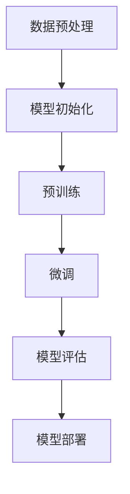

以下是对《ChatGPT背后的推手——OpenAI》这一主题的技术博客文章正文部分的撰写。

# ChatGPT背后的推手——OpenAI

## 1. 背景介绍

### 1.1 问题的由来

在过去的几十年里,人工智能(AI)的发展经历了起起伏伏。从20世纪60年代的"寒冬期"到近年来的"智能春天",AI技术的突破和应用已经渗透到了我们生活的方方面面。而推动这一进程的,正是一些顶尖的AI公司和研究机构。其中,OpenAI无疑是最具影响力和代表性的存在之一。

作为一家非营利性AI研究公司,OpenAI自2015年成立以来,就一直致力于确保人工智能的安全和受益于全人类。他们的愿景是"发现并传播那些可以帮助世界和未来的真理"。而OpenAI最新推出的大型语言模型ChatGPT,正是这一愿景的最新体现。

### 1.2 研究现状 

ChatGPT是一种基于Transformer架构的大型语言模型,经过了大规模的预训练,可以在各种自然语言处理任务上表现出惊人的能力。从写作、编程到问答、分析等,ChatGPT展现出了人类水平的语言理解和生成能力。

自从2022年11月首次对外开放以来,ChatGPT迅速在全球引发了热潮。无论是普通用户还是专业人士,都被其出色的表现所折服。与此同时,ChatGPT也引发了人们对AI潜在风险的担忧和讨论。

### 1.3 研究意义

作为推出ChatGPT的公司,深入研究OpenAI的发展历程、核心技术和运作模式,对于我们理解当前人工智能的发展现状和未来趋势,都有着重要的意义。

通过本文的分析,我们可以揭示OpenAI成功的关键因素,了解其在大型语言模型等前沿AI技术方面的创新,以及在确保AI安全和受益人类方面的独特理念。同时,OpenAI在技术、商业和伦理层面所面临的挑战,也值得我们深入探讨。

### 1.4 本文结构  

本文将从以下几个方面全面介绍OpenAI及其代表作ChatGPT:

1. 背景介绍
2. OpenAI的核心理念和发展历程
3. ChatGPT的核心技术原理
4. ChatGPT的应用场景和影响
5. OpenAI的商业模式和融资情况 
6. OpenAI在伦理和AI安全方面的探索
7. OpenAI面临的挑战和未来展望

## 2. 核心概念与联系

在深入探讨OpenAI和ChatGPT之前,我们有必要先了解一些核心概念,它们贯穿于整个人工智能领域,也是OpenAI所关注和推进的重点方向。

### 2.1 人工智能(Artificial Intelligence)

人工智能指通过使用算法赋予机器"智能",使其能够模仿人类的感知、学习、推理和决策等认知功能。人工智能的目标是创造出能够执行特定任务的"智能系统"。

根据任务的不同,人工智能可以分为以下几种主要类型:

1. **机器学习(Machine Learning)**: 通过利用数据,使计算机系统能够自主学习和提高性能,而无需显式编程。
2. **深度学习(Deep Learning)**: 一种基于人工神经网络的机器学习技术,通过对数据的模式进行建模,可以解决复杂的问题,如计算机视觉和自然语言处理等。
3. **自然语言处理(Natural Language Processing)**: 使计算机能够理解和生成人类语言的技术。
4. **计算机视觉(Computer Vision)**: 使计算机能够从图像或视频中获取有意义的信息。

OpenAI主要集中在机器学习和深度学习等领域,尤其是在大型语言模型和自然语言处理方面做出了卓越贡献。

### 2.2 大型语言模型(Large Language Model)

大型语言模型是一种基于深度学习的自然语言处理模型,通过在大量文本数据上进行预训练,学习语言的统计规律和语义关系。经过预训练后,这些模型可以在下游任务上进行微调,展现出优秀的语言理解和生成能力。

目前,主流的大型语言模型架构包括:

1. **Transformer**: 由Google提出,使用注意力机制建模长期依赖关系,成为当前主流架构。
2. **GPT(Generative Pre-trained Transformer)**: 由OpenAI提出,基于Transformer,采用自回归语言模型进行预训练。
3. **BERT(Bidirectional Encoder Representations from Transformers)**: 由Google提出,使用Masked Language Model预训练,在下游任务中表现优异。

ChatGPT正是基于GPT架构训练的大型语言模型,在自然语言生成、理解和任务完成等方面展现出了强大的能力。

### 2.3 机器伦理(Machine Ethics)

随着人工智能系统的不断发展和应用,确保其安全性和受益人类就变得越来越重要。机器伦理旨在研究赋予人工智能系统道德价值观和行为准则,使其能够做出符合伦理的决策。

机器伦理涉及以下几个主要方面:

1. **价值对齐(Value Alignment)**: 确保人工智能系统的目标和行为与人类的价值观相一致。
2. **安全性(Safety)**: 防止人工智能系统产生意外或有害的行为。
3. **可解释性(Interpretability)**: 使人工智能系统的决策过程可解释和透明。
4. **隐私和公平性(Privacy and Fairness)**: 保护个人隐私,避免歧视和不公平对待。

作为一家负责任的AI公司,OpenAI非常重视机器伦理的研究和实践,并将其融入到了产品和服务的开发中。

### 2.4 概念关联

人工智能、大型语言模型和机器伦理三者之间存在着紧密的联系:

1. 大型语言模型是人工智能领域的一个重要分支,代表了自然语言处理技术的最新进展。
2. 随着大型语言模型能力的不断提高,确保其安全性和符合伦理准则就变得越来越重要,这正是机器伦理所关注的核心问题。
3. OpenAI在推进大型语言模型技术的同时,也在积极探索如何将机器伦理的理念融入到产品和服务中,以确保AI的受益于人类。

这三个概念的交汇,正是OpenAI所追求的目标,也是本文探讨的核心主题。

## 3. 核心算法原理 & 具体操作步骤

### 3.1 算法原理概述

ChatGPT是一种基于Transformer架构的大型语言模型,采用了GPT(Generative Pre-trained Transformer)的预训练方式。其核心算法原理可以概括为以下几个方面:

1. **自注意力机制(Self-Attention Mechanism)**

   Transformer架构中的自注意力机制,能够有效地捕捉输入序列中任意两个位置之间的依赖关系,从而更好地建模长期依赖。这使得模型能够更好地理解和生成长文本。

2. **自回归语言模型(Autoregressive Language Model)**

   GPT采用自回归语言模型的预训练方式,即在训练时,模型需要根据前面的文本来预测下一个词。这种方式使得模型能够很好地捕捉语言的顺序性和语义关系,从而生成更加连贯和自然的文本。

3. **大规模预训练(Large-Scale Pre-training)**

   ChatGPT使用了大量的文本数据进行预训练,包括网页、书籍、论文等多种来源。通过在大量数据上学习语言的统计规律和语义关系,模型能够获得强大的语言理解和生成能力。

4. **微调(Fine-tuning)**

   在预训练的基础上,ChatGPT还会在特定任务的数据集上进行微调,进一步提高模型在该任务上的性能。这种"预训练+微调"的范式,已经成为当前大型语言模型的主流训练方式。

### 3.2 算法步骤详解

ChatGPT的训练过程主要包括以下几个步骤:

1. **数据预处理**

   首先需要收集和清洗大量的文本数据,包括网页、书籍、论文等多种来源。然后将这些数据转换为模型可以识别的格式,例如将文本分词、构建词表等。

2. **模型初始化**

   初始化一个基于Transformer架构的GPT模型,设置模型参数、超参数等。

3. **预训练**

   使用预处理后的大量文本数据,对GPT模型进行自监督的预训练。预训练的目标是最大化模型在给定前文的情况下,正确预测下一个词的概率。预训练过程通常需要消耗大量的计算资源。

4. **微调**

   在预训练的基础上,根据具体的下游任务(如问答、文本生成等),使用相应的数据集对模型进行进一步的微调,以提高模型在该任务上的性能。

5. **模型评估**

   在验证集或测试集上评估微调后模型的性能,包括使用各种指标(如困惑度、BLEU分数等)进行量化评估,以及人工评估生成文本的质量。

6. **模型部署**

   如果模型的性能满足要求,就可以将其部署到生产环境中,用于实际的应用场景。

需要注意的是,由于ChatGPT模型的巨大规模,其训练过程需要消耗大量的计算资源和时间。OpenAI拥有强大的算力支持,这也是他们能够训练出如此优秀的大型语言模型的关键因素之一。

### 3.3 算法优缺点

ChatGPT作为一种基于Transformer的大型语言模型,具有以下优缺点:

**优点**:

1. **强大的语言理解和生成能力**:通过预训练和微调,ChatGPT能够在各种自然语言处理任务上表现出接近人类的水平。
2. **长期依赖建模**:自注意力机制使得模型能够有效捕捉长期依赖关系,从而更好地理解和生成长文本。
3. **无监督学习**:预训练过程中采用无监督学习,不需要人工标注数据,可以利用大量的原始文本数据。
4. **可迁移性强**:预训练后的模型可以在不同的下游任务上进行微调,展现出良好的迁移学习能力。

**缺点**:

1. **训练成本高**:训练大型语言模型需要消耗大量的计算资源和时间,对硬件和算力要求很高。
2. **缺乏常识推理能力**:虽然模型具有强大的语言能力,但缺乏对世界的常识性理解和推理能力。
3. **可解释性差**:模型的内部工作机制较为黑箱,决策过程缺乏可解释性。
4. **潜在的安全和伦理风险**:如果模型生成的内容存在偏差或不当之处,可能会产生负面影响。

总的来说,ChatGPT展现出了大型语言模型在自然语言处理领域的巨大潜力,但也存在一些需要解决的挑战和风险。

### 3.4 算法应用领域

基于强大的语言理解和生成能力,ChatGPT及其相关算法可以应用于多个领域:

1. **自然语言处理**:包括机器翻译、文本摘要、语义分析、问答系统等。
2. **内容创作**:可用于辅助写作、创作故事、编写新闻等。
3. **智能助手**:可以作为对话式的智能助手,为用户提供信息查询、任务规划等服务。
4. **教育和学习**:可以用于自适应教育、个性化学习等场景。
5. **客户服务**:可以为客户提供自动化的问答和服务支持。
6. **代码生成**:可以根据需求自动生成代码,提高开发效率。

当然,ChatGPT及其算法也存在一些局限性,比如缺乏常识推理能力、可解释性差等,因此在实际应用中还需要进一步改进和完善。

## 4. 数学模型和公式 & 详细