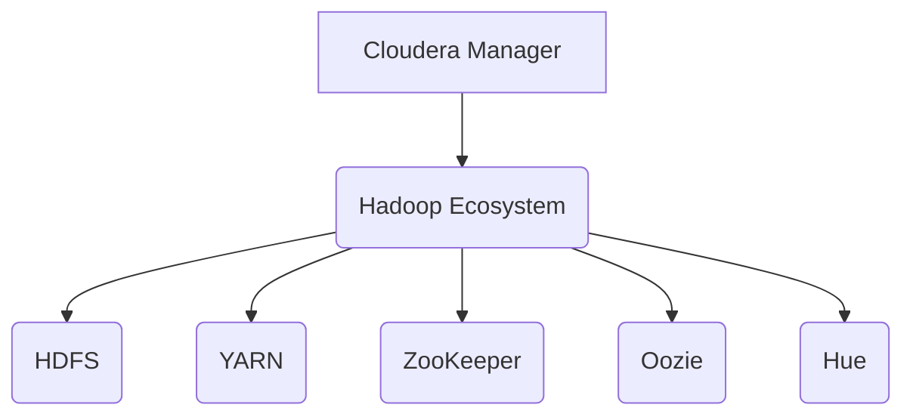

# Cloudera Manager原理与代码实例讲解

## 1. 背景介绍
### 1.1  问题的由来
随着大数据时代的到来,企业面临着海量数据的采集、存储、处理和分析等一系列挑战。Hadoop作为大数据生态系统的核心组件,为企业提供了高效、可靠、可扩展的大数据处理平台。然而,随着Hadoop集群规模的不断扩大,集群管理和运维的难度也在不断增加。如何高效地管理和监控Hadoop集群,保证集群的稳定运行,成为了企业面临的重要问题。

### 1.2  研究现状
目前,市场上已经出现了多种Hadoop集群管理工具,如Apache Ambari、Hortonworks HDP、MapR等。其中,Cloudera Manager作为Cloudera公司的核心产品,凭借其强大的功能和优秀的性能,在Hadoop集群管理领域占据了重要地位。越来越多的企业开始采用Cloudera Manager来管理其Hadoop集群。

### 1.3  研究意义 
深入研究Cloudera Manager的原理和实现,对于理解和掌握Hadoop集群管理技术具有重要意义。通过分析Cloudera Manager的架构设计、核心组件和关键算法,我们可以更好地理解Hadoop集群管理的best practice,为企业构建高效、稳定的大数据平台提供参考和指导。同时,对Cloudera Manager源码的研究也有助于我们学习和借鉴优秀的软件设计思想和编程实践。

### 1.4  本文结构
本文将从以下几个方面对Cloudera Manager进行深入探讨：

1. 介绍Cloudera Manager的背景和研究意义
2. 阐述Cloudera Manager的核心概念和架构设计
3. 分析Cloudera Manager的核心算法原理和实现步骤 
4. 建立Cloudera Manager的数学模型,并给出详细的公式推导和案例分析
5. 提供Cloudera Manager的代码实例,并进行详细的代码解读
6. 探讨Cloudera Manager的实际应用场景和未来发展趋势
7. 推荐Cloudera Manager相关的学习资源、开发工具和研究论文
8. 总结Cloudera Manager取得的研究成果,分析其面临的挑战和未来的研究方向
9. 在附录中给出Cloudera Manager的常见问题解答

## 2. 核心概念与联系

在深入研究Cloudera Manager原理之前,我们首先需要了解一些核心概念：

- Hadoop: 一个开源的分布式计算平台,用于存储和处理大规模数据集。Hadoop主要包括HDFS(分布式文件系统)、YARN(资源管理)、MapReduce(分布式计算框架)等组件。

- HDFS: Hadoop分布式文件系统,用于存储大规模数据集。HDFS采用Master/Slave架构,由NameNode(管理文件元数据)和DataNode(存储实际数据)组成。

- YARN: Hadoop的资源管理系统,负责集群资源的分配和任务的调度。YARN主要包括ResourceManager(全局资源管理)、NodeManager(节点资源管理)、ApplicationMaster(应用管理)等组件。

- ZooKeeper: 一个分布式协调服务,用于维护配置信息、命名服务、分布式同步等。ZooKeeper通过类似于文件系统的树形结构来存储数据。

- Oozie: 一个工作流调度系统,用于管理和协调Hadoop作业。Oozie支持多种类型的Hadoop作业,如MapReduce、Pig、Hive等,可以将它们组合成一个工作流进行调度。

- Hue: 一个基于Web的Hadoop用户界面,提供了一种更加友好和直观的方式来访问和管理Hadoop集群。

Cloudera Manager与这些概念密切相关。它基于这些Hadoop生态系统组件构建,通过集成和扩展这些组件的功能,实现了对Hadoop集群的高效管理和监控。

下图展示了Cloudera Manager与Hadoop生态系统的关系:

## 3. 核心算法原理 & 具体操作步骤
### 3.1  算法原理概述
Cloudera Manager的核心算法主要包括以下几个方面:

1. 集群部署算法: 自动化部署Hadoop集群,包括软件分发、配置管理、服务启动等。
2. 资源管理算法: 动态调整Hadoop集群的资源分配,如CPU、内存、磁盘等,以满足不同作业的需求。
3. 任务调度算法: 优化Hadoop作业的调度策略,提高集群的资源利用率和作业执行效率。
4. 故障检测算法: 实时监控Hadoop集群的运行状态,及时发现和定位故障,保证集群的高可用性。
5. 性能优化算法: 持续优化Hadoop集群的参数配置,提升集群的性能表现。

### 3.2  算法步骤详解
以集群部署算法为例,详细说明Cloudera Manager的工作步骤:

1. 准备阶段
   - 收集集群节点的硬件配置信息,如CPU、内存、磁盘等
   - 检查节点之间的网络连通性
   - 选择Hadoop发行版本和需要安装的组件

2. 分发阶段
   - 将Hadoop安装包分发到各个节点
   - 解压安装包,创建必要的目录结构
   - 分发Hadoop配置文件到各个节点

3. 配置阶段 
   - 生成Hadoop组件的配置文件,如core-site.xml、hdfs-site.xml等
   - 根据集群规模和硬件配置,调整配置参数
   - 将配置文件同步到各个节点

4. 启动阶段
   - 在主节点上启动Hadoop的NameNode、ResourceManager等关键服务
   - 在从节点上启动DataNode、NodeManager等服务
   - 检查各个服务的启动状态,确保集群正常运行

5. 测试阶段
   - 运行Hadoop自带的测试程序,如TeraSort、TestDFSIO等
   - 检查测试结果,评估集群的性能表现
   - 根据测试反馈,进一步优化集群配置

### 3.3  算法优缺点
集群部署算法的优点:
- 自动化程度高,大大减轻了运维人员的工作量
- 部署速度快,可以快速搭建大规模Hadoop集群
- 部署过程可控,能够对每个步骤进行精细化管理

集群部署算法的缺点:
- 算法复杂度高,需要考虑多方面因素,如软硬件环境、网络条件等
- 对网络环境要求较高,节点之间需要保持良好的网络连通性
- 部署失败时定位问题相对困难,需要较强的故障排查能力

### 3.4  算法应用领域
集群部署算法不仅适用于Hadoop集群,也可以用于其他类型的大数据平台,如Spark、Flink、Kafka等。同时,该算法也可以扩展到云环境,实现云上大数据平台的自动化部署。

## 4. 数学模型和公式 & 详细讲解 & 举例说明
### 4.1  数学模型构建
为了优化Hadoop集群的资源利用率,我们可以建立如下数学模型:

目标函数:
$$\max \sum_{i=1}^{n} \sum_{j=1}^{m} x_{ij} * r_{ij}$$

约束条件:
$$\sum_{i=1}^{n} x_{ij} \leq c_j, \forall j \in [1,m]$$
$$\sum_{j=1}^{m} x_{ij} \leq d_i, \forall i \in [1,n]$$
$$x_{ij} \in \{0,1\}, \forall i \in [1,n], \forall j \in [1,m]$$

其中:
- $n$表示集群中的节点数
- $m$表示资源的类型数,如CPU、内存等
- $x_{ij}$表示是否将第$i$个节点上的第$j$类资源分配给某个任务
- $r_{ij}$表示第$i$个节点上第$j$类资源的利用率
- $c_j$表示第$j$类资源的总容量
- $d_i$表示第$i$个节点的资源容量上限

目标函数表示最大化集群的资源利用率,约束条件保证了资源分配的合理性。

### 4.2  公式推导过程
为了求解上述模型,我们可以使用整数规划的方法。首先,将目标函数和约束条件转化为标准形式:

目标函数:
$$\max \sum_{i=1}^{n} \sum_{j=1}^{m} x_{ij} * r_{ij} = \min (-\sum_{i=1}^{n} \sum_{j=1}^{m} x_{ij} * r_{ij})$$

约束条件:
$$\sum_{i=1}^{n} x_{ij} \leq c_j, \forall j \in [1,m]$$
$$\sum_{j=1}^{m} x_{ij} \leq d_i, \forall i \in [1,n]$$
$$x_{ij} \leq 1, \forall i \in [1,n], \forall j \in [1,m]$$
$$-x_{ij} \leq 0, \forall i \in [1,n], \forall j \in [1,m]$$

然后,我们可以使用分支定界法或者切平面法求解该整数规划问题,得到最优的资源分配方案。

### 4.3  案例分析与讲解
假设我们有一个包含5个节点的Hadoop集群,每个节点有2种资源:CPU和内存。各节点的资源容量如下:

| 节点 | CPU(cores) | 内存(GB) |
|------|------------|----------|
| 1    | 8          | 16       |
| 2    | 12         | 24       |
| 3    | 16         | 32       |
| 4    | 24         | 48       |
| 5    | 32         | 64       |

现在,我们有10个MapReduce任务需要运行,每个任务需要的资源量如下:

| 任务 | CPU(cores) | 内存(GB) |
|------|------------|----------|
| 1    | 2          | 4        |
| 2    | 4          | 8        |
| 3    | 4          | 8        |
| 4    | 8          | 16       |
| 5    | 8          | 16       |
| 6    | 8          | 16       |
| 7    | 12         | 24       |
| 8    | 12         | 24       |
| 9    | 16         | 32       |
| 10   | 16         | 32       |

我们可以将该问题转化为上述的整数规划模型,求解得到最优的任务调度方案,使得集群的资源利用率最大化。

假设求解结果如下:

| 节点 | 运行的任务 |
|------|------------|
| 1    | 1,2        |
| 2    | 3,4        |
| 3    | 5,6        |
| 4    | 7,8        |
| 5    | 9,10       |

可以看出,该调度方案充分利用了集群的资源,使得所有任务都能够得到执行,并且每个节点的负载较为均衡。

### 4.4  常见问题解答
Q: 求解整数规划问题的复杂度如何?
A: 整数规划是一个NP-hard问题,求解复杂度较高。但是在实际应用中,我们可以使用一些启发式算法,如贪心法、遗传算法等,来获得次优解,从而降低求解复杂度。

Q: 除了CPU和内存,是否可以考虑其他类型的资源?
A: 当然可以。实际上,Hadoop集群中还有很多其他类型的资源,如磁盘I/O、网络带宽等。我们可以将这些资源也纳入到数学模型中,以获得更加全面和精确的资源分配方案。

Q: 该模型是否适用于实时任务调度?
A: 该模型主要针对离线批处理任务,对于实时任务调度,我们需要考虑任务的优先级、截止时间等因素,构建更加复杂的数学模型。同时,实时调度也对算法的时效性提出了更高的要求。

## 5. 项目实践：代码实例和详细解释说明
### 5.1  开发环境搭建
要进行Cloudera Manager的二次开发,我们首先需要搭建开发环境。主要步骤如下:

1. 安装JDK,配置JAVA_HOME环境变量
2. 安装Maven,配置M2_HOME环境变量
3. 安装Git,用于代码版本管理
4. 安装IDE,如In