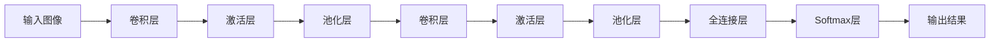

# Convolutional Neural Network

作者：禅与计算机程序设计艺术 / Zen and the Art of Computer Programming

## 1. 背景介绍

### 1.1 问题的由来
近年来,随着人工智能技术的飞速发展,深度学习已经成为了当前最热门的研究方向之一。而在深度学习领域,卷积神经网络(Convolutional Neural Network, CNN)以其出色的性能,在计算机视觉、语音识别、自然语言处理等诸多领域取得了突破性的进展。CNN通过局部感受野、权值共享、池化等操作,能够有效地提取数据中的特征,具有很强的特征学习和表示能力。

### 1.2 研究现状
目前,CNN已经成为计算机视觉领域的主流算法。从2012年AlexNet在ImageNet图像分类竞赛中大放异彩,到近些年ResNet、Inception等网络的出现,CNN的性能不断刷新着纪录。在工业界,谷歌、Facebook等科技巨头纷纷投入大量资源研究CNN,将其应用到自家的产品中。学术界对CNN的研究热情也持续高涨,CVPR、ICCV等顶级会议每年都有大量关于CNN的论文发表。

### 1.3 研究意义
CNN强大的特征提取能力,使其在很多领域都有着广泛的应用前景。深入研究CNN的原理,对算法进行改进和优化,将有助于进一步提升其性能,拓展其应用范围。此外,对CNN的探索也有利于加深我们对人类视觉机理的理解,为揭开大脑工作的奥秘提供新的视角。

### 1.4 本文结构
本文将从以下几个方面对CNN进行深入探讨:
- 第2部分介绍CNN的核心概念以及各概念之间的联系
- 第3部分讲解CNN的核心算法原理,并给出详细的操作步骤
- 第4部分建立CNN的数学模型,推导相关公式,并结合实例进行说明
- 第5部分通过代码实践,演示如何使用Python实现一个CNN模型
- 第6部分总结CNN在图像分类、目标检测、人脸识别等领域的应用场景
- 第7部分推荐一些学习CNN的资源,包括数据集、开源框架、论文等
- 第8部分对CNN的研究现状进行总结,展望其未来的发展趋势和面临的挑战
- 第9部分列出一些关于CNN的常见问题,并给出解答

## 2. 核心概念与联系

CNN主要由以下5个核心概念构成:

1. 卷积层(Convolutional Layer):对输入特征图进行卷积操作,提取局部特征。
2. 激活层(Activation Layer):对卷积层输出的特征图进行非线性变换,增加网络的表达能力。常用的激活函数有ReLU、sigmoid、tanh等。
3. 池化层(Pooling Layer):对特征图进行下采样,减小特征图尺寸,增加感受野,提高特征的鲁棒性。常见的池化操作有最大池化、平均池化等。
4. 全连接层(Fully Connected Layer):将卷积层提取的特征展平成一维向量,通过线性变换和非线性激活实现分类或回归任务。
5. Softmax层:将全连接层的输出归一化为概率分布,用于多分类任务。

下面通过一个流程图来直观地展示CNN的结构和各层之间的关系:

可以看出,图像数据首先经过一系列卷积层和池化层的处理,提取出高层语义特征,然后通过全连接层映射到样本标记空间,最后用Softmax层输出分类结果。CNN就是通过这样一个层次化的结构,实现了从原始像素到抽象语义的特征表示学习。

## 3. 核心算法原理 & 具体操作步骤

### 3.1 算法原理概述
CNN的核心是卷积操作,即用一个卷积核(也称滤波器)对输入特征图进行滑动窗口式的局部加权求和,得到输出特征图。设输入特征图为$X$,卷积核为$W$,卷积操作可以表示为:

$$ Y[i,j] = \sum_m \sum_n X[m,n] \cdot W[i-m, j-n] $$

其中$Y$为输出特征图,$i,j$为输出位置的坐标,$m,n$为卷积核的大小。

卷积操作可以看作是一种特征提取器,不同的卷积核提取输入数据中不同模式的特征。通过多个卷积层的堆叠,CNN能够自动学习到从低级到高级的特征表示。

除了卷积,CNN中还会用到池化操作,它对输入特征图进行压缩,减小特征图的尺寸。以最大池化为例,它将输入特征图划分为若干个不重叠的区域,每个区域输出其最大值,从而得到尺寸更小的输出特征图。池化具有平移不变性,能够提高特征的鲁棒性。

### 3.2 算法步骤详解
下面以一个简单的CNN为例,详细讲解其算法步骤:

输入:一张$28\times28$的灰度图像

1. 第一个卷积层:用$6$个$5\times5$的卷积核对输入图像进行卷积,得到$6$个$24\times24$的特征图。再用ReLU激活函数进行非线性变换。
2. 第一个池化层:用$2\times2$的最大池化,将特征图尺寸减小为$12\times12$。
3. 第二个卷积层:用$16$个$5\times5$的卷积核对第一个池化层的输出进行卷积,得到$16$个$8\times8$的特征图,再用ReLU激活。
4. 第二个池化层:用$2\times2$的最大池化,将特征图尺寸减小为$4\times4$。
5. 全连接层:将第二个池化层的输出展平为一维向量,共$256$个神经元,再用ReLU激活。
6. Softmax层:通过一个全连接层将特征映射到$10$维的输出,再用Softmax函数将其归一化为概率分布。

输出:对图像的$10$类预测概率

在训练阶段,CNN通过反向传播算法学习卷积核参数。具体来说,先用前向传播计算出预测输出,然后将其与真实标签比较,计算出损失函数(如交叉熵),接着用反向传播计算损失函数对每个参数的梯度,最后用优化算法(如随机梯度下降)更新参数,使损失函数最小化。

### 3.3 算法优缺点
CNN的主要优点有:
- 局部连接和权值共享,大大减少了参数数量,降低了过拟合风险
- 平移不变性,对图像的平移、旋转等变换具有鲁棒性
- 层次化的特征表示,能够学习到高度抽象的语义特征

CNN的缺点包括:
- 需要大量的训练数据和计算资源
- 模型设计需要经验和调参,不够自动化
- 缺乏可解释性,难以解释每个特征图的具体含义

### 3.4 算法应用领域
CNN主要应用于以下领域:
- 图像分类:如ImageNet分类、场景识别等
- 目标检测:如行人检测、车辆检测等
- 语义分割:如像素级别的图像理解
- 人脸识别:如人脸验证、人脸聚类等
- 行为识别:如动作分类、异常行为检测等

此外,CNN还被用于语音识别、自然语言处理、药物发现等领域,展现出了广泛的应用前景。

## 4. 数学模型和公式 & 详细讲解 & 举例说明

### 4.1 数学模型构建
我们可以用数学语言来刻画CNN的前向传播过程。设第$l$层的输入为$a^{[l-1]}$,权重为$W^{[l]}$,偏置为$b^{[l]}$,激活函数为$g^{[l]}$,则第$l$层的输出$a^{[l]}$可以表示为:

$$ a^{[l]} = g^{[l]}(W^{[l]} \ast a^{[l-1]} + b^{[l]}) $$

其中$\ast$表示卷积操作。对于全连接层,卷积操作退化为矩阵乘法。

假设CNN的损失函数为$J(W,b)$,我们的目标是找到最优的权重$W$和偏置$b$,使损失函数最小化:

$$ \min_{W,b} J(W,b) $$

这个优化问题可以通过梯度下降法来求解。根据链式法则,损失函数对权重$W^{[l]}$的梯度为:

$$ \frac{\partial J}{\partial W^{[l]}} = \frac{\partial J}{\partial a^{[l]}} \cdot \frac{\partial a^{[l]}}{\partial z^{[l]}} \cdot \frac{\partial z^{[l]}}{\partial W^{[l]}} $$

其中$z^{[l]} = W^{[l]} \ast a^{[l-1]} + b^{[l]}$。类似地,可以求出损失函数对偏置$b^{[l]}$的梯度。

### 4.2 公式推导过程
下面我们详细推导损失函数对权重$W^{[l]}$的梯度公式。为了简化符号,我们暂时省略上标$[l]$。

首先,根据链式法则,有:

$$ \frac{\partial J}{\partial W} = \frac{\partial J}{\partial a} \cdot \frac{\partial a}{\partial z} \cdot \frac{\partial z}{\partial W} $$

对于第一项$\frac{\partial J}{\partial a}$,它表示损失函数对当前层输出的梯度,可以通过反向传播求得。

对于第二项$\frac{\partial a}{\partial z}$,它取决于激活函数的选择。以ReLU函数为例,有:

$$ \frac{\partial a}{\partial z} = \begin{cases} 1, & \text{if } z > 0 \\ 0, & \text{otherwise} \end{cases} $$

对于第三项$\frac{\partial z}{\partial W}$,它就是前一层的输出$a^{[l-1]}$。这是因为:

$$ z = W \ast a^{[l-1]} + b \Rightarrow \frac{\partial z}{\partial W} = a^{[l-1]} $$

综上所述,权重$W$的梯度为:

$$ \frac{\partial J}{\partial W} = \frac{\partial J}{\partial a} \cdot \frac{\partial a}{\partial z} \cdot a^{[l-1]} $$

偏置$b$的梯度可以类似地推导出来:

$$ \frac{\partial J}{\partial b} = \frac{\partial J}{\partial a} \cdot \frac{\partial a}{\partial z} $$

### 4.3 案例分析与讲解
下面我们用一个简单的例子来说明CNN的前向传播和反向传播过程。

考虑一个只有两个卷积层的CNN,输入为$4\times4$的图像,第一层有$2$个$3\times3$的卷积核,第二层有$3$个$2\times2$的卷积核,每层都用ReLU激活函数。假设第一层卷积核的权重分别为$W_1,W_2$,偏置为$b_1,b_2$,第二层卷积核的权重为$W_3,W_4,W_5$,偏置为$b_3,b_4,b_5$。

在前向传播中,第一层的输出为:

$$ a^{[1]}_1 = ReLU(W_1 \ast X + b_1) $$
$$ a^{[1]}_2 = ReLU(W_2 \ast X + b_2) $$

其中$X$为输入图像。第一层的输出尺寸为$2\times2$。

第二层的输出为:

$$ a^{[2]}_1 = ReLU(W_3 \ast a^{[1]} + b_3) $$
$$ a^{[2]}_2 = ReLU(W_4 \ast a^{[1]} + b_4) $$
$$ a^{[2]}_3 = ReLU(W_5 \ast a^{[1]} + b_5) $$

其中$a^{[1]}$是第一层两个特征图的拼接。第二层输出尺寸为$1\times1$。

假设最后的损失函数为$