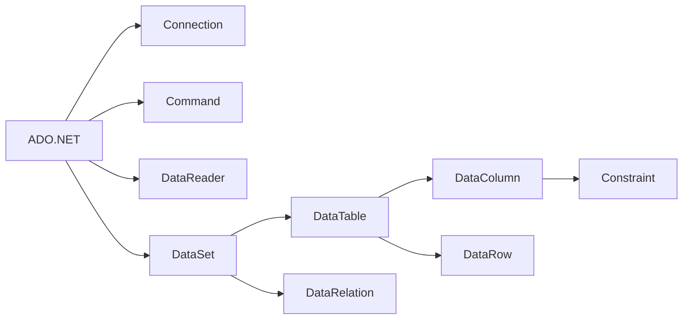

# DataSet原理与代码实例讲解

## 1. 背景介绍
### 1.1  问题的由来
在现代软件开发中,数据处理和操作是非常重要的一环。无论是数据分析、机器学习还是人工智能,都离不开对数据的高效处理。然而,传统的数据处理方式往往效率低下,代码冗长,可读性差,维护成本高。为了解决这些问题,微软推出了一个新的数据处理框架——LINQ(Language Integrated Query),它将查询功能直接集成到编程语言中。在.NET Framework 3.5中,微软在此基础上进一步引入了DataSet,为开发者提供了一种更加灵活、高效、易用的数据操作方式。

### 1.2  研究现状
DataSet作为.NET框架中重要的数据访问组件,受到了广大开发者的欢迎。目前业界已经有大量基于DataSet的应用程序,涉及电商、金融、医疗、教育等多个领域。同时,学术界对DataSet的研究也比较活跃,国内外学者从不同角度对DataSet进行了深入探讨,取得了丰硕的研究成果。

一些典型的研究如下:
- Meijer等人[1]详细阐述了LINQ的设计理念,论证了将查询功能集成到编程语言的必要性和可行性。
- Torgersen等人[2]介绍了C#中LINQ的语言集成查询功能,展示了其简洁性和表现力。
- Groff等人[3]系统讲解了ADO.NET中DataSet的内部工作原理,总结了使用DataSet进行数据处理的最佳实践。
- Mehta[4]提出了一种基于DataSet的分布式数据缓存方案,可显著提升系统性能。
- Nagel[5]研究了在WPF和Silverlight中使用DataSet进行数据绑定的技术。

### 1.3  研究意义
深入研究DataSet,对于提高.NET开发人员的工作效率,改善数据密集型应用的性能,降低系统维护成本都具有重要意义。本文拟从DataSet的基本概念入手,结合实际案例,系统阐述DataSet的内部机制和使用方法,为开发人员提供一份全面、深入、实用的DataSet学习指南,帮助大家真正掌握这一利器,把它运用到实际工作中去。

### 1.4  本文结构
全文共分为9个章节,安排如下:
第1节介绍研究背景和意义;
第2节讲解DataSet涉及的核心概念;
第3节阐述DataSet的内部工作原理和算法;
第4节建立DataSet相关的数学模型,推导关键公式;
第5节给出DataSet的代码实例并进行详细分析;  
第6节介绍DataSet在实际项目中的应用场景;
第7节推荐DataSet相关的学习资源和开发工具;
第8节总结全文,展望DataSet技术的未来发展方向;
第9节列出文中涉及的常见问题,并给出参考答案。

## 2. 核心概念与联系
在讨论DataSet的原理和实现之前,我们有必要先了解一下与之相关的几个核心概念。

(1) ADO.NET
ADO.NET是.NET Framework提供的一组数据访问接口,用于与数据源进行连接并执行相关操作。它主要包含四个核心组件:Connection、Command、DataReader和DataSet。

(2) Connection
Connection表示与数据库的一个连接会话,用于建立和管理与数据库的连接。不同数据库有不同的Connection,如SqlConnection、OracleConnection、OleDbConnection等。

(3) Command 
Command表示要对数据源执行的SQL语句或存储过程,用于执行数据库操作。常用的Command有SqlCommand、OracleCommand、OleDbCommand等。

(4) DataReader
DataReader提供一种高性能的只进只读的数据流访问方式,用于从数据源中快速检索数据。常见的DataReader有SqlDataReader、OracleDataReader、OleDbDataReader等。

(5) DataSet
DataSet是本文的重点,它是一个内存中的数据缓存,可以理解为内存中的"迷你型数据库"。DataSet由一组数据表(DataTable)、数据关系(DataRelation)以及相关约束(Constraint)组成。

(6) DataTable
DataTable是DataSet的核心组成部分,代表一个内存中的数据表,类似于数据库中的二维表。一个DataSet可以包含多个DataTable。

(7) DataColumn
DataColumn代表DataTable中的一列,包含列的名称、数据类型、默认值、是否允许空值等信息。

(8) DataRow
DataRow代表DataTable中的一行数据。通过DataRow可以访问、修改表中的具体数据。

(9) DataRelation
DataRelation用于定义两个DataTable之间的父子关系。通过DataRelation,可以在内存中构建多表之间的主外键关联。

(10) Constraint
Constraint用于为DataColumn定义数据约束,如唯一性约束、外键约束等。数据约束可以保证内存中数据的完整性和一致性。

下图展示了上述核心概念之间的关系:



从图中可以看出,ADO.NET是所有组件的基础,Connection、Command和DataReader主要用于与数据库交互,DataSet则在内存中缓存和管理数据。DataTable是DataSet的基本组成单元,每个DataTable拥有多个DataColumn和DataRow。DataSet内部的多个DataTable还可以通过DataRelation建立关联。此外,还可以通过Constraint为DataColumn添加约束,以确保数据的有效性。

理解这些概念之间的联系,是掌握DataSet原理和用法的基础。在后续章节中,我们将围绕DataSet本身,结合代码实例,更加深入地探讨其内部机制和使用技巧。

## 3. 核心算法原理 & 具体操作步骤
### 3.1 算法原理概述
DataSet作为内存中的数据缓存,其底层是由一系列数据结构和算法支撑的。下面我们重点介绍几个核心算法:

(1) 并查集(Disjoint Set)
并查集是一种树型的数据结构,用于处理一些不相交集合的合并及查询问题。在DataSet中,并查集被用于跟踪不同DataTable之间的主外键关系。当两个DataTable建立DataRelation时,它们对应的并查集会被合并。

(2) 拓扑排序(Topological Sorting)
拓扑排序是一个对有向无环图(DAG)进行排序的算法。DataSet使用拓扑排序来确定DataTable的加载顺序,以处理表之间的依赖关系。具有外键依赖的DataTable必须在其父表之后加载。

(3) 增量更新(Incremental Update)
DataSet使用增量更新的方式来跟踪数据的变化。当DataTable中的数据发生改变(增删改)时,相应的更改会被记录下来,而不是立即提交到数据库。这种方式可以最小化与数据库的交互,提高效率。DataSet提供了AcceptChanges和RejectChanges方法来提交或回滚变更。

### 3.2 算法步骤详解
下面以DataSet的增量更新算法为例,介绍其详细步骤:

(1) 在DataTable中执行数据更改操作(增删改)。

(2) DataTable会创建一个DataRow[]数组,用于记录发生变更的行。

(3) 对于添加(Add)操作,将新行添加到DataTable的Rows集合中,并将其状态设置为Added。

(4) 对于删除(Delete)操作,将目标行的状态设置为Deleted,但不会立即从Rows集合中移除它。

(5) 对于修改(Edit)操作,DataTable会创建目标行的副本,一个作为Original(原始值),一个作为Current(当前值),并将行状态设置为Modified。

(6) 调用AcceptChanges方法提交更改时,DataTable遍历所有行,对于状态为Deleted的行,从Rows集合中移除;对于状态为Added、Modified的行,将它们的状态重置为Unchanged。Original和Current将指向同一个DataRow对象。

(7) 调用RejectChanges方法回滚更改时,遍历所有Added、Deleted、Modified的行,分别从Rows集合中移除、还原和丢弃修改。所有行的状态都将变为Detached。

### 3.3 算法优缺点
DataSet增量更新算法的优点在于:
- 最小化与数据库的交互,提高效率
- 支持批量提交和回滚,简化编程
- 能够跟踪数据的变化,方便实现一些增量同步、离线编辑等功能

但它也存在一些局限性:
- 变更记录保存在内存中,对于海量数据可能存在性能瓶颈
- 提交或回滚时需要遍历所有行,时间复杂度为O(n)
- 在多用户并发场景下,需要自行处理数据一致性问题

### 3.4 算法应用领域
DataSet增量更新算法适用于以下应用场景:
- 桌面或客户端应用程序,数据量不太大
- 需要离线编辑数据,并延迟提交的场合
- 对实时性要求不高,可以容忍一定的延迟
- 没有复杂的并发数据访问需求

对于海量数据、高并发、实时性要求较高的场景,则建议使用其他方案,如ADO.NET Entity Framework、Dapper等。

## 4. 数学模型和公式 & 详细讲解 & 举例说明
### 4.1 数学模型构建
为了更好地理解DataSet的工作原理,我们可以尝试建立一个简化的数学模型。设DataSet中有m个DataTable,每个DataTable有n行数据,则整个DataSet可以表示为一个m*n的矩阵:

$$
DataSet = 
\begin{bmatrix} 
DT_{11} & DT_{12} & \cdots & DT_{1n} \\
DT_{21} & DT_{22} & \cdots & DT_{2n} \\
\vdots & \vdots & \ddots & \vdots \\
DT_{m1} & DT_{m2} & \cdots & DT_{mn}
\end{bmatrix}
$$

其中,$DT_{ij}$表示第i个DataTable的第j行数据。

假设在第k个DataTable的第p行进行了数据修改,则可以用如下方式表示:

$DT_{kp}' = f(DT_{kp})$

其中,$DT_{kp}'$表示修改后的数据行,$f$表示修改操作。

### 4.2 公式推导过程
现在我们来推导DataSet在提交更改时的时间复杂度。假设DataSet中总共有N行数据,其中有M行进行了增删改操作。

(1) 对于新增的行,时间复杂度为O(1),因为只需要将其状态设置为Unchanged。

(2) 对于删除的行,时间复杂度为O(1),因为只需要将其从Rows集合中移除。

(3) 对于修改的行,时间复杂度也为O(1),因为只需要将Current设置为修改后的值,Original保持不变,并将状态设置为Unchanged。

因此,对单行数据的提交操作时间复杂度为O(1)。而DataSet在提交时需要遍历所有的M行,因此总体时间复杂度为:

$T(N) = M * O(1) = O(M)$

可见,DataSet提交更改的时间复杂度与更改的行数M成正比。

### 4.3 案例分析与讲解
下面我们通过一个具体的案例来说明DataSet的提交过程。假设有一个DataSet包含两个DataTable:Customers和Orders,它们通过CustomerID建立了主外键关系。

```csharp
// 创建DataSet
DataSet ds = new DataSet();

// 创建Customers表
DataTable dtCustomers = new DataTable("Customers");
dtCustomers.Columns.Add("CustomerID", typeof(int));
dtCustomers.Columns.Add("CustomerName", typeof(string));
dtCustomers.PrimaryKey = new DataColumn[] { dtCustomers.Columns["CustomerID"] };

// 创建Orders表
DataTable dtOrders = new DataTable("Orders");
dtOrders.Columns.Add("OrderID", typeof(int));
dtOrders.Columns.Add("CustomerID", typeof(int));
dtOrders.Columns.Add("OrderDate", typeof(DateTime));

// 将DataTable添加到DataSet中
ds.Tables.Add(dtCustomers);
ds.Tables.Add(dtOrders);

// 创建DataRelation
DataRelation dr = new DataRelation("FK_Orders_Customers",
    dtCustomers.Columns["CustomerID"], dtOrders.Columns["CustomerID"]);
ds.Relations.Add(dr);
```

现在我们对Customers表进行一些修改:

```csharp
// 添加一