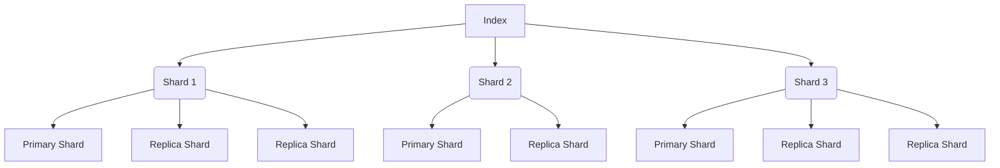

# ElasticSearch Replica原理与代码实例讲解

## 1. 背景介绍

### 1.1 问题的由来

随着数据量的快速增长和实时搜索需求的不断提高,传统的单节点系统已经无法满足现代应用的可扩展性和高可用性要求。为了解决这一问题,ElasticSearch引入了分片(Sharding)和副本(Replica)的概念,以实现数据的分布式存储和高可用性。

### 1.2 研究现状

ElasticSearch作为一种分布式、RESTful风格的搜索和数据分析引擎,已经广泛应用于各种场景,包括日志分析、全文搜索、安全分析等。Replica机制是ElasticSearch实现高可用性和容错能力的关键所在,也是其核心特性之一。

### 1.3 研究意义

深入理解ElasticSearch Replica原理对于构建高可用、可扩展的分布式系统至关重要。本文将从理论和实践两个层面对Replica机制进行全面剖析,帮助读者掌握核心概念、算法原理和实现细节,为实际应用提供指导和参考。

### 1.4 本文结构

本文将首先介绍Replica的核心概念和工作原理,然后深入探讨其算法细节和数学模型。接下来,通过代码实例和应用场景分析,进一步阐明Replica在实际项目中的应用。最后,本文将总结Replica的发展趋势和面临的挑战,为读者提供进一步学习和研究的方向。

## 2. 核心概念与联系

在ElasticSearch中,索引(Index)是一种用于存储相关数据的逻辑空间。为了提高数据的可用性和容错能力,ElasticSearch将每个索引划分为多个分片(Shard),每个分片又可以有一个或多个副本(Replica)。

Replica是分片的精确副本,用于提供数据的冗余备份和负载均衡。当主分片(Primary Shard)出现故障或者无法访问时,副本分片(Replica Shard)可以接管并继续提供服务,确保数据的高可用性。此外,Replica还可以分担主分片的查询和写入负载,提高系统的整体性能。

ElasticSearch会自动在集群中的不同节点上分布式地存储主分片和副本分片,以实现数据的分布式存储和高可用性。当一个节点失效时,ElasticSearch会自动将该节点上的主分片或副本分片迁移到其他可用节点上,确保数据的可用性和一致性。

上图展示了一个具有3个主分片和2个副本分片的ElasticSearch索引的结构。每个主分片都有两个副本分片,分布在不同的节点上,以确保数据的冗余和高可用性。

## 3. 核心算法原理 & 具体操作步骤

### 3.1 算法原理概述

ElasticSearch Replica的核心算法原理是基于分布式一致性协议(Distributed Consistency Protocol)实现的。该协议通过主分片和副本分片之间的数据同步和故障转移机制,确保数据的一致性和高可用性。

主要原理如下:

1. **主分片写入**: 当有新数据写入时,首先会写入主分片。
2. **副本同步**: 主分片会将写入的数据异步复制到所有副本分片,以确保数据的冗余备份。
3. **读取优化**: 读取操作可以从主分片或任意副本分片执行,以实现负载均衡和提高查询性能。
4. **故障转移**: 当主分片出现故障时,ElasticSearch会自动从副本分片中选举一个新的主分片,并将其他副本分片重新与新主分片建立同步关系。

这种分布式一致性协议确保了数据的最终一致性,即在任何时刻,所有副本分片的数据都会与主分片保持一致。同时,它也提供了高可用性和容错能力,当主分片出现故障时,系统可以自动切换到副本分片,确保服务的连续性。

### 3.2 算法步骤详解

ElasticSearch Replica算法的具体步骤如下:

1. **索引创建**:
   - 用户指定索引的主分片数和副本数。
   - ElasticSearch根据集群的节点数量,自动在不同节点上分布式地创建主分片和副本分片。

2. **写入操作**:
   - 客户端向任意节点发送写入请求。
   - 接收请求的节点将请求转发给主分片所在节点。
   - 主分片处理写入请求,并将数据持久化到磁盘。
   - 主分片将写入的数据异步复制到所有副本分片。

3. **读取操作**:
   - 客户端向任意节点发送读取请求。
   - 接收请求的节点将请求转发给主分片或任意副本分片。
   - 主分片或副本分片处理读取请求,并返回数据。

4. **故障转移**:
   - 当主分片所在节点发生故障时,ElasticSearch会自动从副本分片中选举一个新的主分片。
   - 新主分片会通知其他副本分片建立新的复制关系。
   - 客户端后续的读写操作将自动路由到新的主分片。

5. **数据同步**:
   - 当节点重新加入集群或新节点加入时,ElasticSearch会自动将缺失的分片数据从其他节点复制过来,以保持数据的完整性和一致性。

通过这种分布式一致性协议,ElasticSearch可以实现数据的高可用性、负载均衡和容错能力,满足现代应用对可扩展性和稳定性的高要求。

### 3.3 算法优缺点

ElasticSearch Replica算法的优点包括:

1. **高可用性**: 通过副本分片的冗余备份,可以确保数据的持久性和服务的连续性。
2. **负载均衡**: 读取操作可以从主分片或任意副本分片执行,实现了自动负载均衡。
3. **容错能力**: 当主分片出现故障时,ElasticSearch可以自动从副本分片中选举新的主分片,确保服务的连续性。
4. **数据完整性**: 通过数据同步机制,ElasticSearch可以保证集群中所有节点上的数据都是完整和一致的。

但是,ElasticSearch Replica算法也存在一些缺点和限制:

1. **写入延迟**: 由于需要将数据异步复制到所有副本分片,写入操作可能会有一定的延迟。
2. **资源消耗**: 维护多个副本分片会消耗更多的存储空间和网络带宽。
3. **一致性延迟**: 虽然最终会达到数据一致性,但在同步过程中可能会出现短暂的不一致状态。
4. **复杂性**: 实现分布式一致性协议和故障转移机制具有一定的复杂性,需要精心设计和优化。

### 3.4 算法应用领域

ElasticSearch Replica算法广泛应用于各种需要高可用性、可扩展性和容错能力的分布式系统中,包括但不限于:

1. **日志分析系统**: 通过ElasticSearch的分布式存储和搜索能力,可以高效地处理大规模日志数据。
2. **全文搜索引擎**: ElasticSearch作为一种优秀的全文搜索引擎,可以为网站、电子商务平台等提供快速、准确的搜索服务。
3. **安全分析系统**: ElasticSearch可以用于实时监控和分析安全事件,帮助及时发现和响应安全威胁。
4. **物联网数据处理**: ElasticSearch的高吞吐量和可扩展性使其适合处理大规模物联网设备产生的海量数据。
5. **数据分析平台**: ElasticSearch可以与其他大数据技术(如Hadoop、Spark等)集成,构建强大的数据分析平台。

总的来说,ElasticSearch Replica算法为构建高可用、可扩展的分布式系统提供了坚实的理论基础和实现机制,在各种领域都有广泛的应用前景。

## 4. 数学模型和公式 & 详细讲解 & 举例说明

为了更好地理解和优化ElasticSearch Replica算法,我们可以借助数学模型和公式进行理论分析。

### 4.1 数学模型构建

假设一个ElasticSearch集群有N个节点,索引I有P个主分片和R个副本分片。我们定义以下变量:

- $N$: 集群中节点的总数
- $P$: 索引I的主分片数
- $R$: 索引I的副本数
- $S_i$: 第i个主分片
- $R_{i,j}$: 第i个主分片的第j个副本分片
- $f(n)$: 节点n失效的概率
- $A(I)$: 索引I的可用性

我们可以构建以下数学模型来描述ElasticSearch Replica算法:

$$
A(I) = 1 - \prod_{i=1}^{P} \left( 1 - \left( 1 - \prod_{j=1}^{R+1} f(n_{i,j}) \right) \right)
$$

其中$n_{i,j}$表示主分片$S_i$或副本分片$R_{i,j}$所在的节点。

这个公式表示,索引I的可用性等于1减去所有主分片及其副本分片都不可用的概率的乘积。只要有一个主分片及其任意一个副本分片可用,整个索引就可以继续提供服务。

### 4.2 公式推导过程

我们可以通过以下步骤推导出上述公式:

1. 计算单个主分片及其所有副本分片都不可用的概率:

   $$
   P(S_i \text{ 和所有 } R_{i,j} \text{ 都不可用}) = \prod_{j=1}^{R+1} f(n_{i,j})
   $$

2. 计算至少有一个主分片及其任意一个副本分片可用的概率:

   $$
   P(\text{至少有一个 } S_i \text{ 或 } R_{i,j} \text{ 可用}) = 1 - \prod_{j=1}^{R+1} f(n_{i,j})
   $$

3. 计算所有主分片及其副本分片都可用的概率:

   $$
   P(\text{所有 } S_i \text{ 和 } R_{i,j} \text{ 都可用}) = \prod_{i=1}^{P} \left( 1 - \prod_{j=1}^{R+1} f(n_{i,j}) \right)
   $$

4. 索引I的可用性就是所有主分片及其副本分片都可用的概率:

   $$
   A(I) = \prod_{i=1}^{P} \left( 1 - \prod_{j=1}^{R+1} f(n_{i,j}) \right)
   $$

### 4.3 案例分析与讲解

假设我们有一个ElasticSearch集群包含5个节点,并创建了一个索引I,它有3个主分片和2个副本分片。我们假设每个节点失效的概率为0.1。

根据上述公式,我们可以计算索引I的可用性:

$$
\begin{aligned}
A(I) &= 1 - \prod_{i=1}^{3} \left( 1 - \left( 1 - \prod_{j=1}^{3} f(n_{i,j}) \right) \right) \\
     &= 1 - \left( 1 - \left( 1 - 0.1^3 \right) \right)^3 \\
     &= 1 - (1 - 0.999)^3 \\
     &= 0.997
\end{aligned}
$$

这意味着,在这个配置下,索引I的可用性约为99.7%。即使有一个节点发生故障,ElasticSearch仍然可以通过副本分片提供服务,确保数据的高可用性。

我们还可以进一步分析,如果增加副本数量,可用性会有何变化。假设我们将副本数从2增加到3,则可用性将变为:

$$
\begin{aligned}
A(I) &= 1 - \prod_{i=1}^{3} \left( 1 - \left( 1 - \prod_{j=1}^{4} f(n_{i,j}) \right) \right) \\
     &= 1 - \left( 1 - \left( 1 - 