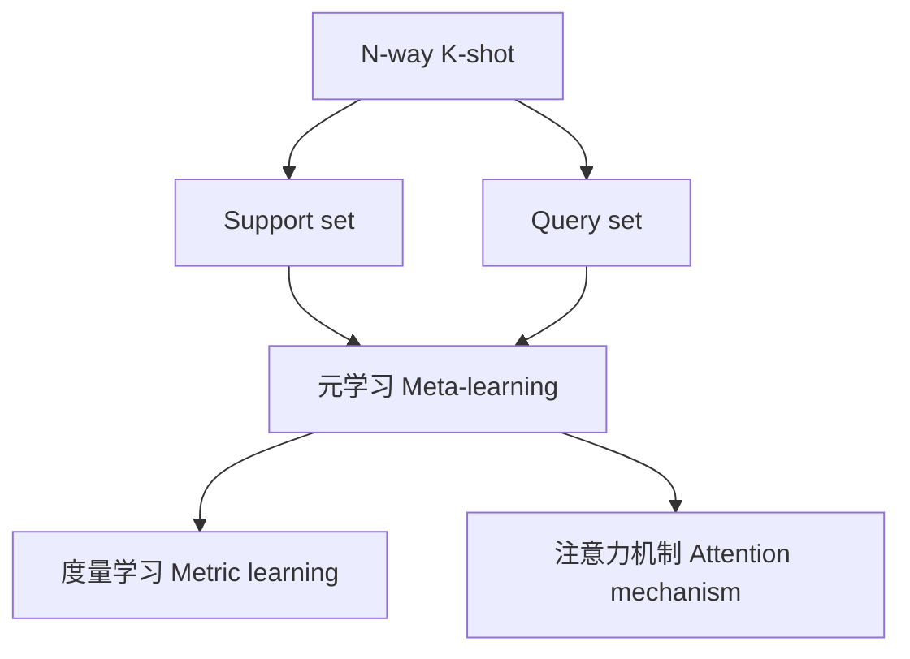

# Few-Shot Learning

作者：禅与计算机程序设计艺术 / Zen and the Art of Computer Programming 

## 1. 背景介绍
### 1.1 问题的由来
在现实世界中,我们人类具有非凡的学习能力,能够通过少量的样本快速学习新的概念和技能。相比之下,传统的机器学习模型通常需要大量的有标签数据进行训练,才能取得良好的性能。然而,在许多实际应用场景中,获取大规模标注数据非常困难和昂贵。因此,如何让机器也能像人类一样,通过少量样本快速学习新知识,成为了人工智能领域亟待解决的重要问题。Few-shot learning正是为解决这一问题而提出的。

### 1.2 研究现状
近年来,few-shot learning受到学术界和工业界的广泛关注。研究者们提出了各种few-shot learning方法,主要可分为基于度量的方法、基于优化的方法和基于模型的方法三大类。基于度量的方法通过学习样本之间的相似度度量,实现对新类别的快速适应;基于优化的方法通过元学习的思想,学习如何快速适应新任务;基于模型的方法则利用强大的生成模型,从少量样本中学习新概念。这些方法在图像分类、物体检测、语义分割等任务上取得了显著进展。

### 1.3 研究意义 
Few-shot learning的研究意义重大:

1. 拓展机器学习的应用边界:使AI系统能够像人类一样快速学习,大大拓宽了机器学习的应用范围,使其能够应用于样本稀缺的领域。

2. 降低数据标注成本:通过few-shot learning,AI系统只需少量标注样本即可工作,大幅降低了数据标注的时间和经济成本。

3. 促进AI的可解释性和鲁棒性:few-shot learning中学习到的知识更加紧凑和本质,有助于理解AI系统的决策过程,提高其可解释性;同时few-shot模型能更好地抵御噪声和对抗样本的干扰。

4. 推动认知科学和神经科学研究:few-shot learning启发于人脑的快速学习机制,相关研究能够反哺认知和脑科学,加深我们对人类智能的理解。

### 1.4 本文结构
本文将全面介绍few-shot learning这一前沿研究方向。第2部分阐述few-shot learning的核心概念;第3部分详细讲解few-shot learning的主要算法原理和步骤;第4部分介绍few-shot learning常用的数学模型和公式;第5部分通过具体的代码实例,演示如何实现few-shot learning模型;第6部分讨论few-shot learning的实际应用场景;第7部分推荐few-shot learning的学习资源;第8部分对few-shot learning的研究现状和未来趋势进行总结展望。

## 2. 核心概念与联系
Few-shot learning的核心概念包括:

1. N-way K-shot:指一个few-shot学习任务中有N个新类别,每个类别有K个标注样本。常见的设置有5-way 1-shot和5-way 5-shot等。

2. Support set和query set:support set是用于学习新类别的少量标注样本集合,query set是用于评估模型泛化性能的测试集。Few-shot learner需要从support set中快速学习新类别的特征表示,并对query set做出分类预测。

3. 元学习(Meta-learning):元学习是few-shot learning的重要思想,旨在学习一个"学习算法",使其能够从少量样本中快速学习新任务。元学习分为元训练和元测试两个阶段,元训练阶段在多个训练任务上学习通用的特征提取器和分类器,元测试阶段将学习到的模型应用于新的few-shot任务。

4. 度量学习(Metric learning):通过学习一个度量空间,使得同类样本的特征表示距离较近,不同类样本的距离较远,从而实现few-shot分类。孪生网络(Siamese Network)是常用的度量学习架构。

5. 注意力机制(Attention mechanism):通过注意力机制,few-shot learner可以选择性地关注support set中与待分类样本最相关的样本或特征,提高分类精度。

下图展示了few-shot learning的核心概念之间的关系:

## 3. 核心算法原理 & 具体操作步骤
### 3.1 算法原理概述
Few-shot learning算法的核心思想是通过元学习,学习一个通用的特征提取器和分类器,使其能够从少量样本中快速适应新的任务。下面以基于度量的Prototypical Network为例,介绍其原理。

Prototypical Network的主要思想是学习一个度量空间,使得同类样本聚集,不同类样本分离。具体而言,对于一个N-way K-shot任务,Prototypical Network首先将support set中每个类别的K个样本特征进行平均,得到该类别的原型向量(prototype)。然后,对于query set中的每个样本,计算其与各个原型向量之间的欧氏距离,并根据softmax函数得到其属于每个类别的概率。模型通过最小化query set上的交叉熵损失进行训练。

### 3.2 算法步骤详解
Prototypical Network的训练和测试步骤如下:

1. 构造元训练任务集:从训练集中采样一系列N-way K-shot任务,每个任务包含N个类别,每个类别有K个样本作为support set,其余样本作为query set。

2. 元训练阶段:
   - 对support set中的每个样本,用卷积神经网络提取特征向量
   - 对每个类别,计算其K个样本特征的平均值,得到原型向量
   - 对query set中的每个样本,计算其与各个原型向量的欧氏距离
   - 通过softmax函数,得到每个query样本属于各类别的概率
   - 计算query set上的交叉熵损失,并通过反向传播更新模型参数

3. 元测试阶段:
   - 在测试集上构造N-way K-shot任务
   - 对support set提取特征并计算原型向量
   - 对query set提取特征,计算与各原型向量的距离,并预测其类别
   - 计算query set上的分类准确率,评估模型的泛化性能

### 3.3 算法优缺点
Prototypical Network的优点包括:

1. 简单有效:原型向量的计算和距离度量非常直观,算法易于实现和理解。

2. 可解释性强:每个类别对应一个原型向量,具有明确的物理含义,便于分析模型的决策过程。

3. 泛化性能好:通过元学习,Prototypical Network能够在新的few-shot任务上取得较好的泛化性能。

但Prototypical Network也存在一些局限性:

1. 度量空间的选择:欧氏距离可能并不是最优的度量方式,更复杂的度量学习机制有待进一步探索。

2. 原型向量的计算:简单平均可能不足以刻画类内差异,需要考虑更精细的原型计算方法。

3. 模型的可扩展性:当类别数N较大时,计算复杂度会显著上升,影响模型的可扩展性。

### 3.4 算法应用领域
Prototypical Network及其他few-shot learning算法已在多个领域得到应用,包括:

1. 图像分类:基于few-shot learning的图像分类器能够识别新的物体类别,在细粒度分类、零样本学习等任务中表现出色。

2. 物体检测:将few-shot learning思想引入物体检测,使检测器能够从少量标注样本中学习新的目标类别,极大地提高了检测的灵活性。

3. 语义分割:few-shot语义分割模型能够从少数标注图像中学习新的物体类别,在医学图像分析、遥感图像解译等领域具有广阔应用前景。

4. 机器人视觉:通过few-shot learning,机器人能够快速学习新的物体和环境,具备更强的环境适应能力,在智能制造、服务机器人等场景下发挥重要作用。

## 4. 数学模型和公式 & 详细讲解 & 举例说明
### 4.1 数学模型构建
以Prototypical Network为例,其数学模型可表示为:

设训练集为 $D=\{(x_i,y_i)\}_{i=1}^{|D|}$,其中 $x_i$ 为输入样本, $y_i\in\{1,\dots,N\}$ 为对应的类别标签。

对于一个N-way K-shot任务 $\mathcal{T}$,其support set为 $S=\{(x_i,y_i)\}_{i=1}^{N\times K}$,query set为 $Q=\{(x_i,y_i)\}_{i=1}^{|Q|}$。

定义映射函数 $f_\phi: \mathcal{X}\rightarrow \mathbb{R}^M$ 将输入空间 $\mathcal{X}$ 映射到 $M$ 维嵌入空间,其中 $\phi$ 为可学习的参数。

对于类别 $k$,其原型向量 $c_k$ 定义为:

$$c_k=\frac{1}{K}\sum_{i=1}^K f_\phi(x_i)$$

其中 $(x_i,y_i)\in S_k=\{(x,y)\in S:y=k\}$ 为类别 $k$ 的support set。

对于query集中的样本 $x$,其属于类别 $k$ 的概率为:

$$p_\phi(y=k|x)=\frac{\exp(-d(f_\phi(x),c_k))}{\sum_{k'}\exp(-d(f_\phi(x),c_{k'}))}$$

其中 $d(\cdot,\cdot)$ 为嵌入空间中的距离度量函数,通常选择欧氏距离:

$$d(z,z')=\|z-z'\|_2$$

模型的目标是最小化query集上的交叉熵损失:

$$\mathcal{L}(\phi)=-\sum_{(x,y)\in Q}\log p_\phi(y|x)$$

通过随机梯度下降等优化算法最小化损失函数 $\mathcal{L}(\phi)$,可学得最优的特征提取器参数 $\phi$。

### 4.2 公式推导过程
Prototypical Network的关键是原型向量 $c_k$ 的计算和概率 $p_\phi(y=k|x)$ 的推导。

对于原型向量 $c_k$,由support set中类别 $k$ 的样本特征向量简单平均得到:

$$c_k=\frac{1}{K}\sum_{i=1}^K f_\phi(x_i), \quad (x_i,y_i)\in S_k$$

对于概率 $p_\phi(y=k|x)$,采用softmax函数对嵌入空间中样本 $x$ 与各原型向量 $c_k$ 的距离进行归一化:

$$
\begin{aligned}
p_\phi(y=k|x)&=\frac{\exp(-d(f_\phi(x),c_k))}{\sum_{k'}\exp(-d(f_\phi(x),c_{k'}))}\\
&=\frac{\exp(-\|f_\phi(x)-c_k\|_2)}{\sum_{k'}\exp(-\|f_\phi(x)-c_{k'}\|_2)}
\end{aligned}
$$

其中 $d(\cdot,\cdot)$ 选择欧氏距离 $\|\cdot\|_2$。

最后,模型通过最小化query集上的交叉熵损失学习最优参数:

$$
\mathcal{L}(\phi)=-\sum_{(x,y)\in Q}\log p_\phi(y|x)
$$

### 4.3 案例分析与讲解
下面以一个5-way 1-shot的图像分类任务为例,说明Prototypical Network的工作流程。

假设support set包含5个类别,每个类别有1张图像:

$S=\{(x_1,y_1=1),(x_2,y_2=2),(x_3,y_3=3),(x_4,y_4=4),(x_5,y_5=5)\}$

query set包含5张待分类图像:

$Q=\{(x_6,y_6=2),(x_7,y_7=5),(x_8,y_8=1),(x_9,y_9=4),(x_{10},y_{10}=3)\}$

首先,将support set中的每张图像通过特征提取器 $f_\phi$ 映射到嵌入空间,得到5个原型向量:

$c_