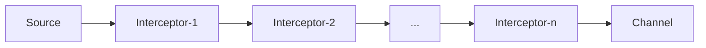

# Flume Interceptor原理与代码实例讲解

## 1. 背景介绍
### 1.1 问题的由来
在大数据时代,海量数据的实时采集和传输是一个重要的课题。Apache Flume作为一个分布式、可靠、高可用的海量日志采集、聚合和传输的系统,在业界得到了广泛应用。然而,对于一些复杂的数据处理需求,仅仅依靠Flume本身的配置往往难以实现。这时候就需要Flume Interceptor来实现定制化的数据处理逻辑。

### 1.2 研究现状
目前业界对Flume Interceptor的研究主要集中在以下几个方面:

1. 基于Interceptor实现数据过滤、清洗等预处理逻辑。
2. 利用Interceptor实现数据的动态路由。
3. 通过Interceptor与外部系统交互,实现数据的扩展处理。

一些典型的研究案例包括:

- 美团利用Flume Interceptor实现了日志数据的过滤和分发。
- 唯品会基于Interceptor实现了日志数据的脱敏处理。
- 腾讯利用Interceptor与Kafka集成,实现了实时日志流处理。

### 1.3 研究意义
Flume Interceptor作为连接数据源与目的存储的桥梁,对提升数据处理的灵活性和效率有着重要意义:

1. 可以在数据传输过程中实现对数据的个性化定制处理,提升数据质量。
2. 能够实现数据流的动态控制,提升传输效率。
3. 为与外部系统的集成提供了接口,拓展了数据处理的场景。

深入研究Flume Interceptor的原理和应用,对于构建高可用、灵活的海量数据处理平台具有重要价值。

### 1.4 本文结构
本文将围绕以下几个方面展开:

1. Flume Interceptor的核心概念和工作原理。
2. Interceptor的处理逻辑和生命周期。
3. 自定义Interceptor的开发步骤和最佳实践。
4. 典型的Interceptor应用场景和代码实例。
5. Interceptor的性能调优和注意事项。

## 2. 核心概念与联系

在深入讨论Flume Interceptor之前,我们先来了解一下Flume的一些核心概念:

- Event:Flume数据传输的基本单元。Event由可选的header和载有数据的byte array两部分组成。
- Source:数据收集组件。负责从数据源采集数据,并将数据封装成Event,传递给Channel。
- Sink:数据发送组件。负责从Channel读取Event,并将Event发送到目的地。
- Channel:连接Source和Sink的数据缓冲区。可以是内存或持久化的文件系统。

而Interceptor,则是Source和Channel之间的一层处理组件。每个Source可以配置一个或多个Interceptor,形成一个Interceptor chain。Event在这个chain中流转,被逐个Interceptor处理,最后再传递到Channel。



Interceptor的核心接口定义如下:

```java
public interface Interceptor {

  void initialize();
  
  Event intercept(Event event);
  
  List<Event> intercept(List<Event> events);
  
  void close();
}
```

- initialize:Interceptor初始化方法。
- intercept(Event event):处理单个Event的方法。
- intercept(List<Event> events):批量处理Event的方法。
- close:Interceptor关闭方法。

## 3. 核心算法原理 & 具体操作步骤
### 3.1 算法原理概述
Flume Interceptor本质上是一种拦截器模式(Interceptor Pattern)的实现。通过在数据流转路径上设置一系列的处理节点,实现对数据的预处理、过滤、转换等操作。

### 3.2 算法步骤详解
Interceptor的处理步骤可以概括为:

1. Interceptor链初始化。Flume框架根据配置,实例化一系列Interceptor对象,并调用它们的initialize方法完成初始化,形成一个Interceptor链。

2. Event拦截处理。Source接收到数据后,将其封装为Event对象,并将Event对象传递给Interceptor链的第一个节点。

3. Event依次流转。Event对象在Interceptor链中流转,每个Interceptor节点调用intercept方法对Event进行处理,处理后的Event再传递给下一个Interceptor节点。
   
4. Event流转完毕。当Event对象流转到Interceptor链的末端后,将其传递到Channel,完成一次数据传输。

5. Interceptor链关闭。当Flume进程关闭时,框架会调用每个Interceptor的close方法,完成清理工作。

### 3.3 算法优缺点

优点:
1. 扩展性强,可以方便地加入定制化的处理逻辑。
2. 与Source、Channel解耦,互不影响。
3. 可以对数据进行流式处理,不需要将数据全部加载到内存。

缺点:  
1. 每个Event都需要流经整个Interceptor链,如果处理逻辑复杂,可能会影响数据传输效率。
2. Interceptor的配置较复杂,有一定的学习成本。

### 3.4 算法应用领域
Flume Interceptor在数据采集、日志处理、流式计算等领域有广泛应用,一些典型的应用场景包括:

1. 数据清洗:利用Interceptor过滤脏数据、补全字段等。
2. 数据脱敏:利用Interceptor对敏感字段进行加密、掩码处理。
3. 数据分发:利用Interceptor根据数据特征动态选择下游的Channel。
4. 数据扩展:利用Interceptor与外部系统交互,实现数据的扩展字段处理。

## 4. 数学模型和公式 & 详细讲解 & 举例说明
### 4.1 数学模型构建
Flume Interceptor的数学模型可以抽象为一个函数组合:设输入的Event为$e$,Interceptor链依次为$f_1, f_2, ..., f_n$,则处理后的Event $e'$为:

$$e' = f_n(...f_2(f_1(e))...)$$

其中,每个$f_i$代表一个Interceptor的处理逻辑。

### 4.2 公式推导过程
假设每个Interceptor的处理可以分解为两个部分:Match和Transform。Match判断Event是否满足处理条件,Transform对满足条件的Event进行转换处理。设Match函数为$m_i$,Transform函数为$t_i$,则Interceptor的处理可以表示为:

$$f_i(e) = \begin{cases}
  t_i(e), & \text{if } m_i(e) \\
  e, & \text{otherwise}
\end{cases}$$

进一步,整个Interceptor链的处理可以表示为:

$$e' = f_n(...f_2(f_1(e))...) = t_n^{m_n}(...t_2^{m_2}(t_1^{m_1}(e))...)$$

其中,$t_i^{m_i}$表示在$m_i$为真时应用$t_i$,否则保持不变。

### 4.3 案例分析与讲解
我们以一个简单的数据清洗场景为例,假设有如下Interceptor链:

1. TimestampInterceptor:过滤掉时间戳不合法的Event。
2. HostInterceptor:过滤掉主机名不合法的Event。
3. RegexFilterInterceptor:过滤掉正文不符合正则表达式的Event。

设输入的Event为$e$,其时间戳为$e.timestamp$,主机名为$e.host$,正文为$e.body$。
三个Interceptor的Match和Transform函数分别为:

$$
\begin{aligned}
m_1(e) &= e.timestamp \in [t_1, t_2] \\
t_1(e) &= e \\
m_2(e) &= e.host \in \{h_1, h_2, ..., h_n\} \\ 
t_2(e) &= e \\
m_3(e) &= e.body \sim regex \\
t_3(e) &= e
\end{aligned}
$$

则整个处理过程可以表示为:

$$e' = t_3^{m_3}(t_2^{m_2}(t_1^{m_1}(e))) = \begin{cases}
  e, & \text{if } m_1(e) \land m_2(e) \land m_3(e) \\
  \text{null}, & \text{otherwise}
\end{cases}$$

可见,只有满足三个条件的Event才能通过Interceptor链,其他的Event都被过滤掉了。

### 4.4 常见问题解答

Q: Interceptor的处理是否会改变Event的内容?
A: 根据具体的处理逻辑,Interceptor既可以原封不动地传递Event,也可以生成全新的Event替换原有的Event。

Q: 如果某个Interceptor抛出异常会怎样?
A: 如果Interceptor在处理过程中抛出异常,则该Event会被丢弃,不会传递到下一个Interceptor。可以通过配置`ErrorPolicy`来定制异常处理策略。

Q: Interceptor的执行顺序是否可以调整?
A: Interceptor的执行顺序由配置文件中的先后顺序决定,可以通过调整配置文件来改变执行顺序。

## 5. 项目实践：代码实例和详细解释说明
### 5.1 开发环境搭建
开发Flume Interceptor需要如下环境:

- JDK 1.8+
- Apache Maven 3.x
- Flume 1.9.0

可以通过在pom.xml中添加如下依赖引入Flume相关类库:

```xml
<dependency>
  <groupId>org.apache.flume</groupId>
  <artifactId>flume-ng-core</artifactId>
  <version>1.9.0</version>
</dependency>
```

### 5.2 源代码详细实现
下面我们以一个简单的HostInterceptor为例,演示如何自定义Interceptor。

```java
package com.example;

import org.apache.flume.Context;
import org.apache.flume.Event;
import org.apache.flume.interceptor.Interceptor;

import java.util.List;
import java.util.ArrayList;

public class HostInterceptor implements Interceptor {
    
  private List<String> allowedHosts;
        
  @Override
  public void initialize() {
    // 从配置中加载允许的主机名列表  
    String hosts = getProperty("hosts");
    String[] hostArray = hosts.split(",");
    allowedHosts = Arrays.asList(hostArray);
  }

  @Override
  public Event intercept(Event event) {
    // 获取Event的主机名
    String host = event.getHeaders().get("host");
    // 判断主机名是否合法
    if (allowedHosts.contains(host)) {
      return event;
    } else {
      return null;
    }
  }

  @Override
  public List<Event> intercept(List<Event> events) {
    List<Event> intercepted = new ArrayList<>(events.size());
    for (Event event : events) {
      Event interceptedEvent = intercept(event);
      if (interceptedEvent != null) {
        intercepted.add(interceptedEvent);
      }
    }
    return intercepted;
  }

  @Override
  public void close() {
    // 清理资源
  }
  
  private String getProperty(String key) {
    // 获取配置属性
    Context context = getContext();
    return context.getString(key);
  }
  
  public static class Builder implements Interceptor.Builder {
        
    @Override
    public Interceptor build() {
      return new HostInterceptor();
    }
        
    @Override
    public void configure(Context context) {
      // 处理配置
    }
  }
}
```

### 5.3 代码解读与分析
- initialize方法:从配置中加载允许的主机名列表,该列表在Interceptor整个生命周期内保持不变。
- intercept(Event event)方法:对单个Event进行处理。获取Event的主机名,判断是否在允许列表中,如果在则返回原Event,否则返回null,表示丢弃该Event。
- intercept(List<Event> events)方法:对Event列表进行批量处理,内部实际上是对每个Event调用intercept(Event event)方法。
- close方法:清理资源,本例中没有需要清理的资源。
- 静态内部类Builder:用于创建Interceptor实例,并处理配置属性。所有自定义Interceptor都需要提供一个内部的Builder类。

### 5.4 运行结果展示
将自定义的HostInterceptor打包,放到Flume的classpath下,然后在Flume的配置文件中添加如下配置:

```properties
a1.sources = s1
a1.channels = c1
a1.sources.s1.interceptors = i1
a1.sources.s1.interceptors.i1.type = com.example.HostInterceptor$Builder
a1.sources.s1.interceptors.i1.hosts = host1,host2,host3
```

启动Flume,即可看