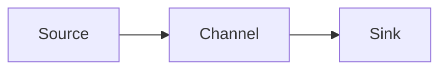
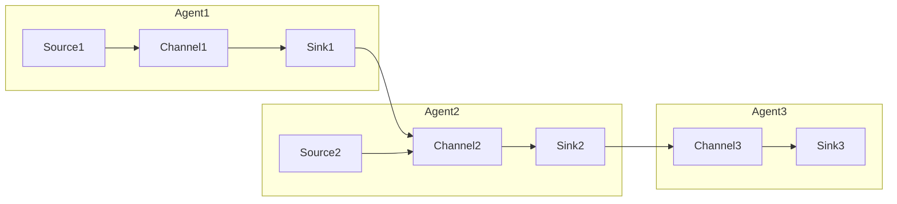

# Flume原理与代码实例讲解

## 1. 背景介绍

### 1.1 问题的由来

在当今大数据时代，海量数据的采集和传输是一个巨大的挑战。传统的日志收集方式已经无法满足现代分布式系统对于高吞吐量、高可靠性和高容错性的要求。为了解决这一问题,Apache Flume应运而生。

Flume是Apache软件基金会的一个分布式、可靠、高可用的海量日志采集、聚合和传输的系统,它可以高效地从不同的数据源采集数据,并将数据汇总到存储介质中,如HDFS、HBase、Solr等。Flume具有简单灵活、容错性高、可扩展性强等特点,可以满足各种不同场景下的数据采集需求。

### 1.2 研究现状

近年来,随着大数据技术的快速发展,越来越多的企业和组织开始采用Flume进行日志收集和数据传输。Flume已经被广泛应用于各种场景,如网络日志收集、服务器日志收集、安全日志收集、物联网数据收集等。

然而,由于Flume的复杂性和可配置性,很多开发人员在使用Flume时会遇到各种问题,如配置困难、性能瓶颈、故障排查等。因此,深入理解Flume的原理和实现机制,掌握其核心算法和代码实现,对于更好地利用Flume进行数据采集和传输至关重要。

### 1.3 研究意义

本文将深入探讨Flume的原理和实现机制,旨在帮助读者全面理解Flume的工作流程、核心算法和代码实现。通过详细的代码分析和案例讲解,读者可以掌握Flume的配置方法、性能优化技巧和故障排查策略。

此外,本文还将介绍Flume在实际应用场景中的使用,以及未来的发展趋势和面临的挑战。通过本文的学习,读者可以更好地利用Flume进行日志采集和数据传输,提高大数据处理的效率和可靠性。

### 1.4 本文结构

本文共分为九个部分:

1. 背景介绍
2. 核心概念与联系
3. 核心算法原理与具体操作步骤
4. 数学模型和公式详细讲解与举例说明
5. 项目实践:代码实例和详细解释说明
6. 实际应用场景
7. 工具和资源推荐
8. 总结:未来发展趋势与挑战
9. 附录:常见问题与解答

## 2. 核心概念与联系

在深入探讨Flume的原理和实现之前,我们先来了解一下Flume的核心概念和它们之间的联系。

Flume的核心组件包括:

1. **Source**:数据源,用于从外部系统采集数据。Flume支持多种数据源,如文件、网络流、执行源等。
2. **Channel**:事件通道,用于临时存储从Source接收到的事件数据。Channel提供了事务性操作,保证数据传输的可靠性。
3. **Sink**:数据目的地,用于将Channel中的事件数据批量移除并存储到外部系统,如HDFS、HBase等。
4. **Event**:数据单元,表示从Source采集到的一条数据记录。
5. **Agent**:Flume的基本单元,由一个Source、一个Channel和一个或多个Sink组成。

Flume的工作流程如下:

1. Source从外部系统采集数据,并将数据封装成Event。
2. Source将Event传递给Channel,Channel负责临时存储Event。
3. Sink从Channel中批量移除Event,并将Event存储到外部系统中。

多个Agent可以串联起来,形成一个复杂的数据传输拓扑结构,如下所示:

在这种拓扑结构中,Agent1的Sink会将数据传递给Agent2的Channel,Agent2的Sink会将数据传递给Agent3的Channel,最终由Agent3的Sink将数据存储到目的地。这种链式结构使得Flume具有良好的扩展性和灵活性。

## 3. 核心算法原理与具体操作步骤

### 3.1 算法原理概述

Flume的核心算法主要包括两个部分:事件传输算法和故障容错算法。

**事件传输算法**:Flume采用了一种基于事务的传输机制,保证了数据传输的可靠性和一致性。具体来说,Flume将Source到Sink的数据传输过程分为两个阶段:

1. 事务开启阶段:Source将采集到的数据封装成Event,并将Event批量写入Channel。
2. 事务提交阶段:Sink从Channel中批量移除Event,并将Event存储到外部系统中。

在每个阶段,Flume都会启动一个事务,并在操作完成后提交或回滚事务。如果在任何一个阶段发生异常,Flume都会回滚事务,保证数据的一致性。

**故障容错算法**:为了提高Flume的可靠性和容错性,Flume采用了多种容错机制,包括:

1. Channel的持久化存储:Channel可以将接收到的Event持久化存储到本地文件系统或数据库中,防止数据丢失。
2. Source和Sink的重试机制:如果Source或Sink在传输数据时发生异常,Flume会自动重试,直到成功或达到最大重试次数。
3. 故障转移机制:Flume支持为Source和Sink配置多个备份实例,当主实例发生故障时,可以自动切换到备份实例,保证数据传输的连续性。

### 3.2 算法步骤详解

下面我们来详细分析Flume的事件传输算法和故障容错算法的具体步骤。

#### 事件传输算法步骤

1. **Source采集数据**

   Source从外部系统采集数据,并将数据封装成Event对象。每个Event对象包含以下几个主要属性:

   - Headers:事件头部,存储元数据信息。
   - Body:事件体,存储实际的数据内容。
   - Channels:事件将被传输到的Channel列表。

2. **Source将Event写入Channel**

   Source将采集到的Event批量写入Channel。具体步骤如下:

   1. Source启动一个事务。
   2. Source将Event写入Channel的内存队列。
   3. 如果Channel配置了持久化存储,Source将Event持久化存储到本地文件系统或数据库中。
   4. Source提交事务。

3. **Sink从Channel移除Event**

   Sink从Channel中批量移除Event,并将Event存储到外部系统中。具体步骤如下:

   1. Sink启动一个事务。
   2. Sink从Channel的内存队列中移除Event。
   3. Sink将Event存储到外部系统中,如HDFS、HBase等。
   4. 如果Channel配置了持久化存储,Sink从持久化存储中移除对应的Event。
   5. Sink提交事务。

在整个传输过程中,如果任何一个步骤发生异常,Flume都会回滚事务,保证数据的一致性。同时,Flume还会根据配置的重试策略自动重试失败的操作。

#### 故障容错算法步骤

1. **Channel持久化存储**

   Channel可以将接收到的Event持久化存储到本地文件系统或数据库中,防止数据丢失。具体步骤如下:

   1. Channel启动一个事务。
   2. Channel将Event写入内存队列。
   3. Channel将Event持久化存储到本地文件系统或数据库中。
   4. Channel提交事务。

   当Flume重启或发生故障时,Channel可以从持久化存储中恢复Event,保证数据不丢失。

2. **Source和Sink的重试机制**

   如果Source或Sink在传输数据时发生异常,Flume会自动重试,直到成功或达到最大重试次数。具体步骤如下:

   1. Source或Sink启动一个事务。
   2. 尝试执行操作,如采集数据或存储数据。
   3. 如果操作失败,回滚事务,等待一段时间后重试。
   4. 如果重试次数达到最大值,放弃重试,记录错误日志。

3. **故障转移机制**

   Flume支持为Source和Sink配置多个备份实例,当主实例发生故障时,可以自动切换到备份实例,保证数据传输的连续性。具体步骤如下:

   1. 配置主实例和一个或多个备份实例。
   2. 主实例正常工作时,备份实例处于空闲状态。
   3. 当主实例发生故障时,Flume会自动切换到备份实例,继续执行数据传输任务。
   4. 当主实例恢复后,可以手动或自动切换回主实例。

通过以上故障容错机制,Flume可以提高系统的可靠性和容错性,确保数据传输的连续性和一致性。

### 3.3 算法优缺点

Flume的事件传输算法和故障容错算法具有以下优点:

1. **可靠性高**:基于事务的传输机制和持久化存储机制,保证了数据传输的可靠性和一致性。
2. **容错性强**:重试机制和故障转移机制,提高了系统的容错能力和可用性。
3. **扩展性好**:支持多种数据源和目的地,可以构建复杂的数据传输拓扑结构。
4. **吞吐量大**:采用批量传输和异步处理,提高了系统的吞吐量。

但同时,Flume的算法也存在一些缺点:

1. **延迟较高**:由于采用批量传输和异步处理,会导致数据传输延迟较高。
2. **资源消耗大**:持久化存储和故障转移机制会消耗较多的磁盘空间和内存资源。
3. **配置复杂**:Flume具有较多的配置项,配置过程较为复杂。
4. **可靠性依赖Channel**:数据的可靠性完全依赖于Channel的持久化存储机制,如果Channel配置不当,可能会导致数据丢失。

### 3.4 算法应用领域

Flume的事件传输算法和故障容错算法可以广泛应用于以下领域:

1. **日志收集**:收集各种服务器日志、应用程序日志、安全日志等。
2. **数据采集**:采集物联网设备、传感器、网络流量等各种数据源的数据。
3. **消息队列**:作为消息队列的替代方案,实现可靠的消息传输。
4. **数据迁移**:将数据从一个系统迁移到另一个系统,如RDBMS到Hadoop等。
5. **实时数据处理**:将实时数据流式传输到大数据处理框架,如Spark Streaming、Flink等。

总的来说,Flume适用于任何需要可靠、高吞吐量、容错性强的数据采集和传输场景。

## 4. 数学模型和公式详细讲解与举例说明

在讨论Flume的数学模型和公式之前,我们先来了解一下Flume的基本性能指标。

Flume的主要性能指标包括:

1. **吞吐量(Throughput)**:指单位时间内Flume能够处理的事件数量,通常以events/second(事件/秒)为单位。
2. **延迟(Latency)**:指事件从Source到达Sink所需的时间,通常以毫秒(ms)为单位。
3. **可靠性(Reliability)**:指Flume在面临各种故障时,能够保证数据不丢失的能力。

Flume的性能主要受以下几个因素影响:

1. **Source和Sink的性能**:Source和Sink的处理速度直接影响Flume的吞吐量和延迟。
2. **Channel的容量和类型**:Channel的容量决定了Flume能够缓存的事件数量,Channel的类型(内存或持久化)也会影响性能。
3. **批量大小**:Source和Sink批量传输事件的大小会影响吞吐量和延迟。
4. **网络条件**:如果Source、Channel和Sink分布在不同的节点上,网络带宽和延迟会影响Flume的性能。

下面我们来构建一个简单的数学模型,分析Flume的吞吐量和延迟。

### 4.1 数学模型构建

假设:

-