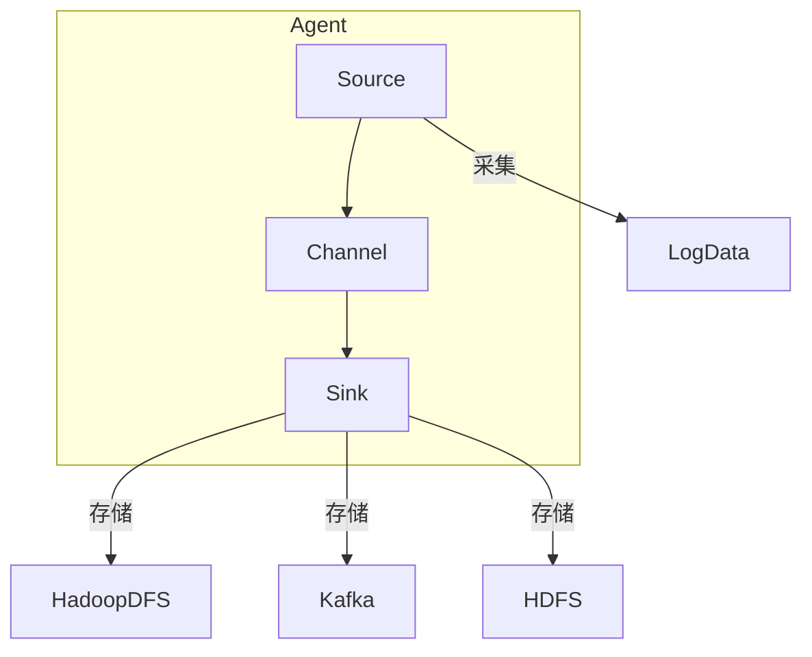

好的，我会尽力撰写一篇专业、深入且有见解的技术文章。以下是标题为《Flume日志收集系统原理与代码实例讲解》的正文内容:

# Flume日志收集系统原理与代码实例讲解

## 1. 背景介绍

### 1.1 问题的由来

在当今大数据时代,海量的日志数据被持续产生,如何高效收集和传输这些分散的日志数据成为一个亟待解决的问题。传统的日志收集方式如log4j往往存在单点故障、可靠性差、吞吐量低等缺陷,无法满足大数据场景下的需求。因此,需要一个分布式、高可用、高可靠的日志收集系统来应对这一挑战。

### 1.2 研究现状  

Apache Flume是一个分布式、可靠、高可用的海量日志收集传输系统,它可以高效地从不同的数据源收集数据,并将收集到的数据聚合到中央存储系统中,为后续的数据处理和分析奠定基础。Flume具有简单灵活、容错性强、可靠性高、易于扩展等特点,被广泛应用于各种大数据场景中。

### 1.3 研究意义

深入理解Flume的工作原理及其核心架构设计,掌握其配置使用方法和最佳实践,对于构建高效的日志收集系统至关重要。本文将从原理、架构、算法、实现等多个层面对Flume进行全面剖析,并结合实际案例进行代码级别的讲解,旨在帮助读者全面掌握Flume,为大数据平台的建设提供理论和实践指导。

### 1.4 本文结构

本文首先介绍Flume的核心概念和整体架构设计,然后深入探讨其关键算法原理和数学模型,接着通过实例代码解析其内部实现细节,最后分析Flume在实际场景中的应用,并对未来的发展趋势和挑战进行展望。

## 2. 核心概念与联系

Flume的核心概念主要包括Event、Source、Channel、Sink和Agent等。

**Event**是Flume传输的基本数据单元,用于封装实际的日志数据。

**Source**是数据的产生源头,用于从不同的数据源采集数据,生成Event。

**Channel**充当临时存储层,用于缓存Source收集的Event,防止数据丢失。

**Sink**是数据的终端接收器,用于将Channel中的Event批量移除并存储到外部系统中。

**Agent**是Flume的主体实例,由一个Source、一个Channel和一个或多个Sink组成,负责从Source接收Event,临时存储在Channel中,最终由Sink将Event写入目标系统。

这些核心概念相互关联、协同工作,构成了Flume的数据流动路径,如下流程图所示:

## 3. 核心算法原理及具体操作步骤

### 3.1 算法原理概述

Flume的核心算法是基于事件驱动架构(Event-Driven Architecture)设计的,整个系统遵循生产者-消费者模式。Source作为生产者,负责从各种数据源采集日志数据,并将数据封装为Event;Channel作为缓冲区,用于临时存储Event;Sink作为消费者,从Channel中获取Event,并将其持久化到外部存储系统中。

为了保证数据传输的可靠性,Flume采用了事务机制。每个Source在向Channel写入数据时,需要先获取一个事务;Channel在接收数据时,会先暂存数据,等待Source提交事务后才真正存储数据;Sink在从Channel读取数据时,也需要先获取一个事务,读取完数据后再提交事务。如果在任何环节出现异常,都可以通过回滚事务来保证数据的一致性。

此外,Flume还支持故障转移和负载均衡等高级功能,以提高系统的可用性和吞吐量。

### 3.2 算法步骤详解

Flume的核心算法步骤可以概括为以下几个主要环节:

1. **Source采集数据**
   - Source从外部数据源(如日志文件、网络流等)采集数据
   - 将采集到的数据封装为Event
   - 向Channel申请启动一个事务,用于后续写入数据

2. **Channel暂存数据**
   - 检查Channel是否有足够的存储空间
   - 如果空间足够,则暂存Source发来的Event
   - 等待Source提交或回滚事务

3. **Sink消费数据**
   - 向Channel申请启动一个事务,用于读取数据
   - 批量从Channel中获取Event
   - 将获取的Event批量写入外部存储系统
   - 提交事务,确认数据写入成功

4. **事务处理**
   - 如果任何一个环节出现异常,立即回滚事务
   - 如果所有步骤都成功执行,则最终提交事务

通过事务机制,Flume能够保证数据在传输过程中不会丢失或重复,从而实现端到端的可靠传输。

### 3.3 算法优缺点

Flume核心算法的优点:

- 事务机制保证数据传输可靠性
- 生产者-消费者模式,解耦数据源和目标存储
- 支持故障转移和负载均衡,提高系统可用性
- 可扩展性强,支持多种数据源和存储系统

缺点:

- 中间存储依赖于Channel的容量,存在数据积压风险  
- 事务开销较大,在高并发场景下性能可能受影响
- 配置较为复杂,维护成本较高

### 3.4 算法应用领域

Flume核心算法广泛应用于以下领域:

- 日志收集系统:高效收集分散的服务器日志
- 数据采集系统:从各种数据源采集结构化/非结构化数据
- 消息系统:作为消息通道,在分布式系统中传输数据
- 大数据平台:为Hadoop、Spark等提供数据输入通道
- 流处理系统:实时采集并传输流数据
- 安全监控系统:收集安全审计日志用于分析

## 4. 数学模型和公式及详细讲解和举例说明

### 4.1 数学模型构建

为了评估Flume的吞吐量和时延性能,我们可以构建如下数学模型:

设Flume系统中有M个Source、N个Sink,Source的事件产生速率为$\lambda$,Sink的事件处理速率为$\mu$。令$\rho=\lambda/\mu$为系统的利用率。

假设事件到达和处理过程都服从泊松分布,那么根据排队论的M/M/1模型,单个Source或Sink的平均时延为:

$$\bar{W}=\frac{1}{\mu-\lambda}$$

对于整个Flume系统,我们可以将其看作是M个M/M/1排队系统和N个M/M/1排队系统的并行,根据排队论,并行系统的总时延等于各子系统时延的最大值,即:

$$\bar{W}_{Flume}=\max\left\{\frac{M}{\mu-\lambda},\frac{N}{\mu-\lambda}\right\}$$

同理,我们可以得到Flume系统的总吞吐量为:

$$X_{Flume}=\min\{M\lambda,N\mu\}$$

该模型为我们分析Flume的性能指标提供了理论依据。当$\rho$较小时,吞吐量主要取决于Source的事件产生速率;当$\rho$较大时,吞吐量主要取决于Sink的事件处理能力。时延则主要取决于系统中瓶颈的排队长度。

### 4.2 公式推导过程

我们以单个Source或Sink的平均时延公式$\bar{W}=\dfrac{1}{\mu-\lambda}$为例,推导其来源。

根据M/M/1模型的稳态分布:

$$P_n=P_0\rho^n,\qquad n\geq0$$

其中$\rho=\lambda/\mu<1$是系统的利用率,$P_n$是系统中有n个事件的稳态概率。

利用归一化条件$\sum_{n=0}^{\infty}P_n=1$,我们可以解出:

$$P_0=1-\rho$$

将$P_0$代入稳态分布公式,可得:

$$P_n=(1-\rho)\rho^n,\qquad n\geq0$$

根据小熙期望公式,我们可以计算系统的平均排队长度$\bar{L}_q$:

$$\bar{L}_q=\sum_{n=0}^{\infty}nP_n=\rho\sum_{n=1}^{\infty}n\rho^{n-1}=\frac{\rho}{1-\rho}$$

已知$\bar{L}_q=\lambda\bar{W}_q$,即平均排队长度等于到达率与平均排队时间的乘积,可得:

$$\bar{W}_q=\frac{1}{\mu-\lambda}$$

再根据$\bar{W}=\bar{W}_q+\dfrac{1}{\mu}$,即平均时延等于平均排队时延加平均服务时间,即可推导出单个M/M/1系统的平均时延公式:

$$\bar{W}=\frac{1}{\mu-\lambda}+\frac{1}{\mu}=\frac{1}{\mu-\lambda}$$

### 4.3 案例分析与讲解

假设我们有一个Flume系统,包含3个Source和2个Sink,Source的事件产生速率为100事件/秒,Sink的事件处理速率为120事件/秒。

1. 计算系统的利用率

$$\rho=\frac{\lambda}{\mu}=\frac{100\times3}{120\times2}=1.25$$

由于$\rho>1$,说明系统处于过载状态,会出现事件积压的情况。

2. 计算系统的平均时延

$$\bar{W}_{Flume}=\max\left\{\frac{3}{\mu-\lambda},\frac{2}{\mu-\lambda}\right\}=\max\left\{\frac{3}{120-300},\frac{2}{120-300}\right\}=60\text{秒}$$

可见,由于过载,系统的平均时延很大,达到了60秒。

3. 计算系统的总吞吐量

$$X_{Flume}=\min\{3\times100,2\times120\}=240\text{事件/秒}$$

由于Sink的总处理能力大于Source的总产生速率,因此吞吐量主要取决于Source,为240事件/秒。

通过这个案例,我们可以看出,当系统过载时,时延会急剧增加,吞吐量也会被限制在Source的最大产生速率。因此,在实际部署时,我们需要根据业务需求,合理规划Source和Sink的数量和处理能力,避免出现过载的情况。

### 4.4 常见问题解答

**1. 如何防止Flume数据丢失?**

Flume的事务机制可以很好地保证数据的可靠传输,但是如果在Source将数据写入Channel之前就发生了异常,那么数据就有可能丢失。为了防止这种情况,我们可以采取以下措施:

- 使用持久化的Channel,如File Channel,能够将数据持久化到磁盘中
- 配置Source的重试机制,出现异常时能够重新发送数据
- 开启Source的Backup机制,将数据备份到本地,等待重试时再读取备份数据

**2. 如何提高Flume的吞吐量?**

提高Flume吞吐量的方法有:

- 增加Source和Sink的并行度,提高事件的产生和处理能力
- 使用异步方式处理事件,减少等待时间
- 优化Source和Sink的配置参数,如批量获取和发送事件的大小等
- 使用高性能的Channel,如Memory Channel
- 对Source和Sink进行负载均衡,避免某些节点过载

**3. Flume是否支持失败转移(Failover)？**

是的,Flume支持失败转移机制。我们可以为Source或Sink配置多个实例,根据优先级自动切换到备用实例。例如,对于Sink,我们可以配置一个主Sink和多个备用Sink,当主Sink失效时,Flume会自动将数据发送到备用Sink。这种机制可以提高Flume的可用性。

**4. Flume和Kafka的区别是什么?**

Flume和Kafka都可以用于日志收集和数据传输,但是它们的定位和设计目标有所不同:

- Flume是一个日志收集系统