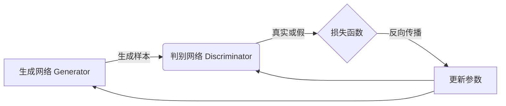

# Generative Adversarial Networks (GAN) 原理与代码实战案例讲解

## 1. 背景介绍

### 1.1 问题的由来

在机器学习和深度学习领域中,生成模型一直是一个具有挑战性的问题。传统的生成模型,如高斯混合模型、自回归模型等,在处理高维数据(如图像、视频等)时,往往会遇到维数灾难和计算复杂度过高的问题。因此,如何设计一种能够高效生成高质量样本的新型生成模型,成为了人工智能领域的一个重要课题。

### 1.2 研究现状

2014年,Ian Goodfellow等人在论文"Generative Adversarial Networks"中提出了一种全新的生成模型——生成对抗网络(Generative Adversarial Networks, GAN)。GAN的核心思想是将生成模型的训练过程建模为一个二人博弈游戏,由生成网络(Generator)和判别网络(Discriminator)两个网络组成,它们相互对抗,最终达到一种动态平衡。

自提出以来,GAN引起了广泛关注,并在图像生成、语音合成、无监督表示学习等多个领域取得了卓越的成果。但是,GAN也存在一些挑战,如训练不稳定、模式坍塌、评估困难等,这些问题成为了GAN研究的热点。

### 1.3 研究意义

GAN作为一种全新的生成模型范式,其意义重大:

1. **理论创新**:GAN提出了一种全新的生成模型思路,打破了传统生成模型的局限性,为机器学习理论发展注入了新的活力。
2. **应用前景**:GAN在图像生成、语音合成、无监督表示学习等领域展现出巨大的应用潜力,有望推动人工智能技术的发展。
3. **算法优化**:GAN存在的训练不稳定、模式坍塌等问题,为算法优化提供了广阔的研究空间。

### 1.4 本文结构

本文将全面介绍GAN的原理、算法细节、代码实现和应用场景,内容安排如下:

- 第2部分介绍GAN的核心概念和基本原理。
- 第3部分详细阐述GAN的核心算法原理和具体操作步骤。
- 第4部分推导GAN的数学模型和公式,并通过案例进行讲解和分析。
- 第5部分提供GAN的代码实现实例,并对关键代码进行解读和分析。
- 第6部分探讨GAN在图像生成、语音合成等领域的实际应用场景。
- 第7部分推荐GAN的学习资源、开发工具和相关论文等。
- 第8部分总结GAN的研究成果、发展趋势和面临的挑战。
- 第9部分列出GAN常见问题并给出解答。

## 2. 核心概念与联系

GAN的核心思想是将生成模型的训练过程建模为一个二人博弈游戏,由生成网络(Generator)和判别网络(Discriminator)两个网络组成,它们相互对抗,最终达到一种动态平衡。

1. **生成网络(Generator)**: 生成网络的目标是从一个潜在的随机噪声分布中生成与真实数据分布尽可能相似的样本,以欺骗判别网络。
2. **判别网络(Discriminator)**: 判别网络的目标是区分生成网络生成的样本和真实样本,并提供二分类的结果作为反馈信号。
3. **对抗训练**: 生成网络和判别网络相互对抗,生成网络努力生成更逼真的样本以欺骗判别网络,而判别网络则努力提高区分真伪样本的能力。通过这种对抗训练,两个网络相互促进,最终达到一种动态平衡。

GAN的创新之处在于将生成模型的训练过程建模为一个二人博弈游戏,而不是直接优化数据似然函数。这种思路打破了传统生成模型的局限性,为机器学习理论发展注入了新的活力。

## 3. 核心算法原理 & 具体操作步骤

### 3.1 算法原理概述

GAN的核心算法原理可以概括为以下几个方面:

1. **对抗损失函数**: GAN的目标是最小化生成网络和判别网络之间的对抗损失函数,使生成的样本分布尽可能接近真实数据分布。
2. **交替训练**: 生成网络和判别网络通过交替训练的方式相互对抗,生成网络努力生成更逼真的样本,而判别网络则努力提高区分真伪样本的能力。
3. **随机噪声输入**: 生成网络从一个潜在的随机噪声分布中采样,并将其映射到数据空间,生成与真实数据分布相似的样本。
4. **反向传播**: 通过计算对抗损失函数的梯度,并利用反向传播算法更新生成网络和判别网络的参数。

### 3.2 算法步骤详解

GAN的训练过程可以概括为以下步骤:

1. **初始化参数**: 初始化生成网络 $G$ 和判别网络 $D$ 的参数。
2. **采样真实数据**: 从真实数据分布 $p_{data}(x)$ 中采样一批真实样本。
3. **采样噪声数据**: 从潜在随机噪声分布 $p_z(z)$ 中采样一批噪声数据。
4. **生成假样本**: 将噪声数据输入生成网络 $G$,生成一批假样本 $G(z)$。
5. **计算判别网络损失**: 计算判别网络 $D$ 在真实样本和假样本上的损失函数 $\mathcal{L}_D$。
6. **更新判别网络参数**: 通过反向传播算法,计算 $\mathcal{L}_D$ 相对于判别网络参数的梯度,并更新判别网络参数。
7. **计算生成网络损失**: 计算生成网络 $G$ 在假样本上的损失函数 $\mathcal{L}_G$。
8. **更新生成网络参数**: 通过反向传播算法,计算 $\mathcal{L}_G$ 相对于生成网络参数的梯度,并更新生成网络参数。
9. **重复训练**: 重复步骤2-8,直到达到停止条件(如最大迭代次数或损失函数收敛)。

### 3.3 算法优缺点

**优点**:

1. **生成能力强大**: GAN能够生成与真实数据分布高度相似的样本,在图像生成、语音合成等领域表现出色。
2. **无需显式建模**: 与传统生成模型不同,GAN不需要显式建模真实数据分布,而是通过对抗训练自动学习数据分布。
3. **理论创新**: GAN提出了一种全新的生成模型范式,为机器学习理论发展注入了新的活力。

**缺点**:

1. **训练不稳定**: GAN的训练过程容易出现不收敛、模式坍塌等问题,需要精心设计训练策略。
2. **评估困难**: 由于GAN生成的样本分布与真实分布高度相似,很难直接评估生成样本的质量。
3. **计算开销大**: GAN需要同时训练生成网络和判别网络,计算开销较大。

### 3.4 算法应用领域

GAN已经在多个领域展现出巨大的应用潜力,主要包括:

1. **图像生成**: GAN能够生成逼真的图像样本,在图像超分辨率、图像翻译、图像修复等领域有广泛应用。
2. **语音合成**: GAN可以生成高质量的语音样本,在语音合成、语音转换等领域有重要应用。
3. **无监督表示学习**: GAN可以从无标注数据中学习有效的数据表示,在无监督学习领域有重要意义。
4. **数据增广**: GAN生成的样本可用于扩充训练数据集,提高机器学习模型的泛化能力。
5. **半监督学习**: GAN可以利用少量标注数据和大量无标注数据进行半监督学习。

## 4. 数学模型和公式 & 详细讲解 & 举例说明

### 4.1 数学模型构建

GAN的数学模型可以形式化为一个二人零和博弈游戏,生成网络 $G$ 和判别网络 $D$ 相互对抗,目标是最小化以下对抗损失函数:

$$\min_G \max_D V(D, G) = \mathbb{E}_{x \sim p_{data}(x)}[\log D(x)] + \mathbb{E}_{z \sim p_z(z)}[\log (1 - D(G(z)))]$$

其中:

- $p_{data}(x)$ 表示真实数据分布
- $p_z(z)$ 表示潜在随机噪声分布,通常为高斯分布或均匀分布
- $D(x)$ 表示判别网络对样本 $x$ 为真实样本的概率输出
- $G(z)$ 表示生成网络从噪声 $z$ 生成的假样本

对抗损失函数的第一项 $\mathbb{E}_{x \sim p_{data}(x)}[\log D(x)]$ 表示判别网络对真实样本的正确分类概率的期望,第二项 $\mathbb{E}_{z \sim p_z(z)}[\log (1 - D(G(z)))]$ 表示判别网络对生成样本的错误分类概率的期望。

判别网络 $D$ 的目标是最大化对抗损失函数,以提高对真实样本和生成样本的区分能力。而生成网络 $G$ 的目标是最小化对抗损失函数,以生成更逼真的样本欺骗判别网络。

### 4.2 公式推导过程

我们可以通过以下步骤推导出GAN的对抗损失函数:

1. 定义判别网络 $D$ 和生成网络 $G$ 的目标函数:

$$\begin{aligned}
\max_D V(D, G) &= \mathbb{E}_{x \sim p_{data}(x)}[\log D(x)] + \mathbb{E}_{z \sim p_z(z)}[\log (1 - D(G(z)))] \\
\min_G V(D, G) &= \mathbb{E}_{z \sim p_z(z)}[\log (1 - D(G(z)))]
\end{aligned}$$

2. 根据Jensen不等式,对于任意分布 $p(x)$ 和函数 $f(x)$,有:

$$\mathbb{E}_{x \sim p(x)}[f(x)] \leq \log \mathbb{E}_{x \sim p(x)}[e^{f(x)}]$$

令 $f(x) = \log D(x)$,则:

$$\mathbb{E}_{x \sim p_{data}(x)}[\log D(x)] \leq \log \int_{x} p_{data}(x) D(x) dx$$

3. 同理,令 $f(x) = \log (1 - D(x))$,则:

$$\mathbb{E}_{x \sim p_g(x)}[\log (1 - D(x))] \leq \log \int_{x} p_g(x) (1 - D(x)) dx$$

其中 $p_g(x)$ 表示生成网络 $G$ 生成的样本分布。

4. 将上述两个不等式代入判别网络和生成网络的目标函数,可得:

$$\begin{aligned}
\max_D V(D, G) &\leq \log \int_{x} p_{data}(x) D(x) dx + \log \int_{x} p_g(x) (1 - D(x)) dx \\
&= \log \left( \int_{x} p_{data}(x) D(x) dx + \int_{x} p_g(x) (1 - D(x)) dx \right) \\
&= \log \left( \int_{x} p_{data}(x) D(x) + p_g(x) (1 - D(x)) dx \right)
\end{aligned}$$

5. 由于 $\log$ 函数是单调递增的,最大化上式等价于最大化其内部的积分项。根据积分的性质,当 $D(x) = \frac{p_{data}(x)}{p_{data}(x) + p_g(x)}$ 时,积分项取得最大值。

6. 将最优的 $D(x)$ 代入判别网络的目标函数,可得:

$$\begin{aligned}
\max_D V(D, G) &= \mathbb{E}_{x \sim p_{data}(x)}\left[\log \frac{p_{data}(x)}{p_{data