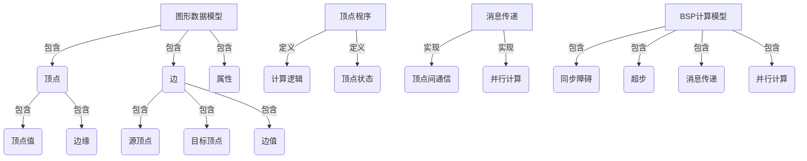

# Giraph原理与代码实例讲解

## 1. 背景介绍

### 1.1 问题的由来

在当今大数据时代，海量数据的处理和分析成为了一个巨大的挑战。传统的计算模型很难有效地处理大规模的图形结构数据,如社交网络、Web图、知识图谱等。图形数据具有复杂的拓扑结构和丰富的关系信息,需要特殊的计算模型和算法来高效处理。

### 1.2 研究现状

为了解决大规模图形数据处理问题,Google提出了Pregel计算模型,它将图形数据分布式存储在集群中,并采用"顺次迭代"的计算模式,通过并行化的顶点程序在每个超步中更新图形状态。Pregel开创性地将图形计算问题转化为数据流计算问题,极大地提高了图形处理的效率。

Apache Giraph是Pregel计算模型在开源社区的实现,它基于Hadoop构建,可以在大规模分布式环境中高效执行图形并行计算任务。Giraph已被广泛应用于社交网络分析、Web链接分析、推荐系统等多个领域。

### 1.3 研究意义

深入理解Giraph的原理和实现细节,对于掌握大规模图形并行计算技术、设计高效的图形算法以及构建图形计算应用具有重要意义。本文将全面介绍Giraph的核心概念、算法原理、数学模型、代码实现和应用场景,为读者提供一个系统的学习参考。

### 1.4 本文结构

本文首先介绍Giraph的核心概念和基本原理,包括图形数据模型、顶点程序、消息传递机制等。然后详细阐述Giraph的核心算法原理和数学模型,包括BSP计算模型、工作流程、聚合器等。接下来通过代码示例讲解Giraph的实现细节,包括开发环境搭建、常用API使用、算法实现等。最后探讨Giraph在实际应用中的场景,并对未来发展趋势和挑战进行展望。

## 2. 核心概念与联系

Giraph的核心概念主要包括以下几个方面:

1. **图形数据模型**:Giraph采用顶点和边的方式来表示图形数据,每个顶点和边都可以携带自定义的属性值。

2. **顶点程序**:顶点程序定义了每个顶点在每个超步中的计算逻辑和状态更新规则,是Giraph并行计算的核心。

3. **消息传递**:顶点之间通过发送消息来交换数据和状态,实现并行计算和协作。

4. **BSP计算模型**:Giraph采用了BSP(Bulk Synchronous Parallel)计算模型,将计算过程划分为一系列的超步(Superstep),每个超步包含并行计算、消息传递和同步障碍三个阶段。

这些核心概念相互关联、相互作用,共同构建了Giraph的分布式图形并行计算框架。下面将详细介绍每个概念的原理和实现细节。

## 3. 核心算法原理 & 具体操作步骤

### 3.1 算法原理概述

Giraph的核心算法原理基于BSP(Bulk Synchronous Parallel)计算模型,将图形计算过程划分为一系列的超步(Superstep)。每个超步包含以下三个阶段:

1. **并行计算阶段**:所有顶点并行执行用户定义的顶点程序,根据当前状态和收到的消息进行计算和状态更新。

2. **消息传递阶段**:顶点向其他顶点发送消息,实现顶点之间的通信和协作。

3. **同步障碍阶段**:所有顶点等待,直到本超步的所有消息传递完成,然后进入下一个超步。

通过重复执行上述三个阶段,直到满足用户定义的终止条件,算法才会结束。BSP模型保证了计算的正确性和一致性,同时利用了并行计算和消息传递机制提高了计算效率。

### 3.2 算法步骤详解

Giraph算法的具体执行步骤如下:

1. **初始化阶段**:
   - 读取输入图形数据,构建初始顶点和边的数据结构。
   - 为每个顶点分配一个唯一的ID和初始值。
   - 将顶点和边数据分片,分布式存储在集群中。

2. **迭代计算阶段**:
   - 进入第一个超步,所有顶点并行执行顶点程序的`compute()`方法。
   - 在`compute()`方法中,顶点根据当前状态和收到的消息执行计算逻辑,更新自身状态。
   - 顶点可以通过`sendMsg()`方法向其他顶点发送消息。
   - 所有顶点完成计算后,进入消息传递和同步障碍阶段。
   - 重复上述过程,进入下一个超步,直到满足终止条件。

3. **聚合器计算**:
   - 在每个超步中,用户可以定义聚合器(Aggregator)来计算全局统计信息。
   - 聚合器收集每个顶点的局部值,并通过聚合函数计算全局值。
   - 全局值可用于控制算法的执行流程或作为算法输出。

4. **终止条件**:
   - 用户可以在顶点程序中设置终止条件,如最大超步数、全局聚合值等。
   - 当满足终止条件时,算法结束执行。

5. **输出结果**:
   - 算法执行完成后,将计算结果输出到指定位置,如HDFS或本地文件系统。

通过上述步骤,Giraph可以高效地执行大规模图形并行计算任务,同时保证计算的正确性和一致性。

### 3.3 算法优缺点

Giraph算法的优点:

1. **高效并行**:利用BSP模型和消息传递机制,可以在大规模分布式环境中高效执行图形并行计算。

2. **容错性强**:基于Hadoop构建,具有良好的容错能力,能够自动处理节点故障。

3. **扩展性好**:可以通过增加计算节点来线性扩展计算能力,满足大规模数据处理需求。

4. **编程灵活**:提供了丰富的API和接口,用户可以灵活定制顶点程序和聚合器逻辑。

5. **生态系统丰富**:与Hadoop生态系统无缝集成,可以复用其他组件,如HDFS、YARN等。

Giraph算法的缺点:

1. **迭代开销大**:BSP模型需要频繁的同步障碍,在每个超步结束时都需要进行全局同步,开销较大。

2. **内存占用高**:需要将整个图形数据加载到内存中,对于超大规模图形可能会面临内存瓶颈。

3. **启动延迟长**:由于需要初始化Hadoop环境和分布式调度,启动时间较长。

4. **学习曲线陡峭**:需要掌握Hadoop生态系统的相关知识,对新手来说有一定的学习曲线。

5. **调试困难**:分布式环境下的调试和故障排查相对复杂。

总的来说,Giraph算法适合处理大规模图形计算任务,但也需要权衡其优缺点,根据具体场景选择合适的计算框架和算法。

### 3.4 算法应用领域

Giraph算法可以广泛应用于以下领域:

1. **社交网络分析**:分析用户关系网络、社区发现、影响力传播等。

2. **Web链接分析**:计算网页权重(PageRank)、检测网络拓扑结构等。

3. **推荐系统**:基于图形算法实现协同过滤、个性化推荐等功能。

4. **知识图谱构建**:从海量数据中抽取实体、关系,构建知识图谱。

5. **金融风险分析**:分析金融交易网络,发现潜在风险和欺诈行为。

6. **交通路径规划**:在交通网络图中寻找最优路径。

7. **生物信息学**:分析蛋白质互作网络、基因调控网络等。

8. **计算机视觉**:图像分割、目标检测和识别等任务。

9. **网络安全**:检测恶意软件传播路径、分析攻击模式等。

总之,任何涉及图形结构数据的领域都可以尝试使用Giraph算法进行分析和处理,发挥其在大规模图形计算方面的优势。

## 4. 数学模型和公式 & 详细讲解 & 举例说明

### 4.1 数学模型构建

Giraph的数学模型基于BSP(Bulk Synchronous Parallel)计算模型,将图形计算过程划分为一系列的超步(Superstep)。每个超步包含三个阶段:并行计算、消息传递和同步障碍。

我们用一个有向图$G=(V,E)$来表示输入的图形数据,其中$V$表示顶点集合,$E$表示边集合。每个顶点$v \in V$都有一个唯一的ID标识,并携带一个值$val(v)$。每条边$e \in E$都连接两个顶点$src(e)$和$dst(e)$,并携带一个值$val(e)$。

在第$k$个超步中,每个顶点$v$都会执行用户定义的顶点程序$compute_v^k$,根据当前状态$state_v^k$和收到的消息$msgs_v^k$进行计算,产生新的状态$state_v^{k+1}$和发送的消息$out\_msgs_v^k$。

$$compute_v^k(state_v^k, msgs_v^k) \rightarrow (state_v^{k+1}, out\_msgs_v^k)$$

消息传递阶段会将所有顶点发送的消息$out\_msgs_v^k$传递给相应的目标顶点,成为下一个超步中该顶点的输入消息$msgs_u^{k+1}$。

$$msgs_u^{k+1} = \bigcup\limits_{v \in V, (v,u) \in E} out\_msgs_v^k$$

同步障碍阶段会等待所有消息传递完成,然后进入下一个超步,重复上述过程,直到满足终止条件。

此外,Giraph还支持定义聚合器(Aggregator),用于计算全局统计信息。聚合器收集每个顶点的局部值$val_v^k$,并通过聚合函数$agg$计算全局值$val_{global}^k$。

$$val_{global}^k = agg(\{val_v^k | v \in V\})$$

全局值可用于控制算法的执行流程或作为算法输出。

通过上述数学模型,我们可以形式化地描述Giraph算法的执行过程,为进一步分析和优化算法奠定基础。

### 4.2 公式推导过程

接下来,我们将推导Giraph算法中一个重要的公式:PageRank算法。PageRank是一种用于计算网页权重的经典算法,被广泛应用于网页排名、链接分析等领域。

假设我们有一个包含$N$个网页的网络$G=(V,E)$,其中$V$表示网页集合,$E$表示链接集合。我们定义每个网页$v$的PageRank值为$PR(v)$,表示该网页的重要性。

PageRank算法的基本思想是:一个网页的PageRank值由链接到它的所有网页的PageRank值的贡献决定。具体来说,如果一个网页$u$链接到网页$v$,那么$u$会将自身的PageRank值按照其出链接数均匀分配给所有出链接的目标网页。

我们用$L(u)$表示网