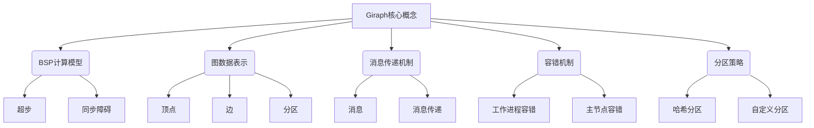
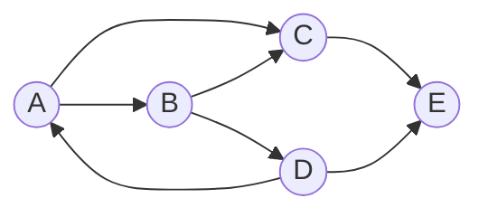

# Giraph图计算框架原理与代码实例讲解

## 1. 背景介绍

### 1.1 问题的由来

在当今大数据时代，海量的数据不断产生和累积,这些数据往往具有复杂的关系结构,传统的关系型数据库难以高效处理。图数据库应运而生,它能够自然地表示实体之间的关系,并提供高效的查询和分析能力。然而,随着数据规模的不断增长,单机图数据库已经无法满足需求,分布式图计算框架成为解决这一问题的关键。

### 1.2 研究现状

Apache Giraph是一个开源的、可伸缩的、容错的分布式图处理系统,它基于Google的Pregel模型,采用BSP(Bulk Synchronous Parallel)计算模型,可以高效地处理大规模图数据。Giraph已经被广泛应用于社交网络分析、Web链接分析、机器学习、推荐系统等领域。

### 1.3 研究意义

掌握Giraph图计算框架的原理和实践,对于解决大规模图数据处理问题具有重要意义。通过深入理解Giraph的设计思想、核心算法和实现细节,可以更好地利用分布式图计算的优势,提高数据处理效率和可扩展性。同时,代码实例的讲解也有助于开发人员快速上手Giraph,加速项目开发进程。

### 1.4 本文结构

本文首先介绍Giraph的核心概念和设计原理,包括BSP计算模型、图数据表示、消息传递机制等。然后详细阐述Giraph的核心算法原理和具体操作步骤,并给出相关的数学模型和公式推导过程。接下来,通过代码实例和详细解释说明,帮助读者掌握Giraph的实际应用。最后,探讨Giraph在实际场景中的应用,并总结未来发展趋势和面临的挑战。

## 2. 核心概念与联系

Giraph的核心概念包括以下几个方面:

1. **BSP计算模型**: Giraph采用BSP(Bulk Synchronous Parallel)计算模型,将计算过程划分为一系列的超步(Superstep),每个超步包含并行计算和同步障碍(Barrier)两个阶段。

2. **图数据表示**: Giraph将图数据表示为顶点(Vertex)和边(Edge)的集合,每个顶点和边都可以携带自定义的数据。图数据被划分为多个分区(Partition),分布在不同的工作节点上进行并行计算。

3. **消息传递机制**: Giraph采用消息传递机制进行顶点之间的通信和数据交换。顶点可以在每个超步中发送和接收消息,从而实现分布式图算法的计算。

4. **容错机制**: Giraph具有容错能力,可以在工作进程(Worker)或主节点(Master)发生故障时自动恢复计算,保证计算的可靠性和一致性。

5. **分区策略**: Giraph支持多种分区策略,包括哈希分区和自定义分区。合理的分区策略可以提高计算效率和数据局部性。

这些核心概念相互关联,共同构建了Giraph的分布式图计算框架。BSP计算模型确保了计算的同步和并行性,图数据表示定义了计算对象,消息传递机制实现了顶点之间的通信,容错机制保证了计算的可靠性,分区策略则影响着计算的效率和可扩展性。

## 3. 核心算法原理与具体操作步骤

### 3.1 算法原理概述

Giraph的核心算法基于Google提出的Pregel模型,采用BSP(Bulk Synchronous Parallel)计算模式。BSP计算模式将计算过程划分为一系列的超步(Superstep),每个超步包含三个阶段:

1. **并行计算阶段**: 所有顶点并行执行用户定义的计算逻辑,处理接收到的消息,更新自身状态,并可选择发送消息给其他顶点。

2. **消息传递阶段**: 系统收集并重新分发所有顶点发送的消息,准备下一个超步的计算。

3. **同步障碍阶段**: 所有工作节点等待其他节点完成当前超步的计算,并进行必要的同步操作,如检查算法是否收敛等。

通过重复执行这三个阶段,直到算法收敛或达到最大超步数,图计算任务即可完成。

### 3.2 算法步骤详解

Giraph图计算算法的具体步骤如下:

1. **初始化**: 用户定义图计算任务的入口类,实现`Vertex`接口,重写相关方法,如`compute()`方法。Giraph根据输入数据构建初始图结构,并将顶点和边分布到不同的工作节点上。

2. **消息传递与计算**: 进入BSP超步循环,每个超步包含以下操作:

   a. 并行计算阶段: 每个工作节点上的顶点并行执行`compute()`方法,处理接收到的消息,更新自身状态,并可选择发送消息给其他顶点。

   b. 消息传递阶段: Giraph收集并重新分发所有顶点发送的消息,准备下一个超步的计算。

   c. 同步障碍阶段: 所有工作节点等待其他节点完成当前超步的计算,并进行必要的同步操作,如检查算法是否收敛等。

3. **终止条件检查**: 在每个超步结束时,Giraph检查算法是否已经收敛或达到最大超步数。如果满足终止条件,则结束计算;否则进入下一个超步,重复步骤2。

4. **结果输出**: 算法执行完毕后,Giraph将最终的顶点状态输出到指定的位置,供用户进一步处理和分析。

### 3.3 算法优缺点

Giraph图计算算法的优点包括:

- **高度并行**: BSP计算模型允许大量顶点并行执行计算,充分利用分布式系统的计算资源。
- **容错性强**: 工作节点或主节点发生故障时,Giraph可以自动恢复计算,保证结果的一致性。
- **可扩展性好**: 随着数据规模和计算资源的增加,Giraph可以线性扩展,处理更大规模的图数据。
- **编程模型简单**: 用户只需要实现`Vertex`接口,编写顶点计算逻辑,无需关注底层的分布式细节。

但同时,Giraph图计算算法也存在一些缺点:

- **延迟较高**: BSP计算模型需要频繁的同步障碍,导致计算延迟较高。
- **内存占用大**: 每个工作节点需要保存本地分区的所有顶点和边数据,对内存占用较大。
- **不适合迭代计算**: 对于需要多次迭代的算法,BSP模型的同步开销较大,效率较低。
- **消息冗余**: 在某些算法中,顶点之间可能会发送大量冗余消息,浪费网络带宽。

### 3.4 算法应用领域

Giraph图计算框架可以广泛应用于以下领域:

- **社交网络分析**: 分析用户之间的关系网络,发现社区结构、影响力用户等。
- **Web链接分析**: 计算网页的PageRank值,用于改进搜索引擎的排名算法。
- **推荐系统**: 基于用户之间的相似度计算,为用户推荐感兴趣的商品或内容。
- **知识图谱构建**: 从海量数据中提取实体和关系,构建知识图谱。
- **金融风险分析**: 分析金融机构之间的风险传播路径,评估系统性风险。
- **交通路径规划**: 在复杂的交通网络中计算最优路径。
- **生物信息学**: 分析蛋白质互作网络,研究基因调控机制。

## 4. 数学模型和公式详细讲解与举例说明

### 4.1 数学模型构建

在Giraph图计算框架中,图数据可以用数学模型表示为一个有向图$G=(V, E)$,其中$V$表示顶点集合,$E$表示边集合。每个顶点$v \in V$可以携带自定义的数据,如标识符、属性值等。每条边$e \in E$表示两个顶点之间的关系,也可以携带自定义的数据,如边的权重等。

$$
G = (V, E) \\
V = \{v_1, v_2, \dots, v_n\} \\
E = \{(v_i, v_j) | v_i, v_j \in V\}
$$

在BSP计算模型中,每个超步$t$可以表示为一个函数$S_t$,将图$G$的状态从$t-1$超步映射到$t$超步:

$$
S_t: G_{t-1} \rightarrow G_t
$$

其中,$G_t$表示第$t$个超步后图$G$的状态,包括每个顶点的值和发送的消息等。

### 4.2 公式推导过程

在Giraph中,一个常见的图算法是计算顶点的PageRank值,用于评估网页的重要性。PageRank算法的核心思想是,一个网页的重要性不仅取决于它被其他网页链接的次数,还取决于链接它的网页的重要性。

设$PR(v_i)$表示顶点$v_i$的PageRank值,$N$表示总顶点数,$d$表示阻尼系数(通常取$0.85$),$M(v_i)$表示指向$v_i$的入边集合,$L(v_j)$表示顶点$v_j$的出边数。则PageRank值的计算公式如下:

$$
PR(v_i) = \frac{1-d}{N} + d \sum_{v_j \in M(v_i)} \frac{PR(v_j)}{L(v_j)}
$$

该公式可以递归计算每个顶点的PageRank值,直到收敛或达到最大迭代次数。

### 4.3 案例分析与讲解

以下是一个简单的示例图,用于说明PageRank算法的计算过程:

假设初始时,每个顶点的PageRank值为$\frac{1}{5}$,阻尼系数$d=0.85$。

第一次迭代后,各顶点的PageRank值为:

$$
\begin{aligned}
PR(A) &= \frac{1-0.85}{5} + 0.85 \times (\frac{1}{5} \times \frac{1}{2} + 0) = 0.235 \\
PR(B) &= \frac{1-0.85}{5} + 0.85 \times (\frac{1}{5} \times 0 + \frac{1}{5} \times 0) = 0.15 \\
PR(C) &= \frac{1-0.85}{5} + 0.85 \times (\frac{1}{5} \times \frac{1}{2} + \frac{1}{5} \times \frac{1}{1}) = 0.335 \\
PR(D) &= \frac{1-0.85}{5} + 0.85 \times (\frac{1}{5} \times \frac{1}{1} + 0) = 0.285 \\
PR(E) &= \frac{1-0.85}{5} + 0.85 \times (\frac{1}{5} \times \frac{1}{1} + \frac{1}{5} \times \frac{1}{1}) = 0.395
\end{aligned}
$$

经过多次迭代,PageRank值将逐渐收敛,最终得到每个顶点的重要性排序。

### 4.4 常见问题解答

**Q: 为什么要使用阻尼系数$d$?**

A: 阻尼系数$d$的引入是为了解决PageRank算法中的"环问题"。如果一组顶点之间形成了一个闭环,它们的PageRank值会相互传递,导致算法无法收敛。引入$