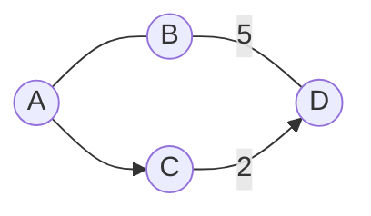
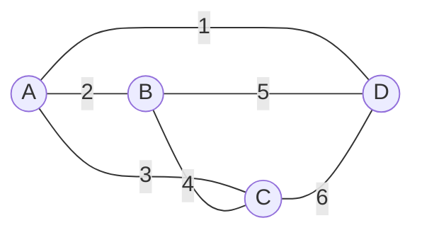

# Graph Edge原理与代码实例讲解

作者：禅与计算机程序设计艺术 / Zen and the Art of Computer Programming

## 1. 背景介绍
### 1.1 问题的由来
在计算机科学领域中,图(Graph)是一种非常重要且广泛应用的数据结构。图由节点(Vertex)和边(Edge)组成,可以用来表示各种复杂的关系网络,如社交网络、交通网络、电信网络等。而在图的众多概念中,边(Edge)是一个非常关键的组成部分,它表示节点之间的连接关系。深入理解图的边,对于图算法的设计与应用具有重要意义。

### 1.2 研究现状
目前,关于图的边的研究主要集中在以下几个方面:

(1)边的表示方法。常见的边表示方法有邻接矩阵、邻接表、边集数组等。不同的表示方法在时间和空间复杂度上各有优劣。

(2)边的权重。图中的边可以是有权重的,即每条边都对应一个权值。边的权重在最短路径、最小生成树等算法中发挥重要作用。

(3)边的方向。图可以分为有向图和无向图,在有向图中边是有方向的,而无向图中边没有方向。

(4)平行边和自环边。图中可能存在平行边(两个顶点之间的多条边)和自环边(一个顶点到自身的边),需要在图的建模和算法设计时加以考虑。

### 1.3 研究意义
深入研究图的边对于以下方面具有重要意义:

(1)优化图的存储。根据问题的特点选择合适的边表示方法,可以节省存储空间,提高访问效率。

(2)改进图算法性能。很多图算法如Dijkstra算法、Kruskal算法等,都需要频繁地访问和处理边,优化边的表示和操作可以显著改进算法性能。

(3)拓展图的应用。图在许多领域都有广泛应用,如何根据具体应用场景,合理设计和使用边,是发掘图能力的关键。

### 1.4 本文结构
本文将重点介绍图的边的相关内容,主要包括以下几个部分:

- 第2部分介绍图边的核心概念与联系。
- 第3部分介绍图边相关的核心算法原理与步骤。 
- 第4部分从数学角度对边进行建模分析,并举例说明。
- 第5部分通过代码实例演示如何实现和使用图的边。
- 第6部分讨论图边在实际应用场景中的作用。
- 第7部分推荐图边相关的学习资源和工具。
- 第8部分总结全文,并展望图边的未来发展方向。

## 2. 核心概念与联系
在图论中,边是图的基本组成元素,用于表示图中节点之间的连接关系。边可以分为以下几类:

- 无向边:表示两个节点之间的双向连接,没有方向性。
- 有向边:表示从一个节点到另一个节点的单向连接,有明确的方向性。
- 权重边:边上带有权重值,表示连接的强度、距离、成本等属性。

图根据边的连接特性,可以分为以下几类:

- 无向图:图中只有无向边的图。
- 有向图:图中只有有向边的图。 
- 混合图:图中同时包含有向边和无向边。
- 加权图:图中的边带有权重值。

边与图的其他概念之间也有密切联系,例如:

- 节点的度:与节点相连的边的数量。
- 路径:图中一系列边首尾相连形成的序列。
- 连通性:通过边可以从任意节点到达其他节点。

下图展示了一个包含各种边的示例图:



## 3. 核心算法原理 & 具体操作步骤
### 3.1 算法原理概述
图的边在许多经典图算法中发挥着核心作用,例如:

- 最小生成树算法(Kruskal、Prim):在加权无向图中找出连通所有节点权重和最小的生成树。
- 最短路径算法(Dijkstra、Floyd):在加权图中找出两个节点之间的最短路径。
- 拓扑排序:在有向无环图中将节点排序,使得每条有向边从前面的节点指向后面的节点。

这些算法的核心思想都是通过边来刻画节点之间的关系,并通过边的权重、方向等属性进行计算和优化。

### 3.2 算法步骤详解
以Kruskal最小生成树算法为例,其基本步骤如下:

1. 将图的所有边按照权重从小到大排序。
2. 初始化一个空的生成树edge集合,和一个记录节点连通性的并查集。
3. 从权重最小的边开始,对每条边执行以下操作:
   - 判断边的两个节点是否已经连通(通过并查集判断)。
   - 如果未连通,则将该边加入生成树edge集合,同时合并两个节点到同一个连通分量。
   - 如果已连通,则跳过该边,避免形成环。
4. 重复步骤3,直到生成树edge包含 n-1 条边(n为节点数),算法结束。

### 3.3 算法优缺点
Kruskal算法的主要优点包括:

- 算法思想简单,易于理解和实现。
- 能够保证得到全局最优解,即权重和最小的生成树。
- 时间复杂度为 O(ElogE),对于稀疏图效率较高。

但Kruskal算法也存在一些局限:

- 需要先对所有边进行排序,当边数很大时耗时较多。 
- 并查集的合并操作会使算法常数项较大。
- 不适合于频繁变化的动态图。

### 3.4 算法应用领域
最小生成树算法在许多领域都有应用,例如:

- 网络设计:在给定若干网络节点的情况下,如何连接这些节点使得总的连接成本最小。
- 集成电路设计:芯片上不同的元器件如何布线连接,使得布线总长度最短。
- 聚类分析:将一组数据点划分成多个簇,使得簇内距离最小而簇间距离最大。

## 4. 数学模型和公式 & 详细讲解 & 举例说明
### 4.1 数学模型构建
图的边可以用数学语言来刻画。假设图G=(V,E),其中V表示节点集合,E表示边集合。

- 无向边(u,v)∈E,表示节点u和v之间存在一条无向边。
- 有向边<u,v>∈E,表示存在一条从节点u到v的有向边。
- 权重w(u,v)表示边(u,v)的权重值。

例如,一个带权无向图可以表示为G=(V,E,w),其中w是E到R的映射,表示每条边的权重。

### 4.2 公式推导过程
以Kruskal算法为例,假设图G有n个节点,m条边,则算法的时间复杂度推导如下:

1. 对所有边进行排序,时间复杂度为O(mlogm)。
2. 初始化并查集,需要O(n)的时间。
3. 对每条边进行遍历,共需要m次操作:
   - 并查集的查找操作,时间复杂度为O(logn)。
   - 并查集的合并操作,时间复杂度为O(logn)。
4. 故算法总体时间复杂度为:
$$ O(mlogm) + O(n) + O(m*logn) = O(mlogm) $$

### 4.3 案例分析与讲解
考虑以下无向带权图:



使用Kruskal算法求其最小生成树的过程如下:

1. 对所有边按权重排序:(A,D)=1,(A,B)=2,(A,C)=3,(B,C)=4,(B,D)=5,(C,D)=6
2. 初始化空边集T,和并查集UF
3. 遍历每条边:
   - (A,D)=1,A和D未连通,加入T,合并A和D
   - (A,B)=2,A和B未连通,加入T,合并A和B
   - (A,C)=3,A和C未连通,加入T,合并A和C
   - (B,C)=4,B和C已连通,跳过
   - (B,D)=5,B和D已连通,跳过
   - (C,D)=6,C和D已连通,跳过
4. 最终得到最小生成树的边集合为 T = {(A,D),(A,B),(A,C)}

### 4.4 常见问题解答
Q:Kruskal算法能否用于有向图?
A:Kruskal算法是针对无向图的,如果是有向图,需要先将有向图转化为无向图,即将每条有向边替换为一条无向边,再应用Kruskal算法。

Q:如何处理图中的重边和自环边?
A:在Kruskal算法中,重边可以直接保留,因为算法会自动跳过形成环的边。自环边可以直接删除,因为自环边不影响最小生成树的结果。

## 5. 项目实践：代码实例和详细解释说明
### 5.1 开发环境搭建
本文采用Python语言实现图的边和Kruskal算法,需要安装以下库:

- networkx:用于创建和操作图。
- matplotlib:用于图形化展示图。

可以通过以下命令安装:

```bash
pip install networkx matplotlib
```

### 5.2 源代码详细实现
下面是使用Python的networkx库实现Kruskal算法的核心代码:

```python
import networkx as nx

def kruskal(G):
    """Kruskal最小生成树算法"""
    T = nx.Graph()
    edges = sorted(G.edges(data=True), key=lambda x: x[2]['weight'])
    uf = UnionFind(G.nodes())
    for u, v, attr in edges:
        if uf.find(u) != uf.find(v):
            T.add_edge(u, v, weight=attr['weight'])
            uf.union(u, v)
    return T

class UnionFind:
    """并查集数据结构"""
    def __init__(self, nodes):
        self.parent = {node: node for node in nodes}
    
    def find(self, x):
        if self.parent[x] != x:
            self.parent[x] = self.find(self.parent[x])
        return self.parent[x]
    
    def union(self, x, y):
        root_x, root_y = self.find(x), self.find(y)
        if root_x != root_y:
            self.parent[root_x] = root_y
```

### 5.3 代码解读与分析
以上代码主要包含两个部分:

1. UnionFind类,实现了并查集的基本操作:
   - `__init__`方法初始化节点的父节点为自身。
   - `find`方法查找一个节点的根节点,并进行路径压缩。
   - `union`方法合并两个节点所在的集合。
2. kruskal函数,实现了Kruskal最小生成树算法:
   - 首先将所有边按照权重从小到大排序。
   - 初始化一个空图T和并查集uf。
   - 遍历每条边,如果边的两个节点不连通,则添加该边到T中,并合并两个节点。
   - 最终返回最小生成树T。

算法的核心在于并查集的使用,通过并查集可以高效地判断两个节点是否连通,避免形成环。

### 5.4 运行结果展示
下面是一个完整的运行示例:

```python
import networkx as nx
import matplotlib.pyplot as plt

# 创建一个带权无向图
G = nx.Graph()
G.add_edge('A', 'B', weight=2)
G.add_edge('A', 'C', weight=3)
G.add_edge('A', 'D', weight=1)
G.add_edge('B', 'C', weight=4)
G.add_edge('B', 'D', weight=5)
G.add_edge('C', 'D', weight=6)

# 调用Kruskal算法得到最小生成树
T = kruskal(G)

# 可视化展示原图和最小生成树
plt.figure(figsize=(8, 4))
plt.subplot(121)
nx.draw(G, with_labels=True)
plt.title("Original Graph")

plt.subplot(122)
nx.draw(T