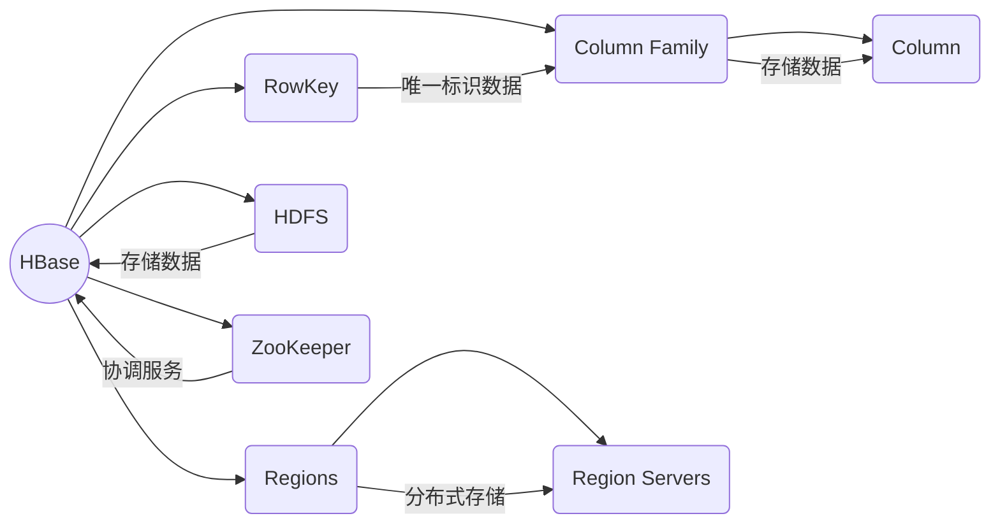

# HBase RowKey设计原理与代码实例讲解

## 1. 背景介绍

### 1.1 问题的由来

在大数据时代,数据量的快速增长对存储系统提出了更高的要求。传统的关系型数据库在处理海量数据时,往往会面临可扩展性、高并发等一系列挑战。为了解决这些问题,诞生了一种全新的数据存储模型——列式数据库(Column-Oriented Database)。作为列式数据库的代表,HBase凭借其高性能、高可靠性和可伸缩性,已经广泛应用于许多大数据场景中。

在HBase中,数据是以键值对(Key-Value)的形式存储的,其中Key被称为RowKey。RowKey的设计直接影响到数据的物理存储方式,对HBase的性能和功能有着重大影响。因此,合理地设计RowKey是HBase应用开发中的一个关键环节。

### 1.2 研究现状

目前,已有许多研究人员和开发者就RowKey的设计原则进行了探讨。大多数人员都认为,RowKey应该满足以下几个基本原则:

1. **唯一性**:RowKey必须在表中是唯一的,以保证数据的准确性和一致性。
2. **有序性**:RowKey应该按照某种规则排列,以便于数据的查询和扫描。
3. **长度适中**:RowKey的长度不宜过长或过短,以避免浪费存储空间或影响查询效率。
4. **热点问题**:RowKey的设计应该考虑数据的访问模式,避免产生热点区域。

除了上述基本原则外,RowKey的设计还需要结合具体的应用场景和需求。不同的场景可能会有不同的设计策略和权衡考虑。

### 1.3 研究意义

合理地设计RowKey对于充分发挥HBase的性能至关重要。一个优秀的RowKey设计不仅可以提高数据查询和扫描的效率,还能够优化数据的物理存储方式,从而提升整个系统的性能和可扩展性。此外,良好的RowKey设计还有助于降低数据热点问题,提高系统的稳定性和可靠性。

因此,深入研究RowKey的设计原理和实践方法,对于HBase应用的开发和优化具有重要的理论和实践意义。

### 1.4 本文结构

本文将从以下几个方面对HBase RowKey设计进行全面的阐述和分析:

1. 介绍RowKey的核心概念及其与HBase其他组件的关系。
2. 详细解释RowKey设计的核心算法原理和具体操作步骤。
3. 构建RowKey设计的数学模型,并给出公式推导和案例分析。
4. 提供RowKey设计的代码实例,并进行详细的解释和运行结果展示。
5. 探讨RowKey设计在不同应用场景中的实践。
6. 介绍RowKey设计相关的工具和学习资源。
7. 总结RowKey设计的发展趋势和面临的挑战。
8. 列出RowKey设计中的常见问题并给出解答。

## 2. 核心概念与联系

在深入探讨RowKey设计原理之前,我们需要先了解一些HBase的核心概念及其之间的关系。

1. **RowKey**: 是HBase表中用于唯一标识数据的主键。它决定了数据在Region Server中的物理存储位置,对查询和扫描性能有重大影响。
2. **Column Family**: 是HBase表的列族,用于存储相关的列。同一个列族中的数据会存储在同一个文件中,以提高查询效率。
3. **Column**: 是列族中的具体列,用于存储数据值。
4. **Regions**: 是HBase表在Region Server上的分区,用于实现数据的分布式存储和负载均衡。
5. **Region Servers**: 是HBase集群中实际存储数据的节点。
6. **HDFS**: 是HBase底层的分布式文件系统,用于存储HBase的数据文件。
7. **ZooKeeper**: 是HBase集群中的协调服务,用于维护集群状态和元数据信息。

从上图可以看出,RowKey在HBase中扮演着至关重要的角色。它不仅决定了数据的物理存储位置,还影响着数据的查询和扫描性能。因此,合理地设计RowKey对于发挥HBase的性能至关重要。

## 3. 核心算法原理 & 具体操作步骤

### 3.1 算法原理概述

RowKey的设计原理主要基于以下几个核心思想:

1. **数据热点分散**:通过合理的RowKey设计,将热点数据分散到不同的Region中,从而避免单个Region承载过多的读写压力。
2. **数据有序性**:RowKey应该按照某种规则排列,以便于数据的查询和扫描操作。
3. **数据分组**:将相关的数据通过RowKey进行分组,以便于数据的管理和维护。
4. **反向查询**:在某些场景下,可以通过反向设计RowKey的方式,实现特定的查询需求。

基于上述原理,我们可以总结出RowKey设计的一般步骤:

1. 分析数据特征和访问模式,确定RowKey的组成部分。
2. 根据数据热点情况,决定RowKey中各部分的排列顺序。
3. 考虑数据分组需求,将相关数据的RowKey设计成相似的前缀。
4. 根据查询需求,决定是否需要进行反向查询的RowKey设计。
5. 确定RowKey的长度和编码方式,平衡存储空间和查询效率。

### 3.2 算法步骤详解

下面我们将详细解释RowKey设计的具体步骤:

#### 步骤1: 分析数据特征和访问模式

在设计RowKey之前,我们需要首先分析数据的特征和访问模式。通常需要考虑以下几个方面:

- **数据类型**: 是结构化数据还是非结构化数据?数据的格式是什么?
- **数据量**: 预计数据的总量是多少?数据的增长速度如何?
- **访问模式**: 数据的主要查询方式是什么?是范围查询还是点查询?是读多写少还是写多读少?
- **热点情况**: 数据访问是否存在热点?热点数据的分布情况如何?

通过对上述问题的分析,我们可以确定RowKey需要包含哪些部分,以及各部分的排列顺序。

#### 步骤2: 确定RowKey的组成部分

根据数据特征和访问模式,我们需要决定RowKey由哪些部分组成。常见的RowKey组成部分包括:

- **行键(RowKey)**: 用于唯一标识一行数据,通常由多个部分组成。
- **时间戳(Timestamp)**: 记录数据的写入时间,用于数据的版本控制和过期处理。
- **反向查询部分(Reverse)**: 用于支持特定的查询需求,如范围查询等。
- **分区键(Partition Key)**: 用于将数据分散到不同的Region中,避免热点问题。
- **其他部分**: 根据具体需求添加其他辅助信息,如设备ID、地理位置等。

不同的应用场景可能会有不同的RowKey组成部分,需要根据具体需求进行设计。

#### 步骤3: 确定RowKey中各部分的排列顺序

确定了RowKey的组成部分后,我们需要决定各部分在RowKey中的排列顺序。排列顺序的决定原则如下:

1. **将查询条件放在前面**:如果有特定的查询条件(如时间范围查询),应该将该部分放在RowKey的前面,以提高查询效率。
2. **将热点数据分散的部分放在后面**:如果某些部分可能会产生热点数据,应该将其放在RowKey的后面,以将热点数据分散到不同的Region中。
3. **考虑数据分组需求**:如果需要将相关数据进行分组,可以通过设计相似的RowKey前缀来实现。
4. **反向查询部分放在最后**:如果需要支持反向查询,应该将反向查询部分放在RowKey的最后。

通过合理的排列顺序,我们可以优化RowKey的查询和扫描性能,同时避免数据热点问题。

#### 步骤4: 确定RowKey的长度和编码方式

在确定了RowKey的组成部分和排列顺序后,我们需要决定RowKey的总长度和各部分的编码方式。

RowKey的长度需要平衡存储空间和查询效率。一般来说,RowKey的长度不宜过长或过短。过长的RowKey会占用更多的存储空间,而过短的RowKey可能会导致数据热点问题。通常RowKey的长度在16~100个字节之间是比较合理的。

对于RowKey中各部分的编码方式,我们需要考虑以下几个因素:

- **可排序性**: 编码方式应该保证RowKey的有序性,以便于范围查询和扫描操作。
- **长度固定**: 为了方便比较和处理,各部分的编码长度应该是固定的。
- **字符集**: 根据数据的特征,选择合适的字符集进行编码,如ASCII、UTF-8等。
- **填充方式**: 对于长度不足的部分,需要决定是使用前置填充还是后置填充。

常见的编码方式包括:

- **数字编码**: 将数字直接转换为字节数组,适用于数字类型的数据。
- **字符串编码**: 将字符串转换为字节数组,需要注意字符集和长度问题。
- **反向编码**: 将数字或字符串反向编码,用于支持反向查询。
- **混合编码**: 将多个部分合并编码,以节省RowKey长度。

通过合理的编码方式,我们可以优化RowKey的存储空间和查询效率。

### 3.3 算法优缺点

RowKey设计算法具有以下优点:

1. **提高查询效率**: 通过合理的RowKey设计,可以有效地提高数据的查询和扫描效率。
2. **避免数据热点**: 将热点数据分散到不同的Region中,可以避免单个Region承载过多的读写压力。
3. **支持数据分组**: 通过设计相似的RowKey前缀,可以将相关数据进行分组,方便数据管理和维护。
4. **支持反向查询**: 通过反向编码RowKey的某些部分,可以支持特定的查询需求,如范围查询等。

同时,RowKey设计算法也存在一些缺点和局限性:

1. **设计复杂度高**: RowKey的设计需要综合考虑多方面因素,设计过程相对复杂。
2. **维护成本高**: 一旦RowKey设计确定,后续的修改和调整会比较困难,维护成本较高。
3. **存在性能瓶颈**: 虽然RowKey可以优化查询效率,但在某些极端情况下,仍可能存在性能瓶颈。
4. **编码方式限制**: 不同的编码方式可能会对RowKey的长度和可排序性产生影响。

因此,在实际应用中,我们需要根据具体的场景和需求,权衡RowKey设计的优缺点,做出合理的设计决策。

### 3.4 算法应用领域

RowKey设计算法可以应用于各种需要使用HBase的大数据场景,包括但不限于:

1. **物联网数据存储**: 将来自各种传感器和设备的物联网数据存储在HBase中,RowKey可以包含设备ID、时间戳等信息。
2. **日志数据分析**: 将各种应用程序和系统的日志数据存储在HBase中,RowKey可以包含日志时间、日志级别等信息。
3. **时序数据存储**: 将各种时