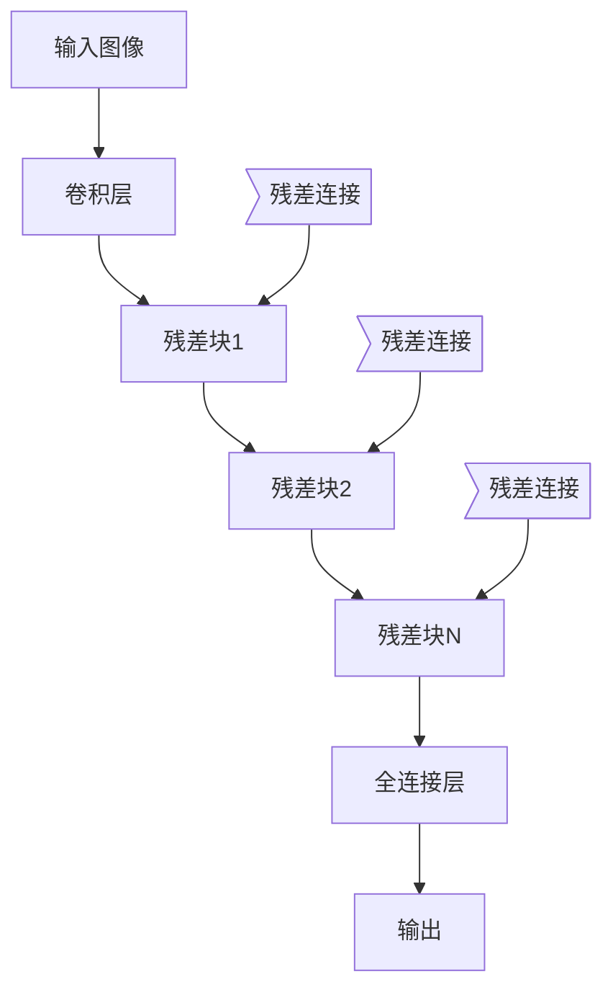

# ImageNet与AI图像识别的历史

## 1. 背景介绍

### 1.1 问题的由来

在过去的几十年里,人工智能领域取得了长足的进步,尤其是在计算机视觉和图像识别方面。图像识别是指使用计算机系统从数字图像或视频中识别和检测出特定的对象、人物、文字、活动等,这是人工智能领域中一个极具挑战的任务。随着数字图像和视频数据的爆炸式增长,高效准确的图像识别技术变得越来越重要。

传统的图像识别方法主要基于手工设计的特征提取和分类算法,但这种方法存在一些固有的局限性。首先,手工设计的特征往往无法很好地捕捉到图像的所有重要信息,导致识别精度受限。其次,不同的图像类别需要设计不同的特征提取器,这使得系统缺乏通用性和可扩展性。

### 1.2 研究现状

为了解决上述问题,研究人员开始探索使用深度学习技术进行图像识别。深度学习是一种机器学习方法,它通过构建深层神经网络模型,从大量数据中自动学习特征表示,并用于各种任务如分类、检测、识别等。相比传统方法,深度学习模型具有更强的表达能力和泛化性能,能够从原始数据中自动提取出高层次的抽象特征。

2012年,AlexNet在ImageNet大规模视觉识别挑战赛(ILSVRC)中取得了突破性的成绩,它的Top-5错误率比之前的最佳方法低了近10个百分点。这标志着深度学习在计算机视觉领域的崛起,也推动了ImageNet数据集在图像识别研究中的广泛应用。

### 1.3 研究意义

ImageNet是一个大规模的图像数据集,包含了1400多万张手工标注的图像,涵盖了20000多个类别。ImageNet数据集的出现极大地促进了深度学习在图像识别领域的发展,为训练大型深度神经网络模型提供了必要的大数据支持。同时,ImageNet也为研究人员提供了一个公平、权威的基准测试平台,推动了图像识别算法的快速进步和创新。

本文将系统地回顾ImageNet数据集的发展历程,介绍基于ImageNet的主要图像识别模型及其核心算法原理,分析这些模型在不同应用场景中的实践,并探讨图像识别领域未来的发展趋势和挑战。

### 1.4 本文结构  

本文的主体结构如下:

- 第2部分介绍ImageNet数据集的概念、发展历史以及在图像识别研究中的重要意义。
- 第3部分详细阐述基于ImageNet的主流图像识别模型及其核心算法原理,包括卷积神经网络(CNN)、残差网络(ResNet)、注意力机制(Attention)等。
- 第4部分使用数学模型和公式对算法进行形式化描述,并通过具体案例进行讲解和分析。
- 第5部分提供实际的代码实现示例,并对关键模块进行解读和分析。
- 第6部分介绍图像识别技术在各个领域的实际应用场景和案例分析。
- 第7部分推荐一些有用的学习资源、开发工具和相关论文。
- 第8部分总结图像识别领域的研究成果,展望未来的发展趋势和面临的挑战。
- 第9部分是附录,回答一些常见的问题。

## 2. 核心概念与联系

在深入探讨图像识别算法之前,我们先介绍一些核心概念及它们之间的联系:

1. **图像识别(Image Recognition)**: 使用计算机系统从数字图像或视频中识别和检测出特定的对象、人物、文字、活动等。它是计算机视觉领域的一个重要分支。

2. **ImageNet数据集**: 一个大规模的手工标注图像数据集,包含1400多万张图像,涵盖20000多个类别,为训练深度学习模型提供了大数据支持。

3. **深度学习(Deep Learning)**: 一种机器学习方法,通过构建深层神经网络模型从大量数据中自动学习特征表示,具有强大的表达和泛化能力。

4. **卷积神经网络(Convolutional Neural Network, CNN)**: 一种常用的深度学习模型,通过卷积、池化等操作自动学习图像特征,广泛应用于图像识别等计算机视觉任务。

5. **残差网络(Residual Network, ResNet)**: 一种具有残差连接的深层CNN模型,可以有效解决深层网络的梯度消失问题,在ImageNet等数据集上取得了卓越的表现。

6. **注意力机制(Attention Mechanism)**: 一种用于加权不同特征的机制,可以让模型自适应地关注图像的不同区域,提高了模型的性能和可解释性。

7. **迁移学习(Transfer Learning)**: 将在大型数据集(如ImageNet)上预训练的模型知识迁移到新的任务或数据集上,可以加速训练并提高性能。

8. **目标检测(Object Detection)**: 在图像中同时识别出物体的类别和位置,是图像识别的一个重要分支。

9. **语义分割(Semantic Segmentation)**: 将图像中的每个像素点与某个类别相关联,实现对图像的像素级别理解。

这些概念相互关联、环环相扣,共同构建了当前图像识别领域的理论和技术体系。接下来我们将详细介绍其中的核心算法原理。

## 3. 核心算法原理 & 具体操作步骤  

### 3.1 算法原理概述

#### 卷积神经网络(CNN)

卷积神经网络是图像识别领域中应用最广泛的一种深度学习模型。CNN的基本思想是通过卷积操作在不同层次上自动学习图像的局部特征,并通过多层网络将这些局部特征组合成更高层次的全局特征表示,最终用于分类或其他任务。

CNN一般由以下几个关键模块组成:

1. **卷积层(Convolutional Layer)**: 使用滤波器(也称卷积核)在图像上滑动,提取局部特征。

2. **池化层(Pooling Layer)**: 对卷积层的输出进行下采样,减少数据维度,提取主要特征。

3. **全连接层(Fully Connected Layer)**: 将前面层的特征映射到样本标记空间,用于分类或回归任务。

4. **非线性激活函数**: 如ReLU函数,增加模型的非线性表达能力。

5. **正则化技术**: 如Dropout、BN等,用于防止过拟合。

CNN通过层层组合和非线性变换,可以自动从原始图像中学习出多层次的抽象特征表示,并将其用于最终的识别任务。

#### 残差网络(ResNet)

随着网络层数的增加,传统CNN会遇到"退化"问题,即增加层数后模型的性能反而下降。为了解决这个问题,残差网络(ResNet)提出了一种残差学习的思路。

ResNet的核心思想是在网络中构建"残差连接(Residual Connection)"。对于给定的输入x,我们期望学习到的映射为H(x)=F(x)+x,其中F(x)是要学习的残差映射。这样,如果残差映射F(x)=0,那么H(x)=x,即模型可以通过恒等映射来传递信息,从而缓解梯度消失或爆炸的问题。

ResNet的网络结构如下所示:

残差块的基本结构是两个卷积层,中间使用批归一化(BN)和ReLU激活函数。残差连接将输入直接传递到残差块的输出,并与卷积的结果相加。这种设计使得模型可以更容易地学习恒等映射,从而缓解退化问题。

通过堆叠大量残差块,ResNet可以构建出非常深的网络结构,在ImageNet等数据集上取得了很高的识别精度。

#### 注意力机制(Attention)

注意力机制最初是在自然语言处理领域提出的,用于加权不同的词元特征。后来,注意力机制也被成功应用到了计算机视觉领域,用于加权图像的不同区域特征。

在图像识别任务中,注意力机制可以让模型自适应地关注图像的不同区域,从而提高模型的性能和可解释性。常见的注意力机制包括:

1. **空间注意力(Spatial Attention)**: 对图像的不同空间位置的特征赋予不同的权重。

2. **通道注意力(Channel Attention)**: 对特征图的不同通道赋予不同的权重。

3. **混合注意力(Mixed Attention)**: 结合空间和通道注意力的方法。

下面以SENet(Squeeze-and-Excitation Network)为例,介绍通道注意力机制的基本原理:

SENet的注意力机制包括以下步骤:

1. **Squeeze**: 使用全局平均池化将输入特征图压缩为一个通道描述子向量。

2. **Excitation**: 将通道描述子输入全连接层和激活函数,得到每个通道的权重向量。

3. **重新缩放**: 将权重向量重新缩放到原特征图的维度,并与输入特征图逐元素相乘,得到注意力加权后的输出特征图。

通过学习每个通道的权重,注意力机制可以自适应地选择对任务更加重要的特征,从而提高模型的性能。

### 3.2 算法步骤详解

接下来,我们将对上述三种核心算法的具体步骤进行更加详细的解释。

#### 卷积神经网络(CNN)

CNN的基本操作步骤如下:

1. **输入层**: 接收原始图像数据,如RGB三通道图像。

2. **卷积层**: 
    - 使用多个不同的卷积核(滤波器)在输入特征图上滑动。
    - 每个卷积核对应输出一个特征图。
    - 卷积核的参数在训练过程中被学习。

3. **激活层**: 通常使用ReLU函数对卷积层的输出进行非线性激活。

4. **池化层**:
    - 对激活后的特征图进行下采样,减小数据维度。
    - 常用的池化操作有最大池化和平均池化。

5. **重复2-4步骤**: 堆叠多个卷积层、激活层和池化层,形成深层网络结构。

6. **全连接层**: 将前面层的高层次特征映射到样本标记空间。

7. **输出层**: 使用Softmax或其他函数进行多分类或回归。

8. **反向传播**: 计算损失函数,使用优化算法(如SGD)更新网络参数。

在训练过程中,CNN会自动学习卷积核的参数,使得在前向传播时能够提取出有效的图像特征,从而完成最终的识别任务。

#### 残差网络(ResNet)

ResNet的主要步骤包括:

1. **输入层**: 接收原始图像数据。

2. **卷积层**: 对输入图像进行初步卷积和池化操作。

3. **残差块**:
    - 输入经过两个卷积层、BN层和ReLU激活。
    - 将输入直接传递到残差块输出,并与卷积结果相加。
    - 堆叠多个残差块,构建深层网络。

4. **全连接层**: 将最后一个残差块的输出映射到标记空间。

5. **输出层**: 使用Softmax等进行分类或回归。

6. **反向传播**: 计算损失函数,优化网络参数。

在残差块中,输入可以直接传递到输出,残差映射只需要学习输入和输出之间的残差部分。这种设计