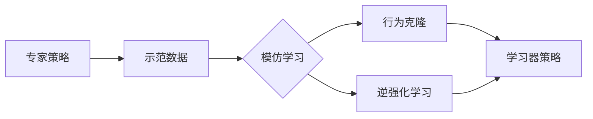

# Imitation Learning原理与代码实例讲解

## 1. 背景介绍

### 1.1 问题的由来
人工智能领域一直以来都在追求如何让机器像人一样思考和行动。传统的机器学习方法,如监督学习和强化学习,虽然取得了一定的成果,但在复杂任务上的表现还不尽如人意。人类擅长通过观察示范来快速学习新技能,因此研究人员提出了一种新的机器学习范式——模仿学习(Imitation Learning),希望赋予机器通过模仿人类专家的行为来学习策略的能力。

### 1.2 研究现状
近年来,模仿学习受到学术界和工业界的广泛关注。斯坦福大学的 Pieter Abbeel 教授及其团队在这一领域做了开创性的工作,他们提出了逆强化学习(Inverse Reinforcement Learning)的思想,通过观察专家的行为来推断其奖励函数,从而学习到专家策略。此后,基于示范的学习(Learning from Demonstration)、逆最优控制(Inverse Optimal Control)等一系列相关方法被提出。目前,模仿学习已经在自动驾驶、机器人控制、游戏AI等领域取得了令人瞩目的成果。

### 1.3 研究意义
模仿学习的意义在于:
1. 它为机器提供了一种更接近人类学习方式的学习框架,有望带来更高效、更鲁棒的机器学习方法。 
2. 对于许多复杂的决策任务,很难给出明确的奖励函数,而借助模仿学习,我们只需要人类专家的示范数据就可以训练出优秀的策略。
3. 模仿学习有望成为连接机器学习和认知科学的桥梁,促进人工智能的发展。

### 1.4 本文结构
本文将全面介绍模仿学习的原理和方法。第2节介绍模仿学习的核心概念。第3节详细阐述模仿学习的主要算法。第4节介绍模仿学习涉及的数学模型和理论分析。第5节通过代码实例演示如何实现模仿学习算法。第6节讨论模仿学习的应用场景。第7节推荐相关工具和资源。第8节总结全文并展望未来。

## 2. 核心概念与联系

模仿学习的核心概念包括:
- 专家策略(Expert Policy):人类专家在任务中所表现出的行为策略。
- 示范数据(Demonstration Data):专家完成任务过程中收集到的状态-动作对数据。
- 学习器策略(Learner Policy):通过模仿学习所得到的机器策略。
- 行为克隆(Behavior Cloning):直接用监督学习来模仿专家行为的方法。
- 逆强化学习(Inverse Reinforcement Learning):通过推断专家的奖励函数来学习策略的方法。

这些概念间的联系可以用下图表示:

专家在执行任务时产生示范数据,模仿学习算法以此为输入,通过行为克隆或逆强化学习的方式学习专家策略,最终输出学习器策略。

## 3. 核心算法原理 & 具体操作步骤

### 3.1 算法原理概述
模仿学习可分为两大类算法:行为克隆和逆强化学习。

**行为克隆**将模仿学习视为一个监督学习问题,目标是学习一个映射函数 $\pi: \mathcal{S} \rightarrow \mathcal{A}$,使得学习器的行为与专家的行为尽可能接近。即:
$$\pi^* = \arg \min_{\pi} \mathbb{E}_{s \sim d_{\pi^*}} [l(\pi(s),\pi^*(s))]$$
其中 $\pi^*$ 为专家策略,$d_{\pi^*}$ 为专家的状态分布,$l$ 为损失函数,衡量学习器动作与专家动作的差异。

**逆强化学习**则将模仿学习视为一个逆向强化学习问题。通过示范数据推断专家的奖励函数 $R^*(s)$,再用强化学习求解该奖励下的最优策略:
$$\pi^* = \arg \max_{\pi} \mathbb{E}[\sum_{t=0}^{\infty} \gamma^t R^*(s_t) | \pi]$$

### 3.2 算法步骤详解

**行为克隆算法步骤:**
1. 收集专家示范数据 $\mathcal{D} = \{(s_i,a_i)\}_{i=1}^N$。
2. 训练监督学习模型 $\pi_{\theta}(a|s)$,最小化行为克隆损失:
   $$\mathcal{L}(\theta) = \mathbb{E}_{(s,a) \sim \mathcal{D}}[l(\pi_{\theta}(a|s),a)]$$
3. 在新状态 $s$ 下,用学习到的策略 $\pi_{\theta}$ 选择动作 $a=\pi_{\theta}(s)$。

**逆强化学习算法(MaxEnt IRL)步骤:**
1. 初始化奖励函数 $R_{\theta}$ 和策略 $\pi_{\phi}$。
2. 重复直到收敛:
   - 固定 $R_{\theta}$,用最大熵强化学习优化 $\pi_{\phi}$:
     $$\max_{\phi} \mathbb{E}_{\pi_{\phi}}[\sum_{t=0}^{\infty} \gamma^t (R_{\theta}(s_t) + \alpha \mathcal{H}(\pi_{\phi}(\cdot|s_t)))]$$
   - 固定 $\pi_{\phi}$,优化 $R_{\theta}$ 使专家轨迹更可能:
     $$\max_{\theta} \mathbb{E}_{\pi^*}[R_{\theta}(s)] - \mathbb{E}_{\pi_{\phi}}[R_{\theta}(s)]$$
3. 返回学习到的策略 $\pi_{\phi}$。

### 3.3 算法优缺点

**行为克隆优点:**
- 简单,易于实现,可以利用现有的监督学习算法。
- 样本效率高,不需要与环境交互。

**行为克隆缺点:**
- 需要大量专家示范数据,且数据需要覆盖状态空间。 
- 容易出现分布漂移问题,导致训练测试不一致。
- 学习到的是专家行为的表面模式,而非内在机制。

**逆强化学习优点:**
- 可以恢复专家策略背后的奖励函数,揭示行为的内在机制。
- 不需要大量示范数据,少量数据就可以恢复奖励。
- 通过强化学习求解最优策略,泛化性更好。

**逆强化学习缺点:**
- 假设专家是最优的,现实中专家也可能有噪声。
- 求解过程复杂,计算量大。
- 学习到的奖励函数不一定是真实奖励。

### 3.4 算法应用领域
- 自动驾驶:通过模仿人类驾驶员的驾驶行为,训练自动驾驶策略。
- 机器人控制:通过人类操作示教,快速训练机器人完成抓取、装配等任务。  
- 游戏AI:通过模仿人类玩家的游戏策略,创造智能游戏AI。
- 自然语言交互:通过模仿人类对话,创建智能对话系统。

## 4. 数学模型和公式 & 详细讲解 & 举例说明

### 4.1 数学模型构建
我们考虑一个马尔可夫决策过程(MDP),定义为一个六元组 $\mathcal{M} = (\mathcal{S},\mathcal{A},\mathcal{P},r,\rho_0,\gamma)$,其中:
- $\mathcal{S}$ 是状态空间
- $\mathcal{A}$ 是动作空间  
- $\mathcal{P}: \mathcal{S} \times \mathcal{A} \times \mathcal{S} \rightarrow [0,1]$ 是状态转移概率
- $r: \mathcal{S} \times \mathcal{A} \rightarrow \mathbb{R}$ 是奖励函数
- $\rho_0: \mathcal{S} \rightarrow [0,1]$ 是初始状态分布
- $\gamma \in [0,1]$ 是折扣因子

在MDP中,智能体与环境交互,在每个时间步 $t$ 观测到状态 $s_t \in \mathcal{S}$,根据策略 $\pi(a|s)$ 采取动作 $a_t \in \mathcal{A}$,环境给予奖励 $r_t$ 并转移到下一状态 $s_{t+1}$。智能体的目标是最大化累积期望奖励:
$$J(\pi) = \mathbb{E}_{\pi}[\sum_{t=0}^{\infty} \gamma^t r_t]$$

### 4.2 公式推导过程

**行为克隆(Behavior Cloning)公式推导:**

给定一组专家示范轨迹 $\mathcal{D} = \{\tau_i\}_{i=1}^N, \tau_i = \{(s^i_t,a^i_t)\}_{t=0}^{T_i}$,行为克隆的目标是学习一个策略 $\pi_{\theta}(a|s)$ 来模仿专家的行为。

我们可以将其建模为一个最大似然估计(MLE)问题:
$$\max_{\theta} \mathcal{L}(\theta) = \max_{\theta} \sum_{i=1}^N \sum_{t=0}^{T_i} \log \pi_{\theta}(a_t^i|s_t^i)$$

等价地,最小化负对数似然损失:
$$\min_{\theta} \mathcal{L}_{BC}(\theta) = -\frac{1}{N} \sum_{i=1}^N \frac{1}{T_i} \sum_{t=0}^{T_i} \log \pi_{\theta}(a_t^i|s_t^i)$$

这实际上就是监督学习中的交叉熵损失。我们可以用神经网络来参数化策略 $\pi_{\theta}$,然后用梯度下降法优化上述损失函数,得到模仿专家行为的策略。

**逆强化学习(Inverse Reinforcement Learning)公式推导:**

逆强化学习的目标是从专家示范中恢复奖励函数 $r(s)$,然后用强化学习求解该奖励下的最优策略。

我们假设专家策略 $\pi^*$ 是该奖励下的最优策略:
$$\pi^* = \arg\max_{\pi} \mathbb{E}_{\pi}[\sum_{t=0}^{\infty} \gamma^t r(s_t)]$$

根据最大熵原理,我们可以将专家策略建模为:
$$\pi^*(a|s) = \frac{\exp(Q^*(s,a))}{\sum_{a'} \exp(Q^*(s,a'))}$$

其中 $Q^*(s,a)$ 是专家策略下的状态-动作值函数。

逆强化学习就是要找到一个奖励函数 $r_{\theta}(s)$,使得上述专家策略在该奖励下是最优的。我们可以最大化如下目标:
$$\max_{\theta} \mathcal{L}_{IRL}(\theta) = \mathbb{E}_{\pi^*}[r_{\theta}(s)] - \log Z_{\theta}$$

其中 $Z_{\theta} = \int \exp(\mathbb{E}_{\pi}[\sum_{t=0}^{\infty} \gamma^t r_{\theta}(s_t)]) d\pi$ 是配分函数,用于归一化。

直观地,这个目标鼓励奖励函数对专家的状态给出高的值,而对其他状态给出低的值。配分函数起到了归一化的作用,使得奖励函数不会无限大。

求解这个优化问题的一种方法是使用梯度上升:
$$\theta \leftarrow \theta + \alpha \nabla_{\theta} \mathcal{L}_{IRL}(\theta)$$

其中梯度项为:
$$\nabla_{\theta} \mathcal{L}_{IRL}(\theta) = \mathbb{E}_{\pi^*}[\nabla_{\theta}r_{\theta}(s)] - \mathbb{E}_{\pi_{\theta}}[\nabla_{\theta}r_{\theta}(s)]$$

这里 $\pi_{\theta}(a|s) \propto \exp(Q_{\theta}(s,a))$ 是当前奖励函数下的最优策略。

可以交替优化奖励函数和策略,直到收敛。这就是最大熵逆强化学习(MaxEnt IRL)的核心思想。

### 4.3 案例分析与讲