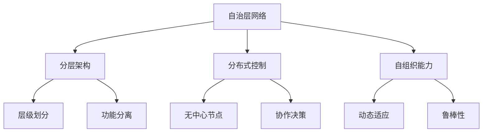

# Internet自治层网络的重要结构特征研究

## 1. 背景介绍

### 1.1 问题的由来

随着互联网的不断发展和演进,网络规模和复杂性也在持续增长。传统的网络架构已经难以满足日益增长的需求,因此出现了一种新型网络架构——自治层网络(Autonomous Networks)。自治层网络旨在通过分层和分布式的方式来管理和控制网络,提高网络的可扩展性、灵活性和自主性。然而,自治层网络的结构特征及其对网络性能的影响还有待深入研究。

### 1.2 研究现状  

目前,已有一些学者对自治层网络的结构特征进行了初步探索。他们发现自治层网络具有层次化、分布式和自组织等特征,这些特征可能会对网络的性能产生影响。但是,现有研究大多局限于理论层面,缺乏对实际网络数据的深入分析和验证。

### 1.3 研究意义

深入研究自治层网络的结构特征对于设计和优化未来网络架构具有重要意义。通过揭示自治层网络的内在结构规律,我们可以更好地理解网络行为,从而提高网络的性能和效率。此外,研究结果还可以为网络模拟和仿真提供参考,为网络规划和部署提供指导。

### 1.4 本文结构

本文将从以下几个方面深入探讨自治层网络的重要结构特征:

1. 介绍自治层网络的核心概念和基本原理。
2. 分析自治层网络的拓扑结构特征,包括层次化、模块化和无标度网络等。
3. 研究自治层网络的动态特征,如自组织、自适应和鲁棒性等。
4. 建立数学模型并推导相关公式,用于量化和描述自治层网络的结构特征。
5. 提供实际网络数据的案例分析,验证理论结果。
6. 讨论自治层网络结构特征对网络性能的影响,并给出优化建议。
7. 总结研究成果,并展望未来的发展方向和挑战。

## 2. 核心概念与联系

在深入探讨自治层网络的结构特征之前,我们首先需要了解一些核心概念和它们之间的联系。

1. **自治层网络(Autonomous Networks)**: 自治层网络是一种新型网络架构,旨在通过分层和分布式的方式来管理和控制网络。它具有分层架构、分布式控制和自组织能力等特征。

2. **分层架构(Layered Architecture)**: 自治层网络采用分层架构,将网络功能划分为多个层级,每个层级负责特定的任务。这种架构有助于降低网络复杂性,提高可扩展性和灵活性。

3. **分布式控制(Distributed Control)**: 自治层网构建在分布式控制的基础之上,没有中心节点,网络中的节点通过协作决策来管理和控制网络。这种方式可以提高网络的鲁棒性和容错能力。

4. **自组织能力(Self-Organization)**: 自治层网络具有自组织能力,可以根据网络状况动态调整网络结构和资源分配,实现自适应和自优化。这种能力使得网络能够更好地应对动态环境和不确定性。

上述核心概念相互关联,共同构成了自治层网络的基本框架。分层架构为网络提供了清晰的结构,分布式控制实现了无中心节点的协作管理,而自组织能力则赋予了网络动态适应和鲁棒性。这些概念的有机结合使得自治层网络具有独特的结构特征。

## 3. 核心算法原理与具体操作步骤

### 3.1 算法原理概述

自治层网络的核心算法原理是基于分布式优化和自组织理论。网络中的节点通过局部信息交换和协作决策,实现全局优化和自适应调整。具体来说,算法包括以下几个关键步骤:

1. **拓扑发现**: 每个节点通过探测和信息交换,了解网络拓扑结构及其所处的位置。

2. **资源评估**: 节点评估自身和邻居节点的资源状况,包括带宽、计算能力、存储空间等。

3. **目标函数构建**: 根据网络的全局目标(如最小时延、最大吞吐量等),构建目标函数。

4. **分布式优化**: 节点通过本地优化和信息交换,协同求解目标函数的最优解。

5. **自适应调整**: 根据网络状态变化,动态调整网络结构和资源分配。

该算法的核心思想是将全局优化问题分解为多个本地优化子问题,通过节点之间的协作求解,从而实现分布式优化和自适应控制。

### 3.2 算法步骤详解

1. **拓扑发现**

   每个节点通过探测和信息交换,了解网络拓扑结构及其所处的位置。具体步骤如下:
   
   a. 节点发送探测消息,收集邻居节点信息。
   
   b. 根据收集到的信息,构建本地拓扑视图。
   
   c. 节点之间交换本地视图,合并形成全局拓扑视图。
   
   d. 根据全局视图,确定节点在网络中的位置和角色。

2. **资源评估**

   节点评估自身和邻居节点的资源状况,包括带宽、计算能力、存储空间等。具体步骤如下:
   
   a. 节点监测本地资源使用情况。
   
   b. 节点交换资源信息,了解邻居节点的资源状况。
   
   c. 根据收集到的信息,构建资源分布视图。

3. **目标函数构建**

   根据网络的全局目标(如最小时延、最大吞吐量等),构建目标函数。具体步骤如下:
   
   a. 确定网络的优化目标,如最小时延、最大吞吐量等。
   
   b. 根据优化目标,构建目标函数。
   
   c. 将目标函数分解为多个子函数,分配给不同的节点。

4. **分布式优化**

   节点通过本地优化和信息交换,协同求解目标函数的最优解。具体步骤如下:
   
   a. 每个节点基于本地信息,求解分配给自己的子函数。
   
   b. 节点之间交换部分解,进行协调和约束。
   
   c. 重复上述过程,直到达到收敛条件或满足终止条件。

5. **自适应调整**

   根据网络状态变化,动态调整网络结构和资源分配。具体步骤如下:
   
   a. 监测网络状态,包括流量模式、故障情况、资源利用率等。
   
   b. 根据状态变化,重新评估资源分布和目标函数。
   
   c. 执行分布式优化算法,求解新的最优解。
   
   d. 根据新的最优解,调整网络结构和资源分配。

上述算法步骤通过节点之间的协作和自适应调整,实现了自治层网络的分布式优化和自组织控制。

### 3.3 算法优缺点

**优点**:

1. **分布式**: 算法采用分布式方式,避免了单点故障和性能瓶颈。

2. **自适应**: 算法可以根据网络状态变化动态调整,提高了网络的鲁棒性和适应能力。

3. **可扩展性**: 算法具有良好的可扩展性,可以应对大规模网络。

4. **无中心节点**: 算法不依赖于中心节点,提高了容错能力。

**缺点**:

1. **收敛速度**: 分布式优化过程可能需要较长时间才能收敛,影响算法的响应速度。

2. **通信开销**: 节点之间需要频繁交换信息,会产生一定的通信开销。

3. **局部最优陷阱**: 算法可能会陷入局部最优解,无法找到全局最优解。

4. **参数敏感性**: 算法的性能可能会受到一些参数设置的影响,需要进行调优。

### 3.4 算法应用领域

自治层网络的分布式优化和自组织控制算法可以应用于多个领域,包括但不限于:

1. **软件定义网络(SDN)**: 算法可以用于SDN控制器的设计,实现网络资源的动态调度和优化。

2. **内容分发网络(CDN)**: 算法可以优化CDN节点的部署和内容缓存策略,提高内容分发效率。

3. **物联网(IoT)**: 算法可以应用于物联网设备的自组织和资源管理,提高网络的可扩展性和效率。

4. **边缘计算**: 算法可以用于边缘节点的任务调度和资源分配,实现计算和存储资源的优化利用。

5. **无线网络**: 算法可以应用于无线网络的频谱管理、负载均衡和移动性支持等方面。

6. **数据中心网络**: 算法可以优化数据中心网络的流量调度和虚拟机迁移,提高资源利用率和服务质量。

总的来说,自治层网络的分布式优化和自组织控制算法具有广泛的应用前景,可以为各种网络系统带来性能提升和自动化管理。

## 4. 数学模型和公式详细讲解与举例说明

### 4.1 数学模型构建

为了量化描述自治层网络的结构特征,我们需要构建相应的数学模型。在这里,我们将自治层网络抽象为一个无向图 $G = (V, E)$,其中 $V$ 表示节点集合,而 $E$ 表示边集合。

我们定义以下符号:

- $N = |V|$: 网络中节点的总数
- $M = |E|$: 网络中边的总数
- $k_i$: 节点 $i$ 的度数,即与之相连的边的数量
- $P(k)$: 度分布,表示度数为 $k$ 的节点的概率
- $C$: 网络的平均clustering系数,用于衡量网络的聚集程度
- $\ell$: 网络的平均最短路径长度,用于衡量网络的紧密程度

基于上述符号,我们可以构建以下数学模型来描述自治层网络的结构特征。

### 4.2 公式推导过程

1. **度分布**

   度分布 $P(k)$ 是描述网络拓扑结构的重要指标,它反映了节点度数的分布情况。对于无标度网络,度分布通常遵循幂律分布:

   $$P(k) \sim k^{-\gamma}$$

   其中 $\gamma$ 是一个常数,通常在 $2 < \gamma < 3$ 的范围内。当 $\gamma = 3$ 时,网络呈现出明显的无标度特征。

2. **平均clustering系数**

   平均clustering系数 $C$ 用于衡量网络的聚集程度,它反映了网络中节点之间形成紧密团体的倾向。对于任意节点 $i$,其clustering系数 $C_i$ 定义为:

   $$C_i = \frac{2E_i}{k_i(k_i - 1)}$$

   其中 $E_i$ 表示节点 $i$ 的邻居节点之间实际存在的边数。网络的平均clustering系数 $C$ 可以通过对所有节点的 $C_i$ 求平均得到:

   $$C = \frac{1}{N}\sum_{i=1}^{N}C_i$$

   一般来说,具有较高聚集程度的网络,其平均clustering系数也会较高。

3. **平均最短路径长度**

   平均最短路径长度 $\ell$ 用于衡量网络的紧密程度,它反映了网络中任意两个节点之间的平均距离。对于任意两个节点 $i$ 和 $j$,它们之间的最短路径长度 $d_{ij}$ 定义为:

   $$d_{ij} = \min\{|P_{ij}|\}$$

   其中 $P_{ij}$ 表示连接节点 $i$ 和 $j