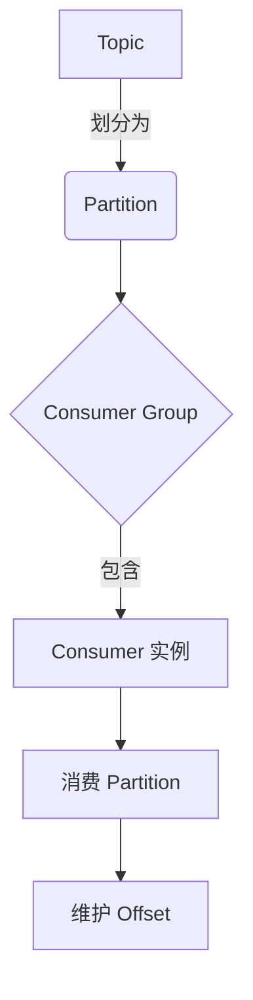

# Kafka Consumer原理与代码实例讲解

## 1. 背景介绍

### 1.1 问题的由来

在现代分布式系统中,数据流是无处不在的。无论是日志收集、物联网数据传输、还是实时数据处理,都需要一个高效、可靠的数据传输管道。Apache Kafka作为一个分布式流处理平台,已经成为这些场景中的不二之选。

作为Kafka的核心组件之一,Kafka Consumer负责从Kafka集群中消费数据。它是整个数据流处理链路的关键一环,其性能和可靠性直接影响着整个系统的效率和稳定性。因此,深入理解Kafka Consumer的原理和实现方式,对于构建高性能、高可用的分布式系统至关重要。

### 1.2 研究现状

Kafka Consumer的设计和实现一直是研究热点。早期的Consumer实现较为简单,采用了传统的拉取(pull)模式,消费者主动向Kafka集群请求数据。这种方式虽然实现简单,但存在一些缺陷,例如消费者需要频繁轮询Kafka集群,导致资源浪费;同时也难以实现精确一次(Exactly Once)的语义保证。

随着Kafka版本的不断迭代,Consumer的实现也在持续优化和改进。Kafka 0.9版本引入了新的Consumer客户端,采用了长轮询(Long Polling)机制,大幅减少了不必要的网络开销。Kafka 0.11版本则进一步优化了分区重平衡(Rebalance)机制,提高了Consumer的可扩展性和容错能力。

最新的Kafka 2.x版本中,Consumer实现进一步完善,引入了增强的幂等性(Idempotence)和事务性(Transaction)支持,使得Exactly Once语义成为可能。同时,Kafka也提供了更加丰富的配置选项和监控指标,方便用户根据实际需求进行定制和调优。

### 1.3 研究意义

深入探讨Kafka Consumer的原理和实现,对于以下几个方面具有重要意义:

1. **提高系统性能**:了解Consumer的内部机制,可以帮助我们更好地调优和优化Consumer的配置,从而提高整个数据流处理链路的吞吐量和延迟。

2. **保证数据一致性**:Consumer的设计直接关系到数据的可靠性和一致性保证。研究Consumer的实现细节,有助于我们构建更加健壮、可靠的分布式系统。

3. **提升扩展性和容错性**:深入理解Consumer的分区分配和重平衡机制,可以帮助我们更好地设计和实现高度可扩展、容错性强的消费者集群。

4. **促进技术创新**:对Kafka Consumer原理的深入探讨,可以激发我们对分布式系统设计的思考,并为未来的技术创新提供灵感和基础。

### 1.4 本文结构

本文将全面深入地探讨Kafka Consumer的原理和实现细节。文章主要包括以下几个部分:

1. **核心概念与联系**:介绍Kafka Consumer相关的核心概念,如分区(Partition)、消费组(Consumer Group)、位移(Offset)等,并阐述它们之间的关系。

2. **核心算法原理与具体操作步骤**:深入剖析Kafka Consumer的核心算法原理,包括消费数据的基本流程、分区分配策略、重平衡机制等,并详细解释每个步骤的具体操作方式。

3. **数学模型和公式详细讲解与举例说明**:构建相关的数学模型,并推导出描述Consumer行为的公式,辅以具体案例进行讲解和说明。

4. **项目实践:代码实例和详细解释说明**:提供完整的代码实例,展示如何使用Kafka Consumer进行数据消费,并对关键代码片段进行深入解析。

5. **实际应用场景**:介绍Kafka Consumer在实际生产环境中的应用场景,如日志收集、实时数据处理、流式数据集成等,并分析在这些场景中Consumer的作用和挑战。

6. **工具和资源推荐**:推荐一些有用的学习资源、开发工具、相关论文和其他资源,帮助读者进一步深入学习和研究Kafka Consumer。

7. **总结:未来发展趋势与挑战**:总结Kafka Consumer的研究成果,展望其未来的发展趋势,并分析其面临的挑战和需要解决的问题。

8. **附录:常见问题与解答**:列出一些常见的问题,并给出解答和建议,帮助读者更好地理解和使用Kafka Consumer。

## 2. 核心概念与联系

在深入探讨Kafka Consumer的原理和实现之前,我们需要先了解一些核心概念,这些概念是理解Consumer行为的基础。

### 2.1 Topic和Partition

Topic是Kafka中的一个逻辑概念,它代表一个数据流或事件流的主题。每个Topic可以被进一步划分为多个Partition,这些Partition是Topic的物理分区,数据实际上存储在这些Partition中。

将Topic划分为多个Partition,可以实现以下几个目的:

1. **提高并行度**:不同的Partition可以被不同的Consumer实例独立消费,从而提高整体的吞吐量。

2. **提高容错性**:即使某些Broker宕机,只要有副本Partition存在,数据就不会丢失。

3. **支持数据有序性**:Kafka保证单个Partition内部的数据是有序的,但不保证跨Partition的有序性。

### 2.2 Consumer Group

Consumer Group是Kafka中的一个重要概念,它是一组Consumer实例的逻辑集合。属于同一个Consumer Group的Consumer实例,会负责消费同一个Topic的数据,并且各自消费不同的Partition。

引入Consumer Group的主要目的是实现负载均衡和容错。如果只有一个Consumer实例,它就需要独自消费整个Topic的所有数据,这显然会成为系统的瓶颈。而将多个Consumer实例组织成一个Consumer Group,就可以实现并行消费,提高整体吞吐量。同时,如果某个Consumer实例宕机,其他实例可以自动接管它的分区,从而实现高可用。

### 2.3 Offset

Offset是Kafka中用于标识消息位置的概念。每个Partition内部,都维护了一个逻辑上的"游标",即Offset,它标识了Consumer已经消费到了哪个位置。

Kafka会为每个Consumer Group单独维护一份Offset信息,这样不同的Consumer Group就可以独立消费同一个Partition,而不会相互影响。Offset信息可以由Kafka自动管理,也可以由Consumer自己维护,这取决于具体的配置。

### 2.4 核心概念关系

上述三个核心概念之间存在着密切的关系,如下图所示:

- Topic被划分为多个Partition
- 每个Consumer Group包含一组Consumer实例
- 每个Consumer实例负责消费一个或多个Partition
- 在消费过程中,Consumer实例会维护自己消费到的Offset位置

理解这些核心概念及其关系,是掌握Kafka Consumer原理的基础。接下来,我们将深入探讨Consumer的核心算法原理和具体实现细节。

## 3. 核心算法原理与具体操作步骤

### 3.1 算法原理概述

Kafka Consumer的核心算法原理可以概括为以下几个方面:

1. **拉取数据(Pull Model)**:Kafka采用了拉取模式,Consumer主动从Kafka集群拉取数据,而不是被动接收数据。这种设计使得Consumer可以自主控制消费进度,同时也降低了Broker的负担。

2. **分区分配策略(Partition Assignment)**:当一个Consumer Group中有多个Consumer实例时,Kafka需要合理地将Topic的多个Partition分配给各个实例,以实现并行消费。分配策略决定了这个过程中的负载均衡效果。

3. **分区重平衡(Rebalance)**:当Consumer Group中的实例数量发生变化时(如新增或宕机),Kafka需要重新分配Partition,以维护整个集群的均衡状态。这个过程被称为重平衡(Rebalance)。

4. **位移提交(Commit Offset)**:为了实现恰好一次(Exactly Once)语义,Consumer需要周期性地将自己的消费位移(Offset)提交到Kafka集群,以便在发生故障时能够从上次提交的位置继续消费。

5. **容错与恢复(Fault Tolerance)**:当某个Consumer实例发生故障时,Kafka需要有机制来检测故障并触发重平衡,将该实例的分区重新分配给其他实例,从而实现高可用。

接下来,我们将详细解释每个核心算法的具体实现步骤。

### 3.2 算法步骤详解

#### 3.2.1 拉取数据

Kafka Consumer采用拉取模式从Broker拉取数据,其基本流程如下:

1. Consumer向Broker发送FetchRequest请求,指定要拉取的Topic、Partition和位移范围。

2. Broker查找指定Partition的数据,并将数据封装成FetchResponse响应返回给Consumer。

3. Consumer解析FetchResponse,获取数据和新的位移信息。

4. Consumer处理获取的数据,并更新本地维护的位移信息。

5. 重复上述步骤,持续从Broker拉取数据。

为了提高效率,Consumer通常会采用长轮询(Long Polling)机制,即在发送FetchRequest时,如果Broker没有新数据,它会保持连接一段时间,等待新数据到达后再返回响应。这样可以减少不必要的网络开销。

#### 3.2.2 分区分配策略

当一个Consumer Group中有多个Consumer实例时,Kafka需要合理地将Topic的多个Partition分配给各个实例。常见的分配策略包括:

1. **范围分区分配(Range Partitioning)**:将连续的一组Partition分配给同一个Consumer实例。这种策略可以保证单个Consumer实例内部的消息有序性,但可能导致负载不均衡。

2. **循环分区分配(Round-Robin Partitioning)**:按照"先到先得"的原则,将Partition依次分配给Consumer实例。这种策略可以实现较好的负载均衡,但无法保证单个Consumer实例内部的消息有序性。

3. **粘性分区分配(Sticky Partitioning)**:在重平衡时,尽量保留已有的分区分配关系,只对新增或减少的Partition进行重新分配。这种策略可以减少不必要的数据移动,提高效率。

无论采用何种策略,分配过程都需要遵循以下原则:

1. 每个Partition只能被分配给一个Consumer实例。

2. 一个Consumer实例可以被分配多个Partition。

3. 分配结果需要在所有Consumer实例之间达成一致。

#### 3.2.3 分区重平衡

当Consumer Group中的实例数量发生变化时(如新增或宕机),Kafka需要重新分配Partition,以维护整个集群的均衡状态。这个过程被称为重平衡(Rebalance)。

重平衡的基本流程如下:

1. 某个Consumer实例加入或离开Consumer Group。

2. 其中一个Consumer实例被选举为领导者(Leader),负责协调重平衡过程。

3. 领导者从Kafka集群获取当前的分区分配信息。

4. 领导者根据分配策略,计算出新的分区分配方案。

5. 领导者将新的分配方案发送给所有Consumer实例。

6. 每个Consumer实例根据新的分配方案,释放旧的分区,并开始消费新分配的分区。

7. 某些Consumer实例可能需要从特定位移处开始消费,以保证数据不丢失或不重复。

在重平衡过程中,Consumer Group会短暂地停止消费数据,以避免数据重复或丢失。因此,重平衡的频率和耗时都会直接影响到整个系统的可用性和性能。Kafka提供了一些配置参数,允许用户根据实际需求调整重平衡的行为。

#### 3.2.4 位移提交

为了实现恰好一次(Exactly Once)语义,Consumer需要周期性地将自己的消费位移(Offset)提交到Kafka集群,以便在发生故障时能够从上次提交的位置继续消费。

Kafka提供了两种位移提交模式:

1. **自动位移提交(Automatic Commit)**:Consumer自动周期性地将位移提交到Kafka集群。这种模式简单方便,但无法精确控制提交时机,可能导致重复消费或数据丢失。

2. **手动位移提交(Manual Commit)**:应用程