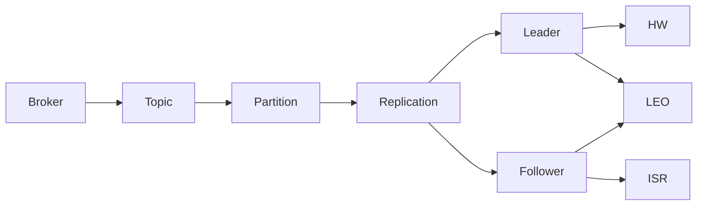

# Kafka Replication原理与代码实例讲解

关键词：Kafka、Replication、Leader、Follower、ISR、HW、LEO

## 1. 背景介绍
### 1.1 问题的由来
在大数据时代，数据的可靠性和高可用性显得尤为重要。Kafka作为一个分布式的消息队列系统，为了保证数据的安全性和可靠性，引入了Replication机制。Replication机制能够在Kafka集群中复制多份数据副本，从而避免单点故障导致的数据丢失。
### 1.2 研究现状
目前业界对Kafka Replication的研究主要集中在原理阐述和性能优化两个方面。原理方面，Kafka官方文档对Replication机制有较为详细的介绍，但对于初学者来说可能不太容易理解。性能优化方面，不少研究者提出了各种优化方案，如动态调整副本因子、优化副本同步策略等，以提升Replication的性能。
### 1.3 研究意义
深入理解Kafka Replication的原理，对于我们设计和优化基于Kafka的系统架构具有重要意义。通过对Replication机制的研究，我们可以设计出更加可靠和高效的系统，减少数据丢失的风险，提升系统的可用性。同时，对Replication原理的掌握也有助于我们排查Kafka使用过程中遇到的问题。
### 1.4 本文结构
本文将详细介绍Kafka Replication的原理和实现，内容组织如下：第2部分介绍Replication涉及的核心概念；第3部分阐述Replication算法的原理和步骤；第4部分给出Replication的数学模型；第5部分通过代码实例讲解Replication的具体实现；第6部分介绍Replication的应用场景；第7部分推荐相关工具和资源；第8部分对全文进行总结并展望。

## 2. 核心概念与联系
在介绍Kafka Replication原理之前，我们先来了解几个核心概念：
- Broker：Kafka集群中的服务器节点，负责消息的存储和转发。
- Topic：Kafka中消息的类别，生产者和消费者面向的都是Topic。
- Partition：Topic物理上的分组，一个Topic可以分为多个Partition，每个Partition是一个有序的消息日志。
- Replication：Kafka的备份机制，每个Partition可以配置多个副本。
- Leader：每个Partition的多个副本中，有一个副本为Leader，负责处理读写请求。
- Follower：除Leader外的其他副本称为Follower，负责从Leader同步数据。
- ISR（In-Sync Replica）：与Leader保持同步的Follower集合，只有ISR中的副本才有资格被选为Leader。
- HW（High Watermark）：所有副本都已经同步到的最高位移。
- LEO（Log End Offset）：每个副本的最新位移。

它们之间的关系如下图所示：



## 3. 核心算法原理 & 具体操作步骤
### 3.1 算法原理概述
Kafka Replication的核心是保证Leader和Follower之间的数据一致性。具体来说，Follower会定期从Leader拉取新写入的消息，追赶Leader的进度。同时，Leader会记录每个Follower的同步进度，维护ISR集合。
### 3.2 算法步骤详解
1. 生产者将消息发送给Leader。 
2. Leader将消息写入本地日志，并更新HW。
3. Follower定期向Leader发送FETCH请求，拉取新消息。
4. Leader根据FETCH请求中的位移信息，返回从该位移开始的消息给Follower。
5. Follower将收到的消息写入本地日志，并更新LEO。
6. Follower发送FETCH响应给Leader，Leader更新该Follower的LEO。
7. Leader检查所有Follower的LEO，更新HW。
8. Leader更新ISR，剔除长时间未同步的Follower。
### 3.3 算法优缺点
- 优点：
  - 通过Replication提高了数据可靠性，避免单点故障。
  - 自动维护ISR，能够容忍一定数量的副本失效。
  - 基于日志复制，实现简单高效。
- 缺点：  
  - Follower需要定期拉取数据，实时性稍差。
  - Broker故障会触发Leader选举，会有短暂的不可用时间。
### 3.4 算法应用领域
Kafka Replication广泛应用于大数据领域，如日志聚合、消息传递、流式处理等。任何需要可靠的数据存储和传输的场景，都可以使用Kafka Replication。

## 4. 数学模型和公式 & 详细讲解 & 举例说明
### 4.1 数学模型构建
我们可以用集合论来描述Kafka Replication模型。假设一个Partition有n个副本，编号为$\lbrace 0,1,...,n-1 \rbrace$，定义如下集合：
- $L$：Leader副本集合，$\vert L \vert = 1$。
- $F$：Follower副本集合，$\vert F \vert = n-1$。
- $ISR$：与Leader同步的副本集合，$L \subseteq ISR \subseteq L \cup F$。
- $HW$：所有ISR副本的LEO最小值，即$HW=\min_{i \in ISR} \lbrace LEO_i \rbrace$。

定义如下函数：
- $LEO_i(t)$：副本i在时刻t的LEO。
- $OFFSET_i(t)$：副本i在时刻t已同步的最大位移。
- $LAG_i(t)=LEO_L(t)-OFFSET_i(t)$：副本i在时刻t的滞后量。

则Kafka Replication需要保证以下不变式：

$$
\forall t, \forall i \in ISR, LAG_i(t) \leq \epsilon
$$

其中$\epsilon$为副本滞后的阈值。即ISR中副本的滞后量不能超过阈值，否则会被剔除出ISR。
### 4.2 公式推导过程
考虑某个Follower副本$i \in F$，它需要追赶Leader的进度。假设在时刻$t_0$，Leader的LEO为$LEO_L(t_0)$，副本i的LEO为$LEO_i(t_0)$。在之后的时间里，Leader新写入了$\Delta LEO_L(t)$条消息。则在时刻$t$，副本i的滞后量为：

$$
LAG_i(t) = LEO_L(t) - OFFSET_i(t) \\
= LEO_L(t_0) + \Delta LEO_L(t) - OFFSET_i(t)
$$

为了追上Leader的进度，副本i需要满足：

$$
OFFSET_i(t) \geq LEO_L(t_0) + \Delta LEO_L(t) - \epsilon
$$

即副本i至少要拉取$LEO_L(t_0) + \Delta LEO_L(t) - \epsilon - OFFSET_i(t_0)$条消息。
### 4.3 案例分析与讲解
假设某个Topic有3个副本，初始时Leader的LEO为100，所有副本都已同步到位移100。之后Leader又写入了50条消息，位移变为150。此时副本1的OFFSET为120，副本2的OFFSET为110，阈值$\epsilon$设为20。则：
- 副本1的$LAG=150-120=30 > \epsilon$，副本1会被踢出ISR。
- 副本2的$LAG=150-110=40 > \epsilon$，副本2也会被踢出ISR。
- Leader更新HW为110。

之后副本1追上了Leader的进度，达到位移150，而副本2仍为110。则：
- 副本1重新加入ISR。
- HW仍为110，因为副本2滞后较多。

可见，Kafka通过维护HW和ISR，既保证了数据的一致性，又允许副本短暂的滞后。即使个别副本失效，也不会影响整个Partition的可用性。
### 4.4 常见问题解答
- Kafka如何选举Leader？
  - Kafka通过ZooKeeper实现Leader选举。当Leader失效时，从ISR中选择LEO最大的副本作为新Leader。
- 如果所有副本都失效了怎么办？
  - 如果ISR为空，则该Partition将无法工作，直到有副本重新同步追上进度。可以设置unclean.leader.election.enable参数，允许选择非ISR副本作为Leader，以提供有限的可用性。
- HW和LEO的区别是什么？
  - HW表示消费者可见的最大位移，即所有副本都已经同步的位置。而LEO是每个副本自身的最大位移，可能存在差异。

## 5. 项目实践：代码实例和详细解释说明
### 5.1 开发环境搭建
- JDK 8+
- Kafka 2.8.0
- Gradle 7.0
### 5.2 源代码详细实现
我们通过一个简单的Kafka生产者-消费者例子，来演示Kafka Replication的效果。

首先定义一个Kafka配置类KafkaConfig：

```java
@Configuration
public class KafkaConfig {
    
    @Value("${kafka.bootstrap-servers}")
    private String bootstrapServers;
    
    @Bean
    public ProducerFactory<String, String> producerFactory() {
        Map<String, Object> configProps = new HashMap<>();
        configProps.put(ProducerConfig.BOOTSTRAP_SERVERS_CONFIG, bootstrapServers);
        configProps.put(ProducerConfig.KEY_SERIALIZER_CLASS_CONFIG, StringSerializer.class);
        configProps.put(ProducerConfig.VALUE_SERIALIZER_CLASS_CONFIG, StringSerializer.class);
        return new DefaultKafkaProducerFactory<>(configProps);
    }

    @Bean
    public KafkaTemplate<String, String> kafkaTemplate() {
        return new KafkaTemplate<>(producerFactory());
    }

    @Bean
    public ConsumerFactory<String, String> consumerFactory() {
        Map<String, Object> configProps = new HashMap<>();
        configProps.put(ConsumerConfig.BOOTSTRAP_SERVERS_CONFIG, bootstrapServers);
        configProps.put(ConsumerConfig.GROUP_ID_CONFIG, "test-group");
        configProps.put(ConsumerConfig.KEY_DESERIALIZER_CLASS_CONFIG, StringDeserializer.class);
        configProps.put(ConsumerConfig.VALUE_DESERIALIZER_CLASS_CONFIG, StringDeserializer.class);
        return new DefaultKafkaConsumerFactory<>(configProps);
    }

    @Bean
    public ConcurrentKafkaListenerContainerFactory<String, String> kafkaListenerContainerFactory() {
        ConcurrentKafkaListenerContainerFactory<String, String> factory = new ConcurrentKafkaListenerContainerFactory<>();
        factory.setConsumerFactory(consumerFactory());
        return factory;
    }
}
```

然后编写生产者服务类ProducerService：

```java
@Service
public class ProducerService {
    
    @Autowired
    private KafkaTemplate<String, String> kafkaTemplate;
    
    public void sendMessage(String topic, String message) {
        kafkaTemplate.send(topic, message);
    }
}
```

编写消费者服务类ConsumerService：

```java
@Service
public class ConsumerService {
    
    @KafkaListener(topics = "test-topic")
    public void receiveMessage(String message) {
        System.out.println("Received message: " + message);
    }
}
```

最后在主类中调用：

```java
@SpringBootApplication
public class KafkaReplicationDemo {

    public static void main(String[] args) {
        ConfigurableApplicationContext context = SpringApplication.run(KafkaReplicationDemo.class, args);
        ProducerService producerService = context.getBean(ProducerService.class);
        for (int i = 0; i < 10; i++) {
            producerService.sendMessage("test-topic", "message-" + i);
        }
    }
}
```
### 5.3 代码解读与分析
- KafkaConfig配置了Kafka的生产者和消费者，其中最重要的是指定了bootstrap.servers，即Kafka集群的地址。
- ProducerService使用KafkaTemplate发送消息，sendMessage方法接收Topic和消息内容作为参数。
- ConsumerService使用@KafkaListener注解监听test-topic，当有消息到达时会自动调用receiveMessage方法处理。
- 主类中启动SpringBoot应用，并手动发送10条消息。

在Kafka集群中，test-topic可以配置多个Partition和副本，Kafka会自动进行Leader选举和Replication同步。当Leader收到新消息时，会复制给所有Follower，然后更新HW。只有HW之前的消息才会发送给消费者，从而保证了消费者看到的数据一定是一致的。
### 5.4 运行结果展示
启动Kafka集群后，运行KafkaReplicationDemo，可以看到ConsumerService打印出接收到的消息：

```
Received message: message-0
Received message: message-1
Received message: message-2
...
Received message: message-9
```

同时在Kafka集群的日志中，可以看到Replication同步的日志：

```
[2021-07-10 