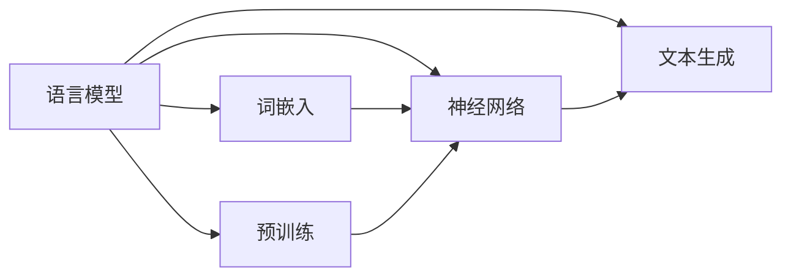

# Language Models 原理与代码实战案例讲解

## 1. 背景介绍
### 1.1 问题的由来
随着人工智能技术的快速发展,自然语言处理(NLP)领域取得了巨大进展。作为NLP的核心任务之一,语言模型在机器翻译、对话系统、文本生成等方面发挥着重要作用。语言模型旨在学习和刻画自然语言的内在规律和特征,从而使计算机能够更好地理解、生成和处理人类语言。

### 1.2 研究现状
近年来,深度学习技术的兴起为语言模型的发展带来了新的突破。基于神经网络的语言模型,如循环神经网络(RNN)、长短期记忆网络(LSTM)和Transformer等,相比传统的统计语言模型,在捕捉长距离依赖关系和生成流畅自然的文本方面表现出色。预训练语言模型如BERT、GPT系列模型更是将语言模型的性能推向新高度,在多项NLP任务上取得了显著成果。

### 1.3 研究意义 
语言模型的研究对于推动自然语言处理技术的进步具有重要意义。高质量的语言模型可以提升各类NLP应用的性能,如机器翻译、智能问答、情感分析等。此外,语言模型还可以作为无监督预训练的基础模型,通过迁移学习应用于下游任务,大大减少了对标注数据的依赖。深入理解语言模型的原理和实现,对于研究者和工程师来说至关重要。

### 1.4 本文结构
本文将全面探讨语言模型的原理与代码实战。首先,我们将介绍语言模型的核心概念与联系。接着,重点阐述语言模型的核心算法原理和具体操作步骤。然后,我们将深入讲解语言模型涉及的数学模型和公式,并给出详细的推导过程和案例分析。此外,本文还将提供语言模型的代码实例,并对其进行详细解释说明。我们也会讨论语言模型在实际应用场景中的价值,推荐相关的工具和学习资源。最后,展望语言模型的未来发展趋势与面临的挑战。

## 2. 核心概念与联系

语言模型的目标是学习自然语言的概率分布,即给定前面的词序列,预测下一个词出现的概率。形式化地,语言模型可以表示为条件概率 $P(w_t|w_1, w_2, ..., w_{t-1})$,其中 $w_t$ 表示在词序列中位置 $t$ 处的词, $w_1, w_2, ..., w_{t-1}$ 为之前的词序列。

语言模型与其他几个重要概念紧密相关:
- 词嵌入(Word Embedding):将词映射为低维稠密向量的表示方式,词嵌入可以作为神经网络语言模型的输入。
- 神经网络(Neural Network):语言模型常采用神经网络结构,如RNN、LSTM、Transformer等,来建模词序列间的复杂依赖关系。  
- 预训练(Pre-training):在大规模无标注语料上预先训练语言模型,学习通用的语言表示,再应用于下游任务。代表模型如BERT、GPT等。
- 文本生成(Text Generation):利用训练好的语言模型,根据给定的前缀或上下文,生成后续的连贯文本。

下图展示了语言模型的核心概念与联系:



## 3. 核心算法原理 & 具体操作步骤
### 3.1 算法原理概述
语言模型的核心是估计单词序列的概率分布。传统的 N-gram 语言模型基于马尔可夫假设,利用前 n-1 个词来预测当前词,但难以捕捉长距离依赖。神经网络语言模型使用神经网络来建模单词序列,可以学习词之间的复杂非线性关系。常见的神经网络结构包括 RNN、LSTM 和 Transformer。

### 3.2 算法步骤详解
以 RNN 语言模型为例,其主要步骤如下:

1. 将输入的单词序列 $w_1, w_2, ..., w_T$ 映射为词嵌入向量 $x_1, x_2, ..., x_T$。
2. 在每个时间步 $t$,RNN 单元接收当前词的嵌入向量 $x_t$ 和上一步的隐状态 $h_{t-1}$,计算当前隐状态:
$$h_t = f(W_{hh}h_{t-1} + W_{xh}x_t + b_h)$$
其中 $f$ 为激活函数,如 tanh 或 ReLU。
3. 将 $h_t$ 通过全连接层转化为输出向量 $o_t$:
$$o_t = W_{ho}h_t + b_o$$
4. 对 $o_t$ 应用 softmax 函数,得到下一个词的概率分布:
$$\hat{y}_t = softmax(o_t)$$
5. 计算损失函数,如交叉熵损失,并进行反向传播和参数更新。

### 3.3 算法优缺点
RNN 语言模型的优点在于能够建模词序列的长距离依赖关系,生成流畅自然的文本。但其也存在梯度消失和梯度爆炸问题,难以捕捉超长序列的依赖。

LSTM 通过引入门控机制缓解了 RNN 的梯度问题,能够更好地学习长期依赖。Transformer 模型采用自注意力机制,以并行的方式处理序列,在计算效率和长程依赖建模能力上优于 RNN/LSTM。

### 3.4 算法应用领域
语言模型被广泛应用于各类自然语言处理任务,如机器翻译、文本摘要、对话系统、情感分析等。此外,预训练语言模型如 BERT、GPT 在下游任务上取得了显著成果,成为 NLP 领域的研究热点。

## 4. 数学模型和公式 & 详细讲解 & 举例说明
### 4.1 数学模型构建
语言模型的数学基础是概率论和统计学。给定单词序列 $w_1, w_2, ..., w_T$,语言模型的目标是估计联合概率 $P(w_1, w_2, ..., w_T)$。根据概率论的链式法则,联合概率可以分解为:

$$P(w_1, w_2, ..., w_T) = P(w_1)P(w_2|w_1)P(w_3|w_1,w_2)...P(w_T|w_1,w_2,...,w_{T-1})$$

$$=\prod_{t=1}^T P(w_t|w_1,w_2,...,w_{t-1})$$

### 4.2 公式推导过程
以 RNN 语言模型为例,我们详细推导其前向计算和损失函数的公式。

在时间步 $t$,RNN 单元的隐状态 $h_t$ 计算公式为:

$$h_t=f(W_{hh}h_{t-1} + W_{xh}x_t + b_h)$$

其中 $W_{hh}$,$W_{xh}$,$b_h$ 分别为循环连接权重矩阵、输入权重矩阵和隐藏层偏置。$f$ 为激活函数,通常选择 tanh 或 ReLU。

隐状态 $h_t$ 经过变换后得到输出向量 $o_t$:

$$o_t=W_{ho}h_t+b_o$$

其中 $W_{ho}$,$b_o$ 为输出权重矩阵和偏置。

对 $o_t$ 应用 softmax 函数得到下一个词的概率分布 $\hat{y}_t$:

$$\hat{y}_t=softmax(o_t)=\frac{exp(o_t)}{\sum_j exp(o_{tj})}$$

模型的损失函数采用交叉熵损失,即:

$$L=-\sum_{t=1}^T \sum_{j=1}^V y_{tj} log(\hat{y}_{tj})$$

其中 $y_t$ 为真实词的 one-hot 向量,$V$ 为词表大小。

### 4.3 案例分析与讲解
我们以一个简单的例子来说明 RNN 语言模型的工作原理。假设词表为 {the, cat, sat, on, mat},词嵌入维度为 3。

输入序列为 "the cat sat on the mat",对应的词嵌入向量为:

```
the: [0.1, 0.2, 0.3]
cat: [0.4, 0.5, 0.6] 
sat: [0.7, 0.8, 0.9]
on : [1.0, 1.1, 1.2]
mat: [1.3, 1.4, 1.5]
```

RNN 单元在每个时间步接收词嵌入向量和上一步的隐状态,计算当前隐状态。以第三个词 "sat" 为例:

$$h_3 = tanh(W_{hh}h_2 + W_{xh}x_3 + b_h)$$

其中 $x_3$ 为 "sat" 的词嵌入向量 $[0.7, 0.8, 0.9]$。

假设经过矩阵运算和激活函数后,得到 $h_3=[0.2, 0.3, 0.4]$。将其转化为输出向量:

$$o_3 = W_{ho}h_3 + b_o$$

假设 $o_3 = [0.1, 0.2, 0.3, 0.4, 0.5]$,对应词表中各词的分数。应用 softmax 函数得到下一个词的概率分布:

$$\hat{y}_3 = softmax(o_3) = [0.12, 0.17, 0.24, 0.36, 0.11]$$

表示下一个词最可能是 "on",其概率为 0.36。

模型根据真实的下一个词 "on" 计算交叉熵损失,并进行反向传播和参数更新。

### 4.4 常见问题解答
Q: RNN 语言模型存在哪些局限性?
A: RNN 语言模型难以捕捉超长序列的长期依赖,容易出现梯度消失和梯度爆炸问题。此外,RNN 的顺序计算限制了并行化能力,在处理长文本时计算效率较低。

Q: 如何缓解 RNN 语言模型的梯度问题?
A: 可以采用 LSTM 或 GRU 等门控机制来缓解梯度消失问题。梯度裁剪技术可以限制梯度范数,避免梯度爆炸。此外,残差连接和层归一化也有助于稳定训练过程。

Q: Transformer 语言模型相比 RNN/LSTM 有哪些优势?
A: Transformer 采用自注意力机制,可以并行计算序列中任意两个位置之间的依赖关系,计算效率高。其使用位置编码和多头注意力,能够更好地捕捉长距离依赖。此外,Transformer 不存在梯度消失和梯度爆炸问题。

## 5. 项目实践：代码实例和详细解释说明
### 5.1 开发环境搭建
我们使用 Python 和 PyTorch 框架来实现 RNN 语言模型。首先安装所需的库:

```bash
pip install torch torchtext
```

### 5.2 源代码详细实现
下面给出 RNN 语言模型的 PyTorch 实现代码:

```python
import torch
import torch.nn as nn
import torchtext

# 定义 RNN 语言模型类
class RNNLanguageModel(nn.Module):
    def __init__(self, vocab_size, embed_dim, hidden_dim, num_layers):
        super(RNNLanguageModel, self).__init__()
        self.embed = nn.Embedding(vocab_size, embed_dim)
        self.rnn = nn.RNN(embed_dim, hidden_dim, num_layers, batch_first=True)
        self.fc = nn.Linear(hidden_dim, vocab_size)
        
    def forward(self, x, h):
        x = self.embed(x)
        out, h = self.rnn(x, h)
        out = self.fc(out)
        return out, h
    
    def init_hidden(self, batch_size, device):
        return torch.zeros(self.rnn.num_layers, batch_size, self.rnn.hidden_size, device=device)

# 加载和预处理数据
TEXT = torchtext.data.Field(lower=True, batch_first=True)
train, val, test = torchtext.datasets.WikiText2.splits(TEXT)
TEXT.build_vocab(train, min_freq=5)

# 定义超参数
vocab_size = len(TEXT.vocab)
embed_dim = 128
hidden_dim