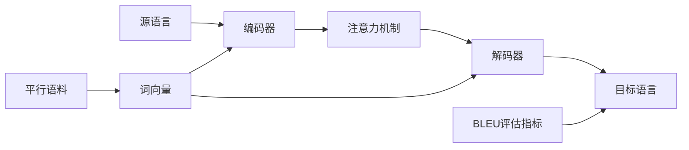

# Language Translation原理与代码实例讲解

## 1. 背景介绍
### 1.1  问题的由来
在全球化时代，语言障碍仍然是阻碍人类交流与合作的重要因素之一。尽管英语是通用语言，但仍有大量人口无法熟练掌握英语。因此，高效、准确的语言翻译工具成为了帮助人们跨越语言鸿沟的关键。

### 1.2  研究现状
传统的语言翻译主要依赖人工翻译，但这种方式效率低下、成本高昂。随着人工智能技术的发展，机器翻译逐渐成为主流。早期的机器翻译系统基于规则和统计方法，但效果有限。近年来，深度学习技术的兴起为机器翻译带来了革命性的突破，使得机器翻译的质量大幅提升。

### 1.3  研究意义
高质量的机器翻译可以显著降低语言障碍，促进全球范围内的交流与合作。无论是在商业、教育、科研还是日常生活中，机器翻译都能发挥重要作用。因此，研究语言翻译的原理和实现方法具有重要的理论和实践意义。

### 1.4  本文结构
本文将首先介绍语言翻译的核心概念和主要方法，然后重点讲解基于深度学习的神经机器翻译模型的原理和实现。通过理论讲解和代码实例相结合的方式，帮助读者全面理解语言翻译技术。最后，本文还将讨论语言翻译技术的应用场景、发展趋势和面临的挑战。

## 2. 核心概念与联系
语言翻译涉及到多个核心概念，包括：

- 源语言（Source Language）：需要被翻译的语言。
- 目标语言（Target Language）：翻译后的语言。
- 平行语料（Parallel Corpus）：由源语言和目标语言组成的句子对，用于训练翻译模型。
- 词向量（Word Embedding）：将词映射到连续的向量空间中，捕捉词之间的语义关系。
- 编码器（Encoder）：将源语言序列转换为中间表示。
- 解码器（Decoder）：根据编码器的输出生成目标语言序列。
- 注意力机制（Attention Mechanism）：帮助解码器在生成每个目标词时关注源语言序列中的相关部分。
- BLEU 评估指标：用于评估翻译质量的指标，通过比较机器翻译结果与参考翻译之间的相似度来计算得分。

这些概念之间紧密相关，共同构成了语言翻译的理论基础。下图展示了它们在神经机器翻译模型中的关系：



## 3. 核心算法原理 & 具体操作步骤
### 3.1  算法原理概述
目前主流的神经机器翻译模型基于编码器-解码器框架和注意力机制。编码器将源语言序列转换为一组向量表示，解码器根据这些向量表示和之前生成的目标词，利用注意力机制生成下一个目标词，直到生成完整的目标语言序列。

### 3.2  算法步骤详解
1. 将源语言和目标语言的词映射为词向量。
2. 编码器读取源语言词向量序列，通过循环神经网络（如LSTM或GRU）生成一组隐藏状态向量。
3. 解码器读取编码器的输出和之前生成的目标词向量，计算注意力权重。
4. 根据注意力权重对编码器输出进行加权求和，得到上下文向量。
5. 将上下文向量与解码器的隐藏状态拼接，经过全连接层和 softmax 函数，生成下一个目标词的概率分布。
6. 根据生成的概率分布采样或选择概率最高的词作为输出。
7. 重复步骤 3-6，直到生成完整的目标语言序列或遇到句子结束标记。

### 3.3  算法优缺点
优点：
- 端到端学习，无需人工设计复杂的特征和规则。
- 可以捕捉源语言和目标语言之间的长距离依赖关系。
- 注意力机制使模型能够动态地关注源语言序列中的相关部分。

缺点：
- 需要大量的平行语料进行训练，对低资源语言对构建高质量的翻译系统具有挑战性。
- 模型训练时间较长，推理速度相对较慢。
- 对于一些罕见词或词表外的词，翻译质量可能较差。

### 3.4  算法应用领域
神经机器翻译广泛应用于以下领域：

- 跨语言信息检索和文本挖掘
- 多语言网站和应用程序的本地化
- 国际贸易和跨境电商
- 全球客户支持和呼叫中心
- 语言教育和辅助工具

## 4. 数学模型和公式 & 详细讲解 & 举例说明
### 4.1  数学模型构建
神经机器翻译模型可以用如下数学模型来表示：

给定源语言序列 $\mathbf{x}=(x_1,\dots,x_n)$ 和目标语言序列 $\mathbf{y}=(y_1,\dots,y_m)$，模型的目标是最大化条件概率 $p(\mathbf{y}|\mathbf{x})$。根据链式法则，可以将其分解为：

$$p(\mathbf{y}|\mathbf{x}) = \prod_{t=1}^m p(y_t|y_1,\dots,y_{t-1},\mathbf{x})$$

其中，$p(y_t|y_1,\dots,y_{t-1},\mathbf{x})$ 表示在给定源语言序列 $\mathbf{x}$ 和之前生成的目标词 $y_1,\dots,y_{t-1}$ 的条件下，生成下一个目标词 $y_t$ 的概率。

### 4.2  公式推导过程
编码器将源语言序列 $\mathbf{x}$ 转换为一组隐藏状态向量 $\mathbf{h}=(h_1,\dots,h_n)$：

$$h_i = f(x_i, h_{i-1})$$

其中，$f$ 是循环神经网络单元，如 LSTM 或 GRU。

解码器在生成第 $t$ 个目标词时，计算注意力权重 $\alpha_{ti}$：

$$\alpha_{ti} = \frac{\exp(e_{ti})}{\sum_{j=1}^n \exp(e_{tj})}$$

其中，$e_{ti}$ 表示解码器在时间步 $t$ 与编码器输出 $h_i$ 的对齐得分，通常使用加性注意力或点积注意力计算。

根据注意力权重，计算上下文向量 $c_t$：

$$c_t = \sum_{i=1}^n \alpha_{ti}h_i$$

解码器的隐藏状态 $s_t$ 由之前的隐藏状态 $s_{t-1}$、上一个目标词 $y_{t-1}$ 的嵌入向量 $e(y_{t-1})$ 和上下文向量 $c_t$ 更新得到：

$$s_t = g(s_{t-1}, e(y_{t-1}), c_t)$$

其中，$g$ 是解码器的循环神经网络单元。

最后，通过全连接层和 softmax 函数计算生成下一个目标词 $y_t$ 的概率分布：

$$p(y_t|y_1,\dots,y_{t-1},\mathbf{x}) = \text{softmax}(W_os_t + b_o)$$

其中，$W_o$ 和 $b_o$ 是可学习的参数。

### 4.3  案例分析与讲解
考虑以下英语到法语的翻译示例：

源语言序列：The cat sat on the mat.
目标语言序列：Le chat était assis sur le tapis.

编码器读取源语言序列，生成隐藏状态向量 $\mathbf{h}$。解码器在生成每个目标词时，通过注意力机制计算上下文向量 $c_t$，并结合之前生成的目标词和解码器的隐藏状态，预测下一个目标词的概率分布。

例如，在生成第三个目标词 "était" 时，解码器会关注源语言序列中与 "was" 对应的部分，即 "sat"。通过注意力机制，解码器可以捕捉到 "sat" 和 "était" 之间的对应关系，从而生成正确的翻译。

### 4.4  常见问题解答
1. 如何处理词表外的词？
   - 可以将低频词替换为特殊的未登录词标记（如 <UNK>），并在后处理阶段使用启发式方法或外部知识库来处理这些词。
   - 使用字符级或子词级的编码方式，如字节对编码（Byte Pair Encoding, BPE），可以减少词表外词的数量。

2. 如何处理不同语言之间的词序差异？
   - 注意力机制可以在一定程度上缓解词序差异的问题，使模型能够动态地关注源语言序列中的相关部分。
   - 引入位置编码（Positional Encoding）可以为模型提供词序信息。
   - 使用基于 Transformer 的模型，如 BERT 和 GPT，可以更好地捕捉语言中的长距离依赖关系。

3. 如何评估翻译质量？
   - BLEU 是最常用的机器翻译评估指标，通过比较机器翻译结果与参考翻译之间的 n-gram 重叠来计算得分。
   - 其他评估指标包括 METEOR、ROUGE 和 TER 等，它们考虑了同义词、词干和词序等因素。
   - 人工评估仍然是评估翻译质量的重要手段，通常由语言专家对翻译结果进行打分或排序。

## 5. 项目实践：代码实例和详细解释说明
### 5.1  开发环境搭建
本项目使用 Python 3 和 PyTorch 深度学习框架。首先，安装所需的依赖库：

```bash
pip install torch torchtext spacy sacrebleu
python -m spacy download en_core_web_sm
python -m spacy download fr_core_news_sm
```

### 5.2  源代码详细实现
下面是一个简单的基于注意力机制的神经机器翻译模型的 PyTorch 实现：

```python
import torch
import torch.nn as nn
import torch.optim as optim
from torchtext.datasets import Multi30k
from torchtext.data import Field, BucketIterator
from torchtext.vocab import Vectors

# 定义源语言和目标语言的字段
SRC = Field(tokenize='spacy', tokenizer_language='en_core_web_sm', init_token='<sos>', eos_token='<eos>', lower=True)
TRG = Field(tokenize='spacy', tokenizer_language='fr_core_news_sm', init_token='<sos>', eos_token='<eos>', lower=True)

# 加载数据集
train_data, valid_data, test_data = Multi30k.splits(exts=('.en', '.fr'), fields=(SRC, TRG))

# 构建词汇表
SRC.build_vocab(train_data, vectors=Vectors(name='glove.6B.100d.txt', cache='./vectors'))
TRG.build_vocab(train_data)

# 定义编码器
class Encoder(nn.Module):
    def __init__(self, input_dim, emb_dim, enc_hid_dim, dec_hid_dim, dropout):
        super().__init__()
        self.embedding = nn.Embedding(input_dim, emb_dim)
        self.rnn = nn.GRU(emb_dim, enc_hid_dim, bidirectional=True)
        self.fc = nn.Linear(enc_hid_dim * 2, dec_hid_dim)
        self.dropout = nn.Dropout(dropout)

    def forward(self, src):
        embedded = self.dropout(self.embedding(src))
        outputs, hidden = self.rnn(embedded)
        hidden = torch.tanh(self.fc(torch.cat((hidden[-2,:,:], hidden[-1,:,:]), dim=1)))
        return outputs, hidden

# 定义注意力层
class Attention(nn.Module):
    def __init__(self, enc_hid_dim, dec_hid_dim):
        super().__init__()
        self.attn = nn.Linear((enc_hid_dim * 2) + dec_hid_dim, dec_hid_dim)
        self.v = nn.Linear(dec_hid_dim, 1, bias=False)

    def forward(self, hidden, encoder_outputs):
        batch_size = encoder_outputs.shape[1]
        src_len = encoder