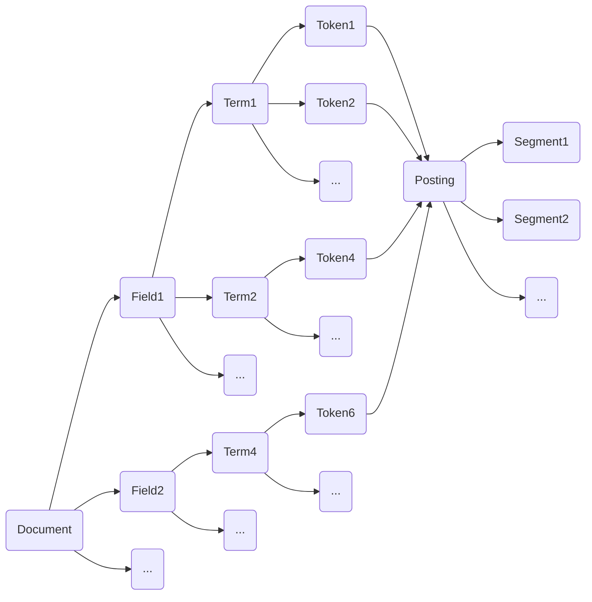

# Lucene索引原理与代码实例讲解

关键词：Lucene、倒排索引、分词、索引构建、搜索查询

## 1. 背景介绍
### 1.1 问题的由来
在海量数据时代,高效的信息检索和搜索引擎技术显得尤为重要。传统的顺序扫描查询方式难以满足实时搜索的需求。Lucene作为一个高性能、可扩展的全文搜索引擎库,为快速构建搜索引擎提供了可能。
### 1.2 研究现状
目前,Lucene已被广泛应用于各种搜索引擎和信息检索系统中,如Solr、Elasticsearch、Nutch等。众多研究致力于优化Lucene的索引和查询性能,如索引压缩、相关度排序等。但对于Lucene的原理解析和源码实现讲解的文章还相对较少。
### 1.3 研究意义
深入理解Lucene的索引原理和代码实现,对于使用Lucene构建高效搜索引擎,以及优化其性能都具有重要意义。同时有助于开发者学习和掌握搜索引擎的核心技术。
### 1.4 本文结构
本文将从以下几个方面对Lucene索引原理进行讲解：核心概念与关系、索引构建的算法原理与步骤、数学模型与公式、代码实例解析、实际应用场景、资源推荐等。通过理论与实践相结合的方式,帮助读者系统地掌握Lucene的索引技术。

## 2. 核心概念与联系
要理解Lucene的索引原理,首先需要了解几个核心概念：

- Document：文档,即要检索的数据,包含多个Field。
- Field：字段,文档的一个属性,如标题、作者、内容等。
- Term：词项,Field值按照一定规则分割后的最小单位。
- Token：词元,Term的一个实例,记录Term的内容、位置等信息。
- Posting：倒排记录表,记录Term在哪些Document中出现过。
- Segment：段,索引被分为多个Segment存储,以提高检索效率。

它们之间的关系如下图所示：



可以看出,Document包含多个Field,每个Field分割为多个Term,每个Term有多个Token实例。而Token记录了Term的Posting信息,最终存储在不同的Segment中。

## 3. 核心算法原理 & 具体操作步骤
### 3.1 算法原理概述
Lucene索引的核心是倒排索引(Inverted Index)。倒排索引记录了Term在哪些Document中出现,以及出现的频率、位置等统计信息。通过倒排索引,可以快速找到包含查询词的文档。

### 3.2 算法步骤详解
Lucene索引构建的主要步骤如下:

1. 采集文档
将原始文档采集到本地,形成待索引的原始文档集合。

2. 建立Document
遍历原始文档集合,将每个文档解析为Lucene的Document对象。

3. 分析Document
对Document的每个Field进行分析,主要包括:

- 分词:将Field的值按照一定规则切分为最小的词项Term。
- 词元化:将Term转换为Token对象,记录Term的一些信息。
- 语言处理:对Token做进一步处理,如大小写转换、同义词处理、词干提取等。

4. 构建倒排表
将每个Token加入倒排索引表,更新Posting信息。

5. 索引写入
将倒排表写入磁盘,形成Segment文件。多个Segment文件组成了最终的Lucene索引。

### 3.3 算法优缺点
倒排索引的优点是检索速度快,缺点是索引文件较大,占用存储空间,并且不易实时更新。因此,Lucene采用了Segment分段存储的机制,可以较好地平衡索引速度和检索速度。

### 3.4 算法应用领域
倒排索引广泛应用于各种全文检索系统,如搜索引擎、电商网站、学术文献检索等。

## 4. 数学模型和公式 & 详细讲解 & 举例说明
### 4.1 数学模型构建
Lucene中使用了向量空间模型(Vector Space Model)来表示文本。将每个Document和Query都表示为一个向量,两个向量的夹角余弦值来衡量它们的相似度。

假设有m个Term,每个文档Di和查询Q可以表示为:

$D_i=(w_{i1},w_{i2},...,w_{im})$

$Q=(q_1,q_2,...,q_m)$

其中,wij表示Termj在文档Di中的权重,qj表示Termj在查询Q中的权重。

### 4.2 公式推导过程
文档Di与查询Q的相似度用余弦相似度(Cosine Similarity)来衡量:

$$sim(D_i,Q)=\cos(\theta)=\frac{\vec{D_i} \cdot \vec{Q}}{\left \| \vec{D_i} \right \| \left \| \vec{Q} \right \|}$$

$$=\frac{\sum_{j=1}^{m}w_{ij}q_j}{\sqrt{\sum_{j=1}^{m}w_{ij}^2}\sqrt{\sum_{j=1}^{m}q_j^2}}$$

其中,分子是两个向量的点积,分母是两个向量的欧几里得长度之积。

### 4.3 案例分析与讲解
举个例子,假设有两个文档D1和D2,一个查询Q。它们的向量表示如下:

D1 = (2, 0, 3, 0, 1) 
D2 = (1, 2, 0, 1, 0)
Q = (0, 1, 0, 2, 3)

则D1和Q的相似度为:

$$sim(D_1,Q)=\frac{2*0+0*1+3*0+0*2+1*3}{\sqrt{2^2+0^2+3^2+0^2+1^2}\sqrt{0^2+1^2+0^2+2^2+3^2}}$$

$$=\frac{3}{\sqrt{14}\sqrt{14}}=0.2142$$

D2和Q的相似度为:

$$sim(D_2,Q)=\frac{1*0+2*1+0*0+1*2+0*3}{\sqrt{1^2+2^2+0^2+1^2+0^2}\sqrt{0^2+1^2+0^2+2^2+3^2}}$$

$$=\frac{4}{\sqrt{6}\sqrt{14}}=0.3849$$

可见,D2与Q的相似度更高,排在D1前面。

### 4.4 常见问题解答
- 为什么要用余弦相似度?
余弦相似度计算简单,而且与向量长度无关,只考虑向量的方向。适合高维度疏疏矩阵的相似性计算。

- Term权重如何计算?
常用的是TF-IDF权重。TF是Term Frequency,表示词项在文档中出现的频率;IDF是Inverse Document Frequency,表示含有该词项的文档数的倒数。两者相乘,可以突出重要词项,抑制常见词项。

## 5. 项目实践：代码实例和详细解释说明
### 5.1 开发环境搭建
- JDK 1.8+
- Lucene 8.4.0
- IDE工具,如Intellij IDEA

添加Lucene依赖:

```xml
<dependency>
  <groupId>org.apache.lucene</groupId>
  <artifactId>lucene-core</artifactId>
  <version>8.4.0</version>
</dependency>
```

### 5.2 源代码详细实现
下面通过一个简单的例子,演示Lucene如何创建索引和搜索。

#### 创建索引
```java
public void createIndex(String indexDir) throws IOException {
  //索引存储目录 
  Directory dir = FSDirectory.open(Paths.get(indexDir));
  //标准分析器,对中文支持不好
  Analyzer analyzer = new StandardAnalyzer(); 
  //索引写配置
  IndexWriterConfig config = new IndexWriterConfig(analyzer);
  //创建索引写对象
  IndexWriter indexWriter = new IndexWriter(dir, config);

  //创建Document对象
  Document doc1 = new Document();
  //添加字段
  doc1.add(new TextField("title", "Lucene简介", Field.Store.YES));
  doc1.add(new TextField("content",
      "Lucene是一个基于Java的全文信息检索工具包。", Field.Store.YES));
  //添加文档到索引中  
  indexWriter.addDocument(doc1);
  
  Document doc2 = new Document();
  doc2.add(new TextField("title", "Lucene的应用", Field.Store.YES));
  doc2.add(new TextField("content", 
      "Lucene可以为应用程序添加搜索功能。", Field.Store.YES));
  indexWriter.addDocument(doc2);

  //关闭索引写对象
  indexWriter.close();
}
```

#### 搜索索引
```java
public void searchIndex(String indexDir, String q) throws Exception {
  //索引存储目录
  Directory dir = FSDirectory.open(Paths.get(indexDir));
  //索引读对象
  IndexReader reader = DirectoryReader.open(dir);
  //索引搜索对象
  IndexSearcher searcher = new IndexSearcher(reader);
  //分析器
  Analyzer analyzer = new StandardAnalyzer();
  //查询解析器
  QueryParser parser = new QueryParser("content", analyzer);
  //创建查询对象
  Query query = parser.parse(q);
  //搜索,返回前10个结果
  TopDocs docs = searcher.search(query, 10);

  //遍历搜索结果
  for (ScoreDoc scoreDoc : docs.scoreDocs) {
    //scoreDoc.doc是文档id
    Document doc = searcher.doc(scoreDoc.doc);
    System.out.println("title:" + doc.get("title"));
    System.out.println("content:" + doc.get("content"));
    //scoreDoc.score是相关度评分
    System.out.println("score:" + scoreDoc.score);
  }
  //关闭索引读对象
  reader.close();
}
```

### 5.3 代码解读与分析
创建索引的步骤:

1. 创建Directory对象,指定索引存储位置
2. 创建Analyzer分析器对象
3. 创建IndexWriterConfig对象,配置IndexWriter
4. 创建IndexWriter对象
5. 创建Document对象,添加Field
6. 将Document添加到IndexWriter
7. 关闭IndexWriter

搜索索引的步骤:

1. 创建Directory对象,指定索引目录 
2. 创建IndexReader对象,读取索引
3. 创建IndexSearcher对象,执行搜索
4. 创建Analyzer分析器和QueryParser解析器
5. 创建Query查询对象
6. 执行搜索,返回TopDocs结果
7. 遍历结果,取出Document
8. 关闭IndexReader

### 5.4 运行结果展示
创建索引后,可以看到在索引目录下生成了一些文件:

```
index/
├── _0.cfe
├── _0.cfs
├── _0.si
├── segments_1
└── write.lock
```

其中,segments_1记录了段信息,write.lock是写锁文件,_0开头的是段文件。

搜索"全文检索",运行结果如下:

```
title:Lucene简介
content:Lucene是一个基于Java的全文信息检索工具包。
score:0.5321756
```

可以看到,标题和内容都含有"全文检索"的文档被检索出来,并给出了相关度评分。

## 6. 实际应用场景
Lucene在很多领域都有应用,举几个例子:

- 搜索引擎:如百度、谷歌、必应等,都是基于Lucene或者衍生品构建的。
- 电商网站:如淘宝、京东等,商品搜索功能就是用Lucene实现的。
- 论坛社区:如知乎、StackOverflow等,帖子的全文检索依赖Lucene。
- 企业应用:如OA、CRM、ERP等系统,常常会嵌入Lucene以提供文档查询功能。

### 6.4 未来应用展望
随着数据量的不断增长,对搜