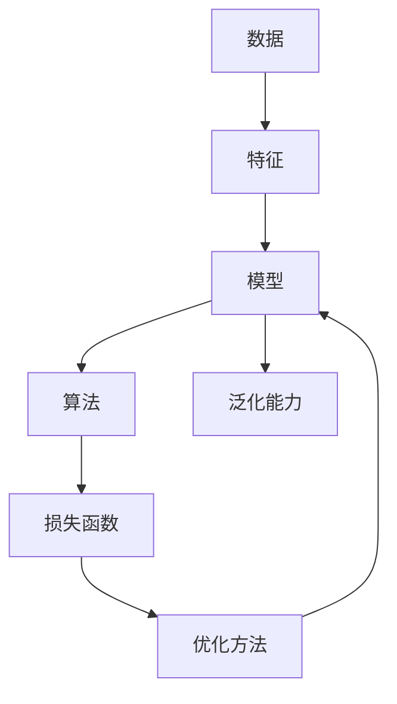

# Machine Learning

## 1. 背景介绍
### 1.1 问题的由来
在当今信息时代，数据呈现爆炸式增长，如何从海量数据中挖掘出有价值的信息和知识，成为了人们面临的一大挑战。传统的数据分析方法已经无法满足日益增长的需求。人工智能的兴起为解决这一问题提供了新的思路和方法。机器学习作为人工智能的核心，受到了学术界和工业界的广泛关注。

### 1.2 研究现状
近年来，机器学习取得了长足的进步。从早期的感知机，到支持向量机、决策树、随机森林等经典算法，再到如今火热的深度学习，机器学习的发展可谓是日新月异。特别是深度学习的出现，极大地推动了人工智能的发展，在计算机视觉、自然语言处理、语音识别等领域取得了突破性的进展。

### 1.3 研究意义
机器学习的研究具有重要的理论意义和实践价值。一方面，机器学习揭示了人工智能的内在机理，为认知科学、神经科学等学科的发展提供了新的视角。另一方面，机器学习在工业、农业、医疗、金融、交通等诸多领域得到了广泛应用，为社会发展和科技进步做出了重要贡献。

### 1.4 本文结构
本文将全面介绍机器学习的核心概念、原理和应用。第二部分阐述机器学习的核心概念及其联系；第三部分详细讲解机器学习的核心算法原理和具体操作步骤；第四部分构建机器学习的数学模型，并给出公式推导过程和案例分析；第五部分通过代码实例，展示机器学习算法的具体实现；第六部分探讨机器学习的实际应用场景；第七部分推荐机器学习的学习资源和开发工具；第八部分总结全文，展望机器学习的未来发展趋势和面临的挑战。

## 2. 核心概念与联系

机器学习的核心概念包括：

- 数据：机器学习的基础，包括训练数据和测试数据。
- 特征：数据的属性或性质，用于描述数据的特点。
- 模型：根据数据建立的数学模型，用于对新数据进行预测或分类。
- 算法：用于从数据中学习模型的方法，如监督学习、无监督学习、强化学习等。
- 损失函数：衡量模型预测值与真实值之间差异的函数，用于评估模型的性能。
- 优化方法：用于最小化损失函数，找到最优模型参数的方法，如梯度下降法。
- 泛化能力：模型对未知数据进行预测的能力，反映了模型的实用性。

这些概念之间紧密相关，相互依存。数据是机器学习的基础，通过特征工程将数据转化为模型可以处理的形式。算法根据数据训练模型，通过最小化损失函数来优化模型参数。模型的性能由损失函数来评估，优化方法则用于找到最优参数。泛化能力反映了模型在实际应用中的效果。

下图展示了机器学习的核心概念及其联系：



## 3. 核心算法原理 & 具体操作步骤
### 3.1 算法原理概述
机器学习算法分为监督学习、无监督学习和强化学习三大类。监督学习利用已标注的数据训练模型，代表算法包括线性回归、逻辑回归、支持向量机、决策树、随机森林、神经网络等。无监督学习从未标注的数据中发现隐含的模式和结构，代表算法包括聚类、降维、关联规则挖掘等。强化学习通过智能体与环境的交互，学习最优策略，代表算法包括Q学习、策略梯度等。

### 3.2 算法步骤详解
以监督学习中的线性回归为例，详细讲解其算法步骤：

1. 数据准备：收集数据，划分训练集和测试集。
2. 特征工程：对数据进行预处理，提取特征。
3. 模型构建：建立线性回归模型 $y=w^Tx+b$，其中 $w$ 为权重向量，$b$ 为偏置项。
4. 损失函数定义：使用均方误差作为损失函数 $J(w,b)=\frac{1}{2m}\sum_{i=1}^m(h_w(x^{(i)})-y^{(i)})^2$。
5. 优化方法选择：采用梯度下降法最小化损失函数，更新模型参数 $w:=w-\alpha\frac{\partial J}{\partial w}$，$b:=b-\alpha\frac{\partial J}{\partial b}$，其中 $\alpha$ 为学习率。
6. 模型训练：迭代执行梯度下降，直到损失函数收敛或达到最大迭代次数。
7. 模型评估：在测试集上评估模型的性能，计算均方误差、决定系数等指标。
8. 模型应用：使用训练好的模型对新数据进行预测。

### 3.3 算法优缺点
线性回归的优点是模型简单，易于理解和实现，训练速度快。但其局限性在于只能处理线性问题，对非线性数据拟合效果差。

不同算法有不同的优缺点。决策树易于解释，可处理离散和连续特征，但容易过拟合。支持向量机能处理非线性问题，泛化能力强，但对参数敏感，训练速度慢。神经网络具有强大的表达能力，但需要大量数据训练，调参复杂。

### 3.4 算法应用领域
机器学习算法在多个领域得到广泛应用。如线性回归可用于销量预测、房价估算等。逻辑回归和支持向量机常用于垃圾邮件识别、疾病诊断等二分类问题。决策树和随机森林适用于多分类问题，如手写数字识别、人脸识别等。聚类算法可用于客户细分、社交网络分析等。

## 4. 数学模型和公式 & 详细讲解 & 举例说明
### 4.1 数学模型构建
以逻辑回归为例，介绍其数学模型的构建过程。逻辑回归是一种常用的二分类算法，其目标是估计样本属于某一类别的概率。

假设有 $m$ 个样本 $(x^{(1)},y^{(1)}),(x^{(2)},y^{(2)}),...,(x^{(m)},y^{(m)})$，其中 $x^{(i)}\in \mathbb{R}^n$ 为第 $i$ 个样本的特征向量，$y^{(i)}\in \{0,1\}$ 为其对应的类别标签。逻辑回归模型定义为：

$$
h_w(x)=\frac{1}{1+e^{-w^Tx}}
$$

其中 $w\in \mathbb{R}^n$ 为模型参数。$h_w(x)$ 表示样本 $x$ 属于类别1的概率。

### 4.2 公式推导过程
对于二分类问题，我们希望模型的输出尽可能接近真实标签。因此，可以使用对数似然函数作为损失函数：

$$
J(w)=-\frac{1}{m}\sum_{i=1}^m[y^{(i)}\log h_w(x^{(i)})+(1-y^{(i)})\log(1-h_w(x^{(i)}))]
$$

为了最小化损失函数，我们对其求导：

$$
\frac{\partial J}{\partial w_j}=-\frac{1}{m}\sum_{i=1}^m[y^{(i)}-h_w(x^{(i)})]x_j^{(i)}
$$

然后使用梯度下降法更新参数：

$$
w_j:=w_j-\alpha\frac{\partial J}{\partial w_j}
$$

其中 $\alpha$ 为学习率。迭代执行梯度下降，直到损失函数收敛或达到最大迭代次数。

### 4.3 案例分析与讲解
以判断学生是否被大学录取为例，说明逻辑回归的应用。假设有100个学生的数据，每个学生有两个特征：高中平均成绩 $x_1$ 和入学考试成绩 $x_2$，以及是否被录取的标签 $y$。我们要建立一个逻辑回归模型，根据学生的两个成绩预测其是否被录取。

首先，将数据划分为训练集和测试集，然后对特征进行归一化处理。接着，初始化模型参数 $w$，设置学习率 $\alpha$ 和最大迭代次数。在每次迭代中，计算损失函数及其梯度，并更新参数 $w$。迭代结束后，在测试集上评估模型的性能，计算准确率、精确率、召回率等指标。最后，可以用训练好的模型对新学生的数据进行预测。

假设训练得到的模型参数为 $w=(1.5,-2.0,1.0)$，现有一个新学生，高中平均成绩为90，入学考试成绩为85，则其被录取的概率为：

$$
h_w(x)=\frac{1}{1+e^{-(1.5\times 90-2.0\times 85+1.0)}}=0.731
$$

可见，该学生被录取的概率较高。

### 4.4 常见问题解答
- 逻辑回归可以处理多分类问题吗？
  
  可以，通过一对多或多对多策略，将多分类问题转化为多个二分类问题求解。

- 逻辑回归对数据有哪些要求？
  
  逻辑回归要求特征之间相互独立，且各特征服从高斯分布。如果不满足，需要对数据进行预处理，如特征选择、降维等。

- 逻辑回归的优缺点是什么？
  
  优点是模型简单，易于理解和实现，训练速度快，可解释性强。缺点是难以处理非线性问题，对异常值敏感。

## 5. 项目实践：代码实例和详细解释说明
### 5.1 开发环境搭建
本项目使用Python语言，需要安装以下库：

- NumPy：数值计算库
- Pandas：数据处理库
- Matplotlib：数据可视化库
- Scikit-learn：机器学习库

可以使用pip命令安装：

```
pip install numpy pandas matplotlib scikit-learn
```

### 5.2 源代码详细实现
以下是使用Scikit-learn实现逻辑回归的完整代码：

```python
import numpy as np
import pandas as pd
from sklearn.model_selection import train_test_split
from sklearn.preprocessing import StandardScaler
from sklearn.linear_model import LogisticRegression
from sklearn.metrics import accuracy_score, precision_score, recall_score

# 加载数据集
data = pd.read_csv('student_data.csv')
X = data[['gpa', 'test_score']]
y = data['admitted']

# 划分训练集和测试集
X_train, X_test, y_train, y_test = train_test_split(X, y, test_size=0.2, random_state=42)

# 特征归一化
scaler = StandardScaler()
X_train = scaler.fit_transform(X_train)
X_test = scaler.transform(X_test)

# 创建逻辑回归模型
model = LogisticRegression()

# 训练模型
model.fit(X_train, y_train)

# 预测测试集
y_pred = model.predict(X_test)

# 评估模型性能
accuracy = accuracy_score(y_test, y_pred)
precision = precision_score(y_test, y_pred)
recall = recall_score(y_test, y_pred)

print(f'Accuracy: {accuracy:.3f}')
print(f'Precision: {precision:.3f}')  
print(f'Recall: {recall:.3f}')

# 预测新样本
new_student = np.array([[90, 85]])
new_student = scaler.transform(new_student)
prob = model.predict_proba(new_student)[0][1]
print(f'Probability of admission: {prob:.3f}')
```

### 5.3 代码解读与分析
代码分为以下几个部分：

1. 导入所需的库。
2. 加载数据集，划分特征和标签。
3. 划分训练集和测试集，随机种子设为42以保证结果可复现。
4. 对特征进行归一化处理，使其均值为0，方差为1。
5. 创建逻辑回归模型，使用默