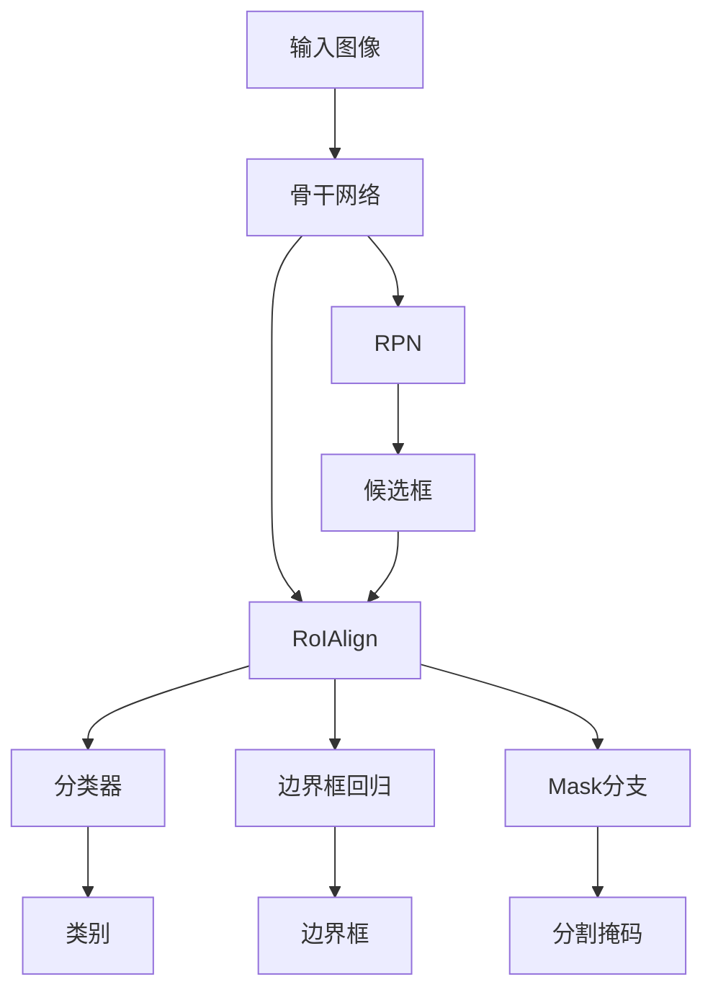

# MaskR-CNN原理与代码实例讲解

## 1. 背景介绍

### 1.1 问题的由来

在计算机视觉领域中,目标检测和实例分割是两个重要的基础任务。目标检测旨在定位图像中感兴趣的目标并给出相应的边界框,而实例分割则需要进一步对每个目标实例进行像素级别的分割。传统的目标检测算法如Faster R-CNN虽然可以高效地检测出目标的边界框,但无法对目标实例进行精确的像素级分割。另一方面,语义分割算法如FCN可以对图像中的每个像素进行分类,但无法区分不同的目标实例。

### 1.2 研究现状

为了同时解决目标检测和实例分割任务,Mask R-CNN被提出并迅速成为该领域的主流算法之一。Mask R-CNN是在Faster R-CNN的基础上进行扩展,增加了一个用于实例分割的分支。通过共享大部分卷积特征,Mask R-CNN可以高效地完成目标检测和实例分割两个任务。自从2017年被提出以来,Mask R-CNN及其变体在多个重要的计算机视觉基准测试中取得了领先的性能,并被广泛应用于各种实际场景。

### 1.3 研究意义

Mask R-CNN的出现为计算机视觉领域带来了重大突破,它不仅能够准确地检测出目标的边界框,还能对目标实例进行精确的像素级分割。这为许多高级视觉任务奠定了坚实的基础,如目标跟踪、人体姿态估计、视觉导航等。Mask R-CNN的研究对于推动计算机视觉技术的发展具有重要意义。

### 1.4 本文结构

本文将全面介绍Mask R-CNN的原理和实现细节。首先阐述Mask R-CNN的核心概念和与其他算法的联系;然后深入探讨Mask R-CNN的算法原理和具体操作步骤;接着详细讲解Mask R-CNN的数学模型和公式推导过程;之后通过代码实例和详细解释说明,展示如何实现Mask R-CNN;再介绍Mask R-CNN在实际应用场景中的应用;最后总结Mask R-CNN的发展趋势和面临的挑战,并推荐相关的工具和资源。

## 2. 核心概念与联系

Mask R-CNN继承了Faster R-CNN的核心思想,即利用区域提议网络(Region Proposal Network, RPN)高效地生成目标候选框,然后对这些候选框进行分类和边界框回归。不同之处在于,Mask R-CNN在Faster R-CNN的基础上增加了一个分支网络,用于对每个目标实例进行像素级别的分割。

Mask R-CNN的核心思想可以概括为"先分类,后分割"。具体来说,Mask R-CNN首先利用RPN生成目标候选框,然后对这些候选框进行分类和边界框回归,得到最终的目标检测结果。与此同时,Mask R-CNN还会对每个检测到的目标实例进行像素级别的分割,生成相应的分割掩码(Segmentation Mask)。

Mask R-CNN的网络结构如下所示:

1. 输入图像首先通过一个骨干网络(如ResNet、VGG等)提取特征图。
2. 特征图被输入到RPN中,生成目标候选框。
3. 候选框通过RoIAlign层对应的特征图区域进行对齐和归一化,得到固定大小的特征图块。
4. 归一化后的特征图块被并行输入到三个分支网络:
   - 分类器分支:对目标进行分类,判断是否为感兴趣的目标。
   - 边界框回归分支:对目标边界框进行精细调整。
   - Mask分支:对目标实例进行像素级别的分割,生成分割掩码。
5. 最终输出包括目标类别、精调后的边界框以及对应的分割掩码。

Mask R-CNN的优势在于它能够同时完成目标检测和实例分割两个任务,并且由于大部分特征被共享,因此具有较高的计算效率。与之前的算法相比,Mask R-CNN在精度和速度上都有了显著提升。

## 3. 核心算法原理 & 具体操作步骤

### 3.1 算法原理概述

Mask R-CNN的核心算法原理可以分为以下几个主要步骤:

1. **特征提取**: 输入图像首先通过一个骨干网络(如ResNet、VGG等)提取特征图。
2. **区域提议**: 在特征图上运行区域提议网络(RPN),生成一系列目标候选框。
3. **区域对齐**: 使用RoIAlign层对候选框对应的特征图区域进行对齐和归一化,得到固定大小的特征图块。
4. **分类和边界框回归**: 归一化后的特征图块被输入到分类器和边界框回归器,用于对目标进行分类和边界框精调。
5. **实例分割**: 同样的特征图块也被输入到Mask分支网络,用于对每个目标实例进行像素级别的分割,生成分割掩码。
6. **输出**: 最终输出包括目标类别、精调后的边界框以及对应的分割掩码。

### 3.2 算法步骤详解

1. **特征提取**

   Mask R-CNN通常使用一个预训练的骨干网络(如ResNet、VGG等)来提取输入图像的特征图。这些骨干网络在大规模图像分类任务上进行了预训练,因此能够提取出丰富的语义特征,为后续的目标检测和实例分割任务提供有效的特征表示。

2. **区域提议**

   Mask R-CNN采用了Faster R-CNN中的区域提议网络(RPN)来生成目标候选框。RPN是一个全卷积网络,它在特征图上滑动一个小窗口,并为每个位置生成多个不同尺度和长宽比的锚框(Anchor Box)。然后,RPN会对这些锚框进行二值分类(是否为目标)和边界框回归,从而生成一系列目标候选框。

3. **区域对齐**

   由于RPN生成的候选框在特征图上的位置并不一定对齐,因此需要使用RoIAlign层对这些候选框对应的特征图区域进行对齐和归一化。RoIAlign层通过双线性插值的方式,从特征图中提取出固定大小的特征图块,用于后续的分类、边界框回归和实例分割。

4. **分类和边界框回归**

   归一化后的特征图块被并行输入到两个分支网络:分类器和边界框回归器。分类器负责对目标进行分类,判断是否为感兴趣的目标类别。边界框回归器则对候选框进行精细调整,得到更准确的目标边界框。

5. **实例分割**

   除了分类和边界框回归,Mask R-CNN还增加了一个Mask分支网络,用于对每个目标实例进行像素级别的分割。Mask分支网络的输入也是归一化后的特征图块,它会为每个类别生成一个对应的分割掩码,用于标记目标实例的像素位置。

6. **输出**

   Mask R-CNN的最终输出包括三个部分:目标类别、精调后的边界框以及对应的分割掩码。这三个输出共同描述了图像中的目标实例,包括其类别、位置和像素级别的分割结果。

### 3.3 算法优缺点

**优点**:

1. **高精度**: Mask R-CNN能够同时完成目标检测和实例分割两个任务,并在多个基准测试中取得了领先的性能。
2. **高效率**: 由于大部分特征被共享,Mask R-CNN的计算效率较高,能够实现实时处理。
3. **通用性强**: Mask R-CNN可以应用于多种视觉任务,如目标跟踪、人体姿态估计、视觉导航等。

**缺点**:

1. **训练困难**: Mask R-CNN需要同时优化多个损失函数,训练过程相对复杂。
2. **对小目标敏感**: Mask R-CNN在处理小目标时的性能相对较差,容易出现漏检或分割不精确的情况。
3. **内存占用大**: Mask R-CNN需要存储大量的特征图和中间结果,对内存的占用较大。

### 3.4 算法应用领域

Mask R-CNN及其变体已被广泛应用于多个计算机视觉领域,包括但不限于:

1. **目标检测和实例分割**: Mask R-CNN最初被设计用于同时解决目标检测和实例分割两个任务,是该领域的主流算法之一。
2. **目标跟踪**: 通过在视频序列中跟踪目标实例,Mask R-CNN可以应用于多目标跟踪任务。
3. **人体姿态估计**: Mask R-CNN可以用于检测和分割人体,为后续的姿态估计任务提供有力支持。
4. **自动驾驶**: Mask R-CNN能够准确检测和分割道路上的各种目标,如行人、车辆、交通标志等,对于自动驾驶系统至关重要。
5. **医学图像分析**: Mask R-CNN可以应用于医学图像中的病灶检测和分割,为疾病诊断提供帮助。
6. **机器人视觉**: Mask R-CNN能够为机器人提供准确的目标检测和分割结果,有助于机器人完成各种视觉任务。

## 4. 数学模型和公式 & 详细讲解 & 举例说明

### 4.1 数学模型构建

Mask R-CNN的数学模型主要包括三个部分:分类损失函数、边界框回归损失函数和分割掩码损失函数。

1. **分类损失函数**

   Mask R-CNN采用交叉熵损失函数作为分类损失,用于衡量预测的类别概率与真实类别之间的差异。对于每个候选框,分类损失函数可以表示为:

   $$L_{cls}(p, u) = -\log p_u$$

   其中 $p = (p_0, \dots, p_k)$ 表示预测的类别概率分布, $u$ 是真实的目标类别, $p_u$ 是真实类别的预测概率。

2. **边界框回归损失函数**

   Mask R-CNN使用平滑 $L_1$ 损失作为边界框回归损失,用于衡量预测的边界框坐标与真实边界框之间的差异。对于每个候选框,边界框回归损失函数可以表示为:

   $$L_{reg}(t^u, v) = \sum_{i\in\{x, y, w, h\}}{\text{smooth}_{L_1}(t^u_i - v_i)}$$

   其中 $t^u = (t^u_x, t^u_y, t^u_w, t^u_h)$ 表示真实边界框的参数化形式, $v = (v_x, v_y, v_w, v_h)$ 表示预测的边界框参数, $\text{smooth}_{L_1}$ 是平滑 $L_1$ 损失函数。

3. **分割掩码损失函数**

   Mask R-CNN使用每个像素的平均二值交叉熵作为分割掩码损失,用于衡量预测的分割掩码与真实掩码之间的差异。对于每个目标实例,分割掩码损失函数可以表示为:

   $$L_{mask}(y, \hat{y}) = -\frac{1}{m}\sum_{i=1}^m[y_i\log\hat{y}_i + (1 - y_i)\log(1 - \hat{y}_i)]$$

   其中 $y$ 是真实的分割掩码, $\hat{y}$ 是预测的分割掩码, $m$ 是掩码中像素的总数。

最终,Mask R-CNN的总损失函数是上述三个损失函数的加权和:

$$L = L_{cls} + L_{reg} + L_{mask}$$

在训练过程中,Mask R-CNN会同时优化这三个损失函数,以提高目标检测和实例分割的精度。

### 4.2 公式推导过程

1. **分类损失函数推导**

   分类损失函数采用交叉熵损失,用于衡量预测的类别概率与真