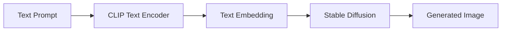

# Midjourney原理与代码实例讲解

## 1. 背景介绍
### 1.1 问题的由来
随着人工智能技术的飞速发展,文本到图像生成(Text-to-Image)已经成为当前人工智能领域的一个研究热点。Midjourney作为一款基于扩散模型(Diffusion Model)的文本到图像生成工具,自2022年推出以来就备受关注,其生成的高质量、富有创意的图像给人留下了深刻的印象。那么Midjourney的原理是什么?背后使用了哪些算法?本文将对此进行深入探讨。

### 1.2 研究现状
目前主流的文本到图像生成方法主要有三类:GAN(Generative Adversarial Network)、VAE(Variational Autoencoder)和Diffusion Model。其中Diffusion Model因其生成效果好、训练稳定等优点成为了当前最受欢迎的方法。代表性的工作有Google的Imagen、OpenAI的DALL-E 2以及stability.ai的Stable Diffusion。而Midjourney正是基于Stable Diffusion进行改进和优化的。

### 1.3 研究意义
深入理解Midjourney的原理和算法,对于我们掌握最新的人工智能技术、开发更优秀的文本到图像生成工具具有重要意义。同时Midjourney的成功也为扩散模型在其他领域(如语音合成、视频生成等)的应用提供了很好的启示。

### 1.4 本文结构
本文将分为以下几个部分:
- 介绍Midjourney所基于的核心概念,如扩散模型、CLIP等
- 详细讲解Midjourney的核心算法原理与具体步骤
- 给出Midjourney中使用的关键数学模型与公式推导
- 提供Midjourney的代码实例与详细解释说明
- 探讨Midjourney的实际应用场景与未来发展趋势
- 推荐相关的学习资源与开发工具

## 2. 核心概念与联系

在深入探讨Midjourney的原理之前,我们需要先了解其所基于的一些核心概念。

### 2.1 扩散模型 Diffusion Model

扩散模型是一类生成模型,其核心思想是通过迭代的方式逐步向随机噪声图像中添加细节,最终生成高质量的图像。扩散过程可以看作是VAE的变体,包含编码器和解码器两个部分。

编码器部分将图像x0逐步添加高斯噪声,得到一系列噪声图像x1,x2,...,xT。噪声添加过程可以表示为:

$$q(x_t|x_{t-1}) = \mathcal{N}(x_t; \sqrt{1-\beta_t} x_{t-1}, \beta_t \mathbf{I})$$

其中$\beta_t$是噪声强度的控制参数。

解码器部分则通过逐步去噪,从纯噪声图像xT开始,生成一系列去噪后的图像,最终得到干净的生成图像。去噪过程用条件概率表示为:

$$p_\theta(x_{t-1}|x_t) = \mathcal{N}(x_{t-1}; \mu_\theta(x_t, t), \sigma_t^2 \mathbf{I})$$

其中$\mu_\theta$是神经网络(如U-Net)预测的均值,$\sigma_t$是固定的方差。

整个扩散模型的训练目标是最小化去噪过程的负对数似然:

$$L_{diffusion} = \mathbb{E}_{x_0,\epsilon}[-\log p_\theta(x_0)] \approx \mathbb{E}_{x_0,\epsilon,t}[\| \epsilon - \epsilon_\theta(\sqrt{\bar{\alpha}_t} x_0 + \sqrt{1-\bar{\alpha}_t} \epsilon, t) \|_2^2]$$

其中$\epsilon$是标准正态分布,$\bar{\alpha}_t$是$\alpha_t=1-\beta_t$的累积连乘。

### 2.2 CLIP模型

CLIP(Contrastive Language-Image Pre-training)是OpenAI提出的一个将图像和文本对齐表示的模型。它包含一个图像编码器和一个文本编码器,分别将图像和文本映射到同一个特征空间,并通过对比学习使得匹配的图文对具有较高的相似度。

CLIP模型的训练数据是大规模的图文对,损失函数为:

$$L_{CLIP} = -\frac{1}{N} \sum_{i=1}^N \log \frac{\exp(\text{sim}(I_i, T_i)/\tau)}{\sum_{j=1}^N \exp(\text{sim}(I_i, T_j)/\tau)}$$

其中$I_i$和$T_i$分别表示第i个图像和文本,$\text{sim}$表示余弦相似度,$\tau$是温度系数。

### 2.3 Midjourney = Stable Diffusion + CLIP

Midjourney实际上是在Stable Diffusion的基础上,引入了CLIP模型来增强文本引导能力。具体来说,Midjourney使用CLIP的文本编码器将prompt编码为特征向量,然后将其作为Stable Diffusion的条件信息,引导扩散模型的生成过程。同时Midjourney还对Stable Diffusion的模型结构进行了优化,提高了生成质量和多样性。

下面是Midjourney的整体架构示意图:

## 3. 核心算法原理 & 具体操作步骤

### 3.1 算法原理概述

Midjourney的核心算法可以分为以下几个步骤:

1. 使用CLIP的文本编码器将输入的文本prompt编码为特征向量v
2. 将v作为Stable Diffusion的条件信息,引导图像生成过程
3. 在Stable Diffusion的基础上,Midjourney还引入了classifier-free guidance、高分辨率fix等技术,进一步提升生成质量

### 3.2 算法步骤详解

#### Step 1: 文本编码

给定一个文本prompt t,使用CLIP的文本编码器$E_\text{text}$将其编码为d维特征向量v:

$$v = E_\text{text}(t) \in \mathbb{R}^d$$

#### Step 2: 条件扩散生成

将文本特征v作为条件信息,引导Stable Diffusion的生成过程。具体来说,修改去噪过程为:

$$p_\theta(x_{t-1}|x_t,v) = \mathcal{N}(x_{t-1}; \mu_\theta(x_t, t, v), \sigma_t^2 \mathbf{I})$$

其中$\mu_\theta$额外接受文本条件v作为输入。

在采样时,Midjourney使用classifier-free guidance的技巧,引入无条件的预测项$\mu_\theta(x_t,t,\emptyset)$,并线性组合有条件和无条件的预测:

$$\hat{x}_{t-1} = \sqrt{\bar{\alpha}_{t-1}} \bigg( \frac{x_t - \sqrt{1-\bar{\alpha}_t}\epsilon_\theta(x_t,t,v)}{\sqrt{\bar{\alpha}_t}} + s \cdot (\epsilon_\theta(x_t,t,v) - \epsilon_\theta(x_t,t,\emptyset)) \bigg)$$

其中s为guidance scale,控制条件信息的强度。

#### Step 3: 高分辨率修复

Stable Diffusion原始的训练分辨率为512x512,为了生成更高分辨率的图像,Midjourney使用了一种高分辨率修复(High-Resolution Fix)的技术。

具体来说,先使用扩散模型生成一个低分辨率的图像,然后将其上采样到目标分辨率,再使用另一个高分辨率的扩散模型对上采样后的图像进行去噪和修复,得到最终的高分辨率生成结果。

### 3.3 算法优缺点

Midjourney算法的优点包括:

- 生成质量高,图像细节丰富,视觉效果出众
- 支持多种艺术风格和创意想象力
- 文本引导能力强,可控性好
- 通过分层生成,可以生成高分辨率图像

缺点包括:
- 推理速度慢,生成一张图需要数十秒到数分钟
- 需要海量的图文对数据进行预训练,训练成本高
- 对于抽象概念、逻辑关系等理解能力有限
- 容易生成一些涉及偏见、伦理问题的内容

### 3.4 算法应用领域

Midjourney作为SOTA的文本到图像生成工具,在以下领域具有广泛的应用前景:

- 辅助设计:Midjourney可以根据文本描述快速生成多种设计草稿,如Logo设计、产品设计、UI设计等,为设计师提供灵感
- 数字艺术创作:Midjourney可以生成各种风格的艺术作品,如油画、水彩画、插画等,还可以根据提示词创作概念艺术
- 虚拟场景构建:Midjourney可以根据场景描述生成逼真的场景图像,如虚拟旅游、电影场景、游戏场景等
- 教育与科普:利用Midjourney生动形象地展示一些抽象概念,如数学、物理、化学、天文等领域的知识
- 广告设计:Midjourney可以根据产品卖点快速生成吸引人的广告图,用于营销推广

未来Midjourney有望进一步提高图像质量和生成效率,扩大应用范围。同时其背后的扩散模型、多模态对齐等技术也可以推广到语音、视频、3D等领域。

## 4. 数学模型和公式 & 详细讲解 & 举例说明

### 4.1 数学模型构建

Midjourney中用到的关键数学模型主要包括:

1. 扩散模型:前向噪声添加过程和反向去噪过程
2. CLIP模型:图文特征提取和对齐
3. 高斯分布:噪声添加和采样过程中用到的概率分布

### 4.2 公式推导过程

#### 扩散模型

前向噪声添加过程:

$$q(x_t|x_{t-1}) = \mathcal{N}(x_t; \sqrt{1-\beta_t} x_{t-1}, \beta_t \mathbf{I})$$

其中$\beta_t$是噪声强度的控制参数。

反向去噪过程:

$$p_\theta(x_{t-1}|x_t) = \mathcal{N}(x_{t-1}; \mu_\theta(x_t, t), \sigma_t^2 \mathbf{I})$$

其中$\mu_\theta$是神经网络预测的均值,$\sigma_t$是固定的方差。

扩散模型的训练目标是最小化去噪过程的负对数似然:

$$\begin{aligned}
L_{diffusion} &= \mathbb{E}_{x_0,\epsilon}[-\log p_\theta(x_0)] \\
&= \mathbb{E}_{x_0,\epsilon}[-\log \prod_{t=1}^T p_\theta(x_{t-1}|x_t)] \\
&= \mathbb{E}_{x_0,\epsilon,t}[-\log p_\theta(x_{t-1}|x_t)] \\
&= \mathbb{E}_{x_0,\epsilon,t}[\frac{1}{2\sigma_t^2} \| x_{t-1} - \mu_\theta(x_t, t) \|_2^2] + C \\
&\approx \mathbb{E}_{x_0,\epsilon,t}[\frac{1}{2\sigma_t^2} \| \epsilon - \epsilon_\theta(\sqrt{\bar{\alpha}_t} x_0 + \sqrt{1-\bar{\alpha}_t} \epsilon, t) \|_2^2] + C
\end{aligned}$$

其中$\epsilon$是标准正态分布,$\bar{\alpha}_t$是$\alpha_t=1-\beta_t$的累积连乘。最后一步利用了重参数化技巧,将$x_t$表示为$x_0$和$\epsilon$的线性组合。

#### CLIP模型

CLIP模型包含图像编码器$E_\text{image}$和文本编码器$E_\text{text}$,分别将图像$I$和文本$T$映射到d维特征空间:

$$\begin{aligned}
f(I) &= E_\text{image}(I) \in \mathbb{R}^d \\
g(T) &= E_\text{text}(T) \in \mathbb{R}^d
\end{aligned}$$

CLIP的训练目标是最大化匹配图文对的相似度,最小化不匹配图文对的相似度:

$$\begin{aligned}
L_{CLIP} &= -\frac{1}{N} \sum_{i=1}^N \log \frac{\exp(\text{sim}(f(I_i), g(T_i))/\tau)}{\sum_{j=1}^N \exp(\text{sim}(f(I_i