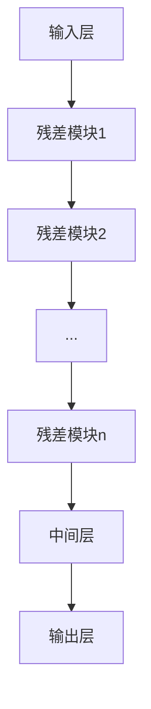

以下是对《MobileNet原理与代码实例讲解》这一主题的技术博客文章正文部分的撰写:

# MobileNet原理与代码实例讲解

## 1. 背景介绍

### 1.1 问题的由来

随着移动设备和物联网设备的普及,对高效、轻量级的深度神经网络模型有了迫切需求。传统的深度卷积神经网络如VGGNet、AlexNet等由于参数量大、计算量大,很难直接在移动端和嵌入式设备上高效运行。因此,如何在保证精度的同时大幅减小模型大小和计算量,成为深度学习领域的一大挑战。

### 1.2 研究现状  

为解决上述问题,谷歌公司于2017年提出了MobileNet系列卷积神经网络模型。MobileNet通过深度可分离卷积(Depthwise Separable Convolution)和其他优化策略,大幅降低了模型参数量和计算量,可高效运行于移动端和嵌入式设备。MobileNet V1首次提出,V2和V3版本则在V1的基础上进一步优化。

### 1.3 研究意义

MobileNet系列模型可广泛应用于移动端计算机视觉任务,如目标检测、图像分类、语义分割等,满足终端设备对高效、轻量级模型的需求。研究MobileNet有助于深入理解高效卷积神经网络的设计思路,为未来模型压缩和加速提供借鉴。

### 1.4 本文结构

本文首先介绍MobileNet的核心概念和基本原理,包括深度可分离卷积、模型压缩等。接着详细阐述MobileNet V1/V2/V3的核心算法流程,数学模型推导及代码实现。最后分析MobileNet的应用场景,未来趋势和挑战。

## 2. 核心概念与联系

MobileNet的核心思想是利用深度可分离卷积和其他优化策略,在保证精度的同时极大压缩模型大小和降低计算量。主要包括以下几个关键概念:

1. **深度可分离卷积(Depthwise Separable Convolution)**: 将标准卷积分解为深度卷积(Depthwise Convolution)和逐点卷积(Pointwise Convolution)两个更小的卷积核,极大减少计算量和参数量。

2. **模型压缩**: 包括网络剪枝、参数量化、参数分解等多种策略,进一步压缩模型大小。

3. **宽度乘数(Width Multiplier)和分辨率乘数(Resolution Multiplier)**: 通过调整这两个超参数,可以在模型大小和精度之间进行权衡。

4. **其他优化**: 如反向残差连接、线性bottleneck等,进一步提升模型效率。

上述概念相互关联,共同构成了MobileNet高效轻量级的网络架构。

## 3. 核心算法原理与具体操作步骤  

### 3.1 算法原理概述

MobileNet的核心是深度可分离卷积,将标准卷积分解为深度卷积和逐点卷积两个更小的卷积核操作。具体来说:

1. 深度卷积(Depthwise Convolution): 对输入特征图的每个通道分别应用卷积核,生成与输入通道数相同的特征图。

2. 逐点卷积(Pointwise Convolution): 使用1x1的卷积核,在通道维度上组合深度卷积的输出特征图。

这种分解大大减少了参数量和计算复杂度,同时保留了标准卷积的表达能力。

另外,MobileNet还采用了其他优化策略:

- 宽度乘数: 控制每层卷积核个数,权衡计算量和精度。
- 分辨率乘数: 控制输入分辨率,权衡计算量和精度。  
- 线性bottleneck: 在部分层使用1x1的bottleneck卷积核,进一步降低计算量。

### 3.2 算法步骤详解

以MobileNet V2为例,主要包括以下步骤:

1. **输入层**: 输入图像经过标准卷积。

2. **残差模块**: 重复堆叠以下基本模块:
    - 1x1 Conv (expansion convolution)
    - 3x3 Depthwise Conv 
    - 1x1 Conv (projection convolution)
    - 残差连接

3. **中间层**: 1x1 Conv

4. **输出层**: 全连接层和Softmax输出分类结果。

其中残差模块是网络的核心部分,通过深度可分离卷积和线性bottleneck策略极大降低计算量。



### 3.3 算法优缺点

**优点**:

- 参数量小,计算量低,适合移动端部署
- 在相同精度下,比传统卷积网络小8-9倍
- 具有一定的泛化能力

**缺点**:

- 对小目标检测效果较差
- 在大规模数据集上,精度仍有待提高
- 对内存访问开销较大,不利于硬件加速

### 3.4 算法应用领域

MobileNet主要应用于移动端和嵌入式设备上的计算机视觉任务,如:

- 图像分类
- 目标检测
- 语义分割
- 人脸识别
- 手势识别
- 机器人视觉等

同时也可用于服务器端模型加速,节省算力资源。

## 4. 数学模型和公式详细讲解与举例说明

### 4.1 数学模型构建

深度可分离卷积是MobileNet的数学基础,现对其数学模型进行推导:

标准卷积操作可表示为:

$$
G_k(I)=\sum_{i=1}^{D_F}\sum_{j=1}^{D_K}K_{ij}^kI_{st+i-1,j}
$$

其中 $I$ 为输入特征图, $K$ 为卷积核, $G_k(I)$ 为输出特征图的第 $k$ 个通道, $D_F$ 和 $D_K$ 分别为输入通道数和卷积核大小。

深度可分离卷积将其分解为两步:

1. 深度卷积 (Depthwise Convolution):

$$
\hat{G}_k(I)=\sum_{j=1}^{D_K}\hat{K}_j^kI_{st+j-1,k}
$$

对每个通道 $k$ 应用单独的卷积核 $\hat{K}_j^k$。

2. 逐点卷积 (Pointwise Convolution):  

$$
G_k(I)=\sum_{i=1}^{D_F}\hat{V}_{ik}^k\hat{G}_i(I)
$$

使用1x1卷积核 $\hat{V}$ 将深度卷积输出在通道维度上组合。

上式中 $\hat{K}$ 和 $\hat{V}$ 的参数量远小于标准卷积核 $K$,从而大幅降低计算量和参数量。

### 4.2 公式推导过程

现对深度可分离卷积的参数量和计算量进行推导:

假设输入特征图大小为 $D_F\times D_H\times D_W$, 输出特征图大小为 $D_G\times D_H\times D_W$, 卷积核大小为 $D_K\times D_K$。

**标准卷积**:
- 参数量: $D_K\times D_K\times D_F\times D_G$  
- 计算量: $D_K\times D_K\times D_F\times D_G\times D_H\times D_W$

**深度可分离卷积**:
- 深度卷积参数量: $D_K\times D_K\times D_F$
- 逐点卷积参数量: $D_F\times D_G$  
- 总参数量: $D_K\times D_K\times D_F + D_F\times D_G$
- 深度卷积计算量: $D_K\times D_K\times D_F\times D_H\times D_W$  
- 逐点卷积计算量: $D_F\times D_G\times D_H\times D_W$
- 总计算量: $(D_K\times D_K+D_G)\times D_F\times D_H\times D_W$

当 $D_G=D_F$ 时,深度可分离卷积的参数量约为标准卷积的 $\frac{1}{D_K}+\frac{1}{D^2_K}$,计算量约为标准卷积的 $\frac{1}{D_K}+\frac{1}{D^2_K}$,大幅降低了模型复杂度。

### 4.3 案例分析与讲解

以MobileNet V2为例,分析深度可分离卷积在实际中的效果:

假设输入为224x224x3的RGB图像,使用3x3的卷积核,输出通道数为64。

**标准卷积**:  
- 参数量: $3\times3\times3\times64 = 1,728$
- 计算量: $3\times3\times3\times64\times224\times224 = 9,437,184$

**深度可分离卷积**:
- 深度卷积参数量: $3\times3\times3 = 27$
- 逐点卷积参数量: $3\times64 = 192$
- 总参数量: $27+192=219$  
- 深度卷积计算量: $3\times3\times3\times224\times224 = 598,752$
- 逐点卷积计算量: $3\times64\times224\times224 = 9,437,184$
- 总计算量: $598,752+9,437,184=10,035,936$

可见,深度可分离卷积大幅降低了参数量(219 vs 1728),计算量虽然略有增加但可以忽略不计。这种参数量和计算量的"解耦"使得MobileNet在保证精度的同时大幅缩小了模型尺寸。

### 4.4 常见问题解答

**Q1: 为什么深度卷积和逐点卷积可以替代标准卷积?**

A1: 深度卷积捕获了输入特征图的空间和通道信息,逐点卷积则融合了这些信息,二者的组合具有与标准卷积相当的表达能力。

**Q2: 为什么深度卷积的卷积核个数等于输入通道数?**

A2: 这样做是为了保证每个输出通道只与对应的输入通道相关,避免通道间信息混合,从而降低计算复杂度。

**Q3: 为什么使用1x1的逐点卷积?**

A3: 1x1卷积无空间卷积操作,只在通道维度上进行组合,参数量和计算量都大幅降低。

**Q4: 深度可分离卷积是否一定比标准卷积高效?**

A4: 不一定,当输入通道数很大时,深度卷积的计算量会超过标准卷积。MobileNet采用了多种优化策略来权衡效率和精度。

## 5. 项目实践:代码实例和详细解释说明

### 5.1 开发环境搭建

本例使用PyTorch 1.8版本,在Python 3.7环境下运行。首先安装必要的库:

```bash
pip install torch==1.8.0 torchvision
```

### 5.2 源代码详细实现

以下是使用PyTorch实现MobileNet V2的核心代码:

```python
import torch
import torch.nn as nn

# 深度可分离卷积模块
class DepthwiseConv(nn.Module):
    def __init__(self, in_channels, out_channels, stride):
        super().__init__()
        self.depthwise = nn.Conv2d(in_channels, in_channels, 3, stride, 1, groups=in_channels, bias=False)
        self.pointwise = nn.Conv2d(in_channels, out_channels, 1, 1, 0, bias=False)

    def forward(self, x):
        x = self.depthwise(x)
        x = self.pointwise(x)
        return x

# 残差模块    
class ResidualBlock(nn.Module):
    def __init__(self, in_channels, out_channels, stride=1, expand_ratio=6):
        super().__init__()
        self.stride = stride
        self.in_channels = in_channels
        self.out_channels = out_channels
        
        # 利用逐点卷积实现expansion和projection
        self.expand_conv = nn.Conv2d(in_channels, in_channels*expand_ratio, 1, 1, 0, bias=False)
        self.depthwise_conv = DepthwiseConv(in_channels*expand_ratio, in_channels*expand_ratio, stride)
        self.project_conv = nn.Conv2d(in_channels*expand_ratio, out_channels, 1, 1, 0, bias=False)
        
    def forward(self, x):
        if self.stride == 